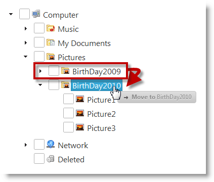

<!--
|metadata|
{
    "fileName": "igtree-drag-and-drop-enabling",
    "controlName": "igTree",
    "tags": ["Getting Started","How Do I"]
}
|metadata|
-->

# Enabling Drag-and-Drop (igTree)

## Topic Overview
### Purpose

This topic explains, with code examples, how to enable the Drag-and-Drop feature in the `igTree`™ control.

### In this topic

This topic contains the following sections:

-   [Introduction](#introduction)
-   [Enabling the Drag-and-Drop Feature Summary](#feature-summary)
-   [Enabling Drag-and-Drop Within an igTree Control](#drag-drop-within-tree)
-   -   [Overview](#within-tree-overview)
    -   [Property settings](#within-tree-settings)
    -   [Code Example](#within-tree-code-example)
-   [Enabling Drag-and-Drop Between Different igTree Controls](#between-different-trees)
-   -   [Overview](#between-trees-overview)
    -   [Property settings](#between-trees-settings)
    -   [Code Example](#between-trees-code-example)
-   [Related Content](#related-content)


## <a id="introduction"></a>Introduction
### The Drag-and-Drop feature

Dragging and dropping can be performed within the same `igTree` control or between different `igTree` controls. The latter is configured in addition to the “normal” (within the same tree) drag-and-drop.

##<a id="feature-summary"></a>Enabling the Drag-and-Drop Feature Summary 

### Enabling Drag-and-Drop summary chart

The following table lists the two ways to enable the Drag-and-drop feature of the `igTree` control.

<table class="table table-bordered">
	<thead>
		<tr>
            <th>
Type of enabling
			</th>

            <th>
Configuration Details
			</th>

            <th>
Properties
			</th>
        </tr>
	</thead>
	<tbody>
        

        <tr>
            <td>
Enabling drag-and-drop within an `igTree`
			</td>

            <td>
The `igTree` control must have the Drag-and-Drop feature enabled.
			</td>

            <td>
                <ul>
                    <li>
[dragAndDrop](igTree-Drag-and-Drop-Property-API-Reference.html)
					</li>
                </ul>
            </td>
        </tr>

        <tr>
            <td>
Enabling the drag-and-drop between different `igTrees`
			</td>

            <td>
All participating `igTree` controls must have the Drag-and-Drop feature enabled. In addition to that, each the must be configured to accept drops from other `igTree` controls.
			</td>

            <td>
                <ul>
                    <li>
[dragAndDrop](igTree-Drag-and-Drop-Property-API-Reference.html)
					</li>

                    <li>
[dragAndDropSettings](igTree-Drag-and-Drop-Property-API-Reference.html)
					</li>

                    <li>
[allowDrop](igTree-Drag-and-Drop-Property-API-Reference.html)
					</li>
                </ul>
            </td>
        </tr>
    </tbody>
</table>


## <a id="drag-drop-within-tree"></a>Enabling Drag-and-Drop Within an igTree Control
### <a id="within-tree-overview"></a>Overview

The `igTree` control must have the Drag-and-Drop feature enabled.



Enabling the dragging within same control is managed by the [dragAndDrop](igTree-Drag-and-Drop-Property-API-Reference.html) property.

### <a id="within-tree-settings"></a>Property settings

The following table maps the desired configuration to property settings.

In order to: | Use this property: | And set it to:
---|---|---
Enable dragging in the igTree | [dragAndDrop](igTree-Drag-and-Drop-Property-API-Reference.html) |true


### <a id="within-tree-code-example"></a>Code Example

The following snippets demonstrate the [](#within-tree-settings)implemented in code.

**In JavaScript:**                                                                                                                                                
```js
$("#tree").igTree({                                                           
 dragAndDrop: true,                                                 
});                                                      
```

**In Razor:**                                                                                                                                            
```csharp
@(Html.                                                                               	Infragistics().                                                           	Tree().                                                                   	ID("tree").                                                               	DragAndDrop(true).                                                        	DataBind().                                                              	Render()                                                              
)                                                            
```


## <a id="between-different-trees"></a>Enabling Drag-and-Drop Between Different igTree Controls
### <a id="between-trees-overview"></a>Overview

All participating `igTree` controls must have the Drag-and-Drop feature
enabled. In addition to that, each the must be configured to accept
drops from other `igTree` controls.


This means that you must set [dragAndDrop](igTree-Drag-and-Drop-API-Reference.html) property of each participating `igTree` control.

to true to enable dragging. To enable dropping between these `igTree` controls, you must set two additional properties for each `igTree` that will be accepting drops from the other trees:

-   [dragAndDropSettings](igTree-Drag-and-Drop-Property-API-Reference.html) to allowDrop
-   [allowDrop](igTree-Drag-and-Drop-Property-API-Reference.html) property to true

### <a id="between-trees-settings"></a>Property settings

The following table maps the desired configuration to property settings.

In order to: | Use this property: | And set it to:
---|---|---
Enable dragging in the igTree | [dragAndDrop](igTree-Drag-and-Drop-Property-API-Reference.html)|true
Enable Drag-and-Drop settings | [dragAndDropSettings](igTree-Drag-and-Drop-Property-API-Reference.html) |allowDrop
Enable dropping in the igTree | [allowDrop](igTree-Drag-and-Drop-Property-API-Reference.html)|true


### <a id="between-trees-code-example"></a>Code Example

The following snippets demonstrate the settings in Example block implemented in code.

 **In JavaScript:** 

```js 
$("#firstTree").igTree({                                                      
	dragAndDrop: true,
	dragAndDropSettings: {                                                       
		allowDrop: true                                                      
	}                                                                     
}); 


$("#secondTree").igTree({                                                     
	dragAndDrop: true,
	dragAndDropSettings: {                                                      
		allowDrop: true                                                       
	}                                                                   
});                                                       
```


**In Razor:**

```csharp
@(Html.Infragistics()
	.Tree()
	.ID("firstTree")
	.DragAndDrop(true)
	.DragAndDropSettings(settings =>{
		settings.AllowDrop(true);
	})
	.DataBind()
	.Render())
                                                                       
@(Html.Infragistics()
	.Tree()
	.ID("secondTree")
	.DragAndDrop(true)
	.DragAndDropSettings(settings =>{
		settings.AllowDrop(true);
	})
	.DataBind()
	.Render())
```

## <a id="related-content"></a>Related Content
### Topics

The following topics provide additional information related to this topic.

- [Configuring Drag-and-Drop (igTree)](igTree-Drag-and-Drop-Configuring.html):  This topic explains, with code examples, how to configure the Drag-and-Drop of the `igTree` control, in both JavaScript and MVC.

- [Drag-and-Drop API Reference (igTree)](igTree-Drag-and-Drop-API-Reference.html): The topics in this group provide reference information about the events and properties of the `igTree` control that are related to the Drag-and-Drop feature.


### Samples

The following samples provide additional information related to this topic.

- [Drag and Drop - Single Tree](%%SamplesUrl%%/tree/drag-and-drop-single-tree): This sample demonstrates how to initialize the `igTree` control with the Drag-and-Drop feature enabled.

- [Drag and Drop - Multiple Trees](%%SamplesUrl%%/tree/drag-and-drop-multiple-trees): This sample demonstrates how to drag-and-drop nodes between two `igTrees`.

- [API and Events](igtree-event-reference.html#attaching-handlers-jquery): This sample demonstrates how to use `igTree` API.


 

 


