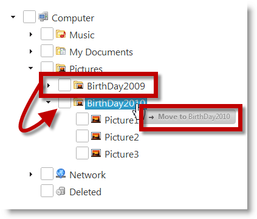
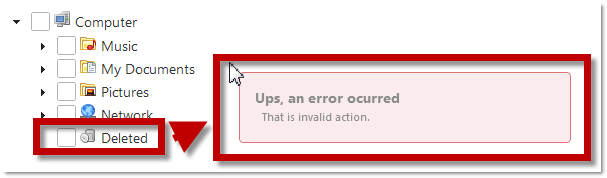

<!--
|metadata|
{
    "fileName": "igtree-drag-and-drop-configuring-tokens",
    "controlName": "igTree",
    "tags": ["How Do I","Styling","Tips and Tricks"]
}
|metadata|
-->

# Configuring the Look of the Drag Visual Tokens (igTree)

## Topic Overview
### Purpose

This topic explains, with code examples, how to configure the look of the drag visual tokens of the `igTree`™ control, in both JavaScript and MVC.

### Required background

The following topics are prerequisites to understanding this topic:

- [Drag-and-Drop Overview (igTree)](igTree-Drag-and-Drop-Overview.html): This topic provides an overview the Drag-and-Drop feature of the `igTree` control.

- [Enabling Drag-and-Drop (igTree)](igTree-Drag-and-Drop-Enabling.html): This topic explains, with code examples, how to enable the Drag-and-Drop feature in the `igTree` control.

### In this topic

This topic contains the following sections:

-   [Introduction](#introduction)
-   [Configuring the Look of the Drag-And-Drop Visual Tokens](#config-visual-token)
    -   [Configurable tokens](#config-tokens)
    -   [Configuration summary chart](#config-summary-chart)
    -   [Example](#config-example)
-   [Code Examples](#code-example)
-   [Code Example: Configuring the Look of the Drag Visual Tokens in JavaScript](#js-visual-token)
    -   [Introduction](#js-introduction)
    -   [Preview](#js-preview)
    -   [Prerequisites](#js-prerequisites)
    -   [Overview](#js-overview)
    -   [Steps](#js-steps)
-   [Code Example: Configuring the Look of the Drag Visual Tokens in MVC](#mvc-visual-token)
    -   [Introduction](#mvc-introduction)
    -   [Preview](#mvc-preview)
    -   [Prerequisites](#mvc-prerequisites)
    -   [Overview](#mvc-overview)
    -   [Steps](#mvc-steps)
-   [Related Content](#related-content)


## <a id="introduction"></a>Introduction
### Visual tokens look configuration summary

A visual token is a hint text that appears under the mouse pointer when the user drags a node. It indicates the current state of the dragging action, like whether a node is about to be moved, copied or dropped onto an invalid area. You can customize the way the visual tokens look through the HTML markup.

The following illustration compares side-by-side the looks of default (left) and a custom (right) visual token looks. In the picture on the right, the custom visual token look is customized with a div structure and a CSS style.






## <a id="config-visual-token"></a>Configuring the Look of the Drag-And-Drop Visual Tokens
### <a id="config-tokens"></a>Configurable tokens

There are several tokens that can be configured for the drag action. The tokens are defined by a combination of the following factors:

-   The type of the drag-and-drop action:
    -   copy
    -   move
-   The drop location type:
    -   after another node – when the node is the last one in the location
    -   before another node – when the node is the last one in the location
    -   between two nodes
    -   onto another node – when the dragged node, if dropped, will become its sibling
    -   onto invalid area

For example, there is one visual token for copying the node before another node, another one for copying after another node, two other for moving the node before and after another node and so on. Each of these combinations is managed individually by a specific markup property.

For all possible combinations and the properties that manage them, see the [Configuration summary chart](#config-summary-chart).

### <a id="config-summary-chart"></a>Configuration summary chart

The following table maps the individual Drag-and-Drop visual tokens to the respective properties that configure them in the HTML markup.

Action | Location | In order to change the visual token when: | Use the this property:
---|---|---|---
copy | after | The node is being copied after another node | copyAfterMarkup
copy | before | The node is being copied before another node. | copyBeforeMarkup
copy | between | The node is being copied between other nodes. | copyBetweenMarkup
copy | onto | The node is being copied onto another node. | copyToMarkup
move | after | The node is being moved after another node. | moveAfterMarkup
move | before | The node is being moved before another node. | moveBeforeMarkup
move | between | The node is being moved between another nodes. | moveBetweenMarkup
move | onto | The node is being moved onto another node. | moveToMarkup
copy /move | invalid | The node is being moved onto an invalid area. | invalidMoveToMarkup


### <a id="config-example"></a>Example

This example demonstrates how to configure the following visual token:

-   the token for copying the dragged node after another node

to:

-   Be larger than the default token
-   Display text formatted with Heading 3 style

Technology | Use the this property: |And set it to:
---|---|---
JavaScript|copyAfterMarkup|`copyAfterMarkup: "<div class="message"><h3>Copy After</h3><p> {0}</p></div>"`
MVC|CopyAfterMarkup|`CopyAfterMarkup("<div class="message"><h3>Copy After</h3><p> {0}</p></div>");`


## <a id="code-example"></a>Code Examples
### Code examples summary

The following table lists the code examples included in this topic.

Example | Description
---|---
[Code Example: Configuring drag visual tokens look in JavaScript](#js-visual-token)|This procedure initializes `igTree` with Drag-and-Drop feature and change drag visual tokens look and binds it to a JSON data.
[Code Example: Configuring Drag-and-Drop Markup in MVC](#mvc-visual-token)| This procedure initializes `igTree` with Drag-and-Drop feature and drag visual tokens look and binds it to a XML file.


## <a id="js-visual-token"></a>Code Example: Configuring the Look of the Drag Visual Tokens in JavaScript
### <a id="js-introduction"></a>Introduction

This procedure changes the look of the drag visual tokens to the following to make it larger than the default token and to display a text part of which is formatted as a heading. This is achieved by:

-   Setting the token property to a new HTML markup – a div tag and an h3 heading tag inside the div tag.
-   Styling the token with a CSS – to increase width of all visual tokens, add padding, and configure the token to a fixed position. The h3 heading tag font size and weight are modified in the CSS to the desired settings.

### <a id="js-preview"></a>Preview

The following screenshot is a preview of the final result.


### <a id="js-prerequisites"></a>Prerequisites

To complete the procedure, you need an HTML file with an instance of the `igTree` control bound to a data source. You can use the code from the topics in the Walkthroughs section.

### <a id="js-overview"></a>Overview

The following is a conceptual overview of the process:

1. Configuring the Drag-and-Drop visual tokens’ properties

2. Adding a custom CSS

### <a id="js-steps"></a>Steps

The following steps demonstrate how to configure an `igTree` with the Drag-and-Drop feature enabled and the look of the drag visual tokens look in JavaScript.

1. Configure the Drag-and-Drop visual tokens’ properties.

	1. Define the DOM (Document Object Model) HTML element placeholder in the file in which the `igTree` control initializes.

		**In HTML:**
				
		```html
		<!--igTree target element--> 
		<div id="tree"> 
		</div> 
		```
	
	2. Instantiate an `igTree` with the Drag-and-Drop feature and set the drag visual tokens in JavaScript.
	
		**In JavaScript:**
		
		```js
		<script>
		$.ig.loader(function () {
		$("#tree").igTree({
			checkboxMode: 'triState',
			singleBranchExpand: true,
			dataSource: data,
			dataSourceType: 'json',
			initialExpandDepth: 0,
			pathSeparator: '.',
			bindings: {
				textKey: 'Text',
				valueKey: 'Value',
				imageUrlKey: 'ImageUrl',
				childDataProperty: 'Folder'
			},
			dragAndDrop: true,
			dragAndDropSettings: {
				invalidMoveToMarkup: "<div class="message"><h3>Ups, an error ocurred</h3><p> That is invalid action.</p></div>",
				moveToMarkup: "<div class="message"><h3>Move to</h3><p> {0}</p></div>",
				moveBetweenMarkup: "<div class="message"><h3>Move Between</h3><p> {0} and {1}</p></div>"
				moveAfterMarkup: "<div class="message"><h3>Move After</h3><p> {0}</p></div>",
				moveBeforeMarkup: "<div class="message"><h3>Move Before</h3><p> {0}</p></div>",
				copyToMarkup: "<div class="message"><h3>Copy to</h3><p> {0}</p></div>",
				copyBetweenMarkup: "<div class="message"><h3>Copy Between</h3><p> {0} and {1}</p></div>",
				copyAfterMarkup: "<div class="message"><h3>Copy After</h3><p> {0}</p></div>",
				copyBeforeMarkup: "<div class="message"><h3>Copy Before</h3><p> {0}</p></div>" 
				}
			});
		});
		</script>
		```

2. Add a custom CSS.

	1. In a CSS, configure the CSS properties for the following:
	
		-   The width of the visual tokens
		-   The padding of the visual tokens
		-   A fixed position for the the visual tokens
		-   The heading tag font size and weight
	
	2. Insert the configured CSS into the HTML file.**To achieve the look in the [Preview](#js-preview), use the following CSS code.**
	
		**In CSS:**
		
		```css
		<style>
		.message
		{
		width: 300px;
		padding: 15px;
		position: fixed;
		}
		.message h3
		{
		font-size: 14px;
		font-weight: bold;
		}
		</style>
	```


## <a id="mvc-visual-token"></a>Code Example: Configuring the Look of the Drag Visual Tokens in MVC
### <a id="mvc-introduction"></a>Introduction

This procedure changes the look of the drag visual tokens to the
following to make it larger than the default token and to display a text
part of which is formatted as a heading. This is achieved by:

-   Setting the token property to a new HTML markup – a div tag and an h3 heading tag inside the div tag.
-   Styling the token with a CSS – to increase width of all visual tokens, add padding, and configure the token to a fixed position. The h3 heading tag font size and weight are modified in the CSS to the desired settings.

### <a id="mvc-preview"></a>Preview

The following screenshot is a preview of the final result.


### <a id="mvc-prerequisites"></a>Prerequisites

To complete the procedure, you need the following:

-   Microsoft® Visual Studio 2010 or newer installed
-   MVC 3 Framework installed
-   A reference to the `Infragistics.Web.Mvc.dll` added to the bin folder or the Global Assembly Cache (GAC).
-   An MVC project with a View defined in it.
-   An HTML file with an instance of the `igTree` control bound to a data source. You can use the code from the topics in the Walkthroughs section.

### <a id="mvc-overview"></a>Overview

The following is a conceptual overview of the process:

1. Configuring the Drag-and-Drop visual tokens’ properties

2. Adding a custom CSS

### <a id="mvc-steps"></a>Steps

The following steps demonstrate how to configure an `igTree` with the Drag-and-Drop feature enabled and the look of the drag visual tokens look in MVC.

1. Configure the Drag-and-Drop visual tokens’ properties .

	In the View, instantiate an `igTree` with the Drag-and-Drop feature and set the drag visual tokens. The defined `igTree` will get the data from the model.
	
	**In C#:**
	
	```csharp
	Purpose
	<script src="http://localhost/ig_ui/js/infragistics.loader.js" type="text/javascript"></script>
	@(Html.Infragistics()
		.Loader()
		.ScriptPath("http://localhost/ig_ui/js/")
		.CssPath("http://localhost/ig_ui/css/")
		.Render()
	)
	@(Html.
		Infragistics().
		Tree().
		ID("XMLTree").
		Bindings( bindings => {
			bindings.
			ValueKey("Value").
			TextKey("Text").
			ImageUrlKey("ImageUrl").
			ChildDataProperty("Folder");
		}).
		InitialExpandDepth(0).
		DataSource(Model).
		CheckboxMode(CheckboxMode.TriState).
		SingleBranchExpand(true).
		DragAndDrop(true).
		DragAndDropSettings(settings =>
		{
			// Configuring Drag-and-drop visual tokens
			settings.InvalidMoveToMarkup("<div class="message"><h3>Ups, an error ocurred</h3><p> That is invalid action.</p></div>").
			MoveToMarkup("<div class="message"><h3>Move to</h3><p> {0}</p></div>").
			MoveBetweenMarkup("<div class="message"><h3>Move Between</h3><p> {0} and {1}</p></div>").
			MoveAfterMarkup("<div class="message"><h3>Move After</h3><p> {0}</p></div>").
			MoveBeforeMarkup("<div class="message"><h3>Move Before</h3><p> {0}</p></div>").
			CopyToMarkup("<div class="message"><h3>Copy to</h3><p> {0}</p></div>").
			CopyBetweenMarkup("<div class="message"><h3>Copy Between</h3><p> {0} and {1}</p></div>").
			CopyAfterMarkup("<div class="message"><h3>Copy After</h3><p> {0}</p></div>").
			CopyBeforeMarkup("<div class="message"><h3>Copy Before</h3><p> {0}</p></div>");
		}).
		DataBind().
	Render()
	)
	```

2. Add a custom CSS.

	1. In a CSS, configure the CSS properties for the following:
	
		-   The width of the visual tokens
		-   The padding of the visual tokens
		-   A fixed position for the the visual tokens
		-   The heading tag font size and weight
	
	2. Insert the configured CSS into the HTML file.**To achieve the look in the [Preview](#mvc-preview), use the following CSS code.**
	
		**In CSS:**
		
		```css
		<style>
		.message
		{
			width: 300px;
			padding: 15px;
			position: fixed;
		}
		.message h3
		{
			font-size: 14px;
			font-weight: bold;
		}
		</style>
		```


## <a id="related-content"></a>Related Content
### Topics

The following topics provide additional information related to this topic.

- [Configuring the Drag-and-Drop Mode (igTree)](igTree-Drag-and-Drop-Configuring-Mode.html): This topic explains, with code examples, how to configure the Drag-and-Drop mode of the `igTree` control, in both JavaScript and MVC.

- [Configuring Custom Drop Validation (igTree)](igTree-Drag-and-Drop-Configuring-Custom-Drop-Validation.html): This topic explains, with code examples, how to configure custom drop validation of the Drag-and-Drop feature of the `igTree` control, in both JavaScript and MVC.

- [Drag-and-Drop API Reference (igTree)](igTree-Drag-and-Drop-API-Reference.html): The topics in this group provide reference information about the events and properties of the `igTree` control that are related to the Drag-and-Drop feature.


### Samples

The following samples provide additional information related to this topic

- [Drag and Drop - Single Tree](%%SamplesUrl%%/tree/drag-and-drop-single-tree): This sample demonstrates how to initialize the `igTree` control with the Drag-and-Drop feature enabled.

- [Drag and Drop - Multiple Trees](%%SamplesUrl%%/tree/drag-and-drop-multiple-trees): This sample demonstrates how to drag-and-drop nodes between two `igTrees`.

- [API and Events](igtree-event-reference.html#attaching-handlers-jquery): This sample demonstrates how to use `igTree` API.


 

 


