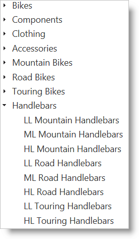
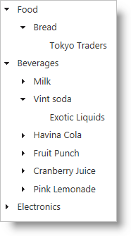

<!--
|metadata|
{
    "fileName": "igtree-optimize-performance",
    "controlName": "igTree",
    "tags": ["Data Binding","Performance"]
}
|metadata|
-->

# Optimize the igTree’s Performance
## Topic Overview
### Purpose
The `igTree`™control supports load-on-demand to request data as needed when nodes are expanded. This behavior helps to limit the amount of data requested on the initial load of the page providing better performance for the end user.

### In this topic
This topic contains the following sections:

-   [**Control Configuration Overview**](#control-configuration-overview)
    -   [Control configuration chart](#control-configuration-chart)
-   [**Enable load-on-demand**](#enable-load-on-demand)
    -   [Load-on-demand details](#enable-load-on-demand-details)
    -   [Load-on-demand configuration settings](#load-on-demand-configuration-settings)
    -   [Example: basic load-on-demand](#load-on-demand-example)
    -   [Load-on-demand property reference](#enable-load-on-demand-property-reference)
-   [**Configure load-on-demand for ASP.NET MVC**](#configure-load-on-demand-for-mvc)
    -   [Load-on-demand for ASP.NET MVC details](#configure-load-on-demand-mvc-details)
    -   [Load-on-demand for ASP.NET MVC property settings](#load-on-demand-mvc-property-settings)
    -   [Example: load-on-demand with ASP.NET MVC](#load-on-demand-mvc-example)
-   [**Configure load-on-demand for OData**](#configure-load-on-demand-odata)
    -   [Load-on-demand for OData details](#configure-load-on-demand-odata-details)
    -   [Load-on-demand for OData property settings](#configure-load-on-demand-odata-property-settings)
    -   [Example: load-on-demand with OData](#configure-load-on-demand-odata-example)
-   [**Related Topics**](#related-topics)

### Required background
The table below lists the required background you need fully understand the information in this topic.

You need to be familiar with the following concepts:

-   JSONP
-   Optional
    - ASP.NET MVC
    -   Action Methods

**Topics**

You need to first read the following topics:

-   [igTree Overview](igTree-Overview.html)
-   [Getting Started with igTree](igTree-Getting-Started.html)

**External Resources**

You need to first read the following articles:

-   [OData: URI Conventions](http://www.odata.org/documentation/odata-version-3-0/url-conventions/)

## <a id="control-configuration-overview"></a>Control Configuration Overview 
### <a id="control-configuration-chart"></a>Control configuration chart 
The table below lists the configurable behaviors of the control.

Configurable behavior | Configuration details | Configuration properties
---|---|---
[Enable load-on-demand](#enable-load-on-demand) | Enabling load-on-demand instructs the tree to only create the necessary HTML elements of the tree when a node is expanded. | [loadOnDemand](%%jQueryApiUrl%%/ui.igTree#options:loadOnDemand) <br> 
[Configure load-on-demand for ASP.NET MVC](#configure-load-on-demand-for-mvc) | By setting up an action method to return JSON in your ASP.NET MVC controller, new data can be fetched remotely when a node is expanded. | [loadOnDemand](%%jQueryApiUrl%%/ui.igTree#options:loadOnDemand) <br> [dataSourceUrl](%%jQueryApiUrl%%/ui.igTree#options:dataSourceUrl)
[Configure load-on-demand for OData](#configure-load-on-demand-odata) | When supplying the `igTree` control with an OData data source, enabling load-on-demand instructs the `igTree` to make calls to the service to retrieve the next level of data. | [loadOnDemand](%%jQueryApiUrl%%/ui.igTree#options:loadOnDemand) <br>[dataSourceUrl](%%jQueryApiUrl%%/ui.igTree#options:dataSourceUrl) <br>[responseDataKey](%%jQueryApiUrl%%/ui.igTree#options:responseDataKey) <br>[responseDataType](%%jQueryApiUrl%%/ui.igTree#options:responseDataType)


## <a id="enable-load-on-demand"></a>Enable load-on-demand 
### <a id="enable-load-on-demand-details"></a>Load-on-demand details 
Load-on-demand provides various performance enhancements to the behavior of the `igTree` control. By enabling load-on-demand on the client, the tree creates HTML elements on demand when necessary to display data. Nodes hidden from view initially have no HTML elements created for them. When enabling load-on-demand using the ASP.NET MVC helper, the data is retrieved on demand from the server.

### <a id="load-on-demand-configuration-settings"></a>Load-on-demand configuration settings 
The table below maps the desired configurations to property settings. The properties are accessed through the `igTree`’s options.

In order to… | Use this property: | And set it to…
---|---|---
Enable load-on-demand|[loadOnDemand](%%jQueryApiUrl%%/ui.igTree#options:loadOnDemand)|true

### <a id="load-on-demand-example"></a>Example: basic load-on-demand 
The following code demonstrates enabling load-on-demand as a result of the following settings:

Property | Setting
---|---
loadOnDemand|true

**In HTML:**

```html
<script type="text/javascript">
    $(function () {
        $("#treeTarget").igTree({
            dataSource: data,
            loadOnDemand: true
        });
    });
</script>
```

### <a id="enable-load-on-demand-property-reference"></a>Load-on-demand property reference 
For detailed information about these properties, refer to their listing in the property reference section:

-   `igTree` Options

## <a id="configure-load-on-demand-for-mvc"></a>Configure load-on-demand for ASP.NET MVC 
### <a id="configure-load-on-demand-mvc-details"></a>Load-on-demand for ASP.NET MVC details 
By enabling load-on-demand and setting up an action method in your controller, you can dynamically supply data from your ASP.NET MVC application to the `igTree` enabling a remote load-on-demand. This connection is created by setting the `igTree`’s `dataSourceUrl` to the url of your action method.

###<a id="load-on-demand-mvc-property-settings"></a> Load-on-demand for ASP.NET MVC property settings 
The following table maps the desired configurations to property settings. The properties are accessed through the `igTree` options.

In order to… | Use this property: | And set it to…
---|---|---
Configure load-on-demand for ASP.NET MVC| [loadOnDemand](%%jQueryApiUrl%%/ui.igTree#options:loadOnDemand) <br> [dataSourceUrl](%%jQueryApiUrl%%/ui.igTree#options:dataSourceUrl)| true <br> string Url of custom action method

###<a id="load-on-demand-mvc-example"></a>Example: load-on-demand with ASP.NET MVC 
#### Introduction

This procedure shows how to enable the properties on the `igTree` required for configuring load-on-demand for ASP.NET MVC, shows how to configure the bindings, and perform the logic to return the appropriate data to the client during a load-on-demand operation.

You will use the AdventureWorks database to create an `igTree` that lists product categories as the parent nodes and products as the child nodes.

#### Preview

Following is a preview of the final result.



#### Requirements

To complete the procedure, you need the following:

-   ASP.NET MVC application
-   [AdventureWorks database](http://msftdbprodsamples.codeplex.com/releases/view/37109)
-   An EntityDataModel containing the ProductCategory and Product tables
-   A basic ASP.NET `igTree` implementation

#### Overview

Following is a conceptual overview of the process:

1.  Configuring bindings
2.  Configuring data source for initial load
3.  Configuring an action method for returning data on demand
4.  Configuring the data source URL for load-on-demand

#### Steps

1.  **Configure Bindings.**
    1.  **Configure bindings for the ProductCategory nodes.**

        **In ASPX:**

        ```csharp
        <%= Html.
            Infragistics().
            Tree(). 
            Bindings( bindings => {
                bindings.
                TextKey("Name").
                PrimaryKey("ProductCategoryID").
                ValueKey("ProductCategoryID");        
            }).
            Render()       
        %>
        ```

    2.  **Configure the binding for the child Product nodes.**

        Set the ChildDataProperty of the ProductCategory bindings options. Also, add a Bindings option to the ProductCategory bindings options to define the bindings for the Products table.

        **In ASPX:**

        ```csharp
        <%= Html.
            Infragistics().
            Tree(). 
            Bindings( bindings => {
                bindings.
                TextKey("Name").
                PrimaryKey("ProductCategoryID").
                ValueKey("ProductCategoryID").
                ChildDataProperty("Products").
                Bindings(b1 =>
                {
                    b1.
                    TextKey("Name")
                    .ValueKey("ProductID")
                    .PrimaryKey("ProductID");
                });
            }).
            Render()       
        %>
        ```

2.  **Set the data source for initial loading through the action method returning the view.**

    1.  **Retrieve the data in your action method.**

        In your action method, retrieve the ProductCategories and return them as the model for the view.

        **In C#:**

        ```csharp
        public class SamplesController : Controller
        {
            //Send the data along with the View
            public ActionResult Mvc()
            {
                var ctx = new AdventureWorksEntities();
                return View("mvc", ctx.ProductCategories.AsQueryable());
            }
        }
        ```

    2.  **Set data source in ASP.NET MVC Helper.**

        Set the data source of the `igTree` using the ASP.NET MVC Helper API

        **In ASPX:**

        ```csharp
        <%= Html.
            Infragistics().
            Tree(). 
            Bindings( bindings => {
                bindings.
                TextKey("Name").
                PrimaryKey("ProductCategoryID").
                ValueKey("ProductCategoryID").
                ChildDataProperty("Products").
                Bindings(b1 =>
                {
                    b1.
                    TextKey("Name")
                    .ValueKey("ProductID")
                    .PrimaryKey("ProductID");
                });
            }).
            DataSource(this.Model).
            DataBind().
            Render()       
        %>
        ```

3.  **Configure an action method for returning data on demand.**

    The required action method features a couple different parts. First it returns a JSON result. Second, it accepts three parameters from the request: a path, binding, and depth. The path is a string that represents the object that was expanded and from which property the child data is retrieved. Make sure a primary key is set on the bindings for each level you want to expand with load-on-demand. The binding is a string that represents the query fields to fulfill the binding requirements of data being retrieved. The depth can be used to determine which level is being expanded to determine which source of data to query. Finally, the GetData method can be found off of the [TreeModel](Infragistics.Web.Mvc~Infragistics.Web.Mvc.TreeModel_methods.html) class. This method accepts a path string and binding string and will query the provided datasource and return a JsonResult as the response to the `igTree` control on the client. The following code listing demonstrates how the action method works with the GetData method.

    **In C#:**

    ```csharp
    public JsonResult TreeGetData(string path, string binding, int depth)
    {
        var ctx = new AdventureWorksEntities();
        TreeModel model = new TreeModel();
        switch (depth)
        {
            case 0:
                model.DataSource = ctx.ProductCategories;
                break;
            case 1:
                model.DataSource = ctx.Products;
                break;
            default:
                model.DataSource = ctx.ProductCategories;
                break;
        }
        return model.GetData(path, binding);        
    }
    ```

4.  **Set the data source for load-on-demand**

    Finally, in order for the `igTree` to be able to communicate with the server, the data source URL must be set and the load-on-demand must be enabled. The data source URL is a string that points to the action method configured in step 3.

    **In ASPX:**

    ```csharp
    <%= Html.
        Infragistics().
        Tree(). 
        Bindings( bindings => {
            bindings.
            TextKey("Name").
            PrimaryKey("ProductCategoryID").
            ValueKey("ProductCategoryID").
            ChildDataProperty("Products").
            Bindings(b1 =>
            {
                b1.
                TextKey("Name")
                .ValueKey("ProductID")
                .PrimaryKey("ProductID");
            });
        }).
        DataSourceUrl("TreeGetData").
        LoadOnDemand(true).
        DataSource(this.Model).
        DataBind().
        Render()       
    %>
    ```

## <a id="configure-load-on-demand-odata"></a>Configuring load-on-demand for OData 
### <a id="configure-load-on-demand-odata-details"></a>Load-on-demand for OData details 
The OData protocol provides a consistent way for web clients to query data from web services over HTTP. By setting some options on the `igTree`, the control can load data on demand as needed.

### <a id="configure-load-on-demand-odata-property-settings"></a>Load-on-demand for OData property settings 
The table below maps the desired configurations to property settings. The properties are accessed through the `igTree` options.

In order to… | Use this property: | And set it to…
---|---|---
Configure load-on-demand for OData | [dataSourceUrl](%%jQueryApiUrl%%/ui.igTree#options:dataSourceUrl) <br> [responseDataKey](%%jQueryApiUrl%%/ui.igTree#options:responseDataKey) <br> [responseDataType](%%jQueryApiUrl%%/ui.igTree#options:responseDataType) <br> [loadOnDemand](%%jQueryApiUrl%%/ui.igTree#option:loadOnDemands)|string URL of OData service <br> string data key <br> string type “json”, “jsonp” <br> true

### <a id="configure-load-on-demand-odata-example"></a>Example: load-on-demand with OData 
#### Introduction

This example binds the `igTree` control to the Northwind OData service and configure load-on-demand to retrieve data in JSONP format.

### Preview

Following is a preview of the final result.



#### Requirements

To complete the procedure, you need the following:

-   Web access to the Northwind OData service
-   OR Access to a different OData service
-   Optional – ASP.NET MVC application
-   Required `igTree` JavaScript files and CSS

#### Overview

Following is a conceptual overview of the process:

1.  Set data source
2.  Enable load-on-demand
3.  Configure bindings

#### Steps

1.  **Set data source.**
    1.  **Set the data source URL.**

        Set the dataSourceUrl to retrieve all categories from the OData service. By setting the format and callback query options, the `igTree` control requests data in JSONP format

        **In HTML:**

        ```html
        <script type="text/javascript">
            $(function () {
                $("#treeTarget").igTree({
               dataSourceUrl: "http://services.odata.org/OData/OData.svc/Categories"+
                "?$format=json&$callback=?"        
           });
            });
        </script>
        ```

	    **In ASPX:**
		
		```csharp
		<%= Html.
		    Infragistics().
		    Tree().
		    DataSourceUrl("http://services.odata.org/OData/OData.svc/Categories"+
		        "?$format=json&$callback=?").
		    Render()
		%>
		```

2.  Configure the response data key and type.

    The response data key is the object which contains the object returned from the OData service. The standard for a v1 OData service is “d”. Also, set the response data type to JSONP.

    **In HTML:**

	```html
    $("#treeTarget").igTree({
       dataSourceUrl: "http://services.odata.org/OData/OData.svc/Categories"+
            "?$format=json&$callback=?",
        responseDataKey: "d",
        responseDataType: "jsonp"  
    });
	```

    **In ASPX:**

	```csharp
    <%= Html.
        Infragistics().
        Tree().
        DataSourceUrl("http://services.odata.org/OData/OData.svc/Categories"+
            "?$format=json&$callback=?").
        ResponseDataKey("d").
        ResponseDataType("jsonp").
        Render()
    %>
    ```

2.  **Enable load-on-demand.**

    **In HTML:**

    ```html
    $("#treeTarget").igTree({
       dataSourceUrl: "http://services.odata.org/OData/OData.svc/Categories"+
            "?$format=json&$callback=?",
        responseDataKey: "d",
        responseDataType: "jsonp",
        loadOnDemand: true  
    });
    ```    
	
	**In ASPX:**
	
	```csharp
	<%= Html.
	    Infragistics().
	    Tree().
	    DataSourceUrl("http://services.odata.org/OData/OData.svc/Categories"+
	        "?$format=json&$callback=?").
	    ResponseDataKey("d").
	    ResponseDataType("jsonp").
	    LoadOnDemand(true).
	    Render()
	%>
	```

3.  **Configure bindings.**

    Next, set the text, value, and primary keys for the Category and Product data types. Also, notice the ChildDataProperty option which points to the child objects that are retrieved during load-on-demand.

    **In HTML:**

    ```html
    $("#treeTarget").igTree({
       dataSourceUrl: "http://services.odata.org/OData/OData.svc/Categories"+
            "?$format=json&$callback=?",
        responseDataKey: "d",
        responseDataType: "jsonp",
        loadOnDemand: true,
        bindings: {
            textKey: 'Name',
            valueKey: 'ID',
            primaryKey: 'ID',
            childDataProperty: 'Products',
            bindings: {
                textKey: 'Name',
                valueKey: 'ID',
                primaryKey: 'ID',
                childDataProperty: 'Supplier',
                bindings: {
                    textKey: 'Name',
                    valueKey: 'ID'
                }
            }
        }  
    });
    ```

	**In ASPX:**
	```csharp
    <%= Html.
        Infragistics().
        Tree().
        DataSourceUrl("http://services.odata.org/OData/OData.svc/Categories"+
            "?$format=json&$callback=?").
        ResponseDataKey("d").
        ResponseDataType("jsonp").
        LoadOnDemand(true).
        Bindings( binding => {
            binding.
            TextKey("Name").
            ValueKey("ID").
            PrimaryKey("ID").
            ChildDataProperty("Products").
            Bindings( binding2 => {
                binding2.
                TextKey("Name").
                ValueKey("ID").
                PrimaryKey("ID").
                ChildDataProperty("Supplier").
                Bindings(binding3 => {
                    binding3.
                    TextKey("Name").
                    ValueKey("ID");
                });
            });
        }).
        Render()
    %>
	```

## <a id="related-topics"></a>Related Topics 
Following are some other topics you may find useful.

-   [Data Binding igTree](igTree-Data-Binding.html) 

 

 


