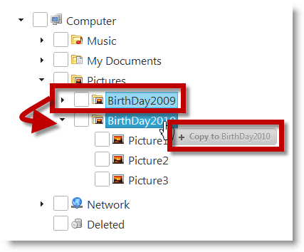

<!--
|metadata|
{
    "fileName": "igtree-drag-and-drop-configuring-mode",
    "controlName": "igTree",
    "tags": ["API","How Do I"]
}
|metadata|
-->

# Configuring the Drag-and-Drop Mode (igTree)

## Topic Overview
### Purpose

This topic explains, with code examples, how to configure the Drag-and-Drop mode of the `igTree`™ control, in both JavaScript and MVC.

### Required background

The following topics are prerequisites to understanding this topic:

- [Drag-and-Drop Overview (igTree)](igTree-Drag-and-Drop-Overview.html): This topic provides overview the Drag-and-Drop feature of the `igTree` control, including explanation of the Drag-and-Drop modes.

- [Enabling Drag-and-Drop (igTree)](igTree-Drag-and-Drop-Enabling.html): This topic explains, with code examples, how to enable the Drag-and-Drop feature in the `igTree` control.


### In this topic

This topic contains the following sections:

-   [Drag-and-Drop Mode Configuration Summary](#config-summary)
-   -   [Overview](#overview)
    -   [Drag-and-Drop mode configuration summary chart](#config-summary-chart)
-   [Code Examples Summary](#code-example-summary)
-   [Code Example: Configuring the Drag-and-Drop Mode in JavaScript](#drag-drop-mode-js)
-   -   [Introduction](#js-introduction)
    -   [Preview](#js-preview)
    -   [Overview](#js-overview)
    -   [Steps](#js-steps)
-   [Code Example: Configuring Drag-and-Drop Mode in MVC](#drag-drop-mode-mvc)
-   -   [Introduction](#mvc-introduction)
    -   [Preview](#mvc-preview)
    -   [Requirements](#mvc-requirements)
    -   [Overview](#mvc-overview)
    -   [Steps](#mvc-steps)
-   [Related Content](#related-content)


## <a id="config-summary"></a>Drag-and-Drop Mode Configuration Summary
### <a id="overview"></a>Overview

The [Drag-and-Drop mode](igTree-Drag-and-Drop-Configuring-Mode.html) of the `igTree` control is managed from the [dragAndDropMode](igTree-Drag-and-Drop-Property-API-Reference.html) property. For the specific settings, see the [Drag-and-Drop mode configuration summary chart](#config-summary-chart). Full configuration procedures are provided in the blocks following the chart.

### <a id="config-summary-chart"></a>Drag-and-Drop mode configuration summary chart

The following table maps the Drag-and-Drop modes to the property settings that configure them.

In order to: | Set the [dragAndDropMode](igTree-Drag-and-Drop-Property-API-Reference.html) property to:
---|---
Allow the user to switch between coping and moving using the Ctrl key.|default <br> This is the default setting for the Drag-and-Drop mode, so you only need to have the Drag-and-Drop feature enabled.
Configure the drag-and-drop move to perform copy action only… | copy
Configure the drag-and-drop move to perform move action only… |move

## <a id="code-example-summary"></a>Code Examples Summary
### Code examples summary chart

The following table lists the code examples included in this topic.

Example | Description
---|---
[Code Example: Configuring the Drag-and-Drop Mode in JavaScript](#drag-drop-mode-js) | This procedure initializes an instance of the `igTree` with the Drag-and-Drop feature enabled and set to Copy mode, and binds this instance to an XML file.
[Code Example: Configuring Drag-and-Drop Mode in MVC](#drag-drop-mode-mvc) | This procedure initializes `igTree` with Drag-and-Drop feature and Copy mode enabled and binds it to an XML file.

## <a id="drag-drop-mode-js"></a>Code Example: Configuring the Drag-and-Drop Mode in JavaScript
### <a id="js-introduction"></a>Introduction

This procedure initializes an instance of the `igTree` with the Drag-and-Drop feature enabled and set to Copy mode, and binds this instance to a JSON data source.

If you want to set some other mode (Move or Default), in the code snippet under step 3.2., replace the following code: `dragAndDropMode: 'copy'`

with `dragAndDropMode: 'move'` or `dragAndDropMode: 'default'`.

### <a id="js-preview"></a>Preview

The following screenshot demonstrates copying of a node as a result of the settings in this procedure.



### <a id="js-overview"></a>Overview

This topic takes you step-by-step toward configuring `igTree` with Drag-and-Drop feature and Copy mode enabled in JavaScript. The following is a conceptual overview of the process:

1. Defining `igTree` data source

2. Adding the script references using Infragistics loader

3. Configuring the Drag-and-Drop mode to Copy

### <a id="js-steps"></a>Steps

The following steps demonstrate how to configure an `igTree` control instance with Copy Drag-and-Drop mode in JavaScript.

1. Define `igTree` data source

For the sake of this example, a simple folder and file structure is created in JSON format. Each object has the following properies

-   `Text` – the name of the node
-   `Value` – the type of node - file or folder
-   `ImageUrl` – URL link which points to a specific node image
-   `Folder` – array of objects with same data as above

**In JavaScript:**

```js
[{
      Text: "My Documents",
      Value: "Folder",
      ImageUrl: "../content/images/DocumentsFolder.png",
      Folder: [{
            Text: "2009",
            Value: "Folder",
            ImageUrl: "../content/images/DocumentsFolder.png",
            Folder: [{
                  Text: "Month Report",
                  Value: "File",
                  ImageUrl: "../content/images/Documents.png",
                  Folder: ""
            }, {
                  Text: "Year Report",
                  Value: "File",
                  ImageUrl: "../content/images/Documents.png",
                  Folder: ""
            }]
      }, {
            Text: "2010",
            Value: "Folder",
            ImageUrl: "../content/images/DocumentsFolder.png",
            Folder: [{
                  Text: "Month Report",
                  Value: "File",
                  ImageUrl: "../content/images/Documents.png",
                  Folder: ""
            }, {
                  Text: "Year Report",
                  Value: "File",
                  ImageUrl: "../content/images/Documents.png",
                  Folder: ""
            }]
      }]
}]
```

2. Add the script references using Infragistics loader.

	The references are required for initializing the igTree control.
	
	Create an HTML file (e.g. tree.html) with the following references to in it.
	
	**In HTML:**
	
	```html
	<script src="../scripts/jquery.min.js"></script>
	<script src="../scripts/jquery-ui.min.js"></script>
	<script src="../js/infragistics.loader.js"></script>
	 $.ig.loader({
	            scriptPath: "../js/",
	            cssPath: "../css/",
	            resources: "igTree"
	});
	```

3. Configure the Drag-and-Drop mode to Copy.

	1. Define the DOM (Document Object Model) Html element placeholder in the `tree.html` file.
	
		**In HTML:**
		
		```html
		<!--igTree target element-->
		<div id="tree">
		</div>
		```
	
	2. Instantiate an `igTree` with the Drag-and-Drop feature enabled in Copy mode in JavaScript.
	
		**In JavaScript:**
		
		```js
		<script>
		        $.ig.loader(function () {
		            $("#tree").igTree({
		                checkboxMode: 'triState',
		                singleBranchExpand: true,
		                dataSource: data,
		                dataSourceType: 'json',
		                initialExpandDepth: 0,
		                pathSeparator: '.',
		                bindings: {
		                    textKey: 'Text',
		                    valueKey: 'Value',
		                    imageUrlKey: 'ImageUrl',
		                    childDataProperty: 'Folder'
		                },
		             dragAndDrop: true,             
		                dragAndDropSettings: {
		                   dragAndDropMode: 'copy'
		               }
		            });
		        });        
		</script>
		```


## <a id="drag-drop-mode-mvc"></a>Code Example: Configuring Drag-and-Drop Mode in MVC
### <a id="mvc-introduction"></a>Introduction

This procedure initializes `igTree` with Drag-and-Drop feature and Copy
mode enabled and binds it to an XML file.

If you want to set some other mode (Move or Default), in the code snippet in step 2., replace the following code (located after the // Configuring Drag-and-drop copy mode comment): `settings.DragAndDropMode(DragAndDropMode.Copy); `with `settings.DragAndDropMode(DragAndDropMode.Move)`; or `settings.DragAndDropMode(DragAndDropMode.Default)`;.

### <a id="mvc-preview"></a>Preview

The following screenshot is a preview of the final result.


### <a id="mvc-requirements"></a>Requirements

To complete the procedure, you need the following:

-   Microsoft® Visual Studio 2010 or newer installed
-   MVC 3 Framework installed
-   `Infragistics.Web.Mvc.dll` added

### <a id="mvc-overview"></a>Overview

This topic takes you step-by-step toward configuring `igTree` with Drag-and-Drop feature and Copy mode enabled in MVC. The following is a conceptual overview of the process:

1. Creating an XML data source file

2. Defining the View

3. Defining the Controller

### <a id="mvc-steps"></a>Steps

The following steps demonstrate how to define View and Controller for configuring `igTree`.

1. Create an XML data source file.

	Create an XML file for the data with Text, ImageUrl, and Value attributes following this structure:
	
	**In XML:**
	
	```xml
	…
	<Folder Text="Network" ImageUrl="../content/images/igTree/Common/door.png" Value="Folder">     
	          <Folder Text="Archive" ImageUrl="../content/images/igTree/Common/door_in.png" Value="Folder"></Folder>
	          <Folder Text="Back Up" ImageUrl="../content/images/igTree/Common/door_in.png" Value="Folder"></Folder>
	          <Folder Text="FTP" ImageUrl="../content/images/igTree/Common/door_in.png" Value="Folder"></Folder>
	</Folder>
	…
	```

2. Define the View.

	1. Add a new View to the Views folder. For this example, name it `SampleDataXML.cshtml`.
	
	2. Add the code to initialize the `igTree` and enable Copy mode in the view.
	
		**In C#:**
		
		```csharp
		<script src="http://localhost/ig_ui/js/infragistics.loader.js" type="text/javascript"></script>
		    @(Html.Infragistics()
		        .Loader()
		        .ScriptPath("http://localhost/ig_ui/js/")
		        .CssPath("http://localhost/ig_ui/css/")
		        .Render()
		    )
		@(Html.
		                        Infragistics().
		                        Tree().
		                        ID("XMLTree").
		                        Bindings( bindings => {
		                            bindings.
		                            ValueKey("Value").
		                            TextKey("Text").
		                            ImageUrlKey("ImageUrl").
		                            ChildDataProperty("Folder");
		                        }).
		                        InitialExpandDepth(0).
		                        DataSource(Model).
		                        CheckboxMode(CheckboxMode.TriState).
		                        SingleBranchExpand(true).
		                        DragAndDrop(true).
		                        DragAndDropSettings(settings =>
		                        {
		                            // Configuring Drag-and-drop copy mode
		                            settings.DragAndDropMode(DragAndDropMode.Copy);
		                        }).
		                        DataBind().
		                        Render()  
		 )
		```

3. Define the controller.

	**In C#:**
	
	```csharp
	public class SampleDataXMLController : Controller
	    {
	        public ActionResult DataBindingUsingMVC()
	        {
	            return View("SampleDataXML", this.GetData());
	        }
	        private IEnumerable<Folders> GetData()
	        {
	            string phisicalFilePath = System.Web.HttpContext.Current.Server.MapPath("~/ThreeData.xml");
	            var ctx = XDocument.Load(phisicalFilePath);
	            IEnumerable<Folders> data = from item in ctx.Root.Elements("Folder")
	                                        select new Folders
	                                        {
	                                            Text = item.Attribute("Text").Value,
	                                            Value = item.Attribute("Value").Value,
	                                            ImageUrl = Url.Content(item.Attribute("ImageUrl").Value),
	                                            Folder = from i1 in item.Elements("Folder")
	                                                     select new Folders
	                                                     {
	                                                         Text = i1.Attribute("Text").Value,
	                                                         Value = i1.Attribute("Value").Value,
	                                                         ImageUrl = Url.Content(i1.Attribute("ImageUrl").Value),
	                                                         Folder = from i2 in i1.Elements("Folder")
	                                                                  select new Folders
	                                                                  {
	                                                                      Text = i2.Attribute("Text").Value,
	                                                                      Value = i2.Attribute("Value").Value,
	                                                                      ImageUrl = Url.Content(i2.Attribute("ImageUrl").Value),
	                                                                      Folder = from i3 in i2.Elements("Folder")
	                                                                               select new Folders
	                                                                               {
	                                                                                   Text = i3.Attribute("Text").Value,
	                                                                                   Value = i3.Attribute("Value").Value,
	                                                                                   ImageUrl = Url.Content(i3.Attribute("ImageUrl").Value)
	                                                                               }
	                                                                  }
	                                                     }
	                                        };
	            return data;
	        }
	    } public class Folders
	{
	        public string Text { get; set; }
	        public string Value { get; set; }
	        public string ImageUrl { get; set; }
	        public IEnumerable<Folders> Folder { get; set; }
	}
	```


## <a id="related-content"></a>Related Content
### Topics

The following topics provide additional information related to this topic.

- [Configuring Custom Drop Validation (igTree)](igTree-Drag-and-Drop-Configuring-Custom-Drop-Validation.html): This topic explains, with code examples, how to configure custom drop validation of the Drag-and-Drop feature of the `igTree` control, in both JavaScript and MVC.

- [Configuring the Look of the Drag Visual Tokens (igTree)](igTree-Drag-and-Drop-Configuring-Tokens.html): This topic explains, with code examples, how to configure the look of the drag visual tokens the `igTree` control, in both JavaScript and MVC.

- [Drag-and-Drop API Reference (igTree)](igTree-Drag-and-Drop-API-Reference.html): The topics in this group provide reference information about the events and properties of the `igTree` control that are related to the Drag-and-Drop feature.

### Samples

The following samples provide additional information related to this topic.

- [Drag and Drop - Single Tree](%%SamplesUrl%%/tree/drag-and-drop-single-tree): This sample demonstrates how to initialize the `igTree` control with the Drag-and-Drop feature enabled.

- [Drag and Drop - Multiple Trees](%%SamplesUrl%%/tree/drag-and-drop-multiple-trees): This sample demonstrates how to drag-and-drop nodes between two `igTrees`.

- [API and Events](igtree-event-reference.html#attaching-handlers-jquery): This sample demonstrates how to use `igTree` API.


 

 


