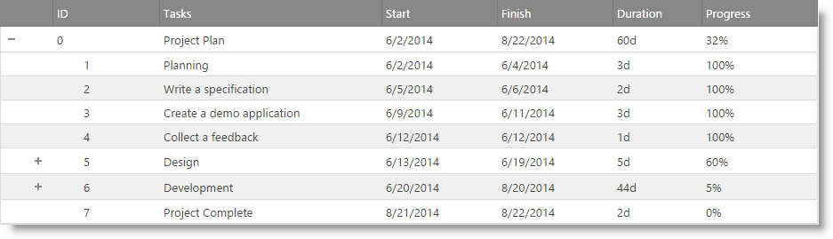

<!--
|metadata|
{
    "fileName": "igtreegrid-overview",
    "controlName": ["igTreeGrid"],
    "tags": ["Grids"]
}
|metadata|
-->

#igTreeGrid Overview
## Topic Overview

This topic contains an overview of the `igTreeGrid` [CTP] control.

### Required background

The following lists the concepts, topics, and articles required as a prerequisite to understanding this topic.

### Topics

-   [igDataSource Overview](igDataSource-igDataSource-Overview.html)
-   [igGrid Overview](igGrid-Overview.html)
-   [igHierarchicalGrid Overview](igHierarchicalGrid-Overview.html)

### In this topic

-   [**Introduction**](#introduction)
-   [**Data Binding**](#data-binding)
    -   [Flat Data Source](#flat-data-source)
    -   [Hierarchical Data Source](#hierarchical-data-source)
-   [**Comparison with the igHierarchicalGrid**](#comparison-hierarchical-grid)
    -   [Similarities](#similarities)
    -   [Differences](#differences)
-   [**Adding igTreeGrid to a web page**](#adding-igTreeGrid)
    -   [Required Resources](#required-resources)
    -   [Initialization](#initialization)
-   [**Supported Features**](#suppored-features)
-   [**Related Content**](#related-content)
    -   [Samples](#samples)

## <a id="introduction"></a>Introduction

The `igTreeGrid` [CTP] is a grid-like control which displays hierarchical data into a single set of columns (the hierarchical data must share a common data schema). It can be compared to an `igHierarchicalGrid` where the child layouts have the same column definition recursively as the root layout.

The `igTreeGrid` features a configurable expander indicator, which can be rendered inline in an existing most-left column or as a standalone column (see [renderExpandColumn](%%jQueryApiUrl%%/ui.igTreeGrid#options:renderExpandColumn) API). The expander can also be customized with different look and feel (see the [File Explorer](%%NewSamplesUrl%%/tree-grid/file-explorer) sample).

The `igTreeGrid` supports some of the `igGrid`/`igHierarchicalGrid` features. For more information see the [Supported Features](#suppored-features) section.

>**Note:** While the `igTreeGrid` is a standalone control and not simply an extension of the `igGrid` control, the `igGrid` API is applicable to the `igTreeGrid` as well. In order to use supported `igGrid` APIs at runtime, use the `$(“.selector”).igGrid()` syntax or you can use the [gridInstance](%%jQueryApiUrl%%/ui.igTreeGrid#methods:gridInstance) API method.



## <a id="data-binding"></a>Data Binding

The `igTreeGrid` supports two type of data sources: flat and hierarchical. The difference between a flat and hierarchical data source are discussed in the following sections. The data source type is configured by the [hierarchicalDataSource](%%jQueryApiUrl%%/ui.igTreeGrid#options:hierarchicalDataSource) option. It is set to true by default.

### <a id="flat-data-source"></a>Flat Data Source

A flat data source consists of an array of objects. Each object is linked with its parent object by a primary key/foreign key relationship.

**In JavaScript:**

```js
var flatDS = [
      { "employeeID": 0, "PID": -1, "firstName": "Andrew", "lastName": "Fuller", "reportsTo": "-" },
      { "employeeID": 1, "PID": -1, "firstName": "Jonathan", "lastName": "Smith", "reportsTo": "-" },
      { "employeeID": 2, "PID": -1, "firstName": "Nancy", "lastName": "Davolio", "reportsTo": "-" },
      { "employeeID": 3, "PID": -1, "firstName": "Steven", "lastName": "Buchanan", "reportsTo": "-" },
      // sub of ID 1
      { "employeeID": 4, "PID": 0, "firstName": "Janet", "lastName": "Leverling", "reportsTo": "0" },
      { "employeeID": 5, "PID": 0, "firstName": "Laura", "lastName": "Callahan", "reportsTo": "0" },
      { "employeeID": 6, "PID": 0, "firstName": "Margaret", "lastName": "Peacock", "reportsTo": "0" },
      { "employeeID": 7, "PID": 0, "firstName": "Michael", "lastName": "Suyama", "reportsTo": "0" },
      // sub of ID 4
      { "employeeID": 8, "PID": 4, "firstName": "Anne", "lastName": "Dodsworth", "reportsTo": "4" },
      { "employeeID": 9, "PID": 4, "firstName": "Danielle", "lastName": "Davis", "reportsTo": "4" },
      { "employeeID": 10, "PID": 4, "firstName": "Robert", "lastName": "King", "reportsTo": "4" }
];
```

In the following sample the `employeeID` represents the primary key and the `PID` property denotes the foreign key relation.

The relationship between the two keys is established via options when instantiating the tree grid.

**In JavaScript:**
```js
$("#treegrid").igTreeGrid({
      dataSource: flatDS,
      key: "employeeID",
      foreignKey: "PID",
      hierarchicalDataSource: false,
      dataValueForRootLayout: -1 // This is the default
});
```
The primary key relation is configured by the [key](%%jQueryApiUrl%%/ui.igTreeGrid#options:key) option (which comes from `igGrid`). The foreign key relation is configured by the [foreignKey](%%jQueryApiUrl%%/ui.igTreeGrid#options:foreignKey) option. The [hierachicalDataSource](%%jQueryApiUrl%%/ui.igTreeGrid#options:hierachicalDataSource) option should be set to false. The [dataValueForRootLayout](%%jQueryApiUrl%%/ui.igTreeGrid#options:dataValueForRootLayout) option is specific for the flat data sources and denotes the values of the foreign key which identifies the record as a root record.

## <a id="hierarchical-data-source"></a>Hierarchical Data Source

A hierarchical data source is also an array of objects, but each object has a property (an array) which contains the child data. The following code listing represents a hierarchical data source.

**In JavaScript:**
```js
var filesList = [
	{
		"name": "Documents", "dateModified": "9/12/2013", "type": "File Folder", "size": 4480, "files": [
			{ "name": "To do list.txt", "dateModified": "11/5/2013", "type": "TXT File", "size": 4448 },
			{ "name": "Work.txt", "dateModified": "9/12/2013", "type": "TXT File", "size": 32 }
		]
	},
	{
		"name": "Music", "dateModified": "6/10/2014", "type": "File Folder", "size": 5594, "files": [
		{
			"name": "AC/DC", "dateModified": "6/10/2014", "type": "File Folder", "size":2726, "files": [
				{ "name": "Stand Up.mp3", "dateModified": "6/10/2014", "type": "MP3 File", "size": 456 },
				{ "name": "T.N.T.mp3", "dateModified": "6/10/2014", "type": "MP3 File", "size": 1155 },
				{ "name": "The Jack.mp3", "dateModified": "6/10/2014", "type": "MP3 File", "size": 1115 }
			]
		},
		{
			"name": "WhiteSnake", "dateModified": "6/11/2014", "type": "File Folder", "size": 2868, "files": [
				{ "name": "Trouble.mp3", "dateModified": "6/11/2014", "type": "MP3 File", "size": 1234 },
				{ "name": "Bad Boys.mp3", "dateModified": "6/11/2014", "type": "MP3 File", "size": 522 },
				{ "name": "Is This Love.mp3", "dateModified": "6/11/2014", "type": "MP3 File", "size": 1112 }
			]
		}
		]
	}
];
```
Here, the files property denotes the child layout data. The relationship between the parent and child data is established via options when instantiating the tree grid.

The child layout data is configured by [dataSourceLayoutKey](%%jQueryApiUrl%%/ui.igTreeGrid#options:dataSourceLayoutKey) option.

**In JavaScript:**
```js
$("#treegrid").igTreeGrid({
      dataSource: filesList,
      dataSourceLayoutKey: "files"
});
```

## <a id="comparison-hierarchical-grid"></a>Comparison with the igHierarchicalGrid

This section helps you to decide when to use `igTreeGrid` or `igHierarchicalGrid`.

>**Note:** This comparison assumes that both controls can data bind to the same data source.

### <a id="similarities"></a>Similarities

Both of them are used to display hierarchical data.

### <a id="differences"></a>Differences

The `igTreeGrid`:

-   Can render the expander cell inline in one of the data columns
-   Supports Column Fixing feature
-   Does not support the Group By feature (grouping is inherent to the tree grid)
-   Has lighter DOM footprint. The control is rendered in single TABLE DOM element (and there is only one instance of `igGrid`). On the contrary the `igHierarchicalGrid` renders separate TABLE DOM for each child layout and on this TABLE element there is an `igGrid` instance.
-   There is no animation when expanding row (initially all expanded child layouts are shown without delay)

The `igHierarchicalGrid`:

-   Can render only hierarchical data source, but not flat data source
-   Supports virtualization (only continuous)
-   Can render column layouts with different data schema from the root layout
-   Creates separate `igGrid` instance for each layout node. In `igTreeGrid` there is one `igGrid` instance which is used to work with `igGrid` API for all the layouts
-   Features can work on individual layouts
-   Supports GroupBy feature
-   There is animation when expanding rows

## <a id="adding-igTreeGrid"></a>Adding igTreeGrid to a web page

### <a id="required-resources"></a>Required Resources

To use the `igTreeGrid` (without the Infragistics Loader) you must reference the following resources:

CSS files

-   css\structure\infragistics.css
-   css\themes\infragistics\infragistics.theme.css

JavaScript files

-   jquery.js
-   jqueryui.js
-   js\modules\infragistics.util.js
-   js\modules\infragistics.ui.shared.js
-   js\modules\infragistics.datasource.js
-   js\modules\infragistics.ui.grid.framework.js
-   js\modules\infragistics.ui.treegrid.js

#### <a id="initialization"></a>Initialization

The following code snippet initializes `igTreeGrid` using a hierarchical data source with a stand-alone expand column.

**In JavaScript:**
```js
$(function () {
var filesList = [
	{
		  "name": "Documents", "dateModified": "9/12/2013", "type": "File Folder", "size": 4480, "files": [
				{ "name": "To do list.txt", "dateModified": "11/5/2013", "type": "TXT File", "size": 4448 },
				{ "name": "Work.txt", "dateModified": "9/12/2013", "type": "TXT File", "size": 32 }
		  ]
	},
	{
		  "name": "Music", "dateModified": "6/10/2014", "type": "File Folder", "size": 5594, "files": [
				{
					  "name": "AC/DC", "dateModified": "6/10/2014", "type": "File Folder", "size":2726, "files": [
							{ "name": "Stand Up.mp3", "dateModified": "6/10/2014", "type": "MP3 File", "size": 456 },
							{ "name": "T.N.T.mp3", "dateModified": "6/10/2014", "type": "MP3 File", "size": 1155 },
							{ "name": "The Jack.mp3", "dateModified": "6/10/2014", "type": "MP3 File", "size": 1115 }
					  ]
				},
				{
					  "name": "WhiteSnake", "dateModified": "6/11/2014", "type": "File Folder", "size": 2868, "files": [
							{ "name": "Trouble.mp3", "dateModified": "6/11/2014", "type": "MP3 File", "size": 1234 },
							{ "name": "Bad Boys.mp3", "dateModified": "6/11/2014", "type": "MP3 File", "size": 522 },
							{ "name": "Is This Love.mp3", "dateModified": "6/11/2014", "type": "MP3 File", "size": 1112 }
					  ]
				}
		  ]
	}
];
$("#treegrid").igTreeGrid({
	dataSource: filesList,
	autoGenerateColumns: false,
	columns: [
		  { headerText: "Name", key: "name", width: "250px", dataType: "string" },
		  { headerText: "Date Modified", key: "dateModified", width: "130px", dataType: "date"},
		  { headerText: "Type", key: "type", width: "230px", dataType: "string" },
		  { headerText: "Size in KB", key: "size", width: "130px", dataType: "number" }
	],
	dataSourceLayoutKey: "files",
	renderExpandColumn: true
});
});
```
### <a id="suppored-features"></a>Supported Features

The `igTreeGrid` shares many of the same features as the `igGrid` and `igHierarchicaGrid`. Just like the other grids, features are configured in the [features](%%jQueryApiUrl%%/ui.iggrid_tg#options:features) option. The following sample shows how to configure grid features:

**In JavaScript:**
```js
$("#treegrid").igTreeGrid({
      width: "800px",
      height:"400px",
      dataSource: filesList,
      autoGenerateColumns: true,
      
      dataSourceLayoutKey: "files",
      features: [
      {
            name: "Sorting"
      },
      {
            name: "Filtering"
      }]
});
```
The `igTreeGrid` supports the following features:

- Column Fixing

- Hiding

- Filtering – works on all layouts at the same time. It can be configured to filter sub-levels with [dataSourceSettings.filtering](%%jQueryApiUrl%%/ui.igtreegrid#options:dataSourceSettings.filtering) option.

- Sorting – works on all layouts at the same time. It can be configured to filter sub-levels with [dataSourceSettings.sorting](%%jQueryApiUrl%%/ui.igtreegrid#options:dataSourceSettings.sorting) option.

- Updating - adding new row works only for the root layout.

- Paging – works only on the root layout

- Resizing

- Selection

- Tooltips

- Multi-Column Headers.

>**Note:** The column related features (Column Fixing, Hiding and Resizing) functionality affects all the layouts, because they share the same column.

>**Note:** When using each feature API you need to use the full feature name. Example: `igGridFiltering`, `igGridSorting` etc.

## <a id="related-content"></a>Related Content

### <a id="samples"></a>Samples

The following samples provide additional information related to this topic.

- [JSON Binding](%%NewSamplesUrl%%/tree-grid/json-binding)

- [File Explorer](%%NewSamplesUrl%%/tree-grid/file-explorer)

- [Balance Sheet](%%NewSamplesUrl%%/tree-grid/balance-sheet)

- [ASP.NET MVC Helper](%%NewSamplesUrl%%/tree-grid/aspnet-mvc-helper)
                    