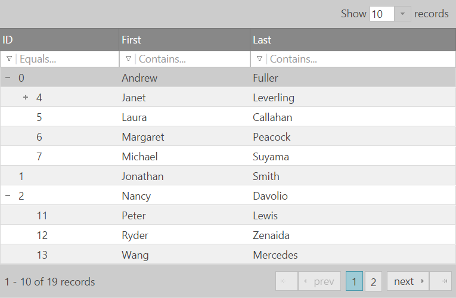
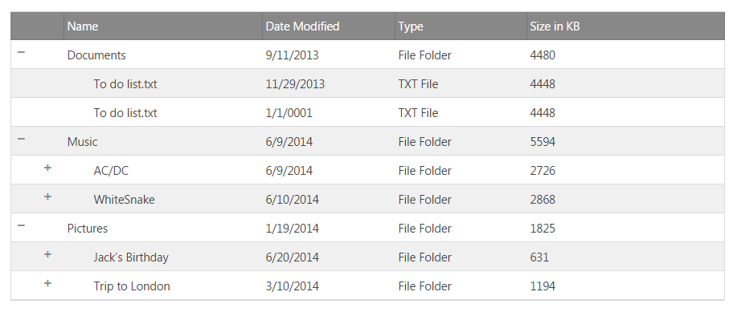
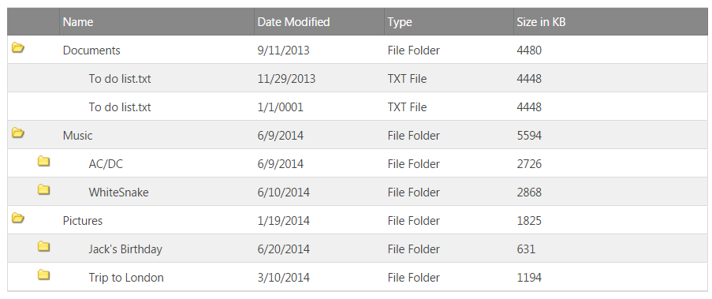

<!--
|metadata|
{
    "fileName": "igtreegrid-overview",
    "controlName": ["igTreeGrid"],
    "tags": ["Grids", "Data Binding", "Getting Started"]
}
|metadata|
-->

# Overview (igTreeGrid)

The `igTreeGrid`™ presents hierarchical data by combining the principles of a tree and tabular data into a single control. Inside the `igTreeGrid` hierarchical data is rendered using the same columns for each row while providing a way for users to expand and collapse child data.



As the `igTreeGrid` inherits the `igGrid` control, it is able to enjoy many of the same features and functionality. Some features differ in function and implementation to best suit the needs of hierarchical data (e.g. filtering, paging, etc.).

In order to maintain flexibility the tree grid features a configurable expansion indicator, which can be rendered inline in the first data column or in a standalone column. The expansion indicator can also be customized with a different look-and-feel to achieve custom visualizations (see the [File Explorer sample](%%SamplesUrl%%/tree-grid/file-explorer "File Explorer Sample - File Explorer with Tree Grid Control - Ignite UI™")).

### In this topic:

- [**Architectural Overview**](#architectural-overview)
- [**Supported Data Sources**](#supported-data-sources)
	- [Flat Data Source](#flat-data)
	- [Hierarchical Data Source](#hierarchical-data)
- [**Feature differences from igGrid**](#feature-differences-iggrid)
- [**igTreeGrid vs. igHierarchicalGrid**](#tree-vs-hierarchical-grids)
- [**Performance**](#performance)
- [**Getting Started**](#getting-started)
  - [Initializing igTreeGrid in JavaScript](#jq-treegrid)
	  - [Full Page Sample](#full-page-sample)
  - [Initializing a MVC igTreeGrid](#mvc-treegrid)
  - [Customize the expand and collapse icons](#customize-icon)
-  [**Keyboard navigation**](#keyboard-navigation)
-   [**Related Content**](#related-content)
    -   [Topics](#topics)
    -   [Samples](#samples)

### Vocabulary

As you become acquainted with the `igTreeGrid` you'll need to be comfortable with a few terms which have specific meaning in the grid's [API](%%jQueryApiUrl%%/ui.igtreegrid) and documentation.

| Term | Definition |
| --- | --- |
| Level | Applies to all data items/rows with equal number of parents in their respective hierarchy |
| Root level | The topmost rows that have no parent of their own |
| Non-leaf level | Rows that have BOTH at least one child AND a parent |
| Leaf level | Items at the lowest level of a hierarchical relationship with NO children AND a parent |


## <a id="architectural-overview"></a> Architectural Overview

The `igTreeGrid` inherits the [`igGrid`](igGrid-Overview.html "igGrid Overview") control and therefore shares many of the same APIs and end-user interactions. In some areas (like filtering, paging, etc.) the tree grid's implementation is different from what is found in the `igGrid` to better accommodate hierarchical data rendered in a tabular format. For details on how certain features are different between the `igGrid` and `igTreeGrid` make sure to read [how igTreeGrid features differ from igGrid](#feature-differences-iggrid).

Much like the flat grid control, the `igTreeGrid` uses a `TABLE` or `DIV` element as the basis for its structure in the DOM. As data is revealed by clicking/tapping on the expansion indicator in the parent's row, the table row and cell elements needed to render child rows are created on-the-fly. For more detailed information on performance considerations for the `igTreeGrid`, please see the [Performance section](#performance).

The tree grid enjoys a disconnected architecture in the same manner as other Ignite UI grids. Under the surface the `igTreeGrid` is powered by the `igTreeHierarchialDataSource` component. The data source component is responsible for implementing logic for features that directly affect the tree grid's source data before its ready to be presented to the user. For details about this specialized data source, see [igTreeHierarchicalDataSource](%%jQueryApiUrl%%/ig.treehierarchicaldatasource).

## <a id="supported-data-sources"></a> Supported Data Sources

The `igTreeGrid` supports two different types of data sources: flat and hierarchical data.

> **Note**: Having a **uniform schema in all data objects** is essential in rendering data in the tree grid. While both the flat and hierarchical data source types use slightly different approaches to maintaining a hierarchical relationship in the data, the rest of the data members are identical in the objects.

### <a id="flat-data"></a> Flat Data Source

Flat data, or self-referencing data, consists of a simple object array where a primary key/foreign key relationship exists in the schema of the data.

An example of a flat data source looks like the following:

```javascript
var data = [
  { id: 1, supervisorId: 0, firstName: "John", lastName: "Smith", title: "CEO" },
  { id: 2, supervisorId: 1, firstName: "Mary", lastName: "Edwards", title: "Manager" },
  { id: 3, supervisorId: 2, firstName: "Matthew", lastName: "Jones", title: "Clerk" }
];
```

Here the `supervisorId` relates back to the `id` value of the data in the array. In order to configure the relationship in the grid you must provide values for both the [`primaryKey`](%%jQueryApiUrl%%/ui.igtreegrid#options:primaryKey) and [`foreignKey`](%%jQueryApiUrl%%/ui.igtreegrid#options:foreignKey) options. The following code snippet demonstrates how to initialize the tree grid with a flat data source:

```javascript
$('#treegrid').igTreeGrid({
  dataSource: data,
  primaryKey: 'id',
  foreignKey: 'supervisorId',
  ...
});
```

The tree grid below is bound to a flat data source:

<div class="embed-sample">
   [JSON Binding](%%SamplesEmbedUrl%%/tree-grid/json-binding)
</div>


### <a id="hierarchical-data"></a> Hierarchical Data Source

Hierarchical data sources have a nested relationship where child data exists as an array member of the parent data object. An example of a hierarchical data source looks like this:

```javscript
var data = [{
  id : 1,
  firstName : "John",
  lastName : "Smith",
  title : "CEO",
  employees : [{
    id : 2,
    firstName : "Mary",
    lastName : "Edwards",
    title : "Manager",
    employees : [{
      id : 3,
      firstName : "Matthew",
      lastName : "Jones",
      title : "Clerk"
    }]
  }]
}];
```

The hierarchical data's relationship is managed by using an array of objects in the `employees` member. To initialize the tree grid with hierarchical data you need to use the [`childDataKey`](%%jQueryApiUrl%%/ui.igtreegrid#options:childDataKey) option to establish the relationship:

```javascript
$('#treegrid').igTreeGrid({
  dataSource: data,
  primaryKey: 'id',
  childDataKey: 'employees',
  ...
});
```

The tree grid below is bound to a hierarchical data source:

<div class="embed-sample">
   [File Explorer](%%SamplesEmbedUrl%%/tree-grid/file-explorer)
</div>

## <a id="feature-differences-iggrid"></a> Feature differences from igGrid


As stated earlier, the `igTreeGrid` inherits the `igGrid` and provides custom implementations for some features of the grid. The following table highlights some of the differences between the features found in each grid.

| Feature | igTreeGrid | igGrid |
| --- | --- | --- |
| Sorting | Recursively sorts rows by column within the hierarchical structure of the data | Sorts rows by all data in a column |
| Paging | Creates pages from only root records OR based on all data | Creates pages from all bound data |
| Filtering | Renders matches to filter criteria in context of its hierarchy | Renders only exact matches to filter criteria |

> **Note**: Unlike the igGrid, the igTreeGrid expects a flat data source if there is a value set for `foreignKey`.


## <a id="tree-vs-hierarchical-grids"></a> igTreeGrid vs. igHierarchicalGrid

While the `igTreeGrid` and [`igHierarchicalGrid`](igHierarchicalGrid-Overview.html "igHierarchicalGrid Overview") are both created to present hierarchical data, there are distinctions when you may want to select one over the other. The biggest distinguishing factor among the two grids is that the `igTreeGrid` displays each row using the same columns, while the `igHierarchicalGrid` supports the ability render data with varying schemas among different hierarchical levels. The following lists detail other ways in which the controls differentiate among each other.

The `igTreeGrid`:
- can render the expansion indicator inside an existing column or in its own column
- applies enabled features across the entire tree grid
- supports the Column Fixing feature
- does not support the Group By feature (grouping is inherent to the tree grid)
- has a lighter DOM footprint than the hierarchical grid; the tree grid is rendered with a single `igGrid` instance

The `igHierarchicalGrid`:
- can render only a hierarchical data source; flat data sources are not supported
- supports child data with a different data schema from the parent
- creates separate `igGrid` instance (with its full DOM) for each child layout as well as for the root data
- features can work on individual layouts independently
- supports the Group By feature

So while there are many similarities between the `igTreeGrid` and the `igHierarchicalGrid`, they each serve a specialized purpose.

## <a id="performance"></a> Performance

Beyond the minimal overhead design of the Tree Grid there are also built-in features that can drastically improve performance with large data sets. [Virtualization](igGrid-Virtualization-Overview.html) helps boost performance by  allowing the number of actual rendered rows (DOM elements) remain constant in the grid while being dynamically reused to render the new data.

> **Note:** Currently the `igTreeGrid` supports only **continuous** flavor of Virtualization, therefore the [`virtualizationMode`](%%jQueryApiUrl%%/ui.igtreegrid#options:virtualizationMode) must always be set to the appropriate value:

```js
$("#treegrid").igTreeGrid({
	//...
	rowVirtualization: true,
	virtualizationMode: "continuous"
});
```

Other features that help increase performance include [Load on Demand](igTreeGrid-Load-On-Demand.html) and the opportunity to take local operations to the server with [Remote Features](%%SamplesUrl%%/tree-grid/remote-features).

> **Note**: The performance enhancements suggested here are best realized when using very large sets of data with the tree grid.

**Related topic:** [Performance Guide (igGrid)](igGrid-Performance-Guide.html)

## <a id="getting-started"></a> Getting Started with the igTreeGrid

### <a id='jq-treegrid'></a> Initializing igTreeGrid in JavaScript

Initializing the `igTreeGrid` requires that you pass an [`options`](%%jQueryApiUrl%%/ui.igtreegrid#options) object that defines the characteristics of the grid. The following code snippet demonstrates how to create a grid bound to a flat data source that includes filtering, sorting and paging.

```javascript
$('#treegrid').igTreeGrid({
  dataSource: employees,
  width: '500px',
  height: '375px',
  primaryKey: 'employeeId',
  foreignKey: 'supervisorId',
  autoGenerateColumns: false,
  columns: [
      { headerText: 'ID', key: 'employeeId', width: '150px', dataType: 'number' },
      { headerText: 'First', key: 'firstName', width: '150px', dataType: 'string' },
      { headerText: 'Last', key: 'lastName', width: '150px', dataType: 'string' }
    ],
  features: [
    {
      name: 'Filtering',
      displayMode: 'showWithAncestorsAndDescendants'
      //displayMode: 'showWithAncestors'
    },
    {
      name: 'Sorting'
    },
    {
      name: 'Paging',
      mode: 'allLevels',
      //mode: 'rootLevelOnly',
      pageSize: 5
    }
  ]
});
```
Notice that in this case values for both `primaryKey` and `foreignKey` are present in order to establish a relationship among data records.

The Filtering and Paging features are shown to include commented out option values that are available for these features. For more information you can read about how Sorting, Filtering and Paging are implemented specifically for the tree grid.

#### <a id="full-page-sample"></a> Full Page Sample

```html
<!DOCTYPE html>
<html xmlns="http://www.w3.org/1999/xhtml">
<head>
	<meta charset="UTF-8" />
	<title>igTreeGrid</title>
</head>
<body>
	<table id="treegrid"></table>
	<script type="text/javascript" src="http://code.jquery.com/jquery-1.10.1.min.js"></script>
	<script type="text/javascript" src="http://ajax.googleapis.com/ajax/libs/jqueryui/1.9.2/jquery-ui.min.js"></script>
    <script type="text/javascript" src="http://cdn-na.infragistics.com/igniteui/%%ProductVersion%%/latest/js/infragistics.loader.js"></script>
	<script type="text/javascript">

        $.ig.loader({
            scriptPath: 'http://cdn-na.infragistics.com/igniteui/%%ProductVersion%%/latest/js/',
            cssPath: 'http://cdn-na.infragistics.com/igniteui/%%ProductVersion%%/latest/css/',
            resources: 'igTreeGrid.Filtering.Paging.Sorting',
            ready: function () {

                var employees = [
                    { "employeeId": 0, "supervisorId": -1, "firstName": "Andrew", "lastName": "Fuller" },
                    { "employeeId": 1, "supervisorId": -1, "firstName": "Jonathan", "lastName": "Smith" },
                    { "employeeId": 2, "supervisorId": -1, "firstName": "Nancy", "lastName": "Davolio" },
                    { "employeeId": 3, "supervisorId": -1, "firstName": "Steven", "lastName": "Buchanan" },

                    // Andrew Fuller's direct reports
                    { "employeeId": 4, "supervisorId": 0, "firstName": "Janet", "lastName": "Leverling" },
                    { "employeeId": 5, "supervisorId": 0, "firstName": "Laura", "lastName": "Callahan" },
                    { "employeeId": 6, "supervisorId": 0, "firstName": "Margaret", "lastName": "Peacock" },
                    { "employeeId": 7, "supervisorId": 0, "firstName": "Michael", "lastName": "Suyama" },

                    // Janet Leverling's direct reports
                    { "employeeId": 8, "supervisorId": 4, "firstName": "Anne", "lastName": "Dodsworth" },
                    { "employeeId": 9, "supervisorId": 4, "firstName": "Danielle", "lastName": "Davis" },
                    { "employeeId": 10, "supervisorId": 4, "firstName": "Robert", "lastName": "King" },

                    // Nancy Davolio's direct reports
                    { "employeeId": 11, "supervisorId": 2, "firstName": "Peter", "lastName": "Lewis" },
                    { "employeeId": 12, "supervisorId": 2, "firstName": "Ryder", "lastName": "Zenaida" },
                    { "employeeId": 13, "supervisorId": 2, "firstName": "Wang", "lastName": "Mercedes" },

                    // Steve Buchanan's direct reports
                    { "employeeId": 14, "supervisorId": 3, "firstName": "Theodore", "lastName": "Zia" },
                    { "employeeId": 15, "supervisorId": 3, "firstName": "Lacota", "lastName": "Mufutau" },

                    // Lacota Mufutau's direct reports
                    { "employeeId": 16, "supervisorId": 15, "firstName": "Jin", "lastName": "Elliott" },
                    { "employeeId": 17, "supervisorId": 15, "firstName": "Armand", "lastName": "Ross" },
                    { "employeeId": 18, "supervisorId": 15, "firstName": "Dane", "lastName": "Rodriquez" },

                    // Dane Rodriquez's direct reports
                    { "employeeId": 19, "supervisorId": 18, "firstName": "Declan", "lastName": "Lester" },
                    { "employeeId": 20, "supervisorId": 18, "firstName": "Bernard", "lastName": "Jarvis" },

                    // Bernard Jarvis' direct report
                    { "employeeId": 21, "supervisorId": 20, "firstName": "Jeremy", "lastName": "Donaldson" }
                ];

                $('#treegrid').igTreeGrid({
                    dataSource: employees,
                    width: '500px',
                    height: '375px',
                    primaryKey: 'employeeId',
                    foreignKey: 'supervisorId',
                    autoGenerateColumns: false,
                    columns: [
                        { headerText: 'ID', key: 'employeeId', width: '150px', dataType: 'number' },
                        { headerText: 'First', key: 'firstName', width: '150px', dataType: 'string' },
                        { headerText: 'Last', key: 'lastName', width: '150px', dataType: 'string' }
                    ],
                    features: [
					    {
					        name: 'Filtering',
					        displayMode: 'showWithAncestorsAndDescendants'
					        //displayMode: 'showWithAncestors'
					    },
                        {
                            name: 'Sorting'
                        },
                        {
                            name: 'Paging',
                            mode: 'allLevels',
                            //mode: 'rootLevelOnly',
                            pageSize: 5
                        }
                    ]
                });

            }
        });
	</script>
</body>
</html>
```

### <a id='mvc-treegrid'></a> Initializing a MVC igTreeGrid

The following steps will guide you through the proccess of initializing the MVC igTreeGrid.

Steps:

	1. Create a new MVC application.
	2. Add reference to the Infragistics.Web.Mvc assembly.
	3. Create a model class.

```csharp
    public class FileExplorer
    {
        public string ID { get; set; }
        public string Name { get; set; }
        public DateTime DateModified { get; set; }
        public string Type { get; set; }
        public int Size { get; set; }
        public List<FileExplorer> Files { get; set; }
    }
```

	4. Create a MVC Controller method that populates a List of data and returns it to the View.

```csharp
public ActionResult AspMvcHelper()
		{
			var files = new List<FileExplorer>();
			files.Add(new FileExplorer
			{
				ID = "1",
				Name = "Documents",
				DateModified = new DateTime(2013, 9, 12),
				Type = "File Folder",
				Size = 4480,
				Files = new List<FileExplorer> { 
                    new FileExplorer { ID = "4", Name = "To do list.txt", DateModified = new DateTime(2013,11,30), Type = "TXT File", Size = 4448 },
                    new FileExplorer { ID = "5", Name = "To do list.txt", DateModified = new DateTime(11/30/2013), Type = "TXT File", Size = 4448 }
                }
			});
			files.Add(new FileExplorer
			{
				ID = "2",
				Name = "Music",
				DateModified = new DateTime(2014, 6, 10),
				Type = "File Folder",
				Size = 5594,
				Files = new List<FileExplorer> { 
                new FileExplorer { ID = "6", Name = "AC/DC", DateModified =new DateTime(2014,6,10), Type = "File Folder", Size = 2726 , 
                    Files = new List<FileExplorer> { 
                        new FileExplorer { ID = "8", Name = "Stand Up.mp3", DateModified = new DateTime(2014,6,10), Type = "MP3 File", Size = 456 },
                        new FileExplorer { ID = "9", Name = "T.N.T.mp3", DateModified = new DateTime(2014,6,10), Type = "MP3 File", Size = 1155 },
                        new FileExplorer { ID = "10", Name = "The Jack.mp3", DateModified = new DateTime(2014,6,10), Type = "MP3 File", Size = 1115 }
                    }
                },
                new FileExplorer { ID = "7", Name = "WhiteSnake", DateModified = new DateTime(2014,6,11), Type = "File Folder", Size = 2868, 
                    Files = new List<FileExplorer> { 
                        new FileExplorer { ID = "11", Name = "Trouble.mp3", DateModified =  new DateTime(2014,6,11), Type = "MP3 File", Size = 1234 },
                        new FileExplorer { ID = "12", Name = "Bad Boys.mp3", DateModified =  new DateTime(2014,6,11), Type = "MP3 File", Size = 522 },
                        new FileExplorer { ID = "13", Name = "Is This Love.mp3", DateModified =  new DateTime(2014,6,11), Type = "MP3 File", Size = 1112 }
                    } 
                }
             }
			});
			files.Add(new FileExplorer
			{
				ID = "3",
				Name = "Pictures",
				DateModified = new DateTime(2014, 1, 20),
				Type = "File Folder",
				Size = 1825,
				Files = new List<FileExplorer> { 
                    new FileExplorer { ID = "14", Name = "Jack's Birthday", DateModified =  new DateTime(2014,6,21), Type = "File Folder", Size = 631, 
                        Files = new List<FileExplorer> { 
                            new FileExplorer { ID = "16", Name = "Picture1.png", DateModified = new DateTime(2014,6,21), Type = "PNG image", Size = 493 },
                            new FileExplorer { ID = "17", Name = "Picture2.png", DateModified = new DateTime(2014,6,21), Type = "PNG image", Size = 88 },
                            new FileExplorer { ID = "18", Name = "Picture3.gif", DateModified = new DateTime(2014,6,21), Type = "GIF File", Size = 50 }
                        }  
                    },
                    new FileExplorer { ID = "15", Name = "Trip to London", DateModified = new DateTime(2014,3,11), Type = "File Folder", Size = 1194, 
                        Files = new List<FileExplorer> { 
                            new FileExplorer { ID = "19", Name = "Picture1.png", DateModified = new DateTime(2014,3,11), Type = "PNG image", Size = 974 },
                            new FileExplorer { ID = "20", Name = "Picture2.png", DateModified = new DateTime(2014,3,11), Type = "PNG image", Size = 142 },
                            new FileExplorer { ID = "21", Name = "Picture3.png", DateModified = new DateTime(2014,3,11), Type = "PNG image", Size = 41 },
                            new FileExplorer { ID = "22", Name = "Picture4.png", DateModified = new DateTime(2014,3,11), Type = "PNG image", Size = 25 },
                            new FileExplorer { ID = "23", Name = "Picture5.png", DateModified = new DateTime(2014,3,11), Type = "PNG image", Size = 12 }
                        }  
                    }
                }
			});

			return View("aspnet-mvc-helper", files.AsQueryable());
		}
```

	5. Create a View named "aspnet-mvc-helper".

In it reference the Infragistics.Web.Mvc.dll assembly and define the Model for the View:

**In C#:**

```
@using Infragistics.Web.Mvc
@model IQueryable<FileExplorer>
```

Add reference to the jQuery, jQueryUI and the IgniteUI scripts and css classes:

```js
    <!-- Ignite UI Required Combined CSS Files -->
    <link href="http://cdn-na.infragistics.com/igniteui/latest/css/themes/infragistics/infragistics.theme.css" rel="stylesheet" />
    <link href="http://cdn-na.infragistics.com/igniteui/latest/css/structure/infragistics.css" rel="stylesheet" />

    <script src="http://ajax.aspnetcdn.com/ajax/modernizr/modernizr-2.8.3.js"></script>
    <script src="http://code.jquery.com/jquery-1.11.3.min.js"></script>
    <script src="http://code.jquery.com/ui/1.11.1/jquery-ui.min.js"></script>

    <!-- Ignite UI Required Combined JavaScript Files -->
    <script src="http://cdn-na.infragistics.com/igniteui/latest/js/infragistics.core.js"></script>
    <script src="http://cdn-na.infragistics.com/igniteui/latest/js/infragistics.lob.js"></script>

```

	6. Define the igTreeGrid in the View.

**In C#:**

```
@(Html.Infragistics().TreeGrid(Model)
        .ID("treegrid1")
        .Width("100%")
        .AutoGenerateColumns(false)
        .PrimaryKey("ID")
        .ChildDataKey("Files")
        .RenderExpansionIndicatorColumn(true)
        .InitialExpandDepth(1)
        .Columns(column =>
            {
                column.For(x => x.ID).Hidden(true);
                column.For(x => x.Name).HeaderText("Name").Width("30%");
                column.For(x => x.DateModified).HeaderText("Date Modified").Width("20%");
                column.For(x => x.Type).HeaderText("Type").Width("20%");
                column.For(x => x.Size).HeaderText("Size in KB").Width("20%");
            })
        .DataBind()
        .Render()
    )
```

The below image demonstrates the end result.



### <a id='customize-icon'></a> Customize the expand and collapse icons

The expand and collapse icons can be customized via the following css classes.
- For the expansion indicator - ui-icon ui-igtreegrid-expansion-indicator ui-icon-plus
- For the collapsing indicator - ui-icon ui-igtreegrid-expansion-indicator ui-icon-minus

The below example demonstrates how to customize the default classes to set a custom image.

```
.ui-icon.ui-igtreegrid-expansion-indicator.ui-icon-minus {
            background: url(../../images/samples/tree-grid/opened_folder.png) !important;
            background-repeat: no-repeat;
}
.ui-icon.ui-igtreegrid-expansion-indicator.ui-icon-plus {
            background: url(../../images/samples/tree-grid/folder.png) !important;
            background-repeat: no-repeat;
}
.ui-icon-plus:before {
		    content: '' !important;
}
.ui-icon-minus:before{
		    content: '' !important;
}
```

The below image shows the result.



## <a id="keyboard-navigation"></a> Keyboard navigation 

### General

Press|While| To
---|---|---
<kbd>Space key</kbd> / <kbd>Enter key</kbd>| Focus is on the expansion indicator cell.|Expand/Collapse the row.


### With Row Selection

Press|While| To
---|---|---
<kbd>Up arrow</kbd> or <kbd>Shift + Tab</kbd> | A row is selected.|Move to the row above.
<kbd>Down arrow</kbd> or <kbd>Tab</kbd> | A row is selected.|Move to the row below.
<kbd>Right arrow</kbd> | A row is selected.|Expand row.
<kbd>Left arrow</kbd> | A row is selected.|Collapse row.
<kbd>Home</kbd> or <kbd>Ctrl+Home</kbd> | A row is selected.|Move to top row.
<kbd>End</kbd> or <kbd>Ctrl+End</kbd> | A row is selected.|Move to bottom row.
<kbd>Right arrow</kbd> | An expanded or leaf row is selected.|Scroll left.
<kbd>Left arrow</kbd> | An expanded or leaf row is selected.|Scroll right.

### With Cell Selection

Press|While| To
---|---|---
<kbd>Up arrow</kbd>| A cell is selected.|Move to the cell above.
<kbd>Down arrow</kbd>| A cell is selected.|Move to the cell below.
<kbd>Right arrow</kbd>| A cell is selected.|Move to the cell on the right.
<kbd>Left arrow</kbd>| A cell is selected.|Move to the cell on the left.
<kbd>Alt + Down arrow</kbd> or <kbd>Enter key</kbd>| The expansion indicator cell is selected.|Expand row.
<kbd>Alt + Up arrow</kbd> or <kbd>Enter key</kbd>| The expansion indicator cell is selected.|Collapse  row.
<kbd>Home</kbd>| A cell is selected.|Move to leftmost cell in the row.
<kbd>End</kbd>| A cell is selected.|Move to rightmost cell in the row.
<kbd>Ctrl+Home</kbd>| A cell is selected.|Move to top left cell in the grid.
<kbd>Ctrl+End</kbd>| A cell is selected.|Move to bottom right cell in the grid.

## <a id="related-content"></a> Related Content


### <a id="topics"></a> Topics
-   [Features Overview (igTreeGrid)](igTreeGrid-Features-Overview.html): This topic covers the basics around the modular features available for the `igTreeGrid` control.
-   [Updating (igTreeGrid)](igTreeGrid-Updating.html): This topic contains an overview of the Updating functionality specific to the `igTreeGrid` control.
-   [Load on Demand (igTreeGrid)](igTreeGrid-Load-On-Demand.html): This topic explains the benefits of the `igTreeGrid` Load on Demand functionality and how it can be implemented.

### <a id="samples"></a> Samples
- [igTreeGrid Overview](%%SamplesUrl%%/tree-grid/overview)
- [igTreeGrid Paging](%%SamplesUrl%%/tree-grid/paging)
