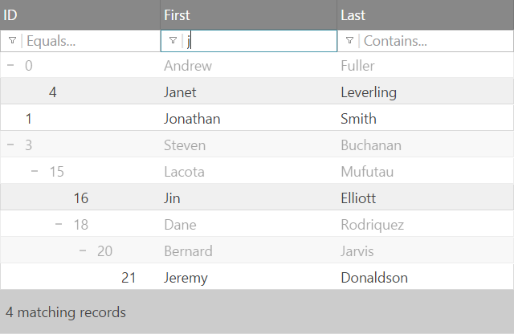
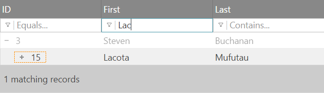
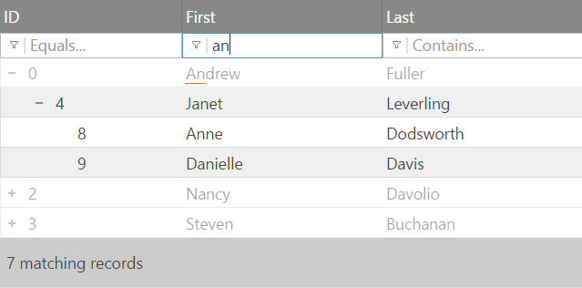

<!--
|metadata|
{
    "fileName": "igtreegrid-filtering",
    "controlName": ["igTreeGrid"],
    "tags": ["Grids", "Filtering"]
}
|metadata|
-->

# Filtering (igTreeGrid)

The Filtering feature for the `igTreeGrid` is extended from the [`igGridFiltering`](igGrid-Filtering.html "igGrid Filtering") feature and is customized to manipulate and present hierarchical data by including additional API options and methods, styling and general behavior.



### In this topic:

- [**Introduction**](#introduction)
- [**Display Mode**](#display-mode)
- [**Finding matching records through the API**](#api-matching)
- [**Apply filtering to specific levels only**](#filter-levels)
- [**Related Content**](#related-content)
    - [Topics](#topics)
    - [Samples](#samples)


## <a id="introduction"></a> Introduction

Filtering operations are performed on all bound data records regardless of their level or expansion state. This creates an experience much like what you may expect from data in a flat grid. The customization specific to the Tree Grid allows you to see matches across different levels of the hierarchy that maintain context by showing the matches next to greyed out (by default) parent and child rows in the hierarchy.

Furthermore, filtering causes collapsed hierarchies to expand and reveal matches, but will properly restore their expansion state once filters are cleared. Changes to the expansion state made while the records are filtered will override the persisted expansion state.

## <a id="display-mode"></a> Display Mode

The  [`displayMode`](%%jQueryApiUrl%%/ui.igtreegridfiltering#options:displayMode) property controls how filtered results appear in the grid. The default is `"showWithAncestors"` which renders matches in full opacity along with their parent nodes with lower opacity. See image above.

The other available mode is `"showWithAncestorsAndDescendants"` which in addition to the default also renders child records, even if child records don't match the filtering conditions. This allows you to quickly find and interact with child levels that associated with a matching parent. While the default state of those levels is collapsed,  changes made to the expansion state will persist after clearing filters:




## <a id="api-matching"></a> Finding matching records through the API

As the `igTreeGrid` render matches with additional parent and child (depending on mode) records, when you attempt to programmatically access the current view state of the control, it can be difficult to determine which records actually match the filter criteria. To help locate matching records, the tree grid filtering will **add an additional property** to the data object named [`matchFiltering`](%%jQueryApiUrl%%/ui.igtreegridfiltering#options:matchFiltering). This property is a Boolean flag applied only to matching data records directly in the filtered data view and is removed if filtering conditions change.

To access the filtered records you can request the [`flatDataView`](%%jQueryApiUrl%%/ig.treehierarchicaldatasource#methods:flatDataView) of the underlying `igTreeHierarchicalDataSource` instance which can be accessed through the grid widget (either directly with the [`.data()`](http://api.jquery.com/data/ "jQuery .data()") method or the reference provided in event handlers):

```js
// alternatively you can access the dataSource instance at any point using:
// var treeHierachicalDS = $("#treegrid").date("igTreeGrid").dataSource;

$("#treegrid").bind("igtreegridfilteringdatafiltered", function(ev, ui){
	var treeHierachicalDS = ui.owner.grid.dataSource;
	var flatView = treeHierachicalDS.flatDataView();

	for (var i = 0; i < flatView.length; i++) {
	  if( flatView[i]['__matchFiltering']) {
		//handle matching flatView[i]
	  }
	}
});

```

## <a id="filter-levels"></a> Apply filtering only to specific levels

In order to control the hierarchy levels that get filtered by this feature the [`fromLevel`](%%jQueryApiUrl%%/ui.igtreegridfiltering#options:fromLevel) and [`toLevel`](%%jQueryApiUrl%%/ui.igtreegridfiltering#options:toLevel) options can be set. These properties are zero-based indexes of the available levels where 0 is the first and in the case of unknown number of child hierarchies the `toLevel` can be set to `-1` which filters to the last bound level.

For example to apply filtering to the child levels only:

```js
$("#treegrid").igTreeGrid({
	//...
	features: [{
		name: 'Filtering',
		fromLevel: 1
	}]
});
```
The result of initializing the Filtering feature as shown above will cause operations to ignore root levels and only match in their child levels:



Notice how the first row contains name matching the "an" criteria, yet is it still displayed in non-matching style and is only rendered to follow the display mode rules.


## <a id="related-content"></a> Related Content

### <a id="topics"></a> Topics
-   [Load on Demand (igTreeGrid)](igTreeGrid-Load-On-Demand.html): This topic explains the benefits of the `igTreeGrid` Load on Demand functionality and how it can be implemented.

### <a id="samples"></a> Samples
-	[igTreeGrid Remote Features](%%SamplesUrl%%/tree-grid/remote-features)
