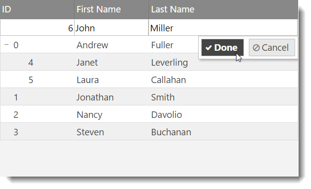
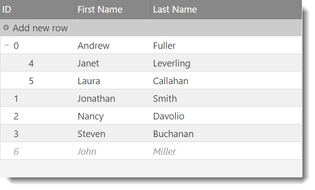
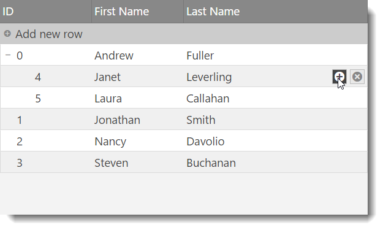
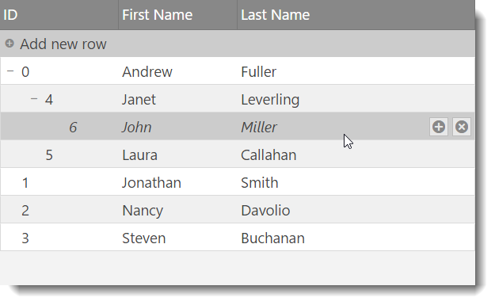

<!--
|metadata|
{
    "fileName": "igtreegrid-updating",
    "controlName": ["igTreeGrid"],
    "tags": ["Grids", "Editing"]
}
|metadata|
-->

# Updating (igTreeGrid)

With the `igTreeGrid` Updating feature, you can edit bound data directly from the grid. The updating features of the grid provides a wide array of adding and editing values of the underling set of data bound to the grid.


### Required Background

The following lists the concepts, topics, and articles required as a prerequisite to understanding this topic.

- [Updating Overview (igGrid)](igGrid-Updating.html): This topic explains how to use the Updating feature of the `igGrid`™ control.


## Introduction

Similar to other features, Updating also extends the equivalent flat data control to add support for hierarchy within a single grid. This is made possible via the underlying instance of the `igTreeHierarchicalDataSource`. While most additions are under-the-hood support for available functionality such as inline editing experience or row edit template, one change is that since version 16.1 the "Add new row" user interface is already enabled and along with it TreeGrid Updating supports adding new records not only directly to the root level, but also adding a child records to a specified level as through the UI, as well through the API.  

## Adding a New Row to a Specific Level

To add a new row **at the root level** programmatically to the Tree Grid you can use the inherited [`addRow`](%%jQueryApiUrl%%/ui.igtreegridupdating#methods:addRow) API method. You need to specify only pairs of values in the format: { column1Key: value1, column2Key: value2, ... } .

For example with the following grid definition:
```js
			$("#treegrid").igTreeGrid({
				dataSource: data,
				height: 400,
				autoCommit: true,
				primaryKey: "employeeId",
				foreignKey: "supervisorId",
				initialExpandDepth: -1,
				autoGenerateColumns: false,
				columns: [
					{ headerText: "ID", key: "employeeId", dataType: "number" },
					{ headerText: "First Name", key: "firstName", dataType: "string" },
					{ headerText: "Last Name", key: "lastName", dataType: "string" },
				],
				features: [
				{
                       name: "Updating",
					   enableAddRow: true
                }
			   ]
			});	
```

Adding a new row to the root level looks like so:

```js
$("#treegrid").igTreeGridUpdating("addRow", {employeeId: 3, firstName: "John", lastName: "Miller"}); 
```




To add a **child** row **at a specific level** you can use either TreeGrid Updating UI or add it programmatically using [`addChild`](%%jQueryApiUrl%%/ui.igtreegridupdating#methods:addChild) API method. The parameters for this method allow you to specify both parent key as well as the new record object that should be inserted. 

> **Note:** Adding a child row to a specific level depends on **enableAddChild** option, which by default is set to true.

For example:
```js
$("#treegrid").igTreeGrid({
				dataSource: data,
				height: 400,
				autoCommit: true,
				primaryKey: "employeeId",
				foreignKey: "supervisorId",
				initialExpandDepth: -1,
				autoGenerateColumns: false,
				columns: [
					{ headerText: "ID", key: "employeeId", dataType: "number" },
					{ headerText: "First Name", key: "firstName", dataType: "string" },
					{ headerText: "Last Name", key: "lastName", dataType: "string" },
				],
				features: [
				{
                       name: "Updating",
					   enableAddRow: true,
					   enableAddChild: true,
                }
			   ]
			});	
```

Adding a child row to a specific level looks like so:

```js
$("#treegrid").igTreeGridUpdating("addChild", {employeeId: 8, firstName: "John", lastName: "Miller"}, 5);
```





## <a id="related-content"></a> Related Content

### <a id="topics"></a> Topics
-   [Load on Demand (igTreeGrid)](igTreeGrid-Load-On-Demand.html): This topic explains the benefits of the `igTreeGrid` Load on Demand functionality and how it can be implemented.

### <a id="samples"></a> Samples
- [igTreeGrid Updating](%%SamplesUrl%%/tree-grid/overview)
