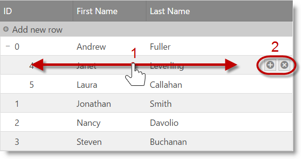

<!--
|metadata|
{
    "fileName": "igtreegrid-updating",
    "controlName": ["igTreeGrid"],
    "tags": ["Grids", "Editing"]
}
|metadata|
-->

# Updating (igTreeGrid)

## Topic Overview

### Purpose
This topic explains how to use the Updating feature of the `igTreeGrid`™ control.

### In this topic
This topic contains the following sections:

-   [**Introduction**](#introduction)
-   [**Updating UI**](#ui)
    -   [Mouse UI](#mouse)
    -   [Touch UI](#touch)
-   [**Working with Updating**](#working-with-updating)
     -   [Enabling Updating](#enable)
     -   [Configuring Updating](#configuring)
-   [**Updating API**](#api)
    -   [Adding a new row to a root level](#api-add-row)
    -   [Adding a child row to a specific level](#api-add-child-row)
    -   [Deleting a row](#api-delete-row)
    -   [Updating a row](#api-update-row)
-   [**Keyboard Interactions**](#keyboard-interaction)
-   [**Related Topics**](#topics)
-   [**Related Samples**](#samples)

### Required Background

The following lists the concepts, topics, and articles required as a prerequisite to understanding this topic.

- [Updating Overview (igGrid)](igGrid-Updating.html): This topic explains how to use the Updating feature of the `igGrid`™ control.


## <a id="introduction"></a> Introduction

Similar to other features, Updating also extends the equivalent flat data control to add support for hierarchy within a single grid. This is made possible via the underlying instance of the [`igTreeHierarchicalDataSource`](%%jQueryApiUrl%%/ig.treehierarchicaldatasource). While most additions are under-the-hood support for available functionality such as inline editing experience or row edit dialog, one change is that since version 16.1 the "Add new row" user interface is already enabled and along with it TreeGrid Updating supports adding new records not only directly to the root level, but also adding a child records to a specified level as through the UI, as well through the API.  

## <a id="ui"></a> Updating UI 

The Updating UI encompasses the built-in adding, updating, and deleting functionality of the igTreeGrid including the "Add new row" button, "Add child row" button, editors, and delete buttons.

### <a id="mouse"></a> Mouse UI

The Updating feature works in the same way as in igGrid. In addition, users can add rows as children of the currently hovered row. The user can add new root level node by using the "Add new row" button at the top of the grid records. The user can add a new child node by first hovering a row, then clicking on the "Add child row" button that appears next to the "Delete row" button. A new row (in edit mode) appears just below the target parent row. 
On cancel, the row is removed and no data changes are made. 
On done, the new row is appended as a last child of the target parent row. 
> **Note:** If there is Paging enabled and the target parent row's children span multiple pages then the **autoCommit** option should be considered. When autoCommit is **false**, then the new child row is added as last record on the current page. When autoCommit is **true**, the new child row is added as a last child and the grid is paged so the new row gets visible.


### <a id="touch"></a> Touch UI

In touch environment hover interaction is not available which requires the user to swipe or tap over the respective row in order to show the "Add child row" button. 



## <a id="working-with-updating"></a> Working with Updating

By enabling the Updating feature, you enable adding, removing and updating the data in the grid.

### <a id="enable"></a> Enabling Updating

The snippet below demonstrates how to configure the igTreeGrid to support updating.

**In Javascript:**
```js
$("#treegrid").igTreeGrid({
				dataSource: data,
				height: 400,
				autoCommit: true,
				primaryKey: "employeeId",
				foreignKey: "supervisorId",
				initialExpandDepth: -1,
				autoGenerateColumns: false,
				columns: [
					{ headerText: "ID", key: "employeeId", dataType: "number" },
					{ headerText: "First Name", key: "firstName", dataType: "string" },
					{ headerText: "Last Name", key: "lastName", dataType: "string" },
				],
				features: [
				{
                       name: "Updating"
                }
			   ]
			});	
```
> **Note:** Updating requires **primaryKey** option to be set and also **dataType** property for the primary key column, otherwise underlying data source may not work as expected.

**In ASPX (MVC):**

```csharp
@(Html.Infragistics().TreeGrid(Model)
.ID("treegrid")
.PrimaryKey("employeeId")
.ForeignKey("supervisorId")
.UpdateUrl(Url.Action("UpdatingSaveChanges"))
.Columns(column =>
    {
        column.For(x => x.employeeId).HeaderText("ID").Width("100px");
        column.For(x => x.firstName).HeaderText("First Name").Width("200px");
        column.For(x => x.lastName).HeaderText("Last Name").Width("200px");
    })
    .Features(features => {
        features.Updating();
    })
    .Height("500")
    .DataSourceUrl(Url.Action("UpdatingGetData"))
	.DataBind()
	.Render()
	)
```

### <a id="configuring"></a> Configuring Updating

Along with the inherited options for configuring adding, updating and deleting rows several new options are available for configuring the 'add child' functionality:
 
Option | Description
---|---
[enableAddChild](%%jQueryApiUrl%%/ui.igTreeGridUpdating#options:enableAddChild) (true) | Specifies whether to enable or disable adding children to rows
[addChildTooltip](%%jQueryApiUrl%%/ui.igTreeGridUpdating#options:addChildTooltip) (null) | Specifies the add child tooltip text
[addChildButtonLabel](%%jQueryApiUrl%%/ui.igTreeGridUpdating#options:addChildButtonLabel) (null) | Specifies the label of the add child button in touch environment

## <a id="api"></a> Updating API

Along with the inherited methods from igGrid Updating several new methods are available related to the 'add child' functionality:

Method | Description
---|---
[addChild](%%jQueryApiUrl%%/ui.igTreeGridUpdating#methods:addChild) | Adds a new child to a specific row. It also creates a transaction and updates the UI
[startAddChildFor](%%jQueryApiUrl%%/ui.igTreeGridUpdating#methods:startAddChildFor) | Starts editing for adding a new child for specific row
[showAddChildButtonFor](%%jQueryApiUrl%%/ui.igTreeGridUpdating#methods:showAddChildButtonFor) | Shows the "Add child row" button for specific row
[hideAddChildButton](%%jQueryApiUrl%%/ui.igTreeGridUpdating#methods:hideAddChildButton) | Hides the "Add child row" button

### <a id="api-add-row"></a> Adding a new row to a root level
To add a new row **at the root level** programmatically to the Tree Grid you can use the inherited from the igGrid [`addRow`](%%jQueryApiUrl%%/ui.igtreegridupdating#methods:addRow) API method. You need to specify only pairs of values in the format: { column1Key: value1, column2Key: value2, ... } .
Using the Tree Grid configuration above adding a new row to the root level looks like so:

```js
$("#treegrid").igTreeGridUpdating("addRow", {employeeId: 3, firstName: "John", lastName: "Miller"}); 
```

### <a id="api-add-child-row"></a> Adding a child row to a specific level
To add a **child** row **at a specific level** you can use either Tree Grid Updating UI or add it programmatically using [`addChild`](%%jQueryApiUrl%%/ui.igtreegridupdating#methods:addChild) API method. The parameters for this method allow you to specify both parent key as well as the new record object that should be inserted. 
Using the Tree Grid configuration above adding a child row to a specific level using the API looks like:

```js
$("#treegrid").igTreeGridUpdating("addChild", {employeeId: 8, firstName: "John", lastName: "Miller"}, 5);
```

> **Note:** The child row is appended as the last child of its parent

### <a id="api-delete-row"></a> Deleting a row

A row can be deleted using the [`deleteRow`](%%jQueryApiUrl%%/ui.igtreegridupdating#methods:deleteRow) API method. The only argument it accepts is the primary key value. 
> **Note:** Deleting a parent row will delete all its children as well.

```js
$("#treegrid").igTreeGridUpdating("deleteRow", 1)
```
### <a id="api-update-row"></a> Updating a row

A row can be updated using the [`updateRow`](%%jQueryApiUrl%%/ui.igtreegridupdating#methods:updateRow) API method.

```js
$("#treegrid").igTreeGridUpdating("updateRow", 5, {lastName: "Fuller"});
```

## <a id="keyboard-interaction"></a> Keyboard Interactions
#### When Editing the following keyboard interactions are available:
> **Note**: The current section describes the keyboard interactions with the default property settings. 
The related options that may change these behaviors are:
>

-	[horizontalMoveOnEnter](%%jQueryApiUrl%%/ui.igtreegridupdating#options:horizontalMoveOnEnter) -  Default: false
-	[startEditTriggers](%%jQueryApiUrl%%/ui.igtreegridupdating#options:startEditTriggers) - Default: click,F2,enter
- 	[excelNavigationMode](%%jQueryApiUrl%%/ui.igtreegridupdating#options:excelNavigationMode) - Default: false

 When a cell/row is selected (Selection feature is enabled):
 
 -	ENTER/F2 – Enters edit mode for the selected cell/row. (See  [startEditTriggers](%%jQueryApiUrl%%/ui.igtreegridupdating#options:startEditTriggers))

When editMode is row and a row is in edit mode, the following key interactions are available:

-	TAB: Moves focus to the next editor in the row. When the last editor is reached the focus would move to the Done/Cancel buttons (if they are available).
-	ENTER: Changes are accepted and the next row enters edit mode. If the current row is the last row in the grid then the first row will enter edit mode.
-	ESCAPE: If any changes were made they are reverted. If there are no pending changes then the row exits edit mode.

When editMode is cell and a cell is in edit mode, the following key interactions are available:

-	TAB: The next cell from the row enters edit mode. If the current cell is the last from the row then the first cell from the next row will enter edit mode. If the current cell is the last from the last row in the grid then the first cell from the first row will enter edit mode.
-	ENTER: Changes are accepted and the cell from the same column on the next row enters edit mode. If the current cell is on the last row of the grid then the related cell from the first row enters edit mode. (See [horizontalMoveOnEnter](%%jQueryApiUrl%%/ui.igtreegridupdating#options:horizontalMoveOnEnter)).
-	ESCAPE: If any changes were made they are reverted. If there are no pending changes then the cell exits edit mode.
-	UP/DOWN/LEFT/RIGHT: Arrows will navigate the cursor inside the edited cell (See [excelNavigationMode](%%jQueryApiUrl%%/ui.igtreegridupdating#options:excelNavigationMode)).

When editMode is rowEditTemplate and a cell is in edit mode, the following key interactions are available:
When the row edit template dialog is open:

-	ESCAPE: Changes are discarded and the dialog is closed. 

###### When row adding is enabled the following keyboard interactions are available:
When the adding row is in edit mode:

-	ENTER: Add the row with the current values to the grid.
-	TAB: Moves focus to the next editor in the row. When the last editor is reached the focus would move to the Done/Cancel buttons (if they are available).

###### When row deleting is enabled the following keyboard interactions are available:
When a row is selected (the Selection feature is enabled and its mode is row):

-	DELETE: Deletes the selected row.


### <a id="topics"></a> Related Topics
-   [Load on Demand (igTreeGrid)](igTreeGrid-Load-On-Demand.html): This topic explains the benefits of the `igTreeGrid` Load on Demand functionality and how it can be implemented.

### <a id="samples"></a> Related Samples
- [igTreeGrid Updating](%%SamplesUrl%%/tree-grid/updating)
