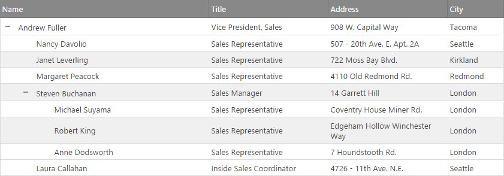
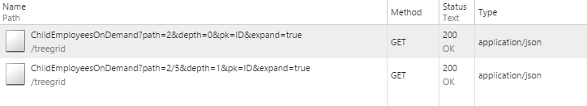

<!--
|metadata|
{
    "fileName": "igtreegrid-load-on-demand",
    "controlName": ["igTreeGrid"],
    "tags": ["Grids", "MVC", "Virtualization"]
}
|metadata|
-->

# Load on Demand (igTreeGrid)

The `igTreeGrid` Load on Demand feature allows for binding to a remote data source and only initially loading the visible data into the grid. Additional data is available by  making remote requests for child records "on demand" as the parents are expanded. This type of interaction allows for a faster page load, faster Tree Grid binding, a lighter initial footprint and potential for presenting the most up-to-date data.

This feature can be combined with additional remote features to achieve complete data virtualization.


### Required Background

The following lists the concepts, topics, and articles required as a prerequisite to understanding this topic.

- [Adding Controls to an MVC Project](Adding-NetAdvantage-Controls-to-an-MVC-Project.html): This topic explains how to get started with Ignite UI™ components in an ASP.NET MVC application.


## Introduction

The Load on Demand functionality enables the tree grid to request the data for the child nodes from the server as the user interacts with the grid (expands a node). This approach significantly reduces the data being transferred between the browser and the server.

In order to take advantage of the remote load on demand functionality the controller action method responsible for processing the request should be decorated with TreeGridDataSourceAction attribute. This is all that needs to be done and the TreeGridDataSourceAction is handling everything else for you. In this scenario requests are handled by the ignite UI Grid MVC Wrapper which automatically adds parameter to the request and returns the data for the specific level only.  

When a row is expanded, the data for the child records is requested with an Ajax call to the server. The feature uses the same [`dataSourceUrl`](%%jQueryApiUrl%%/ui.igtreegrid#options:dataSourceUrl) address shared by other [remote features](igTreeGrid-Remote-Features.html). This means back-end implementations for multiple remote features need to be able to handle more than one style of request.

Rendering expansion indicators in their own column also requires providing the [`initialIndentationLevel`](%%jQueryApiUrl%%/ui.igtreegrid#options:initialIndentationLevel) which determines how many indentations should be reserved as width for that column. This is done to ensure there will be enough space to render the most indented indicator for the leaf levels. Normally this would be determined from the bound data, but in a remote scenario it must be explicitly set up front.

## <a id="request-format"></a> Request Format

With the Ajax call to the remote data source, the `igTreeGrid` will provide a number of parameters - a **path** consisting of the primary keys of the expanded rows, **depth** which is the depth of the last expanded row and the name of the **primary key** property. Depending on the scenario and data one or more can be used to identify the specific piece of data/layout needed.

For example in the Grid described in the [walkthrough](#walkthrough) below:



produces the following two requests, where the single root row has an primary key value of "2":

  

and as visible, the child record's key value is "5", producing a path of `2/5` for its data request.

> **Note:** While Ignite UI comes with ASP.NET MVC helper models to help developers, this feature in not dependent on the platform. Rather, Load on demand can be enabled through the [`enableRemoteLoadOnDemand`](%%jQueryApiUrl%%/ui.igtreegrid#options:enableRemoteLoadOnDemand) option and implemented with any server-side platform that can provide an endpoint to handle the incoming request and return the processed data as JSON.

## <a id="walkthrough"></a> Walkthrough

To quickly get enable the Load on demand functionality of the Tree Grid follow the steps.

1. Configure the `TreeGridModel` model. Set [`EnableRemoteLoadOnDemand`](Infragistics.Web.Mvc~Infragistics.Web.Mvc.TreeGridModel~LoadOnDemand.html) to `true` and [`DataSourceUrl`](Infragistics.Web.Mvc~Infragistics.Web.Mvc.GridModel~DataSourceUrl.html) to the endpoint URL that will handle the requests:

	```csharp
	private TreeGridModel GetTreeGridModel()
	{
		TreeGridModel gridModel = new TreeGridModel();
		gridModel.EnableRemoteLoadOnDemand = true;
		gridModel.DataSourceUrl = Url.Action("ChildEmployeesOnDemand");

		gridModel.Width = "100%";
		gridModel.AutoGenerateColumns = false;
		gridModel.Columns = new List<GridColumn>();
		gridModel.Columns.Add(new GridColumn() { Key = "ID", HeaderText = "ID", DataType = "number", Width = "10%", Hidden = true });
		gridModel.Columns.Add(new GridColumn() { Key = "FirstName", HeaderText = "First Name", DataType = "string", Width = "25%" });
		gridModel.Columns.Add(new GridColumn() { Key = "LastName", HeaderText = "Last Name", DataType = "string", Width = "25%" });
		gridModel.Columns.Add(new GridColumn() { Key = "Title", HeaderText = "Title", DataType = "string", Width = "30%" });
		gridModel.Columns.Add(new GridColumn() { Key = "StartDate", HeaderText = "Start Date", DataType = "date", Width = "15%" });
		gridModel.PrimaryKey = "ID";
		gridModel.ChildDataKey = "Employees";
		gridModel.RenderExpansionIndicatorColumn = true;
		gridModel.InitialIndentationLevel = 4;
		return gridModel;
	}
	```
2. Assign the appropriate source and pass the model to the view:

	```csharp
        [ActionName("load-on-demand")]
        public ActionResult LoadOnDemand()
        {
           TreeGridModel gridModel = GetTreeGridModel();
           gridModel.DataSourceUrl = Url.Action("ChildEmployeesOnDemand");
           return View(gridModel);
        }
	```
3. Crate a controller action to handle the data requests. Use the `path` parameter by splitting it into separate identifiers that correspond to the record key values and use those to navigate to the target level. Return the level data with empty collections for child data:

```csharp
	        [TreeGridDataSourceAction]
        public ActionResult ChildEmployeesOnDemand()
        {
            IQueryable allData = RepositoryFactory.GetHierarchicalEmployeeData().AsQueryable();
            return View("load-on-demand", allData);
        }
```
	> Note: The `igTreeGrid` will provide as much information as possbile to determine the requested data and using it entirely depends on the level of funtionality required. For example if the underlying data has a unique **primary keys** the last identifier (or `identifiers[depth]`) can be used to access the expanded record directly. Also the provided key name parameter can be used to either assign Routing rules for separate data views or in the creation of a predicate string used for querying the source.

4. Create a view and instantiate the `TreeGrid` wrapper with the configured model.

	**In CSHTML:**
	```csharp
	@using Infragistics.Web.Mvc
	// ..
	@(Html.Infragistics().TreeGrid(Model))
	```

## <a id="related-content"></a> Related Content

### <a id="topics"></a> Topics
-   [Features Overview (igTreeGrid)](igTreeGrid-Features-Overview.html): This topic covers the basics around the modular features available for the `igTreeGrid` control.

### <a id="samples"></a> Samples
- [Load on Demand](%%SamplesUrl%%/tree-grid/load-on-demand)
- [igTreeGrid Remote Features](%%SamplesUrl%%/tree-grid/overview)
