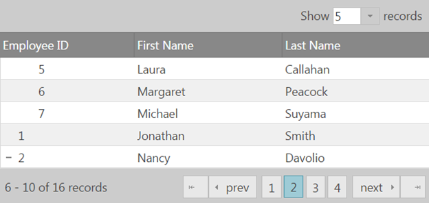
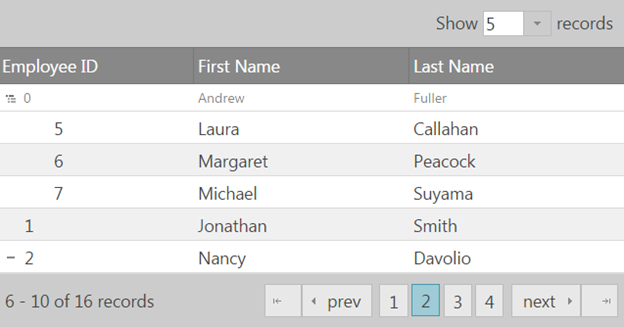
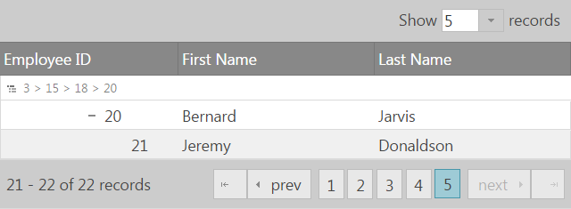
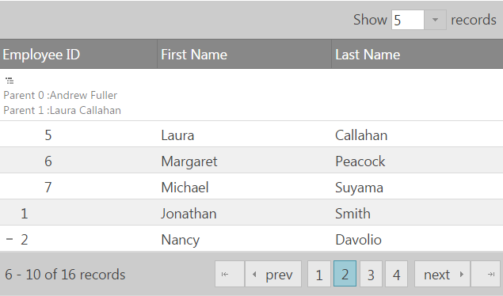

<!--
|metadata|
{
    "fileName": "igtreegrid-paging",
    "controlName": ["igTreeGrid"],
    "tags": ["Grids", "Paging"]
}
|metadata|
-->

# Paging (igTreeGrid)
The Paging feature for the igTreeGrid is extended from the igGridPaging feature and is customized to present hierarchical data while also including additional API options and methods specific to the igTreeGrid.
Due to the extra hierarchy levels additional paging modes are added as well as ways to present the parent row context of the currently visible child rows.

### In this topic:

- [**Introduction**](#introduction)
- [**Paging Modes**](#paging-modes)
- [**Context Row**](#context-row)
- [**Related Content**](#related-content)
    - [Topics](#topics)
    - [Samples](#samples)


## <a id="introduction"></a> Introduction

Due to the hierarchical representation of the data in the igTreeGrid there are two possible paging modes that operate either on the root level of data or on all data levels. When paging operates on the root level only the root rows are paged, the child rows do not affect paging. When paging operates on all levels the grid is paged based on all visible rows. Expanding and collapsing rows in that mode will affect the current page count and rendered rows. 

## <a id="paging-modes"></a> Paging Modes

Paging has additional [`mode`](%%jQueryApiUrl%%/ui.igtreegridpaging#options:mode) option which by default is set to operate only on root level records. In the default mode changing the visible rows by expanding or collapsing rows will not affect the page count.

In the following examples `flatDS` in an array with only **4 root-level rows**:

```js
$("#treegrid").igTreeGrid({
	dataSource: flatDS,
	primaryKey: "employeeID",
	foreignKey: "PID", 
	features: [{
		name: 'Paging',
		mode: 'rootLevelOnly'
	}]
});
```


To apply paging to all visible records set `mode` equal to `allLevels`. This mode setting applies paging to all visible records regardless of their position in the data. The `allLevels` mode makes the paging controls dynamic. For instance the number of pages available changes as rows are expanded and collapsed.

```js
$("#treegrid").igTreeGrid({
	dataSource: flatDS,
	primaryKey: "employeeID",
	foreignKey: "PID", 
	features: [{
		name: 'Paging',
		mode: 'allLevels'
	}]
});
```


## <a id="context-row"></a> Context Row

For scenarios where the child data flows to the next page (when paging mode is set to "allLevels") and context needs to be introduced for the child level row, the TreeGridPaging feature introduces an additional [contextRowMode](%%jQueryApiUrl%%/ui.igtreegridpaging#options:contextRowMode) option that allows rendering of a context row below the grid headers that contains information on the parent row(s) of the current child level row.
There are three possible modes to choose from: "none", "parent" and "breadcrumb".

By default the option is set to "none", in which case no context row is rendered.



As you can see from the screenshot the row at the top is a child row, however its related parent is on the previous page. With this mode there's no way to determine which is the parent row from the context of the current page.

When contextRowMode is set to "parent" a context row will be displayed containing information on the immediate parent row. This mode is useful if the hierarchy isn't too deep and the immediate parent would give enough context for the child row(s). 



To give better context for more complex hierarchies the "breadcrumb" mode can be used. It will render the full path through the ancestors to the current child row. By default the primary key values will be used to build the breadcrumb path to the current row.



There are additional options that allow modification of the displayed breadcrumb (applicable only when contextRowMode is set to 'breadcrumb'):

[breadcrumbKey](%%jQueryApiUrl%%/ui.igtreegridpaging#options:breadcrumbKey) - sets the column key of ancestor to be shown in the breadcrumb trail. By default uses the primary key column.

[breadcrumbDelimiter](%%jQueryApiUrl%%/ui.igtreegridpaging#options:breadcrumbKey) - sets the delimiter between ancestors in the breadcrumb trail. By default is ' &gt; '.

The whole context row rendering can be handled manually using the [renderContextRowFunc](%%jQueryApiUrl%%/ui.igtreegridpaging#options:renderContextRowFunc) option, which allows setting a custom function to handle the rendering of the context row.

The function has four arguments: 

dataRow - the curent data row, which the context row defines.

$textArea - the text area in the context row 

parents - an array of the parents of the current data row

contextMode - the current context mode.

It can either return a string, which will then be injected into the text area of the context row (as html), or if false, empty string or nothing is returned the content can directly be added to the text area via the $textArea argument.

Both of the following examples are valid ways to modify the context row's content.

Via returning a custom string:
```js
renderContextRowFunc: function(dataRow, $textArea, parents, mode) {
        var contextRowText = "<div>";
        $(parents).each(function(index) {
			contextRowText += "<div> Parent " + index + " :" + this.row["firstName"] + " " + this.row["lastName"] + "</div>";
        });
        contextRowText += "</div>";
        return contextRowText;
} 
```
Via directly modifying the textArea content:
```js
renderContextRowFunc: function(dataRow, $textArea, parents, mode) {
        var contextRowText = "<div>";
        $(parents).each( function(index) {
			contextRowText += "<div> Parent "+ index + " :" + this.row["firstName"] + " " + this.row["lastName"] + "</div>";
        });
        contextRowText += "</div>";				
		$textArea.html(contextRowText);
} 
 ```
And lead to the same result.



## <a id="related-content"></a> Related Content

### <a id="topics"></a> Topics
-	[Remote Features (igTreeGrid)](igTreeGrid-Remote-Features.html): This topic contains an overview and implementation details on performing remote operations with `igTreeGrid` features.

### <a id="samples"></a> Samples
-	[igTreeGrid Remote Features](%%SamplesUrl%%/tree-grid/remote-features)