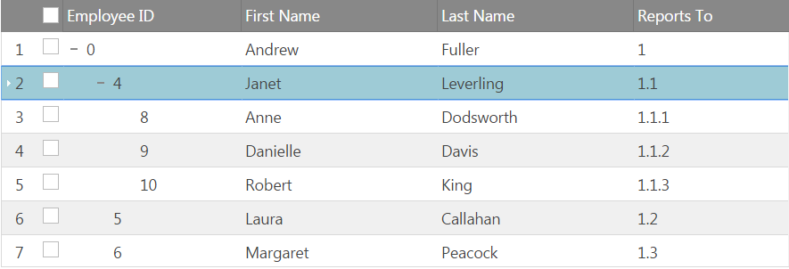
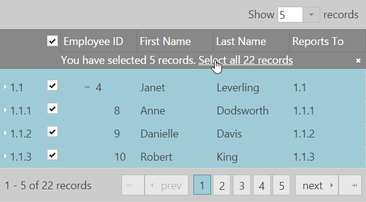

<!--
|metadata|
{
    "fileName": "igtreegrid-row-selectors",
    "controlName": ["igTreeGrid"],
    "tags": ["Grids", "RowSelectors"]
}
|metadata|
-->
# Row Selectors (igTreeGrid)
The Row Selectors feature for the `igTreeGrid` is extended from the `igGrid` RowSelectors. The feature is customized to ease selection in hierarchical data. What is more, in order to meet all kind of requirements Row Selectors provides the opportunity to decouple checkboxes from selection. Additional API options specific to the igTreeGrid are introduced – `rowSelectorNumberingMode` and `chechkboxMode` as well as additional API methods - `checkedRows`, `uncheckedRows`, `partiallyCheckedRows`, `toggleCheckState` and `toggleCheckStateById`.

### In this topic:

- [**Introduction**](#introduction)
- [**Row Selector`s Numbering Modes**](#numbering-modes)
    - [Sequential numbering](#sequential-numbering-mode)
    - [Hierarchical numbering](#hierarachical-numbering-mode)
- [**Row Selector`s Checkbox Modes**](#checkobox-modes)
    - [Bi-state checkboxes](#biState-checkobox-mode)
    - [Tri-state checkboxes](#triState-checkobox-mode)

## <a id="introduction"></a> Introduction
The rowSelectors feature widget provides the user with the functionality to select cell(s), or entire row(s) by clicking the row selector column placed on the left of the first column of the grid. In addition to that, the widget provides row numbering functionalities and checkboxes for row selection. Another advantage of Row Selectors is that they could be easily configured to decouple checkboxes from selection if you would like achieve a "tree-like" look and feel of the applications.

## <a id="numbering-modes"></a> Row Selector`s Numbering Modes
In the `igTreeGrid` there are two possible modes for the row selectors numbering[`mode`](%%jQueryApiUrl%%/ui.igtreegridrowselectors#options:rowSelectorNumberingMode) – sequential and hierarchical.

### <a id="sequential-numbering-mode"></a> Sequential numbering
RowSelectors has a `rowSelectorNumberingMode` option for the numbering format of the rows which by default is set to “sequential”. In this scenario the row numbering format is going to be row`s visible index.

```js
$("#treegrid ").igTreeGrid({
	dataSource: flatDS,
	primaryKey: “employeeID”,
	foreignKey: “PID”,
	features : [
	{
		name : "RowSelectors",
		rowSelectorNumberingMode: "sequential"
	},
	{
		name: "Selection"
	}
	]
});
```


### <a id="hierarachical-numbering-mode"></a>Hierarachical numbering
In order to apply formatting that is concatenation of parent and children indexes set `rowSelectorNumberingMode` to “hierarchical.” 

```js
$("#treegrid ").igTreeGrid({
	dataSource: flatDS,
	primaryKey: “employeeID”,
	foreignKey: “PID”,
	features : [
	{
		name : "RowSelectors",
		rowSelectorNumberingMode: "hierarachical"
	},
	{
		name: "Selection"
	}
	]
});


```


## <a id="checkobox-modes"></a> Row Selector`s Numbering Modes
Depending on the selection is going to be coupled with checkboxes or decoupeled  there are two possible types of checkboxes that you could render: biState and triState.
Bi-state checkboxes

### <a id="biState-checkobox-mode"></a>Bi-state checkboxes
Default state of this option is “biState” . When it is enabled clicking on a checkbox or selecting a row will apply selection to this row only.

```js
$("#treegrid ").igTreeGrid({
	dataSource: flatDS,
	primaryKey: “employeeID”,
	foreignKey: “PID”,
	features : [
	{
		name : "RowSelectors",
		checkBoxMode: "biState"
	},
	{
		name: "Selection"
	}
	]
});
```


### <a id="triState-checkobox-mode"></a>Tri-state checkboxes
In this mode there is a clear distinction between selected row and the state of the corresponding checkbox. This configuration will decouple checkboxes from selection and selection in this case could only be single.
When in “triState” `checkBoxMode` selecting a row is not going to check the corresponding checkbox and vice versa, clicking a selector checkbox is not going to apply selection to the row.

```js
$("#treegrid ").igTreeGrid({
	dataSource: flatDS,
	primaryKey: “employeeID”,
	foreignKey: “PID”,
	features : [
	{
		name : "RowSelectors",
        enableCheckBoxes: true,
		checkBoxMode: "triState"
	},
	{
		name: "Selection"
	}
	]
});
```

Tri state checkboxes - selecting a row



Tri state checkboxes - clicking on the checkbox


## <a id="paging-integration"></a> Integration with Paging
By default the user can select all rows in the current grid page using a checkbox in the header of the row selector column. 
Along with Paging feature, Row Selectors feature provides the ability of the user to select all records across all grid pages when 'enableSelectAllForPaging' option is enabled. 
> **Note:**  This option is enabled by default.  

An option 'selectAllForPagingTemplate' is available to control the notification template. The template supports parameters ${checked} (total checked records) and ${totalRecordsCount}. 
The default template is:
```<div><div>```You have selected ${checked} records. ```<a data-rs-select-all>```Select all ${totalRecordsCount} records```</a><span data-rs-close-all></span></div></div>```


The differences between the two checkbox modes related to "Select All" Paging functionality are described below:
### <a id="biState-paging"></a>Bi-state mode
With the default "biState" mode in order to select all grid pages, along with "enableSelectAllForPaging" option should be enabled also multiple selection.
```js
$("#treegrid").igTreeGrid({
	dataSource: flatDS,
	primaryKey: “employeeID”,
	foreignKey: “PID”,
	features : [
	{
		name: "RowSelectors",
        rowSelectorNumberingMode: "sequential",
        enableCheckBoxes: true,
        checkBoxMode: "biState",
        enableSelectAllForPaging: true
	},
	{
		name: "Selection",
        multipleSelection: true
	},
    {
        name: "Paging",
        pageSize: 10,
        mode : "allLevels"
    }
	]
});
```
Bi state mode - Select All functionality



### <a id="triState-paging"></a>Tri-state mode

> **Note:** TriState mode is not supported with multiple selection.
