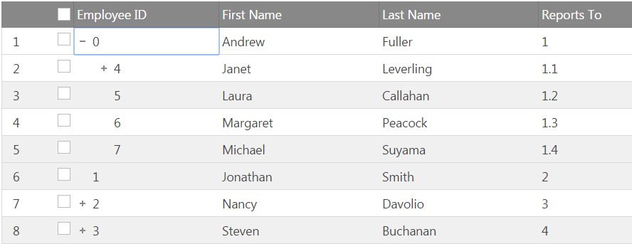
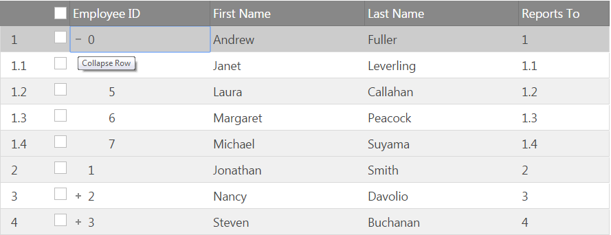
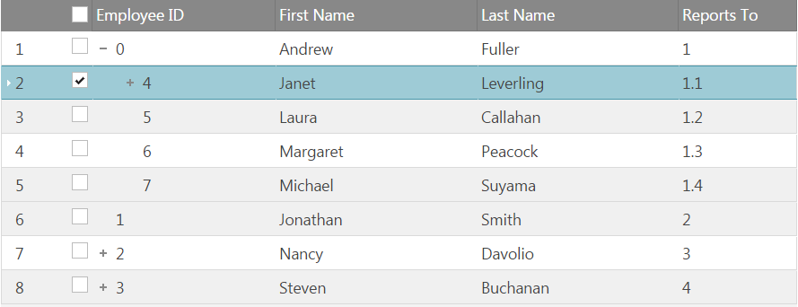
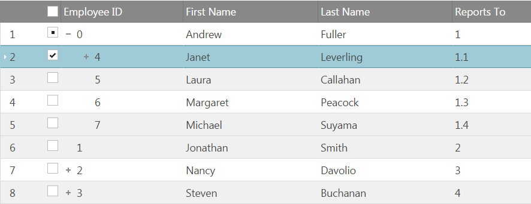

<!--
|metadata|
{
    "fileName": "igtreegrid-row-selectors",
    "controlName": ["igTreeGrid"],
    "tags": ["Grids", "RowSelectors"]
}
|metadata|
-->
# Row Selectors (igTreeGrid)
The Row Selectors feature for the `igTreeGrid` is extended from the `igGrid` RowSelectors. The feature is customized to ease selection in hierarchical data.  Additional API options specific to the igTreeGrid are introduced – `rowSelectorNumberingMode` and `chechkboxMode`.

### In this topic:

- [**Introduction**](#introduction)
- [**Row Selector`s Numbering Modes**](#numbering-modes)
    - [Sequential numbering](#sequential-numbering-mode)
    - [Hierarchical numbering](#hierarachical-numbering-mode)
- [**Row Selector`s Checkbox Modes**](#checkobox-modes)
    - [Bi-state checkboxes](#biState-checkobox-mode)
    - [Tri-state checkboxes](#triState-checkobox-mode)

## <a id="introduction"></a> Introduction
The rowSelectors feature widget provides the user with the functionality to select cell(s), or entire row(s) by clicking the row selector column placed on the left of the first column of the grid. In addition to that, the widget provides row numbering functionalities and checkboxes for row selection.

## <a id="numbering-modes"></a> Row Selector`s Numbering Modes
In the `igTreeGrid` there are two possible modes for the row selectors numbering[`mode`](%%jQueryApiUrl%%/ui.igtreegridrowselectors#options:rowSelectorNumberingMode) – sequential and hierarchical.

### <a id="sequential-numbering-mode"></a> Sequential numbering
RowSelectors has a `rowSelectorNumberingMode` option for the numbering format of the rows which by default is set to “sequential”. In this scenario the row numbering format is going to be row`s visible index.

```js
$("#treegrid ").igTreeGrid({
	dataSource: flatDS,
	primaryKey: “employeeID”,
	foreignKey: “PID”,
	features : [
	{
		name : "RowSelectors",
		rowSelectorNumberingMode: "sequential"
	},
	{
		name: "Selection"
	}
	]
});
```



### <a id="hierarachical-numbering-mode"></a>Hierarachical numbering
In order to apply formatting that is concatenation of parent and children indexes set `rowSelectorNumberingMode` to “hierarchical.” 

```js
$("#treegrid ").igTreeGrid({
	dataSource: flatDS,
	primaryKey: “employeeID”,
	foreignKey: “PID”,
	features : [
	{
		name : "RowSelectors",
		rowSelectorNumberingMode: "hierarachical"
	},
	{
		name: "Selection"
	}
	]
});


```


## <a id="checkobox-modes"></a> Row Selector`s Numbering Modes
Depending on how you would like selection on child rows to affect parent row there are two possible types of checkboxes that you could render: biState and triState.
Bi-state checkboxes

### <a id="biState-checkobox-mode"></a>Bi-state checkboxes
Default state of this option is “biState” . When it is enabled clicking on a checkbox or selecting a row will apply selection to this row only.

```js
$("#treegrid ").igTreeGrid({
	dataSource: flatDS,
	primaryKey: “employeeID”,
	foreignKey: “PID”,
	features : [
	{
		name : "RowSelectors",
		checkboxMode: "biState"
	},
	{
		name: "Selection"
	}
	]
});
```



### <a id="triState-checkobox-mode"></a>Tri-state checkboxes

When “triState” mode parent checkboxes will be fully checked if all of their children are fully checked and partially checked if only some of their children are checked. With `checkboxMode` set to “triState” selecting parent node will select all its children as well.

```js
$("#treegrid ").igTreeGrid({
	dataSource: flatDS,
	primaryKey: “employeeID”,
	foreignKey: “PID”,
	features : [
	{
		name : "RowSelectors",
		checkboxMode: "triState"
	},
	{
		name: "Selection"
	}
	]
});
```

