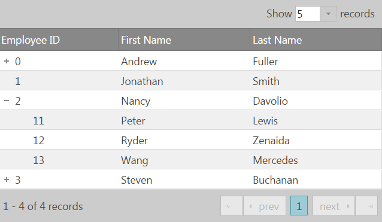

<!--
|metadata|
{
    "fileName": "igtreegrid-features-overview",
    "controlName": ["igTreeGrid"],
    "tags": ["Grids", "Getting Started"]
}
|metadata|
-->

# Features Overview (igTreeGrid)

The `igTreeGrid` extends the [`igGrid`](igGrid-Overview.html "igGrid Overview") control, building on the same modular architecture where  features are extended from the `igGrid`'s equivalents. This allows functional and API parity between the two controls for most features, while some are further customized to better fit the needs of presenting interactive hierarchical data.


### In this topic:

- [**Introduction**](#introduction)
	- [Inherited igGrid Features](#inherited-features)
	- [Unsupported features](#unsupported-features)
- [**Specialized Features**](#specialized-features)
	- [Sorting](#sorting)
	- [Paging](#paging)
	- [Filtering](#filtering)
	- [Updating](#updating)
-   [**Related Content**](#related-content)
    -   [Topics](#topics)
    -   [Samples](#samples)


## <a id="introduction"></a> Introduction

As expected, enabling features in the tree grid is identical to the `igGrid` by defining a `features` array:

```js
$("#treegrid").igTreeGrid({
	//... 
	features : [
		{ name : 'Paging' },
		{ name : 'Sorting', firstSortDirection: 'descending' }
	]
});
```

While may of the tree grid APIs are inherited from `igGrid` you can use a syntax that is native to the tree grid to access those features. For instance if you want to use the Sorting API you could use:

```js
$(".selector").igGridSorting( "option", "firstSortDirection", "ascending");
```

or you can execute the same logic by using a syntax that matches the tree grid:

```js
$(".selector").igTreeGridSorting( "option", "firstSortDirection", "ascending");
```

Notice how the syntax changed from `.igGridSorting` to `.igTreeGridSorting`.

In addition, the same compatibility between supported feature module apply as well. You can reference the full list in the [Feature Compatibility Matrix (igGrid)](Feature-Compatibility-Matrix%28igGrid%29.html "Feature Compatibility Matrix (igGrid)").

### <a id="inherited-features"></a> Inherited igGrid Features
Features inherited directly (extended without modifications) from the `igGrid` behave in the exact same way in the `igTreeGrid` as they would in the `igGrid`. These include:

-	[Column Fixing](igGrid-ColumnFixing-Overview.html "Column Fixing Overview")
-	[Column Hiding](igGrid-Column-Hiding.html "Column Hiding")
-	[Multi Column Headers](igGrid-MultiColumnHeaders-MultiColumnHeaders.html "Multi-Column Headers Overview")
-	[Responsive](igGrid-Responsive-Web-Design-Mode-LandingPage.html "Responsive Web Design /RWD/ Mode")
-	[Selection](igGrid-Selection-Overview.html "Selection Overview")
-	[Tooltips](igGrid-Tooltips.html "Tooltips")

> **Note:** The only difference in some of these features can be the always-present expansion indicators on the first column, unless rendered in their own column.

### <a id="unsupported-features"></a> Unsupported Features

While some feature might be successfully enabled for the `igTreeGrid`, some of them might not behave as expected, therefore they are considered as not yet supported and include the following:

- Column Moving
- Row Selectors
- Resizing
- Summaries
- Column Grouping

## <a id="specialized-features"></a> Specialized Features

### <a id="sorting"></a> Sorting

1.	Sorting against a column sorts the grid's data recursively at each level. To control the range of levels affected by the feature two additional properties are available - [`fromLevel`](%%jQueryApiUrl%%/ui.igtreegridsorting#options:fromLevel) and [`toLevel`](%%jQueryApiUrl%%/ui.igtreegridsorting#options:toLevel) defining the first and last bound levels in the hierarchy to be sorted.
2.	If a parent record does not have data in the column being sorted the record position in the grid will not be changed and the sort is only applied to its child rows.
3.	Sorting persists expansion state.


### <a id="paging"></a> Paging

Because of the extra hierarchy levels introduced in the data, paging has additional [`mode`](%%jQueryApiUrl%%/ui.igtreegridpaging#options:mode) options which by default operate on root level records. The visible records rendered per page in the grid will vary considerably depending on the  expansion state of root records, number of children and hierarchy depth. Meanwhile, page numbers will remain consistent.

In the following examples `flatDS` in an array with only **4 root-level nodes**:

```js
$("#treegrid").igTreeGrid({
	dataSource: flatDS,
	primaryKey: "employeeID",
	foreignKey: "PID", 
	features: [{
		name: 'Paging',
		mode: 'rootLevelOnly'
	}]
});
```



To apply paging to all visible records set `mode` equal to `allLevels`. This mode setting applies paging to all visible records regardless of their position in the data. The `allLevels` mode makes the paging controls dynamic. For instance the number of pages available changes as rows are expanded and collapsed.

```js
$("#treegrid").igTreeGrid({
	dataSource: flatDS,
	primaryKey: "employeeID",
	foreignKey: "PID", 
	features: [{
		name: 'Paging',
		mode: 'allLevels'
	}]
});
```


### <a id="filtering"></a> Filtering

The Filtering feature in the `igTreeGrid` is applied on the entirety of the column data across all levels and behaves as if the data structure is flat.

**Related topic:** [Filtering (igTreeGrid)](igTreeGrid-Filtering.html)


### <a id="updating"></a> Updating

The extended Updating feature adds support for hierarchy within a single grid, maintains functionality such as inline editing experience or row edit template and takes advantage of the to the underlying [`igTreeHierarchicalDataSource`](%%jQueryApiUrl%%/ig.treehierarchicaldatasource).

**Related topic:** [Updating (igTreeGrid)](igTreeGrid-Updating.html)


## <a id="related-content"></a> Related Content

### <a id="topics"></a> Topics
-   [Load on Demand (igTreeGrid)](igTreeGrid-Load-On-Demand.html): This topic explains the benefits of the `igTreeGrid` Load on Demand functionality and how it can be implemented.
-	[Remote Features (igTreeGrid)](igTreeGrid-Remote-Features.html): This topic contains an overview and implementation details on performing remote operations with `igTreeGrid` features.

### <a id="samples"></a> Samples
- [igTreeGrid Overview](%%SamplesUrl%%/tree-grid/overview)
- [Load on Demand](%%SamplesUrl%%/tree-grid/load-on-demand)
- [igTreeGrid Remote Features](%%SamplesUrl%%/tree-grid/remote-features)
