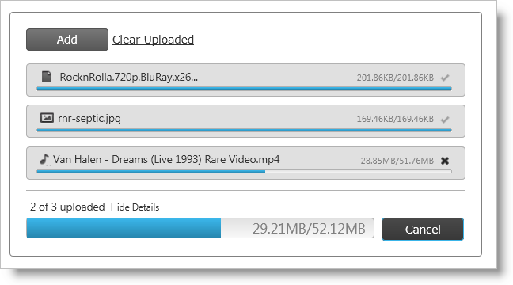
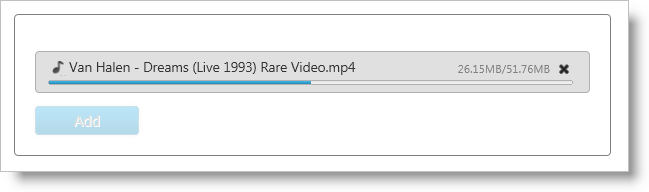

<!--
|metadata|
{
    "fileName": "igupload-overview",
    "controlName": "igUpload",
    "tags": ["Getting Started"]
}
|metadata|
-->

# igUpload Overview

## About igUpload
The Ignite UI™ upload control, or `igUpload`, is a control that allows you to upload any types of files, sending them from the client browser to the server. The size of the uploaded files can be restricted only by server limitations, so you can upload large files with size more than default 10MB.

The upload control is able to handle single uploads (default) or simultaneous multiple file upload operations. To facilitate multiple uploads, the control uses an HTML iframe element to upload files in the background. When the file is uploaded then iframe is removed as a HTML .

There are a number of UI elements that support the upload control as depicted in **Figure 1**. Visual elements include:

-   Progress bar that shows upload progress of an individual file
-   Information like total size, uploaded size and file name
-   Icon that changes according to file type
-   Cancel button
    -   Once the file is uploaded the cancel button disappears and in its place a success indicator is revealed to the user
    -   If the upload is canceled the file information is hidden

During multiple uploads visual elements include:

-   Each file has its own progress bar and cancel button
    -   When Cancel is clicked, that individual file is removed from the upload queue
-   A summary progress bar displays the upload progress of all files
    -   The entire upload may be canceled when the overall cancel button is clicked

## Architecture
Use of the `igUpload` control consists of two required parts - client-side jQuery widget and server-side logic which is responsible for handling and processing each upload request. The server is also responsible for processing the upload itself. The example in this document implements server code using ASP.NET Framework, but the `igUpload` control is independent of server technology.

The upload control exposes a rich jQuery API, so that the controls can be easily configured on the client-side. Also, developers using the Microsoft® ASP.NET MVC framework can leverage the upload control’s server-side wrapper to configure the control with their .NET™ language of choice.

The `igUpload` control may be extensively styled giving you an opportunity to provide a completely different look and feel for the control as opposed to the default style. Styling options include using your own styles as well as styles from jQuery UI’s ThemeRoller.

**Figure 1:** The igUpload control as presented to the user



## Features
-   Single/Multiple Mode
-   Upload more than default 10MB’s
-   Automatic Upload
-   Multiple Simultaneous Upload
-   Cancel Uploading process
-   Client-side events
-   Set maximum upload files
-   Show/Hide progress information
-   Client-Side validation
-   Server-side validation
-   Theme support
-   Modify progress information and file upload status
-   Show appropriate icon according to file extension
-   Modify the text of the control’s labels

## Adding jQuery Upload to a Web Page
This example demonstrates how to include and implement the client-side logic of the control and how to configure the server-side so that it receives and saves the uploaded files.

>**Note:** For more information about the server-side architecture and implementation is available in: [Using the HTTP Handler and Module (igUpload)](igUpload-Using-HTTP-Handler-and-Modules.html).

This sample demonstrates a basic upload scenario in Single Mode, which will start the upload automatically.

**Figure 2**



[igUpload Single Upload Sample](%%SamplesUrl%%/file-upload/basic-usage)

1.  To get started, include the required and localized resources for your application. Details on which resources to include can be found in the [Using JavaScript Resources in Ignite UI](Deployment-Guide-JavaScript-Resources.html) help topic.
2.  On your HTML page or ASP.NET MVC View, reference the required JavaScript files, CSS files, and ASP.NET MVC assemblies.

    **In HTML:**

    ```html
    <link type="text/css" href="/css/themes/infragistics/infragistics.theme.css" rel="stylesheet" /><link type="text/css" href="/css/structure/infragistics.css" rel="stylesheet" />
     <script type="text/javascript" src="/Scripts/jquery-1.4.4.min.js"></script>
    <script type="text/javascript" src="/Scripts/jquery-ui.min.js"></script>
    <script type="text/javascript" src="/Scripts/Samples/infragistics.core.js"></script><script type="text/javascript" src="/Scripts/Samples/infragistics.lob.js"></script>
    ```

    **In ASPX:**

    ```csharp
    <%@ Import Namespace="Infragistics.Web.Mvc" %><link type="text/css" href="<%= Url.Content("~/css/themes/infragistics/infragistics.theme.css") %>" rel="stylesheet" />
    <link type="text/css" href="<%= Url.Content("~/css/structure/infragistics.css") %>" rel="stylesheet" />
    <script type="text/javascript" src="<%= Url.Content("~/Scripts/jquery-1.4.4.min.js") %>"></script>
    <script type="text/javascript" src="<%= Url.Content("~/Scripts/jquery-ui.min.js") %>"></script>
    <script type="text/javascript" src="<%= Url.Content("~/Scripts/Samples/infragistics.core.js") %>"></script><script type="text/javascript" src="<%= Url.Content("~/Scripts/Samples/infragistics.lob.js") %>"></script>
    ```

    **In Razor:**

    ```csharp
    @using Infragistics.Web.Mvc;

    <link type="text/css" href="@Url.Content("~/css/theme/infragistics/infragistics.theme.css")" rel="stylesheet" />
    <link type="text/css" href="@Url.Content("~/css/structure/infragistics.css")" rel="stylesheet" />

    <script type="text/javascript" src="@Url.Content("~/Scripts/jquery-1.4.4.min.js")"></script>
    <script type="text/javascript" src="@Url.Content("~/Scripts/jquery-ui.min.js")"></script>
    <script type="text/javascript" src="@Url.Content("~/Scripts/Samples/infragistics.core.js")"></script><script type="text/javascript" src="@Url.Content("~/Scripts/Samples/infragistics.lob.js")"></script>
    ```

3.  For jQuery implementations, define a DIV as the target element in HTML. This step is optional for ASP.NET MVC implementations as the MVC wrapper creates the containing element for you.

    **In HTML:**

    ```html
    <div id="igUpload1"></div>
    ```

4.  Once the above setup is complete, begin to set options including ID, `autostartupload` and `progressUrl`. The last property defines the URL of the HTTP handler that returns file status progress and file size information and handles cancel upload command. That’s all you need on the client-side widget to connect with server-side and get the upload control to work. The remaining options have their default values. For example for the upload mode is single. Note: For the ASP.NET MVC Views, the Render method must be called after all other options are set.

    **In jQuery:**

    ```js
    <script type="text/javascript" language="javascript">
    $(window).load(function () {
        $("#igUpload1").igUpload({
            autostartupload: true,
            progressUrl: "/IGUploadStatusHandler.ashx"
        });
    });
    </script>
    ```

    **In ASPX:**

    ```csharp
    <%= Html.Infragistics().Upload()
        .ID("igUpload1")
        .AutoStartUpload(true)
        .ProgressUrl("/IGUploadStatusHandler.ashx")
        .Render()
    %>
    ```

    **In Razor:**

    ```csharp
    @(  Html.Infragistics().Upload()
        .ID("igUpload1")
        .AutoStartUpload(true)
        .ProgressUrl("/IGUploadStatusHandler.ashx")
        .Render()
    )
    ```
	>**Note:** If you are using igUpload in a MVC project, you will need to ignore the URL of the HTTP handler in the *Global.asax* file:
	
	**In Global.asax:**
	```
	    protected static void RegisterRoutes(RouteCollection routes)
	    {
	        routes.IgnoreRoute("IGUploadStatusHandler.ashx");
	    }
	```

5.  Next you must configure the server-side HTTP Handler and Module.

## Configuring the HTTP Handler and Module for ASP.NET
The required HTTP handler and Module are part of the `Infragistics.Web.MVC dll` as well as the MVC wrappers. Follow the steps below to register them in the Web.config file.

1.  To get started, first you must create folder with write permissions, where the uploaded files will be saved. Then you have to register that folder in the Web.config file (see the code below), so that the `igUpload` knows where to save the files. For the current example the folder is called Uploads.
2.  You can restrict the size of the uploaded files by setting the `maxFileSizeLimit` setting. In this sample this size is about 100 MB.

    **In web.config:**

    ```xml
    <appSettings>
        <add key="fileUploadPath" value="~/Uploads" />
        <add key="maxFileSizeLimit" value="100000000" />
    </appSettings>
    ```

    >**Note:** The value of `maxFileSizeLimit` is in bytes.

3.  Then you need to register the modules and handlers. Depending on your server you should configure Web.config file.

    For IIS6 (and Development Environment)
    ======================================

    **In web.config:**

    ```xml
    <system.web>
        <httpHandlers>
             <add verb="GET" type="Infragistics.Web.Mvc.UploadStatusHandler" 
                             path="IGUploadStatusHandler.ashx" />
        </httpHandlers>
        <httpModules>
            <add name="IGUploadModule" type="Infragistics.Web.Mvc.UploadModule" />
        </httpModules>
		<!--OPTIONAL: Set the maximum request length.
		By default the request lenght is 4 MB.
		More info: http://msdn.microsoft.com/en-us/library/e1f13641(v=vs.85).aspx-->
		<httpRuntime executionTimeout="3600" maxRequestLength="2097151000"/>
    </system.web>
    ```

    For IIS7
    ========

    **In web.config:**

    ```xml
    <system.webServer>
        <modules runAllManagedModulesForAllRequests="true">
            <add name="IGUploadModule" type="Infragistics.Web.Mvc.UploadModule" 
                                       preCondition="managedHandler" />
        </modules>
        <handlers>
            <add name="IGUploadStatusHandler" path="IGUploadStatusHandler.ashx" verb="*"
				type="Infragistics.Web.Mvc.UploadStatusHandler" preCondition="integratedMode" />
       </handlers>    
	   <security>      
			<requestFiltering>    
				<!--OPTIONAL: Set the maximum request length.
				By default the request lenght is ~30 MB.
				More info: http://www.iis.net/configreference/system.webserver/security/requestfiltering/requestlimits-->
				<requestLimits maxAllowedContentLength="2097151000"/>
	      </requestFiltering>    
	   </security>
    </system.webServer>
    ```

4.  Run the web page and you will get the basic upload control. Then you can select a file from the file picker that your browser displays and monitor the progress information that `igUpload` exposes as shown in Figure 2.
	 >**Note:** If you are still not able to run the upload control, please follow this link to explore possible errors [Using Client-Side Events (igUpload)](igUpload-Using-Client-Side-Events.html). The client-side events topic explains how to attach to a client-side event onError and investigate the problem.

## igUpload Application Settings
`igUpload` comes with an application wide settings, which control the behavior of the HTTP Module and Handler. Those settings are configured in application's web.config file.

**Table 1:** `igUpload` application settings

<table class="table table-bordered">
	<thead>
		<tr>
            <th>
Setting
			</th>

            <th>
Description
			</th>

            <th>
Default value
			</th>
        </tr>
	</thead>
	<tbody>
        <tr>
            <td>
FileUploadPath
			</td>
            <td>
Configures the path to which the files will be uploaded.
			</td>
            <td>
"~/Uploads"
			</td>
        </tr>
        <tr>
            <td>
CustomDictionaryProvider
			</td>
            <td>
Configures a third party dictionary provider (the structure which holds the metadata for the currently uploading files).
This setting is specifically designed for Web Farm/Web Garden scenarios where a common file metadata should be shared between multiple machines/processes.
This setting expects a name of a type which implements `ISafeDictionary<string, UploadInfo>` interface.
			</td>
            <td>
-
			</td>
        </tr>
        <tr>
            <td>
FileSaveType
			</td>
            <td>
Configures the upload processing lifecycle. It can be "filestream" or "memorystream".

In "filestream" mode the HTTP module will process file automatically and save it to the FileUploadPath directory.

In "memorystream" mode the file is uploaded to the server RAM and it should be manually saved to a permanent storage (disk, database) by handling some of the server-side events FileUploading or UploadFinishing. For more information on "memorystream" mode refer to [Saving Files as Stream](igUpload-Saving-Files-as-Stream.html) topic.
			</td>
            <td>
"filestream"
			</td>
        </tr>
        <tr>
            <td>
maxFileSizeLimit
			</td>
            <td>
Configures the limit of the maximum file size which can be uploaded.
			</td>
            <td>
"4194304"
			</td>
        </tr>
        <tr>
            <td>
bufferSize
			</td>
            <td>
Configures the size of each chunk of data which is uploaded to the server.
			</td>

            <td>
"16384"
			</td>
        </tr>
        <tr>
            <td>
allowedMIMEType
			</td>

            <td>
Configures the MIME types which can be uploaded. Multiple MIME types can be listed separated with "|".

                Example:
				<code>
                &lt;add key="allowedMIMEType" value="image/jpeg|image/gif"/&gt;
                </code>
			</td>

            <td>
"*"
			</td>
        </tr>
    </tbody>
</table>


## Related Links
-   [igUpload Single Upload Sample](%%SamplesUrl%%/file-upload/basic-usage)
-   [Ignite UI Overview](NetAdvantage-for-jQuery-Overview.html)
-   [Using JavaScript Resources in Ignite UI](Deployment-Guide-JavaScript-Resources.html)
-   [igUpload HTTP Handler and Module](igUpload-Using-HTTP-Handler-and-Modules.html)
-   [igUpload Client-side events](igUpload-Using-Client-Side-Events.html)

 

 


