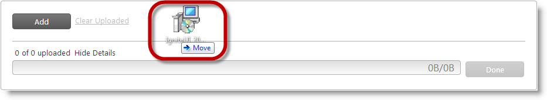
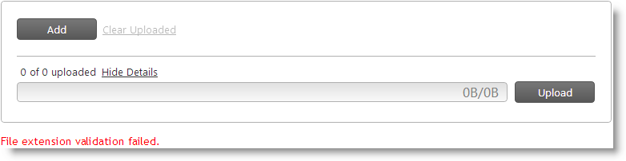
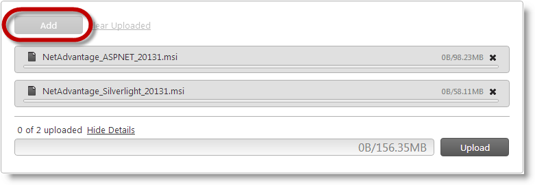
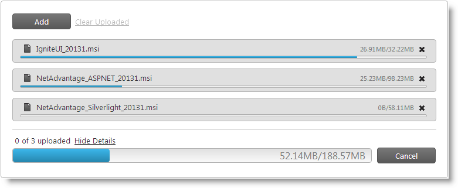
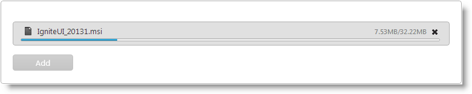
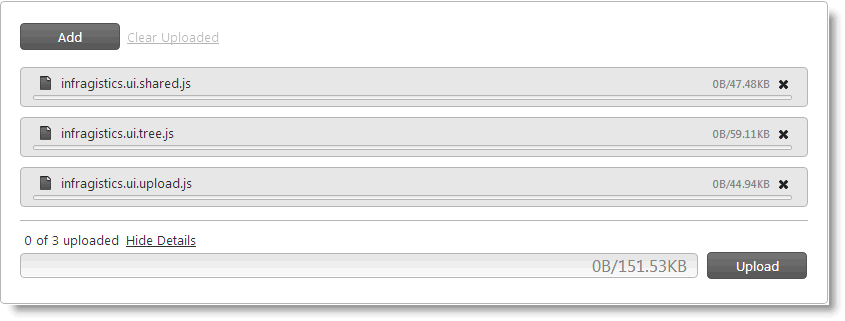

<!--
|metadata|
{
    "fileName": "igupload-configuring-igupload",
    "controlName": "igUpload",
    "tags": []
}
|metadata|
-->

# Configuring igUpload

## Topic Overview
### Purpose

This topic explains, with code examples, how to configure the `igUpload`™ control.

### Required background

The following topics are prerequisites to understanding this topic:

**Topics**

- [igUpload Overview](igUpload-Overview.html): This topic explains conceptually the `igUpload` control and its features. It also demonstrates how to add the control to an HTML page.

- [Using the HTTP Handler and Module](igUpload-Using-HTTP-Handler-and-Modules.html): This topic demonstrates how to configure the HTTP Module and HTTP Handler to process the server events necessary to accept the data uploaded with the `igUpload` control.

**External Resources**

-   [HTML: The Markup Language (an HTML language reference)](http://www.w3.org/TR/html-markup/input.file.html#input.file)

### In this topic

This topic contains the following sections:

-   [igUpload Configuration Overview](#overview)
    -   [igUpload Configuration summary](#config-summary)
    -   [igUpload Configuration summary chart](#config-summary-chart)
-   [Configuring the File Selection Mode (Single/Multiple)](#config-selection-mode)
    -   [Overview](#selection-mode-overview)
    -   [Requirements](#selection-mode-requirements)
    -   [Property settings](#selection-mode-settings)
    -   [Example](#selection-mode-example)
-   [Configuring the Upload Trigger (Manual/Auto)](#config-upload-trigger)
    -   [Overview](#upload-trigger-overview)
    -   [Property settings](#upload-trigger-settings)
    -   [Example](#upload-trigger-example)
-   [Configuring the Allowed File Types](#config-allowed-files)
    -   [Overview](#allowed-files-overview)
    -   [Property settings](#allowed-files-settings)
    -   [Example](#allowed-files-example)
-   [Configuring the Maximum Number of Files to Upload](#max-number-files)
    -   [Overview](#number-files-overview)
    -   [Property settings](#number-files-settings)
    -   [Example](#number-files-example)
-   [Configuring the Maximum Number of Simultaneously Uploading Files](#simultaneously-uploaded-files)
    -   [Overview](#simultaneously-uploaded-files-overview)
    -   [Property settings](#simultaneously-uploaded-files-settings)
    -   [Example](#simultaneously-uploaded-files-example)
-   [Configuring the Usage of a Single Request When Uploading Multiple Files](#singleRequest)
    -   [Overview](#singleRequest-overview)
    -   [Property settings](#singleRequest-settings)
    -   [Example](#singleRequest-example)
-   [Configuring the File Display Mode](#file-display-mode)
    -   [Overview](#display-mode-overview)
    -   [Property settings](#display-mode-settings)
    -   [Example](#display-mode-example)
-   [Related Content](#related-content)
    -   [Topics](#topics)
    -   [Samples](#samples)


## <a id="overview"></a>igUpload Configuration Overview
### <a id="config-summary"></a>igUpload Configuration summary

The `igUpload` control has a large set of options which allow you to customize it for your specific needs. You can control the allowed file types, specify the number of files that can upload simultaneously, configure the user interactions in the file panel (how many files they can select for upload in one pass and how this is displayed in the `igUpload` panel), and chose whether the upload will start automatically or after some explicit user action. For further details, refer to [igUpload Configuration summary chart](#config-summary-chart) and the sections that follow it.

### <a id="config-summary-chart"></a>igUpload Configuration summary chart

The following table lists the configurable aspects of `igUpload`. Additional details are available after the table.

<table class="table">
	<thead>
		<tr>
            <th>
Configurable aspects
			</th>

            <th>
Details
			</th>

            <th>
Properties
			</th>
        </tr>
	</thead>
	<tbody>
        

        <tr>
            <td>
[File selection mode (Single/Multiple)](#config-selection-mode)
			</td>

            <td>
You can configure whether users, when selecting the files to upload, will be able to select multiple files or only one file at a time.
			</td>

            <td>
                <ul>
                    <li>
[mode](%%jQueryApiUrl%%/ui.igupload#options:mode)
					</li>

                    <li>
[multipleFiles](%%jQueryApiUrl%%/ui.igupload#options:multipleFiles)
					</li>
                </ul>
            </td>
        </tr>

        <tr>
            <td>
[Upload trigger (Manual/Auto)](#config-upload-trigger)
			</td>

            <td>
You can configure whether the upload will start automatically once the user has added the file(s) to the `igUpload` panel or manually (on user’s pressing the Upload button).
			</td>

            <td>
                <ul>
                    <li>
[autostartupload](%%jQueryApiUrl%%/ui.igupload#options:autostartupload)
					</li>
                </ul>
            </td>
        </tr>

        <tr>
            <td>
[The Allowed File Types](#config-allowed-files)
			</td>

            <td>
You can configure which types of files will be allowed for users to upload.
			</td>

            <td>
                <ul>
                    <li>
[allowedExtensions](%%jQueryApiUrl%%/ui.igupload#options:allowedExtensions)
					</li>
                </ul>
            </td>
        </tr>

        <tr>
            <td>
[Maximum number of files to upload](#max-number-files)
			</td>

            <td>
You can configure the maximum number of files that can be uploaded per page refresh.
			</td>

            <td>
                <ul>
                    <li>
[maxUploadedFiles](%%jQueryApiUrl%%/ui.igupload#options:maxUploadedFiles)
					</li>
                </ul>
            </td>
        </tr>

        <tr>
            <td>
[Maximum number of simultaneously uploading files](#simultaneously-uploaded-files)
			</td>

            <td>
This setting configures the threshold on the number of simultaneous file uploads.
			</td>

            <td>
                <ul>
                    <li>
[maxSimultaneousFilesUploads](%%jQueryApiUrl%%/ui.igupload#options:maxSimultaneousFilesUploads)
					</li>
                </ul>
            </td>
        </tr>

        <tr>
            <td>[Using a single request when uploading multiple files](#singleRequest)</td>
            
            <td>
This setting configures the control to upload multiple files using one single HTTP request.
            </td>
            
            <td>
                <ul>
                    <li>
[useSingleRequest](%%jQueryApiUrl%%/ui.igupload#options:useSingleRequest)
                    </li>
                </ul>
            </td>
        </tr>

        <tr>
            <td>
[File display mode](#file-display-mode)
			</td>

            <td>
You can configure how many files to be displayed in the panel of the `igUpload` control.
			</td>

            <td>
                <ul>
                    <li>
[mode](%%jQueryApiUrl%%/ui.igupload#options:mode)
					</li>
                </ul>
            </td>
        </tr>
    </tbody>
</table>


## <a id="config-selection-mode"></a>Configuring the File Selection Mode (Single/Multiple)
### <a id="selection-mode-overview"></a>Overview

You can configure whether users, when selecting the files to upload, will be able to select multiple files or only one file at a time. This functionality is managed by the file selection mode of `igUpload`. The file selection mode can be either Single File (users can select only one file at one pass) or Multiple Files (users can select multiple files at one pass).

In Multiple Files file selection mode, users can:

-   Select multiple files at once from the file Open dialog
-   Drag-and-drop the files from Windows® Explorer onto the `igUpload` control

In Single File selection mode, users can select only one file in the file Open dialog and cannot drag-and-drop files. If they want to upload multiple files, they will have to add the files to the `igUpload` control panel repeating the adding procedure for each file.

The following pictures illustrate the two alternative file selection approaches: selecting multiple files in the file Open dialog (left) or dragging and dropping them from Windows Explorer onto the `igUpload` control panel (right).

#### Multiple files selection in the file Open dialog 

 

#### Dropping selected files from Windows Explorer onto `igUpload`



The default file selection mode is Single File.

The file selection mode is managed by the [mode](%%jQueryApiUrl%%/ui.igupload#options:mode) and [multipleFiles](%%jQueryApiUrl%%/ui.igupload#options:multipleFiles) options. Setting [multipleFiles](%%jQueryApiUrl%%/ui.igupload#options:multipleFiles) to true makes sense only when [mode](%%jQueryApiUrl%%/ui.igupload#options:mode) is multiple. When [mode](%%jQueryApiUrl%%/ui.igupload#options:mode) is single, [multipleFiles](%%jQueryApiUrl%%/ui.igupload#options:multipleFiles) has no effect.

The File Selection Mode feature employs the [HTML 5 multiple attribute](http://www.w3.org/TR/html-markup/input.file.html#input.file) of the input element. This makes the feature browser-dependent. If an unsupported browser is used, then setting the feature’s properties has no effect, meaning that users will not be able to select multiple files from the file Open dialog or drag-and-drop them onto the `igUpload` control. For the list of the supported browsers, see [Requirements](#selection-mode-requirements).

### <a id="selection-mode-requirements"></a>Requirements

Following are the requirements for configuring the file selection type:

-   A browser supporting HTML 5 multiple attribute of the input element

This functionality is available only in the following browsers:

Chrome| Firefox| Internet Explorer| Opera| Safari
---|---|---|---|---
1.0 or higher|3.6 or higher|10 or higher|10.62 or higher|5 or higher


### <a id="selection-mode-settings"></a>Property settings

The following table maps the desired configuration to its respective property settings.

<table class="table">
	<thead>
		<tr>
            <th>
Configurable aspects
			</th>

            <th>
Details
			</th>

            <th>
Properties
			</th>
        </tr>
	</thead>
	<tbody>


        <tr>
            <td>
[File selection mode (Single/Multiple)](#config-selection-mode)
			</td>

            <td>
You can configure whether users, when selecting the files to upload, will be able to select multiple files or only one file at a time.
			</td>

            <td>
                <ul>
                    <li>
[mode](%%jQueryApiUrl%%/ui.igupload#options:mode)
					</li>

                    <li>
[multipleFiles](%%jQueryApiUrl%%/ui.igupload#options:multipleFiles)
					</li>
                </ul>
            </td>
        </tr>

    </tbody>
</table>


### <a id="selection-mode-example"></a>Example

This example demonstrates how to enable multiple files selection as a result of the following settings:

Property| Value
---|---
mode|"multiple"
multipleFiles|true


Following is the code that implements this example.

**In JavaScript:**

```js
$('#upload1').igUpload({ 
    mode: 'multiple', 
    multipleFiles: true
});
```

**In ASPX:**

```csharp
@(Html.Infragistics().Upload()
    .MultipleFiles(true)
    .Mode(UploadMode.Multiple)
    .Render()
)
```


## <a id="config-upload-trigger"></a>Configuring the Upload Trigger (Manual/Auto)
### <a id="upload-trigger-overview"></a>Overview

You can configure whether the upload will start automatically once the user has added the file(s) to the `igUpload` panel or manually (on user’s pressing the Upload button). This functionality of the `igUpload` control is called “upload trigger”. The upload trigger enables or disables the automatic start of the file upload.

The default upload trigger is Manual.

The upload trigger is managed by the autostartupload option of the `igUpload` control.

### <a id="upload-trigger-settings"></a>Property settings

The following table maps the desired configuration to its respective
property settings.

In order to:| Use this property:| And set it to:
---|---|---
Enable automatic upload|[autostartupload](%%jQueryApiUrl%%/ui.igupload#options:autostartupload)|true
Disable automatic upload|[autostartupload](%%jQueryApiUrl%%/ui.igupload#options:autostartupload)|false

### <a id="upload-trigger-example"></a>Example

This example demonstrates how to enable automatic upload for users a result of the following settings:

Property|Value
---|---
[autostartupload](%%jQueryApiUrl%%/ui.igupload#options:autostartupload)|true

Following is the code that implements this example.

**In JavaScript:**

```js
$('#upload1').igUpload({ 
    autostartupload: true
});
```

**In ASPX:**

```csharp
@(Html.Infragistics().Upload()
    .AutoStartUpload(true)
    .Render()
)
```

## <a id="config-allowed-files"></a>Configuring the Allowed File Types
### <a id="allowed-files-overview"></a>Overview

You can configure which types of files will be allowed for users to upload. This functionality is handled by explicitly listing the file name extensions of the allowed file types in a list of permissible file types. This list is set as an array of strings representing the allowed file extensions as the value of the [allowedExtensions](%%jQueryApiUrl%%/ui.igupload#options:allowedExtensions) property.

By default, all file types can be uploaded.

The file extension validation compares the selected file extension against the list of extensions declared in `allowedExtenstions` property. When the file extension validation fails, the `igUpload` ‘s onError event is raised. The second parameter of the onError handler contains an object with property `errorCode = 2` and the `errorMessage = “File extension validation failed.”`. It is up to you to decide how to present the error to the user.

### <a id="allowed-files-settings"></a>Property settings

The following table maps the desired configuration to its respective
property settings.

In order to:| Use this property:| And set it to:
---|---|---
Define allowed extensions|[allowedExtensions](%%jQueryApiUrl%%/ui.igupload#options:allowedExtensions)|An array of strings representing the allowed file extensions


### <a id="allowed-files-example"></a>Example

This example demonstrates how to set allowed users to upload .xls and ,doc files:

Property| Value
---|---
[allowedExtensions](%%jQueryApiUrl%%/ui.igupload#options:allowedExtensions)|["xls","doc"]




Following is the code that implements this example.

**In JavaScript:**

```js
$("#upload1").igUpload({
    allowedExtensions : ["xls","doc"]
});
```

**In ASPX:**

```csharp
@(Html.Infragistics().Upload()
    .AllowedExtensions(new List<string> { "xls", "doc"})
    .Render()
)
```


## <a id="max-number-files"></a>Configuring the Maximum Number of Files to Upload
### <a id="number-files-overview"></a>Overview

You can configure the maximum number of files that can be uploaded per page refresh. Once this limit is reached, the Add button in the `igUpload` control’s panel is disabled. When File Selection mode is Multiple, an error is thrown when the number of selected files exceeds the limit.

By default, there is no restriction on the number of files to upload.

When you have `multipleFiles = true` user can select more files that the threshold. In this case an `igUpload` `onError` event is raised. The second parameter of the `onError` handler contain object with property `errorCode = 1` and the `errorMessage = “Maximum count of uploading files exceeded.”` It is up to you to decide how to present the error to the user.

### <a id="number-files-settings"></a>Property settings

The following table maps the desired configuration to its respective
property settings.

In order to:| Use this property:| And set it to:
---|---|---
Set maximum uploaded files| [maxUploadedFiles](%%jQueryApiUrl%%/ui.igupload#options:maxUploadedFiles)| The desired integer value


### <a id="number-files-example"></a>Example

This example demonstrates how to set the maximum number of files to upload to 2:

Property| Value
---|---
[maxUploadedFiles](%%jQueryApiUrl%%/ui.igupload#options:maxUploadedFiles)|2


The following picture demonstrates the Add button disabled as a result of reaching the maximum number of allowed files for upload.



Following is the code that implements this example.

**In JavaScript:**

```js
$('#upload1').igUpload({ 
    maxUploadedFiles: 2
});
```

**In ASPX:**

```csharp
@(Html.Infragistics().Upload()
    .MaxUploadedFiles(2)
    .Render()
)
```


## <a id="simultaneously-uploaded-files"></a>Configuring the Maximum Number of Simultaneously Uploading Files
### <a id="simultaneously-uploaded-files-overview"></a>Overview

You can configure the maximum number of files that can be uploading simultaneously.

If there are more files for upload than that maximum allowed number, that maximum number of files is uploaded simultaneously (on first come –first served basis) while the rest stand by until the number of uploading files number gets below that number.

the maximum number of files that can be uploading simultaneously is managed by the [maxSimultaneousFilesUploads](%%jQueryApiUrl%%/ui.igupload#options:maxSimultaneousFilesUploads) property.

### <a id="simultaneously-uploaded-files-settings"></a>Property settings

The following table maps the desired configuration to its respective
property settings.

In order to:| Use this property:| And set it to:
---|---|---
Set the maximum number of simultaneous file uploads| [maxSimultaneousFilesUploads](%%jQueryApiUrl%%/ui.igupload#options:maxSimultaneousFilesUploads)| The desired integer value


### <a id="simultaneously-uploaded-files-example"></a>Example

The code samples below demonstrate how to set maximum simultaneous files uploads:

Property| Value
---|---
[maxSimultaneousFilesUploads](%%jQueryApiUrl%%/ui.igupload#options:maxSimultaneousFilesUploads)|2



Following is the code that implements this example.

**In JavaScript:**

```js
$('#upload1').igUpload({ 
    maxSimultaneousFilesUploads: 2
});
```

**In ASPX:**

```csharp
@(Html.Infragistics().Upload()
    .MaxSimultaneousFilesUploads(2)
    .Render()
)
```


## <a id="singleRequest"></a>Configuring the Usage of a Single Request When Uploading Multiple Files
### <a id="singleRequest-overview"></a>Overview

You can configure whether the multiple files upload process should use a request for each file or send all files using one single request.


### <a id="singleRequest-settings"></a>Property settings

The following table maps the desired configuration to its respective
property settings.

In order to:| Use this property:| And set it to:
---|---|---
Upload multiple files each in a separate request| [useSingleRequest](%%jQueryApiUrl%%/ui.igupload#options:useSingleRequest)| false (default)
Upload multiple files each in one single request| [useSingleRequest](%%jQueryApiUrl%%/ui.igupload#options:useSingleRequest)| true


### <a id="singleRequest-example"></a>Example

The code sample below demonstrates how to set the file upload of multiple files to use a single request:

Property| Value
---|---
[useSingleRequest](%%jQueryApiUrl%%/ui.igupload#options:useSingleRequest)| true

Following is the code that implements this example.

**In JavaScript:**

```js
$('#upload1').igUpload({ 
    useSingleRequest: true
});
```

**In ASPX:**

```csharp
@(Html.Infragistics().Upload()
    .useSingleRequest(true)
    .Render()
)
```


## <a id="file-display-mode"></a>Configuring the File Display Mode
### <a id="display-mode-overview"></a>Overview

You can configure how many files to be displayed in the panel of the `igUpload` control. This functionality is managed by the file display mode of `igUpload`. The file selection mode can be either Single File (only one file is shown in the panel) or Multiple Files (multiple files shown in the panel).

In Multiple Files mode, the panel displays several files (arranged vertically).

In Single File mode, only one file at a time can be displayed.

The following pictures compare Single File mode and Multiple Files mode.

#### Single File mode 



#### Multiple Files mode




The default file mode setting is Single File.

The number of displayed files in Multiple Files mode cannot exceed the [maxUploadedFiles](%%jQueryApiUrl%%/ui.igupload#options:maxUploadedFiles) setting.

### <a id="display-mode-settings"></a>Property settings

The following table maps the desired configuration to its respective
property settings.

In order to: | Use this property:| And set it to:
---|---|---
Set the display mode to Single File| mode| “single”
Set the display mode to Multiple Files| mode|"multiple"

### <a id="display-mode-example"></a>Example

This example demonstrates setting the display mode to Multiple Files. This is a result of the following settings:

Property|Value
---|---
mode|"multiple"


Following is the code that implements this example.

**In JavaScript:**

```js
$('#upload1').igUpload({ 
    mode: 'multiple'
});
```

**In ASPX:**

```csharp
@(Html.Infragistics().Upload()
    .Mode(UploadMode.Multiple)
    .Render()
)
```


## <a id="related-content"></a>Related Content
### <a id="topics"></a>Topics

The following topics provide additional information related to this topic.

- [Saving Files as Stream](igUpload-Saving-Files-as-Stream.html): This topic explains how to process and save upload files as either file or memory streams. A detailed procedure is provided on saving files as memory stream by individual processing of each uploaded file chunk.


### <a id="samples"></a>Samples

The following samples provide additional information related to this topic.

- [Single Upload](%%SamplesUrl%%/file-upload/basic-usage): This sample demonstrates setting up `igUpload`’s auto-start upload option.

- [Multiple Upload](%%SamplesUrl%%/file-upload/multiple-upload): This sample demonstrates configuring `igUpload` to upload multiple files.

- [Progress Information](%%SamplesUrl%%/file-upload/progress-information): This sample demonstrates setting up the maximum number of uploaded files and the maximum simultaneous file uploads for the `igUpload` control.