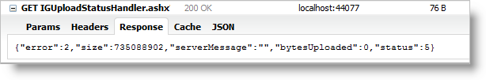

<!--
|metadata|
{
    "fileName": "igupload-using-http-handler-and-modules",
    "controlName": "igUpload",
    "tags": ["Data Binding","Data Presentation"]
}
|metadata|
-->

# Using the HTTP Handler and Module (igUpload)
 
To facilitate uploads with the `igUpload` control you must implement server logic to process and save the uploaded data. The client-only `igUpload` works with any number of different server technologies, Ignite UI™ includes a server-side implementation using ASP.NET. This topic demonstrates how to configure a HTTP Module and HTTP Handler to process the server events necessary to accept the uploaded data.

## HTTP Module
An HttpModule may be configured to manage the file upload process. It implements the .NET IHttpModule interface so that it plugs into the HTTP Request process. Therefore all the requests, even those that are not coming from the upload control, pass through HttpModule. That’s why HttpModule filters the requests that are relevant only to the upload control.

The examples below demonstrate how to configure an HttpModule for IIS6 (or development server) or for deploying on an IIS7 server.

## For IIS6 (Development Environment)
**In web.config:**

```xml
<system.web>    
	<httpModules>
        <add name="IGUploadModule type="Infragistics.Web.Mvc.UploadModule" />
    </httpModules>
    <!--OPTIONAL: Set the maximum request length. By default the request lenght is 4 MB. More info: http://msdn.microsoft.com/en-us/library/e1f13641(v=vs.85).aspx-->
    <httpRuntime executionTimeout="3600" maxRequestLength="2097151000"/>
</system.web>
```

## For IIS7
**In web.config:**

```xml
<system.webServer>
    <modules runAllManagedModulesForAllRequests="true">
        <add name="IGUploadModule" type="Infragistics.Web.Mvc.UploadModule" 
                                   preCondition="managedHandler" />
    </modules>    
	<security>      
		<requestFiltering>    
			<!--OPTIONAL: Set the maximum request length. By default the request lenght is ~30 MB. More info: http://www.iis.net/configreference/system.webserver/security/requestfiltering/requestlimits-->        
			<requestLimits maxAllowedContentLength="2097151000"/>      
		</requestFiltering>    
	</security>
</system.webServer>
```

## HTTP Handler
An HttpHandler implements the .NET IHttpHandler interface and is used to communicate with the client widget. The handler has two main functions – to receive commands from the client and to return status back to the client.

All the requests between the upload control and the handler are sent via Ajax. Using Ajax as a communication mechanism is a natural choice as the handler returns status messages in JSON.

As contrasted from the HttpModule, the HttpHandler is accessible via a URL. Commands for every file sent become parameters in the URL. Commands can be one of the following three types:

-   **Status**: Returns the current the file status. The JSON response contains information for total bytes, uploaded bytes and current file error status. JSON format is: 
-   **Cancel**: When this command is requested the file upload process is canceled
-   **fileSize**: This command is called in two special cases when the size of the file to be uploaded is needed from the handler to display in the control. The first is when `autostartupload` property is set to `false`. The size information is required as the file is not processing until the user starts the upload. The second case is when `autostartupload` property is set to true but there are files placed in the uploading queue and their uploading process is not started.

To enable the handler you need to add the appropriate sections in Web.config file – either for development server or for IIS7:

## For IIS6 (Development Environment)
**In web.config:**

```xml
<system.web>
    <httpHandlers>
         <add verb="GET" type="Infragistics.Web.Mvc.UploadStatusHandler" 
                         path="IGUploadStatusHandler.ashx" />
    </httpHandlers>
</system.web>
```

## For IIS7
**In web.config:**

```xml
<system.webServer>
    <handlers>
        <add name="IGUploadStatusHandler" path="IGUploadStatusHandler.ashx" verb="*"
             type="Infragistics.Web.Mvc.UploadStatusHandler" preCondition="integratedMode" />
   </handlers>
</system.webServer>
```

>**Note:** This example is uses IGUploadStatusHandler.ashx as a default name for the handler. The name as well the path to the handler are only recommended values.


## Server Enumerations for File Status and Error
When upload information is transferred from server to the client, it contains status data for the current upload. Response data includes:

-   Uploaded bytes
-   File status information
-   Error info about any exceptions that may occur

**Table 3** describes details found in the response for the upload status and Table 4 describes file error codes.

An example of a JSON response that includes the described data is depicted in Figure 2.


**Note:** The other JSON properties – `size`, `serverMessage` and `bytesUploaded`, are not needed to be created as enumeration types on the server, like error and status, because they are either dynamically changed strings or numbers.

**Table 3:** Enumeration of type UploadStatus

Value | Description
---|---
0 | File is not started
1 | File Uploading is started
2 | File Upload is finished
3 | File not found - this status is used when it is not found such key in the dictionary
4 | Cancel file uploading by client command
5 | Size of the file exceeded
6 | Error while file is uploading
7 | File upload is cancelled from server-side event handler
8 | File uploading is cancelled by dropping client connection
9 | Status of file when the whole content is uploaded but the file is with temporary filename

**Table 4:** Enumeration of type FileError

Value | Description
---|---
-1 | No error
0 | File error occurs when getting file name from the request
1 | MIME type validation failed
2 | File size exceeded
3 | Temporary folder where file should be uploaded could not be found
4 | Error while parsing request header
5 | File does not exist with the specified key in the request
6 | Error occurs when file saving fails
7 | Error occurs when trying to write file content
8 | Error occurred when trying to write file content for the first time
9 | Error occurred when trying to delete file
10 | Error set when file upload is cancelled on start uploading in event handler

## Related Links
-   [Ignite UI Overview](NetAdvantage-for-jQuery-Overview.html)
-   [Using JavaScript Resources in Ignite UI](Deployment-Guide-JavaScript-Resources.html)
-   [igUpload Overview](igUpload-Overview.html)

 

 


