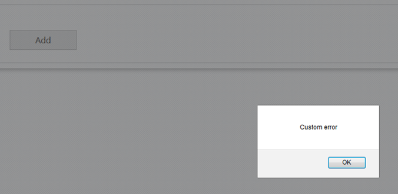

<!--
|metadata|
{
    "fileName": "igupload-using-server-side-events",
    "controlName": "igUpload",
    "tags": ["Events"]
}
|metadata|
-->

# Using Server-Side Events in ASP.NET MVC  (igUpload)

## Topic Overview
This topic lists the different server-side events of the *igUpload* control, describes their purpose and arguments and shows examples on how to handle the events via the** UploadProgressManager** class (residing in Infragistics.Web.Mvc.dll).  It also contains an example on how to handle the file uploading process to implement server-side validation.

## Required background
The following lists the concepts, topics, and articles required as a prerequisite to understanding this topic.

-   [igUpload Overview](igUpload-Overview.html)
-   [Using the HTTP Handler and Module (igUpload)](igUpload-Using-HTTP-Handler-and-Modules.html)

## In this topic

-	UploadProgressManager and Server Events
-	Sending additional data between the client and server
-	Walkthrough: Server-side validation in MVC

## UploadProgressManager and Server Events

The `igUpload` control includes a server-side implementation in Infragistics.Web.Mvc.dll to process and save the uploaded data using ASP.NET. This is achieved via a HTTP Module and HTTP Handler that process the server events necessary to accept the uploaded data. You can find more in-depth description and examples on how to configure them in the [Using the HTTP Handler and Module (igUpload)](igUpload-Using-HTTP-Handler-and-Modules.html) topic.

The server architecture is designed so that the handler and module communicate using proxy class called – [UploadProgressManager](Infragistics.Web.Mvc~Infragistics.Web.Mvc.UploadProgressManager.html). This class is implemented as a singleton object. Its instance can be accessed using the [UploadProgressManager.Instance](Infragistics.Web.Mvc~Infragistics.Web.Mvc.UploadProgressManager~Instance.html) property. This class is also responsible for attaching and triggering the server events. The events are the place where you can handle the file uploading process to perform actions like deleting and moving uploaded files, to cancel uploading or to modify status information. **Table 1** lists the available server-side events:

**Table 1:** Server-side events

<table class="table table-bordered">
	<thead>
		<tr>
            <th>
Event
			</th>

            <th>
Description
			</th>

            <th>
Arguments
			</th>

            <th>
Cancelable
			</th>
        </tr>
	</thead>
	<tbody>
        

        <tr>
            <td>
UploadStarting
			</td>

            <td>
Triggered when file upload is starting. At this stage the file is yet to be uploaded and the information from the request header is available in the `UploadStartingEventArgs` argument. Having this information you can implement validation rules
                and decide whether or not to cancel the upload.
			</td>

            <td>
                <ul>
                    <li>
object - contains the UploadProgressManager instance which triggered the event.
					</li>

                    <li>
[UploadStartingEventArgs](Infragistics.Web.Mvc~Infragistics.Web.Mvc.UploadStartingEventArgs.html) - contains information for the file to be uploaded.
					</li>
                </ul>
            </td>

            <td>
true
			</td>
        </tr>

        <tr>
            <td>
FileUploading
			</td>

            <td>
Triggered when each chunk of the file is uploaded on the server. In this event the file can be processed manually by reading its current chunk from the FileUploadingEventArgs.FileChunk property.

                Note: This event is used for [Saving Files as Stream](igUpload-Saving-Files-as-Stream.html) scenario. This event is only triggered when&nbsp;FileSaveType="memorystream".
			</td>

            <td>
                <ul>
                    <li>
object - contains the UploadProgressManager instance which triggered the event.
					</li>

                    <li>
[FileUploadingEventArgs](Infragistics.Web.Mvc~Infragistics.Web.Mvc.FileUploadingEventArgs.html) - contains the current chunk of data of the uploading file.
					</li>
                </ul>
            </td>

            <td>
true
			</td>
        </tr>

        <tr>
            <td>
UploadFinishing
			</td>

            <td>
Triggered when file upload is finishing. At this stage the file is already uploaded but it’s still has the temporary name. The `igUpload` has released the file and it can be freely modified.
			</td>

            <td>
                <ul>
                    <li>
object - contains the UploadProgressManager instance which triggered the event.
					</li>

                    <li>
[UploadFinishingEventArgs](Infragistics.Web.Mvc~Infragistics.Web.Mvc.UploadFinishingEventArgs.html) - contains information of the uploaded file.
					</li>
                </ul>
            </td>

            <td>
true
			</td>
        </tr>

        <tr>
            <td>
UploadFinished
			</td>

            <td>
Triggered when file upload has finished. At this stage the file is uploaded and it is renamed with its original name. If there already is a file with the same name the old one is overwritten, only the last one will be available.
			</td>

            <td>
                <ul>
                    <li>
object - contains the UploadProgressManager instance which triggered the event.
					</li>

                    <li>
[UploadFinishedEventArgs](Infragistics.Web.Mvc~Infragistics.Web.Mvc.UploadFinishedEventArgs.html) - contains information about the uploaded file.
					</li>
                </ul>
            </td>

            <td>
false
			</td>
        </tr>
    </tbody>
</table>

In ASP.NET MVC to attach/detach to a server-side event of an `igUpload` control use the UploadProgressManager methods. The first parameter of each method is the id of the control ([UploadModel.ControlId](Infragistics.Web.Mvc~Infragistics.Web.Mvc.UploadModel~ControlId.html)) to which the event will be attached. **Table 2** lists the UploadProgressManager methods and the respective events to which they attach event handlers.

**Table 2:** UploadProgressManager methods used to attach to server-side events.

UploadProgressManager method | Event | Example
---|---|---
[AddStartingUploadEventHandler](infragistics.web.mvc~infragistics.web.mvc.uploadprogressmanager~addstartinguploadeventhandler.html)| UploadStarting | `UploadProgressManager .Instance.AddStartingUploadEventHandler("upload1" , startingUploadHandler);`
[AddFileUploadingEventHandler](infragistics.web.mvc~infragistics.web.mvc.uploadprogressmanager~addfileuploadingeventhandler.html)  | FileUploading | `UploadProgressManager .Instance.AddFileUploadingEventHandler("upload1" , fileUploadingHandler);`
[AddFinishingUploadEventHandler](infragistics.web.mvc~infragistics.web.mvc.uploadprogressmanager~addfinishinguploadeventhandler.html) | UploadFinishing | `UploadProgressManager .Instance.AddFinishingUploadEventHandler("upload1" , fileFinishingHandler);`
[AddFinishedUploadEventHandler](infragistics.web.mvc~infragistics.web.mvc.uploadprogressmanager~addfinisheduploadeventhandler.html) | UploadFinished | `UploadProgressManager .Instance.AddFinishedUploadEventHandler("upload1" , fileFinishedHandler);`


**Note:** It's a common error to attach to `igUpload` server-side events in a controller action. Since controller actions can be invoked multiple times during the application lifecycle this will result in single event handler attached multiple times (usually you'll want to attach to a server-side event only once.). It is recommended that you handle server-side events in the application start logic in the Global.asax file of a MVC project.

##  Sending additional data between the client and server during file uploading

In some cases you may want to transfer additional custom data related to the uploaded file from the server to the client or vice versa.

For instance you may want to apply some custom file validation on the server and display that result on the client or display some other custom message once the file uploading is complete. Or you may want to send some additional data from the client-side that is relevant to the file that’s being uploaded (security GUID, client-side input field, etc.) and would like to have access to that data on the related server-side events.

The following sections will explain in details the way to achieve this in the `igUpload`.

### Sending additional data from the server to the client

To add a custom message you can use the `UploadStarting`, `UploadFinishing` and `UploadFinished` event argument `ServerMessage`.

**In C#**

```
public static void igUpload_UploadStarting(object sender, Infragistics.Web.Mvc.UploadStartingEventArgs e){          
              e.ServerMessage = "Upload of " + e.FileName + " started.";   
        }
        
public static void igUpload_UploadFinishing(object sender, Infragistics.Web.Mvc.UploadFinishingEventArgs e){          
             e.ServerMessage = "Upload of " + e.FileName + "is about to finish.";   
        }
        
public static void igUpload_UploadFinished(object sender, Infragistics.Web.Mvc.UploadFinishedEventArgs e){          
            	e.ServerMessage = "Upload of " + e.FileName + "is finished.";   
        }           
```
This value can then be retrieved on the client-side on the related client-side events- [`fileUploading`](%%jQueryApiUrl%%/ui.igupload#events:fileUploading) and [`fileUploaded`](%%jQueryApiUrl%%/ui.igupload#events:fileUploaded). The  `uploadInfo` event argument contains the additional file information, including the serverMessage value send from the server.

**In JavaScript:**

```
$(function(){
        $("#upload1").on("iguploadfileuploading", function (evt, ui) {
			alert(ui.fileInfo.serverMessage);
        });  
    
        $("#upload1").on("iguploadfileuploaded", function (evt, ui) {
			alert(ui.fileInfo.serverMessage);
        });
        
     });

```
>**Note:** If you wish to pass more complex data, you can pass it in JSON format as part of the e.ServerMessage string and deserialize it on the client-side.

### Sending additional data from the client to the server

In order to add additional data to the request you can use the [`onFormDataSubmit`](%%jQueryApiUrl%%/ui.igupload#events:onFormDataSubmit) client-side event to add additional data to the request. The [`addDataField`](%%jQueryApiUrl%%/ui.igupload#methods:addDataField) and [`addDataFields`](%%jQueryApiUrl%%/ui.igupload#methods:addDataFields) methods can be used to add the additional parameters.

**In JavaScript:**

```
 $("#upload1").on("iguploadonformdatasubmit", function (evt, ui) {
            $("#upload1").igUpload("addDataField", ui.formData, { "name": "Parameter Name", "value": "Value" });
        });
```
To get the data on the server-side you can use the `UploadStarting`,`UploadFinishing` and `UploadFinished`’s `AdditionalDataFields` event argument, which will contain a collection of the field name and value passed from the client.

**In C#:**

```
public static void igUpload_UploadStarting(object sender, Infragistics.Web.Mvc.UploadStartingEventArgs e){          
       foreach (var dataField in e.AdditionalDataFields)
	   {
		   string fieldName = dataField.Name;
		   string fieldValue = dataField.Value;
	   } 
   }
```


## Walkthrough: Server-side validation in MVC

### Introduction
This procedure guides you through the process of implementing custom validation on the server-side for the `igUpload`.

### Requirements
To complete this procedure you need to follow the steps defined in the [igUpload Overview](igUpload-Overview.html) topic:


1.	Adding jQuery Upload to a Web Page
2.	Configuring the HTTP Handler and Module for ASP.NET

After following those steps you’ll have a basic upload control in your MVC application.

### Steps

**Step 1.** Register `igUpload`‘s server-side event handler for the UploadStarting event.

You register the `UploadStarting` event handler in the `Global.asax` in the ` Application_Start()` method. Note that the [AddStartingUploadEventHandler](Infragistics.Infragistics.Web.Mvc~AddStartingUploadEventHandler.html) method takes two parameters: control ID and the event handler. The value for the control ID must match the `ControlId` property defined for the related `igUpload` control(s). The event is raised for each `igUpload` control with the related `ControlId`, regardless of the view/controller they’re defined in. If there are other igUpload controls with different `ControlId` values that need to have this event handler registered for them, then the 
[AddStartingUploadEventHandler](Infragistics.Infragistics.Web.Mvc~AddStartingUploadEventHandler.html) method should be called again for each one with the first parameter matching the `ControlId` option defined for the related `igUpload` control. 

**In C#**

```
protected void Application_Start()
{
            //configurations for  Area Registration, WebApi, Filte and Route 
            AreaRegistration.RegisterAllAreas();

            WebApiConfig.Register(GlobalConfiguration.Configuration);
            FilterConfig.RegisterGlobalFilters(GlobalFilters.Filters);
            RouteConfig.RegisterRoutes(RouteTable.Routes);

            //registed UploadStarting event via the UploadProgressManager
            UploadProgressManager.Instance.AddStartingUploadEventHandler("upload1",
           new EventHandler<UploadStartingEventArgs>(igUpload_UploadStarting));
} 
public static void igUpload_UploadStarting(object sender, Infragistics.Web.Mvc.UploadStartingEventArgs e)
{
            // implement logic here. See next step for details.
} 

```

**Step 2.** In the event handler add your custom validation logic and if the conditions are not met set a custom [ServerMessage](Infragistics.Infragistics.Web.Mvc~ServerMessage.html) and cancel the event.

**In C#**

```
public static void igUpload_UploadStarting(object sender, Infragistics.Web.Mvc.UploadStartingEventArgs e){
            //Custom Validation logic		
            e.ServerMessage = "Custom error";
            e.Cancel = true;
        }

```

**Step 3.** Display the custom server message on the client side in the client-side error event:

**In JavaScript**

```
$(function(){
        $("#upload1").on("iguploadonerror", function (evt, ui) {
            // This property can be set during the 
            // server event UploadStarting. If not set it’s 
            // an empty string. (You can use it to display custom error messages.)
            alert(ui.serverMessage);
        });
    });

```

**Step 4.** Observe the result.

After uploading a file that does not meet the requirements, the custom error message is displayed.



## Related Links
-   [Ignite UI Overview](NetAdvantage-for-jQuery-Overview.html)
-   [Using JavaScript Resources in Ignite UI](Deployment-Guide-JavaScript-Resources.html)

 

 


