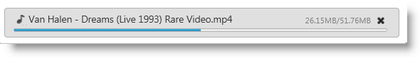
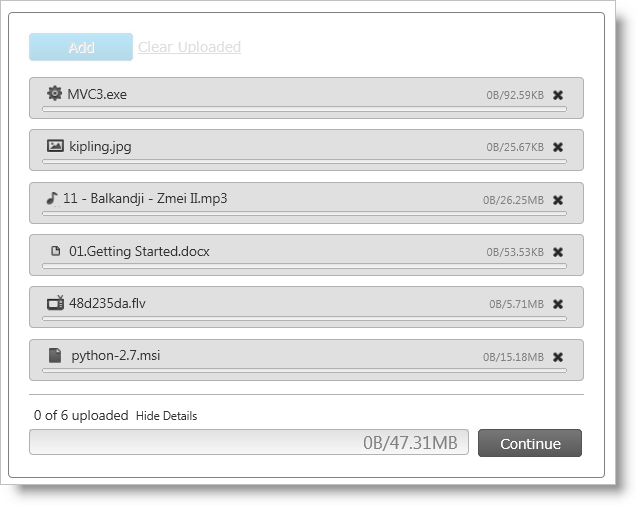

<!--
|metadata|
{
    "fileName": "igupload-styling-and-theming",
    "controlName": "igUpload",
    "tags": ["Styling","Theming"]
}
|metadata|
-->

# Styling igUpload

This topic demonstrates how to customize the `igUpload` control to achieve a custom look and feel. You’ll also learn about the required scripts and styles needed to style the control.

## Required CSS and Themes

The Ignite UI™ `igUpload`, like other jQuery widgets, utilizes the jQuery UI CSS Framework for styling. Included in Ignite UI are custom jQuery UI themes called Infragistics and Metro. These themes provide a professional and attractive design to all Infragistics and standard jQuery UI widgets.

In addition to the Infragistics and Metro themes, there is a structure directory, which is required for the basic CSS layout of the Infragistics widgets.

### Adding Required Themes to a Website

The Infragistics and Metro themes are located in the installed directory within the css folder. To add the themes to your application, copy the whole css folder (including structure and themes directories) into your site’s location.

>**Note:** When using Infragistics Loader, the folder structure must be preserved. Thus the loader will work as expected. If some of the themes are not used they can be deleted, but the structure should remain the same.

**Figure 1: Included theme folders upon product install**


## Infragistics and Metro Themes

The Infragistics Theme is a custom theme which includes all of the styles typically found in a jQuery UI theme. This theme may be replaced by a different theme but for the jQuery widgets to display correctly a reference to file `{IG Resources root}/css/structure/infragistics.css` is required..

Metro theme is implementation of the clean, modern and fast Metro design language. It has the same requirements for `{IG Resources root}/css/structure/infragistics.css` like Infragistics theme.

When using a theme other than the Infragistics (or Metro) theme, the `igUpload` has some additional styling points that may need customization to achieve a complete design (depending on the upload's enabled features and theme).

The `igUpload` control requires having a link to the stylesheet of a standard jQuery UI theme. For the IG Theme, you must include reference to the theme’s stylesheet in the page:

### Listing 1: Manual CSS reference to Infragistics theme

**In HTML:**

```html
<link href="css/themes/infragistics/infragistics.theme.css" rel="stylesheet" type="text/css" />
<link href="css/structure/modules/infragistics.ui.upload.css" rel="stylesheet" type="text/css" />
```

### Listing 2: CSS reference to Infragistics theme in ASP.NET MVC

**In HTML:**

```html
<%@ Import Namespace="Infragistics.Web.Mvc" %>
<!DOCTYPE html>
<html>
<head runat="server">
<link href="<%= Url.Content("~/css/themes/infragistics/infragistics.theme.css") %>” rel="stylesheet"                                                                       type="text/css" />
<link href="<%= Url.Content("~/css/structure/modules/infragistics.ui.upload.css") %>” rel="stylesheet"                                                                       type="text/css" />
```

**Metro Theme**

The Metro Theme is referenced after the jQuery Theme. The following stylesheets are required when using the `igUpload` control:

### Listing 3 : Manual CSS reference to the Metro theme

**In HTML:**

```html
<link href="css/themes/metro/infragistics.theme.css " rel="stylesheet" type="text/css" />
<link href="css/structure/modules/infragistics.ui.upload.css" rel="stylesheet" type="text/css" />
```

### Listing 4 : CSS reference to the Metro theme in ASP.NET MVC

**In HTML:**

```html
<%@ Import Namespace="Infragistics.Web.Mvc" %>
<!DOCTYPE html>
<html>
<head runat="server">
<link href="<%= Url.Content("~/css/themes/metro/infragistics.theme.css ") %>” rel="stylesheet"                                                                       type="text/css" />
<link href="<%= Url.Content("~/css/structure/modules/infragistics.ui.upload.css") %>” rel="stylesheet"                                                                       type="text/css" />
```

## CSS Property
The upload CSS property is the member where all the styles for the control are applied. **Table 1** shows all the properties of the CSS object property and all the rules applied to them. This gives you the freedom to create your own theme by overwriting specific classes.

>**Note:** The Theme Roller theming the control by simply overwriting the listed classes presented in the table. For more information you can see the running sample with Theme Roller [link to sample].

### Table 1: List of CSS classes
CSS object properties | List of CSS classes applied to the property | Area where CSS classes are applied
---|---|---
clearClass | ui-helper-clearfix | Applies float wrapping properties to parent elements
hiddenClass | ui-helper-hidden | Hide element
baseClassIE6 | ui-ie6 | Class for IE6
baseClassIE7 | ui-ie7 | Class for IE7
baseClassMoz | ui-moz | Class for FF
baseClassOpera | ui-opera | Class for Opera
startupBrowseButtonClasses | ui-igstartupbrowsebutton | Class for startup browse button
baseClass | ui-widget ui-widget-content ui-corner-all ui-igupload | Class for the container
baseMainContainerClass | ui-igupload-basemaincontainer | Classes applied to main container in single/multiple mode
multipleDialogClasses | ui-iguploadmultiple | Classes applied to main container when multiple file upload mode is selected
singleDialogClass | ui-iguploadsingle | Classes applied to main container when multiple file upload mode is selected
browseButtonClass | ui-igupload-browsebutton | Classes applied on browse button - button in main container
containerClass | ui-igupload-container ui-widget-content | Classes applied to DOM element containing all file upload progress bars
uploadProgressClass | ui-igupload-uploadprogress | div containing separate individual file upload
fileInfoMainContainer | ui-igupload-fimaincontainer | Class applied on div which contains add button, clear button and progress details of the files
progressContainer | ui-helper-clearfix | Class container for each file
progressBarUploadClass | ui-igupload-progressbar-upload ui-helper-clearfix | Class applied on single progressbar
progressBarFileNameClass | ui-igupload-progressbar-filename | Classes applied to file name DOM element in the summary progress bar
progressBarFileSizeClass | ui-igupload-progressbar-filesize | Classes applied to file size DOM element in the summary progress bar
progressBarInnerHTMLContainerClass | ui-igupload-progressbar-container ui-helper-clearfix | Classes of the container of the filename DOM element and file size DOM element inside each of the progressbar
containerButtonCancelClass | ui-container-button-cancel-class ui-helper-clearfix | Classes for container of the cancel/done button near the progress bar
summaryProgressBarClass | ui-igupload-summaryprogressbar | Classes applied to summary progressbar
summaryProgressContainerClass | ui-igupload-summaryprogresscontainer | Classes applied to container of summary progress bar
summaryProgressbarLabelClass | ui-igupload-summaryprogress-label | Classes of label of the summary progress bar
summaryInformationContainerClass | ui-igupload-summaryinformation-container ui-helper-clearfix | Classes of container in summary progress area - contains label for summary progress and show/hide details button
summaryUploadedFilesLabelClass | ui-igupload-summaryuploadedfiles-label | Classes applied to DOM element showing status of summary progress
summaryShowHideDetailsButtonClass | ui-igupload-showhidedetails-button | Classes of show/hide details button in summary progress area
summaryButtonClass | ui-igupload-summary-button | Classes which are set to the cancel button
summaryProgressBarInnerProgress | ui-igupload-summaryprogres_summpbar_progress | Classes set inside progress DIV
summaryProgressBarSecondaryLabel | ui-igupload-summaryprogress-label ui-igupload-summaryprogress-secondary-label | Class for the second label in summary progress bar
containerFUS | ui-widget-content ui-igupload-progress-container ui-corner-all ui-helper-clearfix | Class for container of each individual file - including progress bar, file info, cancel button, etc.


>**Note:** Not all of the classes are custom for the upload control. Some of them are reused from the jQuery UI CSS Framework.

## File Extensions Icons
When the Upload property `showFileExtensionIcon` is set to true, the control displays an icon to the left of the file name indicating the type of the file being uploaded.

**Figure 3: File Extension icon during an upload**



By default most of the popular extensions has built-in icons. The types that are supported with icons are from the current categories:

File Type | File Extension
---|---
Application | exe, app
Images | gif, jpg, jpeg, png, bmp, uyv, tif, thm, psd
Music | mp3, wav, mp4, aac, mid, wma, ra, iff, aif, m3u, mpa
Documents | doc, docx, xls, xlsx, txt, ppt, pptx, pdf
Video | 3pg, asf, asx, avi, flv, mov, mp4, mpg, rm, swf, vob, wmv

**Figure 4** depicts how the default values of the icons look during a multiple file upload operation.

**Figure 4: The upload control during a multiple file upload process**



>**Note:** If the file type is outside the built-in ones, a default icon is applied.

## Modifying File Extensions Icons
If you want to customize the file extension icons, you can override the default values by providing new icons to the `fileExtensionIcons` property.

The `fileExtensionIcons` property accepts an an array of objects that maps to each file type. **Listing 1** demonstrates how to associate existing extension styles to a new CSS class.

**Listing 1: Overriding default file extension icons**

**In JavaSript:**

```js
fileExtensionIcons: [
    {
        ext: ['gif', 'jpg', 'jpeg', 'png', 'bmp', 'yuv', 'tif', 'thm', 'psd'],
        css: 'image-class',
        def: true
    },
    {
        ext: ['mp3', 'wav', 'mp4', 'aac', 'mid', 'wma', 'ra', 'iff', 'aif', 'm3u', 'mpa'],
        css: 'audio-class',
        def: false
    }
]
```

Each mapping must account for the following three values:

-   `ext`: Array of the file extensions to share an icon
-   `css`: CSS class that is applied to each file that has the extension as defined in the ext property
-   `def`: Designates if this is the default rule that is going to be applied to the types that have not been defined in any ext array.

If there are file extension icons with more than one set default property then the last definition takes precedence.

## External References
-   [jQuery UI](http://jqueryui.com/)
-   [jQuery UI - Getting Started](http://docs.jquery.com/UI/Getting_Started)
-   [jQuery Themeroller](http://jqueryui.com/themeroller/)
-   [Theming jQuery UI](http://docs.jquery.com/UI/Theming)
-   [jQuery UI CSS Framework](http://docs.jquery.com/UI/Theming/API)

## Related Links
-   [Ignite UI Overview](NetAdvantage-for-jQuery-Overview.html)
-   [Using JavaScript Resources in Ignite UI](Deployment-Guide-JavaScript-Resources.html)

 

 


