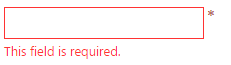

<!--
|metadata|
{
    "fileName": "igvalidator-overview",
    "controlName": ["igValidator"],
    "tags": ["Getting Started"]
}
|metadata|
-->

# igValidator Overview

The `igValidator` control provides new look and feel compared to the previous one. It is designed to be easy to use with any form element and our existing components such as editors, combo box and other components for collecting user input. This control takes advantage to the notification widget design and use its visualizations to display the necessary success and error messages.

### In this topic

- [Introduction](#introduction)
- [Setting up the igValidator](#setting-up)
- [Validations’ priority](#validation-priority)
- [Related Content](#related-content)

## <a id="introduction"></a> Introduction

The main purpose of the `igValidator` control is to inform the end user for the passed and failed validation immediately by default. This means that when a user blur the editor's input a feedback message is immediately displayed giving useful information about the state in which the editor is in. For example it can display messages that indicate whether the current field is required or not and whether the user filled the input with the expected type of data.

The `igValidator` supports different [configurations](#setting-up) and multiple [validation rules](#validation-priority) with messages for both success and error. The messages can be either placed in a predefined [`messageTarget`](%%jQueryApiUrl%%/ui.igValidator#options:messageTarget) or handed off to the `igNotifier` widget. In the latter case if the user data fails a validation rule the specific input is colored in red to indicate that something went wrong with the current interaction along with showing a notification.

Optionally you can use the `requiredIndication` property to hint in advance which form elements are required. There is also an `optionalIndication` property that indicates a particular field is optional.

The whole list of the `igValidator` options can be found in the [igValidator API](%%jQueryApiUrl%%/ui.igvalidator)

## <a id="setting-up"></a> Setting up the igValidator

The validator control can be configured independently on one or multiple targets (fields) or as an integrated part of the supported Ignite UI controls - Editors, Combo and Rating. It possesses plenty of options which allows you to customize and configure this control corresponding to your needs.

### Configuring from other Ignite UI controls

```html
<div id="textEditor"></div>
```
```js
$('#textEditor').igTextEditor({
  inputName: "pass",
  textMode: "password",
  validatorOptions: {
    required: true,
    onblur: true,
    lengthRange: [6, 20],
    requiredIndication: true
  }
});
```



> **Note:** When configured from an Editor control the validator does not support an additional `fields` collection.

### Standalone igValidator on one field
The following example demonstrates a basic usage with a single target filed. Targets can be any HTML form element as well as our specific editor controls and the combo.

```html
<div id="validator"></div>
```

```js
$('#validator').igTextEditor();

$('#validator').igValidator({
  required: true,
  onblur: true,
  requiredIndication: true
});
```

### Standalone igValidator with multiple fields
The control supports a [`fields`](%%jQueryApiUrl%%/ui.igvalidator#options:fields) collection describing each field with validation options and a selector. Fields must provide a valid selector jQuery selector and can contain any of the validation rules and triggers, but not other fields or event handlers. Rules from at the main options level will also be inherited by filed if no such option is provided.

```html
<form id="validationForm">
    <fieldset>
        <h4> Feedback form</h4>
        <p> Enter your name: (Validation onsubmit, required)</p>
        <input type="text" id="grpEdit1"></input>
        <p> Enter date: (Validation onblur, not required on submit)</p>
        <input type="text" id="grpEdit2"></input>
        <p> Give us rating: ( Validation onsubmit, minimum value = 1.5) </p>
        <div id="rating"></div>
        <p> Subscribe for free samples : (Validation onsubmit,required)</p>
        <div id="igCheckboxEditor"></div>
        <br>
        <input type="submit" value="Submit"></input>
    </fieldset>
</form>
```

```js
$("#rating").igRating({
		precision : "half",
		valueAsPercent : false
	});
	$("#igCheckboxEditor").igCheckboxEditor();

	$('#validationForm').igValidator({
		required : true, //inherited
		fields : [{
				selector : "#grpEdit1",
				onblur : false // override default
			}, {
				selector : "#grpEdit2",
				date : true,
				required : false, // override
				onchange : true
			}, {
				selector : "#rating",
				successMessage : "Thanks!",
				onchange : true,
				valueRange : {
					min : 1.5,
					errorMessage : "At least 1.5 stars required (custom message)"
				},
				notificationOptions : {
					mode : "popover"
				}
			}, {
				selector : "#igCheckboxEditor",
				onchange : true
			}
		]
	});
```

> **Note:** Both standalone configurations support fields enhanced with Ignite UI Editor controls, however they must be initialized in advance for the validator to discover and handle them correctly. In case the timing cannot be controlled and the validator is initialized before other control(s) the [`updateField`](%%jQueryApiUrl%%/ui.igvalidator#methods:updateField) method can be used to update that field in the validator.

## <a id="validation-priority"></a> Validations' priority

In some scenarios you might need to use multiple validators on a single input in order to validate upon different criteria. In those cases it is important to mention that on a single input the validations are perform in a particular order. The simplest validations pass first and then the more sophisticated conditions are performed. Please note that if one of the validation rules fails, the following ones won't be evaluated and the current check will end as invalid.

By default, the validations priority is as follows (first is most important, last is least important):
1.	required
2.	Infragistics' editor (optional)*
3.	Number
4.	Date
2.	LengthRange
3.	ValueRange
4.	EqualsTo
5.	Email
6.	Pattern (regular expression)
7.	Custom function

\* This step is optional and is fired only when you use an `igEditor`. The validator will call `isValid` on the editor to check if its specific requirements (selection, required mask fields, etc.) are fulfilled.

## <a id="related-content"></a> Related Content

- [Validator Overview Sample](%%SamplesUrl%%/validator/overview)
-	[igValidator jQuery API](%%jQueryApiUrl%%/ui.igValidator)
