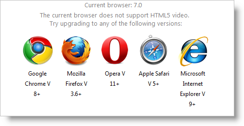

<!--
|metadata|
{
    "fileName": "igvideoplayer-working-with-html5-video",
    "controlName": "igVideoPlayer",
    "tags": ["Getting Started"]
}
|metadata|
-->

# Working with HTML5 Video (igVideoPlayer)

## Introduction
The `igVideoPlayer` control uses the HTML5-specific `<video>` tag to play videos. It is supported by the following versions of the most popular browsers.

Internet Explorer| Firefox| Safari| Chrome| Opera
---|---|---|---|---
9+ | 3.6+ | 5+ (requires QuickTime) | 8+ | 11.+

Earlier versions of these browsers are not HTML5 video compatible. Initializing the control in any of older browser versions results in firing the [browserNotSupported](%%jQueryApiUrl%%/ui.igVideoPlayer#events) event, which if unhandled displays a user-friendly message with links to the download pages of the respective supported browsers.



If the desired course of action in the case of browser not supporting HTML5 video is different, you can handle the [browserNotSupported](%%jQueryApiUrl%%/ui.igVideoPlayer#events) event and execute custom logic such as displaying an alternative video player using Microsoft® Silverlight™ or Adobe® Flash™. The following code snippet demonstrates this.

**In Javascript:**

```js
$("#player1").bind({
   igvideoplayerbrowsernotsupported: function (sender, eventArgs) {
       $("#flashContainer").css("display", "block");
       $("#player1").css("display", "none");
       eventArgs.cancel = true;
   }
});
```

## Video Codecs
Each browser has its own way of handling video tags and supports one or more video codecs. Currently there is no universally supported codec. Therefore if you wish to have your video viewable in all of the most popular browsers you will need to encode the video more than once.

Here is a complete list of codec support in the modern browsers.

Codecs/Container | IE | Firefox | Safari | Chrome | Opera
---|---|---|---|---|---
Theora+Vorbis/Ogg | - | 3.5+ | ** | 3.0+ | 11+
H264+AAC/MP4 | 9.0+ | - | 5+ | - |-
WebM | 9.0+* | 4.0+ | ** | 6.0+ |11+

Internet Explorer 9 will only support WebM if the end-user has a VP8 codec installed.

Safari plays anything that Apple® QuickTime™ can play, but QuickTime only comes with H.264/AAC/ MP4 support pre-installed.

>**Note:** For more up to date data on browser support visit: [http://en.wikipedia.org/wiki/HTML5_video](http://en.wikipedia.org/wiki/HTML5_video)

In most cases, you will need to encode the video with each of the codec/container combinations listed above. Paths to the three files must be passed to the control which will then chose the most appropriate one for the browser if it supports more than one. The priority is the following:

1.  H264/AAC in MP4 container
2.  Theora/Vorbis in Ogg container
3.  WebM

The chosen source will be added in the src attribute of the video tag.

You can also test a specific browser for compatibility with the three separate codec/container combinations using built-in functions.

**In Javascript:**

```js
var supportsHTML5 = $("#player1").igVideoPlayer("supports_video");
var supportsH264 = $("#player1").igVideoPlayer("supports_h264_baseline_video");
var supportsOgv = $("#player1").igVideoPlayer("supports_ogg_theora_video");
var supportsWebM = $("#player1").igVideoPlayer("supports_webm_video");
```

**Related Topics**

-   [igVideoPlayer Overview](igVideoPlayer-Overview.html)

 

 


