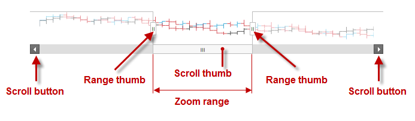
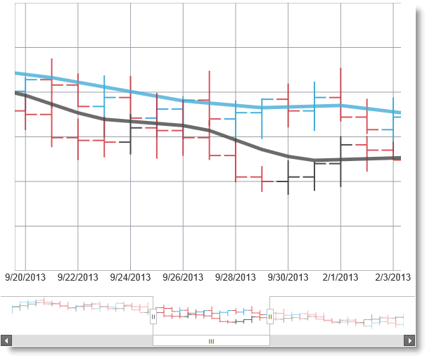

<!--
|metadata|
{
    "fileName": "igzoombar-overview",
    "controlName": "igZoombar",
    "tags": ["Charting","Data Presentation","Getting Started"]
}
|metadata|
-->

# igZoombar Overview

Position the zoom-range window

## Topic Overview
### Purpose

This topic provides conceptual information about the `igZoombar`™ control and the functionalities it including the supported user interactions and some configuration basics.

### Required background

The following topics are prerequisites to understanding this topic:

- [igDataChart Overview](igDataChart-Overview.html): This topic provides conceptual information about the `igDataChart`™ control including its main features, minimum requirements for using charts and user functionality.

### In this topic

This topic contains the following sections:

-   [**Introduction**](#introduction)
    -   [igZoombar summary](#summary)
    -   [Supported controls](#supported-controls)
-   [**Main Features**](#main-features)
-   [**User Interactions and Usability**](#user-interaction)
    -   [User interactions summary](#user-interaction-summary)
    -   [User interactions summary chart](#user-interaction-summary-chart)
    -   [Touch support](#touch-support)
-   [**Configuring igZoombar**](#config-igzoombar)
-   [**igZoombar Default Configuration**](#default-config)
    -   [igZoombar default configuration summary](#config-summary)
    -   [igZoombar default configuration summary chart](#config-summary-chart)
-   [**Related Content**](#related-content)
    -   [Topics](#topics)
    -   [Samples](#samples)

## Introduction
### igZoombar summary

The `igZoombar` control provides zooming functionality to range-enabled controls. The `igZoombar` features a horizontal scroll bar, a thumbnail of the whole range, and a resizable zoom-range window.

The `igZoombar` control is designed to be used as an enhancement to range-based controls like `igDataChart`™. The `igZoombar` cannot work as a standalone control.

### Supported controls

The `igZoombar` control supports `igDataChart` control out-of the box. However, `igZoombar` is extensible and can be custom-integrated with other Infragistics® or third-party range-enabled controls.

The following screenshot demonstrates the `igZoombar` in combination with an `igDataChart`.

## Main Features
### Main features summary chart

The following table summarizes the main features of the `igZoombar` control.

<table class="table">
	<thead>
		<tr>
            <th>
Feature
			</th>

            <th>
Description
			</th>
        </tr>
	</thead>
	<tbody>
        

        <tr>
            <td>
Scrollbar navigation
			</td>

            <td>
Users can change scale and scroll through ranges of data using the built-in capabilities of the `igZoombar` scrollbar.
			</td>
        </tr>

        <tr>
            <td>
Panning and zooming
			</td>

            <td>
Users can adjust the display scale by dragging the edges of the thumb pad to either make the current display cover a larger range (zoom out) or a smaller range (zoom in).
			</td>
        </tr>

        <tr>
            <td>
Multiple user interaction options
			</td>

            <td>
All mouse user interactions are redundantly supported through touch and most of them – through the keyboard. For details, see
                    [User Interactions and Usability](#user-interaction).
			</td>
        </tr>

        <tr>
            <td>
Touch support
			</td>

            <td>
On touch-enabled devices, users can enjoy the full `igZoombar` functionality. All mouse interactions are supported in touch environment.
			</td>
        </tr>

        <tr>
            <td>
Out-of-the box integration with other controls
			</td>

            <td>
The `igZoombar` control supports `igDataChart` control out-of the box.
			</td>
        </tr>

        <tr>
            <td>
Extensibility
			</td>

            <td>
The `igZoombar` control supports `igDataChart` control out-of the box. However, `igZoombar` is extensible and can be custom-integrated with other Infragistics
                    or third-party range-enabled controls.
			</td>
        </tr>

        <tr>
            <td>
Configurable zoom-range window
			</td>

            <td>
                The initial zoom-range window width and position, as well as its minimum size, are configurable.

               ** Related topic:**

                <ul>
                    <li>
[Configuring igZoombar](Configuring-igZoombar.html)
					</li>
                </ul>
            </td>
        </tr>

        <tr>
            <td>
Refresh modes
			</td>

            <td>
                The user zoom action can be configured in one of the following modes: Immediate or Deferred based on whether the zoom effect is applied without any delay as the user interacts with the `igZoombar` control or is delayed until the user finishes their interaction.

                **Related topic:**

                <ul>
                    <li>
[Configuring igZoombar](Configuring-igZoombar.html)
					</li>
                </ul>
            </td>
        </tr>
    </tbody>
</table>

## User Interactions and Usability
### User interactions summary

All `igZoombar` functionality is available on mouse-enabled and touch-enabled devices. Keyboard navigation support only zoom-range window horizontal scrolling.

### User interactions summary chart

The following table lists the actions with which the user can interact with `igZoombar` control on all possible interfaces.

<table class="table">
	<thead>
		<tr>
            <th>
The user can…
			</th>

            <th>
Using…
			</th>

            <th>
Details
			</th>

            <th>
Configurable?
			</th>
        </tr>
	</thead>
	<tbody>
        

        <tr>
            <td>
Pan and zoom
			</td>

            <td>
The range thumbs of the zoom-range window in order to display a larger range (zoom out) or a smaller range (zoom in) in it.
			</td>

            <td>
Users can slide the range thumbs by either dragging with the mouse or with the drag gesture.
			</td>

            <td>
                
                    
                        
                    
                

                You can configure the control in the following aspects which are indirectly related to this user interaction:

                <ul>
                    <li>
Refresh mode
					</li>

                    <li>
Initial size and position of the zoom-range window
					</li>

                    <li>
Minimum size of the zoom-range window
					</li>
                </ul>

                <h4>Related topic:</h4>

                <ul>
                    <li>
[Configuring igZoombar](Configuring-igZoombar.html)
					</li>
                </ul>
            </td>
        </tr>

        <tr>
            <td rowspan="5">
Position the zoom-range window
			</td>

            <td>
The zoom-range window itself
			</td>

            <td>
Users can drag the zoom-range window to the desired position.
			</td>

            <td>

			</td>
        </tr>

        <tr>
            <td>
The scrollbar thumb
			</td>

            <td>
Users can drag the scrollbar thumb to position the zoom-range window.
			</td>

            <td>

			</td>
        </tr>

        <tr>
            <td>
The thumbnail area
			</td>

            <td>
Clicking/tapping on the thumbnail area that represents the range sifts the zoom-range window to that position
			</td>

            <td>

			</td>
        </tr>

        <tr>
            <td>
The scrollbar track
			</td>

            <td>
Clicking the track on either side of the scrollbar thumb shifts the zoom-range window one zoom-range window size in the respective direction.
			</td>

            <td>

			</td>
        </tr>

        <tr>
            <td>
                <ul>
                    <li>
The scrollbar navigation buttons
					</li>

                    <li>
The arrow keys
					</li>
                </ul>
            </td>

            <td>
The action of the navigation button on the scrollbar is duplicated by the Left and Right arrow keys on the keyboard.
			</td>

            <td>

                The step with which the zoom-range window shifts is configurable with the [zoomWindowMoveDistance](%%jQueryApiUrl%%/ui.igzoombar#options:zoomWindowMoveDistance) property.
			</td>
        </tr>
    </tbody>
</table>

### Touch support

On touch-enabled devices, users can enjoy the full igZoombar functionality. All mouse interactions are supported in touch environment.

## Configuring igZoombar
### igZoombar configuration summary chart

The following table lists the configurable aspects of `igZoombar`. For details, refer to the [Configuring topic](Configuring-igZoombar.html).

<table class="table table-bordered">
	<thead>
		<tr>
            <th>
Configurable aspect
			</th>

            <th>
Details
			</th>

            <th>
Properties
			</th>
        </tr>
	</thead>
	<tbody>
        

        <tr>
            <td>
Initial zoom-range window size and position
			</td>

            <td>
The initial breadth and position of the zoom-range window can be configured.
			</td>

            <td>
                <ul>
                    <li>
[defaultZoomWindow.left](%%jQueryApiUrl%%/ui.igzoombar#options:defaultZoomWindow.left)
					</li>

                    <li>
[defaultZoomWindow.width](%%jQueryApiUrl%%/ui.igzoombar#options:defaultZoomWindow.width)
					</li>
                </ul>
            </td>
        </tr>

        <tr>
            <td>
Minimum zoom-range window size
			</td>

            <td>
The minimum breadth of the zoom-range window is a size limit under which users cannot shrink the window any further. This minimum size is configurable.
			</td>

            <td>
                <ul>
                    <li>
[zoomWindowMinWidth](%%jQueryApiUrl%%/ui.igzoombar#options:zoomWindowMinWidth)
					</li>
                </ul>
            </td>
        </tr>

        <tr>
            <td>
Refresh upon zoom interaction
			</td>

            <td>
                The igZoombar control can be configured to one of the following refresh modes based on how the control responds to zoom interactions performed by the user:

                <ul>
                    <li>
**Immediate** (default) – the zoom effect is applied without any delay as the user interacts with the igZoombar control
					</li>

                    <li>
**Deferred** – the zoom effect is delayed until the user finishes their interaction
					</li>
                </ul>
            </td>

            <td>
                <ul>
                    <li>
[zoomAction](%%jQueryApiUrl%%/ui.igzoombar#options:zoomAction)
					</li>
                </ul>
            </td>
        </tr>

        <tr>
            <td>
Movement step of the zoom-range window
			</td>

            <td>
The step, with which the zoom-range window shifts upon clicking/tapping the navigation buttons on the scrollbar or pressing the Left/Right arrow keys on the keyboard, is configurable.
			</td>

            <td>
                <ul>
                    <li>
[zoomWindowMoveDistance](%%jQueryApiUrl%%/ui.igzoombar#options:zoomWindowMoveDistance)
					</li>
                </ul>
            </td>
        </tr>
    </tbody>
</table>

## igZoombar Default Configuration
### igZoombar default configuration summary

By default, the zoom-range window is positioned at the center of the `igZoombar` control and spans over 30 percent of its total breadth (= 100%). The zoom-range window can be sized down to 5 percent of the control’s total breadth. The default refresh mode is Immediate.

### igZoombar default configuration summary chart

The following table lists the `igZoombar` properties and their settings that form the default configuration of the control.

Property | Type | Default Value | Description
---|---|---|---
[defaultZoomWindow.left](%%jQueryApiUrl%%/ui.igzoombar#options) | number | 35 | The starting (left) edge of the zoom-range window is placed at 35 percent of the total breadth of the `igZoombar` control, counted from its starting (left) edge.
[defaultZoomWindow.width](%%jQueryApiUrl%%/ui.igzoombar#options) | number | 30 | The width of the zoom-range window is set to 30 percent of the total breadth of the `igZoombar` control.
[zoomWindowMinWidth](%%jQueryApiUrl%%/ui.igzoombar#options) | number | 5 |The zoom-range window can be sized down by the user to 5 percent of the control’s total breadth.
[zoomAction](%%jQueryApiUrl%%/ui.igzoombar#options) | string | “immediate” |The default refresh mode is Immediate.

## Related Content
### Topics

The following topics provide additional information related to this topic.

- [Adding igZoombar](Adding-igZoombar.html): This topic explains, with code examples, how to add the `igZoombar` control to an HTML page and an ASP.NET MVC application.

- [Configuring igZoombar](Configuring-igZoombar.html): This topic explains, with code examples, how to configure the zoom action and the zoom window of the `igZoombar` control.

- [Accessibility Compliance (igZoombar)](igZoombar-Accessibility-Compliance.html): This topic explains the accessibility features of the `igZoombar` and provides information on how to achieve accessibility compliance for pages containing the control.

- [Known Issues And Limitations (igZoombar)](igZoombar-Known-Issues-And-Limitations.html): This topic describes the known issues and limitations of the `igZoombar` control and the available workarounds.

- [jQuery and ASP.NET MVC Helper API Links (igZoombar)](igZoombar-ASP-NET-MVC-Helper-API.html): This topic provides links to the API reference documentation about the `igZoombar` control and the ASP.NET MVC Helper for it.

### Samples

The following samples provide additional information related to this topic.

- [Basic Zoombar](%%SamplesUrl%%/zoombar/financial-chart): This sample demonstrates integrating `igZoombar` in an `igDataChart` control showing financial data.

 

 

