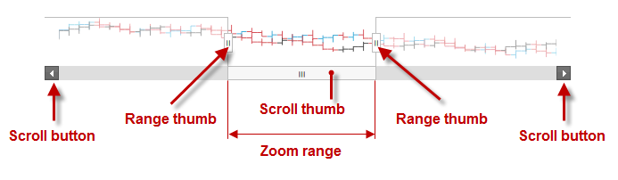

<!--
|metadata|
{
    "fileName": "igzoombar-landingpage",
    "controlName": "igZoombar",
    "tags": []
}
|metadata|
-->

# igZoombar

## In This Group of Topics
### Introduction

The topics in this group cover the `igZoombar`™ control and its use.

The `igZoombar` control provides zooming functionality to range-based controls. The `igZoombar` features a horizontal scroll bar, a thumbnail of the whole range, and a resizable zoom-range window.

The `igZoombar` control is designed to be used as an enhancement to range-enabled controls like `igDataChart`™. The `igZoombar` cannot work as a standalone control.

### Topics

- [igZoombar Overview](igZoombar-Overview.html): This topic provides conceptual information about the `igZoombar` control and the functionalities it provides including the supported user interactions and some configuration basics.

- [Adding igZoombar](Adding-igZoombar.html): This topic explains, with code examples, how to add the `igZoombar` control to an HTML page and an ASP.NET MVC application.

- [Configuring igZoombar](Configuring-igZoombar.html): This topic explains, with code examples, how to configure the zoom action and the zoom window of the `igZoombar` control.

- [Accessibility Compliance (igZoombar)](igZoombar-Accessibility-Compliance.html): This topic explains the accessibility features of the `igZoombar` control and provides information on how to achieve accessibility compliance for pages containing this control.

- [Known Issues and Limitations (igZoombar)](igZoombar-Known-Issues-And-Limitations.html): This topic describes the known issues and limitations of the `igZoombar` control and the available workarounds.

- [jQuery and ASP.NET MVC Helper API Links (igZoombar)](igZoombar-ASP-NET-MVC-Helper-API.html): This topic provides links to the API reference documentation about the `igZoombar` control and the ASP.NET MVC Helper for it.

 

 

