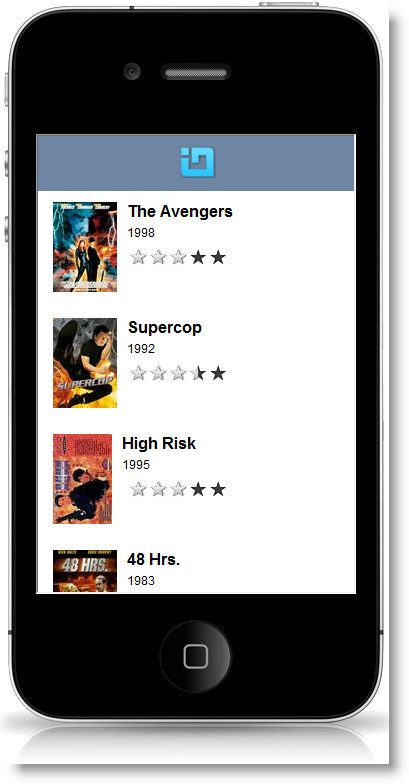
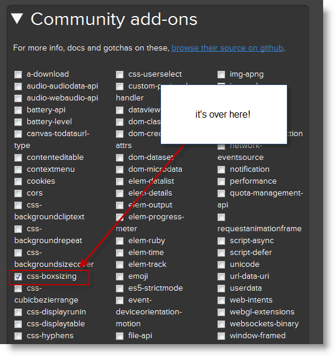
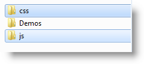
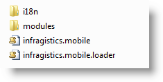
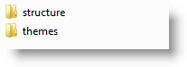

<!--
|metadata|
{
    "fileName": "referencing-mobile-resources-in-netadvantage-for-jquery",
    "controlName": "",
    "tags": ["Deployment"]
}
|metadata|
-->

# Referencing Mobile Resources in Ignite UI

##Topic Overview

### Purpose

This topic explains how to manage the required mobile resources for Ignite UI controls.

### In this topic

This topic contains the following sections:

-   [**Introduction**](#introduction)
-   [**Referencing External Mobile Resources for jQuery Controls**](#external)
-   [**Referencing Infragistics Mobile Resources for jQuery Controls**](#ig-resources)
    -   [Referencing Infragistics JavaScript from a custom download](#custom-build)
    -   [Referencing resources using the Loader](#loader)
    -   [Referencing CSS and JavaScript files](#manual)
    -   [Installed resources](#installed)
    -   [Infragistics Content Deliver Network (CDN) Resources](#cdn)
-   [**Referencing Localization Mobile Resources for jQuery Controls**](#localization)
-   [**Related Content**](#related-content)
    -   [Topics](#topics)
    -   [Samples](#samples)
    -   [Resources](#resources)


## <a id="introduction"></a> Introduction

The `igListView`™ and `igRating`™ are the two controls that are part of the Ignite UI 2012.2 mobile controls. Both are new, different widgets from Ignite UI controls, and are adapted especially for mobile platforms. The both controls require specific script and CSS files for the control to work on the page. This topic explains how to manage the required resources for Ignite UI mobile controls.




## <a id="external"></a> Referencing External Mobile Resources for jQuery Controls

### Referencing external resources summary

The [jQuery](http://jquery.com/) and [jQuery Mobile](http://jquerymobile.com) JavaScript libraries are always required when using Ignite UI mobile controls. In addition to that it’s highly recommended to use [Modernizr](http://modernizr.com/) which detects the current browser features.

> **Note:** The Ignite UI mobile controls don’t depend on Modernzir, but the controls adapt better to a mobile environment when accompanied by Modernizr.

The following list describes the latest version of the resources that are required and are compatible among each other and Ignite UI control scripts (see the next block):

-   jQuery 1.6.4 ([Download jQuery](http://docs.jquery.com/Downloading_jQuery))
-   jQuery Mobile 1.0.1 RTM ([Download jQuery Mobile](http://jquerymobile.com/download/))
-   Modernizr 2.5.3 (Custom build*, including box-sizing testing. [Download Modernizr](http://modernizr.com/download/).)(optional)

You also need to reference **JQuery Mobile base CSS Structure. This is the basic CSS structure that the controls need:**

-   jQuery Mobile – jquery.mobile.structure.css ([Download jQuery Mobile](http://jquerymobile.com/download/))

> **Note:** There is a requirement with *css-boxsizing*, which is not included in the default packaging for Modernizr. You should make sure that *css-boxsizing* (from Community add-ons) is checked, when you are generating the Moderznir code.



> **Note:** See a complete list describing which framework versions are supported with each release of Ignite UI at [http://www.infragistics.com/help/supported-environments](http://www.infragistics.com/help/supported-environments).

### Referencing JavaScript libraries

References needed to include the libraries mentioned above:

jQuery library:

**In HTML:**

```html
<script src="Scripts/jquery.min.js" type="text/javascript"></script>
```

jQuery Mobile:

**In HTML:**

```html
<script src="Scripts/jquery.mobile.min.js" type="text/javascript"></script>
```

Modernizr library:

**In HTML:**

```html
<script scr="Scripts/modernizr.js" type="text/javascript"></script>
```

### Referencing the jQuery Mobile CSS

The jQuery mobile structure CSS is required to define the layout of Ignite UI widgets. The code example below includes the structure CSS.

jQuery Mobile structure CSS:

**In HTML:**

```html
<link href="Content/jqm/jquery.mobile.structure.min.css" rel="stylesheet" type="text/css" />
```


## <a id="ig-resources"></a> Referencing Infragistics Mobile Resources for jQuery Controls

### Referencing Infragistics resources summary

To work with the mobile controls from Ignite UI you must reference Infragistics resources in your page. You can reference these resources in the following different ways:

- [Referencing Infragistics JavaScript from a custom download](#custom-build): This is the recommended approach to reference Ignite UI JavaScript files. You can [create a custom download](%%SamplesUrl%%/download) of selected Ignite UI controls and components.

- [Using Infragistics Loader](#loader): The Infragistics Loader can be used to resolve all the Infragistics resources (styles and scripts)

- [Including all CSS and/or JavaScript files](#manual): You can manually reference all the required files, including the Infragistics theme, styles and scripts.


The following represents the places where the script and style files are located. You can see the different approaches that you can follow to access the resources.

- [Installed Resources](#installed): The location of all the resources that are installed from the packet.

- [Including references using Content Deliver Network (CDN) Resources](#cdn): The JavaScript files are also available in a hosted environment on the Infragistics CDN.


> **Note:** The default iOS theme can be replaced by another theme, for instance a custom ThemeRoller theme, but it’s a good practice to include iOS theme if you don’t use another theme to override it.

### <a id="custom-build"></a> Referencing Infragistics JavaScript from a custom download

To create an Ignite UI custom build, go to the [custom download page](%%SamplesUrl%%/download). Custom builds have two main benefits. First, by choosing only the controls and features used in your application, the browser downloads and executes less total JavaScript. Second, the JavaScript is combined into one file reducing the amount of requests that the browser makes to the server. These benefits result in faster performance for your application.

**In HTML:**

```html
<script src="../scripts/infragistics.mobile.js" type="text/javascript"></script>
```

**In ASPX:**

```csharp
<%@ Import Namespace="Infragistics.Web.Mvc" %>
<!DOCTYPE html>
<html>
<head runat="server">
..    
<script src="<%= Url.Content("~/scripts/infragistics.mobile.js") %>" type="text/javascript"></script>
```

### <a id="loader"></a> Referencing resources using the Loader

The Infragistics Loader resolves and loads on to the page all the Infragistics resources (styles and scripts) for you. You just need to provide the path to required CSS and JavaScript files and declare which resources the loader will fetch for the page.

You need to reference the Infragistics Loader:

**In HTML:**

```html
<script src="js/infragistics.loader.js" type="text/javascript"></script>
```

Inside another `<script>` element, you need to include the JavaScript code below to call the Infragistics Loader and in addition to declare the resources for the widget that you want to load. For example the following code initializes the loader and requests all the resources that are needed by the `igListView` control and loads the iOS theme.

**In HTML:**

```html
$.ig.loader({
       scriptPath: "js/",
       cssPath: "css/",
       resources: "igmList",
       theme: "ios"
});
```

The loader also has an ASP.NET MVC wrapper. A benefit of using the wrapper is that when initializing the Loader you are not required to provide the resources for the control you want to load. They are automatically added from the wrapper of the control.

**In C#:**

```csharp
@(Html.InfragisticsMobile().
    Loader().
    ScriptPath("js/").
    CssPath("css/").
    Theme("ios").
    Render())
```

The code above loads the resources asynchronously. The loader exposes a callback function which gives you a place to execute code that is dependent upon the resources managed by the loader. The following code listing demonstrates how to use the callback for custom code:

**In HTML:**

```html
$.ig.loader(function () {
       /// DO YOUR LOGIC HERE
});
```

For a complete example using the Infragistics Loader, see the [Adding Mobile Control to the ASP.NET MVC Project](Adding-Mobile-Ignite-UI-Controls-to-an-ASP.NET-MVC-Application.html) topic or follow the mobile `igRating` samples.

### <a id="manual"></a> Referencing CSS and JavaScript files

If you want to manually reference the resources for the mobile controls you will need to include the iOS theme, jQuery Mobile structural CSS files, and the base JavaScript files.

This approach allows you to exclude the scripts you do not need for your application. For example, if you will not be using list view you can exclude all list-view related scripts like:

-   *infragistics.util.js*
-   *infragistics.templating.js*, etc.

First you will need to include the CSS of the mobile controls used in your application.

Infragistics theme:

**In HTML:**

```html
<!--INFRAGISTICS THEME-->
<link type="text/css" href="css/themes/ios/infragistics.mobile.theme.css" rel="stylesheet" />
```

> **Note:** The default iOS theme can be replaced by another theme, but it’s a good practice to include iOS theme if you don’t use another theme that overrides it.

Next, you must include the control-specific styles and scripts. The following tables demonstrate the required resources for igListView and igRating.

Mobile structural CSS files for `igListView`:

**In HTML:**

```html
<link type="text/css" href="content/css/structure/modules/infragistics.mobile.list.css" rel="stylesheet" />
```

Mobile structural CSS files for `igRating`:

**In HTML:**

```html
<link type="text/css" href="content/css/structure/modules/infragistics.mobile.rating.css" rel="stylesheet" />
```

Mobile scripts for `igListView`

**In HTML:**

```html
<script type="text/javascript" src="js/modules/infragistics.util.js"></script>
<script type="text/javascript" src="js/modules/infragistics.datasource.js"></script>
<script type="text/javascript" src="js/modules/i18n/infragistics.dataSource-en.js"></script>
<script type="text/javascript" src="js/modules/infragistics.ui.scroll.js"></script>
<script type="text/javascript" src="js/modules/infragistics.templating.js"></script>
<script type="text/javascript" src="js/modules/infragistics.mobileui.list.js"></script>
<script type="text/javascript" src="js/modules/infragistics.mobileui.list.sorting.js"></script>
<script type="text/javascript" src="js/modules/infragistics.mobileui.list.filtering.js"></script>
<script type="text/javascript" src="js/modules/infragistics.mobileui.list.loadondemand.js"></script>    
<script type="text/javascript" src="js/modules/i18n/infragistics.mobileui.list-en.js"></script>
```

Mobile scripts for `igRating`:

**In HTML:**

```html
<script type="text/javascript" src="js/modules/infragistics.mobileui.rating.js"></script>
```


### <a id="installed"></a> Installed resources

If you have chosen the typical installation of Ignite UI %%ProductVersion%%, you can find the resources under the paths below:

Type | Path
---|---
Assemblies | %%InstallPath%%\MVC\
Script files | %%InstallPath%%\mobile\js\
CSS files | %%InstallPath%%\mobile\css\




The scripts are located in the **js** folder and it’s up to you if you want to reference the all-inclusive JavaScript files manually, or the Infragistics loader.



These files keep older naming convention for all the source files in the modules folder.

-   *infragistics.mobileui.CONTROL_NAME.js*
-   *infragistics.mobileui.CONTROL_NAME.CONTROL_FEATURE.js*

> **Note:** Some of the files are taken from the jQuery, non-mobile controls. Example is *infragistics.datasource.js*. It’s used by the `igListView` when you want to bind it to a data source.

The localization folder (**i18n**) contains the localization files for the controls.

The following picture shows you the content of the other folder css.



The basic structure CSS files and all the CSS files for all controls can be found in the structure folder. Infragistics mobile themes are available in the **themes** folder.

> **Note:** The iOS theme is the only one available for the Ignite UI 2012.2 release.

You can see all scripts required for each control in the topic [JavaScript Files in Ignite UI](Deployment-Guide-JavaScript-Files.html)


### <a id="cdn"></a> Infragistics Content Deliver Network (CDN) Resources

The JavaScript files are also available in a hosted environment on the Infragistics CDN. The benefits of using a CDN are numerous so please refer to the [Infragistics Content Delivery Network (CDN)](Deployment-Guide-Infragistics-Content-Delivery-Network%28CDN%29.html) help topic.


## <a id="localization"></a> Referencing Localization Mobile Resources for jQuery Controls

### Referencing localization resources

Localization files are placed in the localization folder (**i18n**).

After adding Infragistics resources as shown in the [Referencing Infragistics Mobile Resources for jQuery Controls](#ig-resources) section of this topic, the **scripts** folder of your Web application will have a modules folder. The **i18n** folder is placed inside the modules folder, holding JavaScript files to localize `igListView` to the Japanese language.

> **Note:** Localization resources must always be loaded before the mobile control widget.

There are two ways to reference localization resources:

-   Using Infragistics Loader, which resolves the Infragistics resources (styles and scripts) and also the localization resources.
-   Referencing the localization scripts manually.

The following examples demonstrate how to include Japanese localization resources, assuming you already have the three JavaScript files mentioned above.

### Referencing English localization

The English language localization files are embedded in jQuery mobile JavaScript files. You don’t need to include localization resources for the English language.

### Code example: referencing localization resources using the Loader

**In Javascript:**

Code example: referencing localization resources using the Loader
The following code example demonstrates how to include localization resources using the Infragistics Loader. The `igListView` widget localization is controlled by the `igLoader` locale option.

```
$.ig.loader({
    cssPath: "css/",
    scriptPath: "js/",
    resources: 'igListView',
    locale: 'ja'
});
//Continue loading the igListView widget

```
For a complete example and further details about the Infragistics Loader, see the Using Infragistics Loader topic.

### Code example: referencing localization resources manually

The following code example demonstrates how to include localization resources manually.

> **Note:** Localization scripts must be referenced before the actual JavaScript files in the page code.

**In HTML:**

```html
<!-- LOCALIZATION SCRIPTS -->
<script scr="js/modules/i18n/infragistics.mobileui.list-ja.js" type="text/javascript"></script>
<!-- BASE IG SCRIPTS -->
<script type="text/javascript" src="js/modules/infragistics.mobileui.list.js"></script>
```


## <a id="related-content"></a> Related Content

### <a id="topics"></a> Topics

The following topics provide additional information related to this topic.

- [Adding Mobile Ignite UI control to an ASP.NET MVC Application](Adding-Mobile-Ignite-UI-Controls-to-an-ASP.NET-MVC-Application.html): This topic explains how to add mobile controls in ASP.NET MVC application.

- [Referencing Resources in Ignite UI](Deployment-Guide-JavaScript-Resources.html): This topic explains how to manage the required resources for Ignite UI controls.

- [igList Overview](igListView-Overview.html): This topic explains the features of `igListView`.

- [igRating Overview](igRating%28Mobile%29-Overview.html): The topic that introduces the user to the `igRating` main features and functionality.


### <a id="samples"></a> Samples

The following samples provide additional information related to this topic. In the samples above you can see how the loader is used to load resources for `igListView` and `igRating`.

- [*igListView* Load On Demand](%%SamplesUrl%%/mobile-list-view/load-on-demand): This sample demonstrates how to load items in the `igListView` on demand.

- [*igRating* Default](%%SamplesUrl%%/mobile-rating/basic-usage): Sample that shows you how to initialize the `igRating` using different approaches.


### <a id="resources"></a> Resources

The following material (available outside the Infragistics family of content) provides additional information related to this topic.

- [jQuery](http://jquery.com/): Home page of the jQuery JavaScript library

- [jQuery Mobile](http://jquerymobile.com): Home page of the jQuery Mobile JavaScript library

- [Modernizr](http://modernizr.com/): Home page of the Modernizr JavaScript library


 

 


