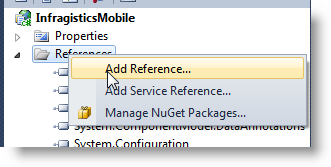

<!--
|metadata|
{
    "fileName": "adding-mobile-ignite-ui-controls-to-an-asp.net-mvc-application",
    "controlName": "",
    "tags": ["Getting Started","How Do I","MVC"]
}
|metadata|
-->

# Adding Mobile Controls to an ASP.NET MVC Application


## Topic Overview
#### Purpose

This topic explains how to add mobile Ignite UI controls in an ASP.NET MVC application.

#### In this topic

This topic contains the following sections:

-   [**Using Mobile MVC helper**](#mvc-helper)
-   [**Chaining Syntax**](#chaining)
-   [**Developing ASP.NET MVC application with mobile igListView**](#listview-example)**™**
-   [**Related Content**](#related-content)


## <a id="mvc-helper"></a> Using Mobile MVC helper
### Using the MVC helper overview

The ASP.NET™ MVC mobile helpers for the Ignite UI™ wrap the already client-only mobile control in a server-side set of MVC Extensions that allows the control to be defined and used in the following way:

**In ASPX:**

```csharp
<%= Html.InfragisticsMobile().CONTROL_NAME() %>
```

OR

**In ASPX:**

```csharp
<%= Html.InfragisticsMobile().CONTROL_NAME(Model) %>
```

There is no dependence on ASP.NET or any other framework different than MVC.

### Navigate to the installed resources

If you have chosen the typical installation for Ignite UI %%ProductVersion%%, you can find the resources under the paths below:

Type | Path
---|---
Assemblies | %%InstallPath%%\MVC\
Script files | %%InstallPath%%\mobile\js
CSS files | %%InstallPath%%\mobile\css\


**Related Topic:**

[Referencing mobile Resources in Ignite UI](Referencing-Mobile-Resources-in-NetAdvantage-for-jQuery.html)

### MVC 3

All the code for the MVC helper is contained in the Infragistics.Web.Mvc assembly, which comes compiled against MVC3.

The assemblies can be found under the path below:

-   %%InstallPath%%\MVC\MVC3\Bin

The assemblies can be installed to the GAC using the **gacutil** command.

[http://msdn.microsoft.com/en-us/library/ex0ss12c%28v=vs.80%29.aspx](http://msdn.microsoft.com/en-us/library/ex0ss12c%28v=vs.80%29.aspx)

> **Note:** You should set the Copy Local property of the reference of the dll to be True: [http://msdn.microsoft.com/en-us/library/t1zz5y8c%28v=vs.80%29.aspx](http://msdn.microsoft.com/en-us/library/t1zz5y8c%28v=vs.80%29.aspx)

### Calling Render() method

When instantiating the control with the ASP.NET MVC Helper, make sure to call the Render method last after all other options have been configured. This is the method that renders the HTML and JavaScript necessary to instantiate the control on the client.


## <a id="chaining"></a> Chaining Syntax

You have two different options of defining a Ignite UI control in an MVC application. The first option is to configure a Model class and pass it as an argument in the control extension method.

The other option is to configure the control in the View using a chaining approach as demonstrated by the following code listing:

**In ASPX:**

```csharp
<%= Html.InfragisticsMobile().ListView(Model).ID(“igListView”).Render() %>
```

### Configuring the control using chaining

Initializing the control with the chaining syntax moves all creation and configuration logic to the view, making the controller code extremely concise and clear. Defining the control in the view is achieved by exposing required properties and methods through helper’s methods that always return the same object that called them. For complex objects, [lambda expression builders](http://msdn.microsoft.com/en-us/library/bb397687.aspx) are used in order to achieve the appropriate syntax. The following code listing demonstrates how to use chaining and lambda expressions to instantiate a control:

**In ASPX:**

```csharp
<%= Html.InfragisticsMobile()
    .ListView(Model)
    .ID("listView")
    .Bindings(b =>
    {
        b.TextKey(”ProductName”)
            .DescriptionKey (”CategoryName”);
    })
    .DataBind()
    .Render() %>
```

### Configuring the control using a Model

Using a model class relies on the controller to configure the control. This is useful in a scenario where after a request (such as page change or filtering), you need to retrieve some of the settings/properties with which the control was configured – which wouldn’t be otherwise available if you would have used chaining to configure everything in the View. The following code explains how to define `igListView` in the controller:

**In C#:**

```csharp
ListViewModel list = new ListViewModel();
ListViewBindings binding = new ListViewBindings();
binding.TextKey = "ProductName";
binding.DescriptionKey = "CategoryName";
list.Bindings = binding;
return View(list);
```

Then in the View you will need only to pass the model in the `igListView` Helper:

**In ASPX:**

```csharp
<%= Html.InfragisticsMobile()
    .ListView(Model)
    .ID("listView")
    .DataBind()
    .Render() %>
```


## <a id="listview-example"></a> Developing ASP.NET MVC application with mobile igListView

This procedure shows you how to add all required assemblies and resources (CSS and JavaScript files) to work with Ignite UI mobile igListView in ASP.NET MVC.

### Requirements

To complete the procedure, you need the following:

-   A new MVC3 Web application that contains MVC Controllers, Models and Views.
-   Ignite UI %%ProductVersion%% installed
-   All the required resources loaded. To see how to load them follow [Referencing Mobile Resources in Ignite UI](Referencing-Mobile-Resources-in-NetAdvantage-for-jQuery.html) topic.
-   Understand how to add the `igListView` control to a page. To learn more about how to do this, read the [Adding igListView to a Page](igListView-Adding-igListView-to-a-Web-Page.html) topic.

### Overview

This topic takes you step-by-step toward developing and ASP.NET MVC application with `igListView` control. The following is a conceptual overview of the process:

1.  Add a reference to the MVC wrapper in your Web Application.
2.  Adding MVC wrapper of the Loader.
3.  Adding MVC wrapper of the `igListView`.
4.  Adding client-side code to manipulate `igListView` client-side API.

### Steps

The following steps demonstrate how to develop ASP.NET MVC application with the mobile `igListView` control.

1. **Add reference to the MVC wrapper in your Web Application**
	
	a. Go to the Web Project window and select context menu of the Reference folder.

	
	
	b. Select Add Reference List Item and then browse the Infragistics.Web.Mvc assembly. You can reference it from the:
	-   GAC
	-   The installation folder. Here you will need to set the `CopyLocal` property to *true*, in order to get the assembly in the bin directory.

2. **Adding MVC wrapper of the Loader**

	a. Add the loader to the page using the ASP.NET MVC wrapper

	**In ASPX:**
	
	```csharp
	<%= Html.Infragistics()
	        .Loader()
	        .ScriptPath(“http://cdn-na.infragistics.com/igniteui/%%ProductVersion%%/latest/mobile/js/”)
	        .CssPath(“http://cdn-na.infragistics.com/igniteui/%%ProductVersion%%/latest/mobile/css/”)
	        .Render() %>
	```

	> **Note:** Alternatively, you may choose to manually load the dependent files on the page. For more information on manual loading read the topic Referencing mobile Resources in Ignite UI.
	
	​b. The first option is to reference them locally, but the JavaScript files are also available in a hosted environment on the Infragistics CDN. The example above references the trial JavaScript and CSS. For more information on the CDN, please refer to the [Infragistics Content Delivery Network (CDN)](Deployment-Guide-Infragistics-Content-Delivery-Network%28CDN%29.html) help topic under Related Items.
	
	​c. One of the benefits of using the ASP.NET MVC helper is that you are not required to define the dependent resources (i.e. scripts and style) for your control, just the configuration options. The helper controls for the individual controls in use on the page will tell the loader which dependent resources to load.

3. **Adding MVC wrapper of the igListView**

	​Add the MVC wrapper of the control.
	
	**In ASPX:**
	
	```csharp
	<%= Html.InfragisticsMobile()
	     .ListView()
	     .ID(“igListView”)
	     .Render() %>
	```
	
	> **Note:** This is just a simple use of the `igListView` wrapper. To see all the possible options of how to initialize the igListView control, read the topic [Adding igListView to a Page](igListView-Adding-igListView-to-a-Web-Page.html).

4. Adding client-side code to manipulate `igListView` client-side API

	When you are using the Ignite UI ASP.NET MVC wrappers to render the control the control resources are requested by the Control wrapper’s code, rather that the `igLoader`™ wrapper’s code. Therefore two instances of `igLoader` components are created on the page. The first one is rendered by the loader wrapper and the second is rendered by the control’s wrapper. They each load scripts separately and asynchronously which is why they load scripts at different stages of the page life cycle. Therefore, consider the following when working with `igLoader` component:

	1.  Any JavaScript code that accesses Ignite UI Mobile controls should be defined after the definition of the MVC wrapper of the control. Doing this ensures that the loader is processed first and has an opportunity to load the dependent resources before the page attempts to use the controls on the page. The recommended approach for ordering the loader and control scripts is shown in the following code listing:
		
		**In ASPX:**
	
	    ```csharp
	    <%= Html.InfragisticsMobile()
	         .ListView()
	         .ID(“igListView”)
	         .Render() %>
	    ```
	
	    **In Javascript:**
	
	    ```js
	    <script type="text/javascript">
	        $.ig.loader(function () {
	            $("#igListView").igListView("option", "imageMode”);
	        });
	    </script>
	    ```

	2.  If you are accessing the widget inside a jQuery handler as shown in the following listing, it’s always preferable to use jQuery method ‘live’ instead of the ‘bind’:

	    **In Javascript:**
	
	    ```js
	    $("#btnReset1").live({ click: function () {
	        $("#igRating1").igRating("option", "value", 0);
	    }});
	    ```
	
	    In this way you are ensured that the selector will include elements that are created at any stage of the page cycle. 
	
		> **Note:** If you are using jQuery version 1.7.1 and above, you can use the `on` handler instead of the `bind` or `live` handlers. The %%ProductVersion%% release of Ignite UI Mobile controls use jQuery version 1.6.4 by default.


## <a id="related-content"></a> Related Content

### <a id="topics"></a> Topics

The following topics provide additional information related to this topic.

- [Referencing Mobile Resources in Ignite UI](Referencing-Mobile-Resources-in-NetAdvantage-for-jQuery.html): This topic explains how to manage the required resources for Ignite UI mobile controls.

- [Adding igListView to a Page](igListView-Adding-igListView-to-a-Web-Page.html): This topic explains how you can add `igListView` mobile control to a web page.


 

 


