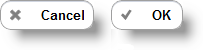
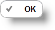
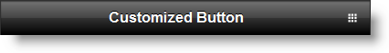

<!--
|metadata|
{
    "fileName": "button-overview",
    "controlName": "Button",
    "tags": ["Getting Started","MVC"]
}
|metadata|
-->

# Button Overview

## Topic Overview

### Purpose

This topic introduces MVC Button control wrapper and its main functionalities.

### In this topic

This topic contains the following sections:

-   [**Introduction**](#introduction)
-   [**Button MVC Wrapper Main Features Summary**](#features-summary)
-   [**Button MVC Wrapper Features**](#features)
    -   [Text](#text)
    -   [Mini](#mini)
    -   [Inline](#inline)
    -   [Submit](#submit)
    -   [Icons](#icons)
    -   [Corners](#corners)
    -   [Shadow](#shadow)
    -   [Theme](#theme)
    -   [Attributes](#attributes)
-   [**Related Content**](#related-content)
    -   [Topics](#topics)
    -   [Samples](#samples)

##  Introduction

The Button MVC wrapper is a server-side control that renders the [jQuery Mobile](http://jquerymobile.com/demos/1.1.1/docs/buttons/index.html) control. It allows you to add a button into your MVC web project and configure its state either on the client or on the server.

##  Button MVC Wrapper Main Features Summary
The following table summarizes the main features of the Button MVC wrapper:

Feature | Description
---|---
[Text](#text) | [`Text`](Infragistics.Web.Mvc.Mobile~Infragistics.Web.Mvc.Mobile.ButtonModel~Text.html) property allows you to set and get the text of the control.
[Mini](#mini) | The Button can have two states – one normal and another that can make the control smaller.
[Inline](#inline) | By default the Button is of type block and if you insert two buttons, they will be at two different rows. Setting the [`Inline`](Infragistics.Web.Mvc.Mobile~Infragistics.Web.Mvc.Mobile.ButtonModel~Inline.html) method allows you to render several buttons on one row.
[Submit](#submit) | By default the Button is rendered as a HTML DIV element on the client, except it is configured to be a Submit button. Then it is rendered as HTML INPUT of type submit.
[Icons](#icons) | Buttons can be customized to have different icons.
[Corners](#corners) | Buttons can be customized to have rounded corners.
[Shadow](#shadow) | Buttons can be customized to have shadows.
[Theme](#theme) | Buttons can have the standard jQuery Mobile Themes.
[Attributes](#attributes) | The MVC Button wrapper has a method that accepts a list of HTML attributes that will be rendered on the client.

##  Button MVC Wrapper Features

###  Text

Button [`Text`](Infragistics.Web.Mvc.Mobile~Infragistics.Web.Mvc.Mobile.ButtonModel~Text.html) property allows you to set and get the text of the control.

###  Mini

The Button can have two states – one normal and another that can make the control smaller. If the default size of the Button does not fit your requirements and you want to restrict the control size, you can make the Button smaller, using its [`Mini`](Infragistics.Web.Mvc.Mobile~Infragistics.Web.Mvc.Mobile.ButtonWrapper~Mini.html) method.

###  Inline

By default the Button is of type block and if you place two buttons, they will be at two different rows. Setting the [`Inline`](Infragistics.Web.Mvc.Mobile~Infragistics.Web.Mvc.Mobile.ButtonModel~Inline.html) method allows you to render several buttons on one row.

###  Submit

By default Button is rendered as a HTML DIV element on the client, except it is configured to be a Submit button. Then it is rendered as HTML INPUT of type *submit*. This can happen by using the [`IsSubmitButton`](Infragistics.Web.Mvc.Mobile~Infragistics.Web.Mvc.Mobile.ButtonModel~IsSubmitButton.html) method. When the Button is rendered on the client, it will be again a HTML span element, but will be associated with hidden input submit field.

###  Icons

Button can be customized to have different icons. You can achieve this by using the Icons wrapper method. You can pass as a parameter any of the supported jQuery Mobile [Button icons](http://jquerymobile.com/demos/1.1.1/docs/buttons/buttons-icons.html). The following picture shows you a button that uses a “check” icon.

###  Corners

Button can be customized to have rounded corners. This can be achieved by using the [`Corners`](Infragistics.Web.Mvc.Mobile~Infragistics.Web.Mvc.Mobile.ButtonModel~Corners.html) method. By default the corners are rounded, so if you want to square them you need to pass “false” as the parameter.

###  Shadow

Button can be customized to have a shadow by using the [`Shadow`](Infragistics.Web.Mvc.Mobile~Infragistics.Web.Mvc.Mobile.ButtonModel~Shadow.html) method of the Button wrapper.

###  Theme

Button can have the standard [jQuery Mobile Themes](http://jquerymobile.com/demos/1.1.1/docs/api/themes.html). By default, the MVC wrappers render controls with the default jQuery mobile from, which is “c”. The following picture shows you button customized with theme “e”.

###  Attributes

The MVC Button wrapper has a method that accepts a list of HTML attributes that will be rendered on the client. The method name is [`HtmlAttributes`](Infragistics.Web.Mvc.Mobile~Infragistics.Web.Mvc.Mobile.ButtonWrapper~HtmlAttributes.html) and it accepts parameter from type [Dictionary](http://msdn.microsoft.com/en-us/library/xfhwa508.aspx)

##  Related Content

###  Topics

The following topics provide additional information related to this topic:

- [Adding *Button*](Adding-Button.html): This topic contains the information needed to enable the Button using the Infragistics MVC Wrappers.

- [*Button* Configuring](Button-Configuring.html): This topic contains the information and references needed to configure the Button using the MVC wrapper.

- [*Button* Property Reference](Button-Property-Reference.html): This topic provides reference information about the properties of the Button MVC Wrapper.

###  Samples

The following samples provide additional information related to this topic:

- [Basic Usage](%%SamplesUrl%%/mobile-button/basic-usage): This sample demonstrates display options of the Button ASP.NET MVC helper.

 

 

