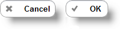

<!--
|metadata|
{
    "fileName": "button-configuring",
    "controlName": "Button",
    "tags": ["How Do I","MVC"]
}
|metadata|
-->

# Button Configuring

## Topic Overview

### Purpose

This topic contains the information and references needed in order to configure the Button using the MVC wrapper.

### Required background

The following topics are prerequisites to understanding this topic:

- [Adding *Button*](Adding-Button.html): This topic contains the information needed in order to enable the Button using the Infragistics MVC Wrappers.


### In this topic

This topic contains the following sections:

-   [Control Configuration Summary](#summary)
-   [Mini and Inline Button](#mini-inline)
-   [Customize Button Appearance](#appearance)
-   [Configure Button Icon](#icon)
-   [Create Submit Button](#submit)
-   [Related Content](#related-content)


## <a id="summary"></a> Control Configuration Summary

The following table lists the configurable aspects of the Button MVC wrapper:

Configurable aspects | Details | Properties
---------------------|---------|-----------
Mini and Inline Button | This scenario will help you if you want to place several buttons in one row. | [Mini](Infragistics.Web.Mvc.Mobile~Infragistics.Web.Mvc.Mobile.ButtonWrapper~Mini.html) <br /> [Inline](Infragistics.Web.Mvc.Mobile~Infragistics.Web.Mvc.Mobile.ButtonWrapper~Inline.html)
Customize Button Appearance | This part of the Button API allows you to change control appearance. | [Corners](Infragistics.Web.Mvc.Mobile~Infragistics.Web.Mvc.Mobile.ButtonWrapper~Corners.html) <br /> [Shadow](Infragistics.Web.Mvc.Mobile~Infragistics.Web.Mvc.Mobile.ButtonWrapper~Shadow.html) <br /> [Theme](Infragistics.Web.Mvc.Mobile~Infragistics.Web.Mvc.Mobile.ButtonWrapper~Theme.html)
Configure Button icon | Button can have an icon that has some configurable properties. | [Icon](Infragistics.Web.Mvc.Mobile~Infragistics.Web.Mvc.Mobile.ButtonWrapper~Icon.html) <br /> [IconPosition](Infragistics.Web.Mvc.Mobile~Infragistics.Web.Mvc.Mobile.ButtonWrapper~IconPosition.html) <br /> [IconShadow](Infragistics.Web.Mvc.Mobile~Infragistics.Web.Mvc.Mobile.ButtonWrapper~IconShadow.html)
Create Submit Button | Button can be configured to a submit form. | [IsSubmitButton](Infragistics.Web.Mvc.Mobile~Infragistics.Web.Mvc.Mobile.ButtonWrapper~IsSubmitButton.html)


## <a id="mini-inline"></a> Mini and Inline Button

This scenario is will help you if you want to place several buttons in one row.



### Property settings

The following table maps the desired configuration to display several buttons on one row:

In order to: | Use this property: | And set it to:
---|---|---
Create smaller Button | [Mini](Infragistics.Web.Mvc.Mobile~Infragistics.Web.Mvc.Mobile.ButtonWrapper~Mini.html) | true
Create inline Button | [Inline](Infragistics.Web.Mvc.Mobile~Infragistics.Web.Mvc.Mobile.ButtonWrapper~Inline.html) | true

### Code Example

The code below demonstrates how set two mini Buttons on one row:

**In C#:**

```csharp
@(Html.InfragisticsMobile()
	.Button()
	.ID("btnOK")
	.Mini(true)
	.Inline(true)
	.Text("OK")
	.Render())
    
@(Html.InfragisticsMobile()
	.Button()
	.ID("btnCancel")
	.Mini(true)
	.Inline(true)
	.Text("Cancel")
	.Render())
```


## <a id="appearance"></a> Customize Button Appearance

The following scenario will help you modify the Button’s appearance so that it is different from the default one.


### Property settings

The following table maps the desired configuration to change a Button’s appearance:

In order to: | Use this property: | And set it to:
---|---|---
Disable rounded corners | [Corners](Infragistics.Web.Mvc.Mobile~Infragistics.Web.Mvc.Mobile.ButtonWrapper~Corners.html) | false
Enable Shadow | [Shadow](Infragistics.Web.Mvc.Mobile~Infragistics.Web.Mvc.Mobile.ButtonWrapper~Shadow.html) | true
Set jQuery Mobile Theme b | [Theme](Infragistics.Web.Mvc.Mobile~Infragistics.Web.Mvc.Mobile.ButtonWrapper~Theme.html) | “b”


### Code Example

The code below demonstrates how to set the Button methods and its change control appearance.

**In C#:**

```csharp
@(Html.InfragisticsMobile()
    .Button()
    .ID("btn1")
    .Corners(false)
    .Shadow(true)
    .Theme("b")
    .Text("Customized Button")
    .Render())
```


## <a id="icon"></a> Configure Button Icon

Button can have a jQuery Mobile [Button icon](http://jquerymobile.com/demos/1.1.1/docs/buttons/buttons-icons.html) that has some configurable properties.


### Property settings

The following table maps the desired configuration to set the Button icon:

In order to: | Use this property: | And set it to:
---|---|---
Use grid icon | [Icon](Infragistics.Web.Mvc.Mobile~Infragistics.Web.Mvc.Mobile.ButtonWrapper~Icon.html) | “grid”
Set icon position | [IconPosition](Infragistics.Web.Mvc.Mobile~Infragistics.Web.Mvc.Mobile.ButtonWrapper~IconPosition.html) | “right”
Enable Icon shadow | [IconShadow](Infragistics.Web.Mvc.Mobile~Infragistics.Web.Mvc.Mobile.ButtonWrapper~IconShadow.html) | true


### Code Example

The code bellows demonstrates how to enable and configure button icon:

**In C#:**

```csharp
@(Html.InfragisticsMobile()
    .Button()
    .ID("btn1")
    .Icon(DefaultIcons.Grid)
    .IconPosition(IconPositions.Right)
    .IconShadow(true)
    .Text("Icon")
    .Render())
```


## <a id="submit"></a> Create Submit Button

Button can be configured to a submit form. By default, the Button is rendered as a HTML span element.


### Property settings

The following table maps the desired configuration to render a submit button:

In order to: | Use this property: | And set it to:
---|---|---
Render Submit Button | [IsSubmitButton](Infragistics.Web.Mvc.Mobile~Infragistics.Web.Mvc.Mobile.ButtonWrapper~IsSubmitButton.html) | true


### Code Example

The following code adds some additional methods that can be set to achieve the result in the picture above:

**In C#:**

```csharp
@(Html.InfragisticsMobile()
    .Button()
    .ID("btn1")
    .Mini(true)
    .Inline(true)
    .Icon(DefaultIcons.Check)
    .IconPosition(IconPositions.Right)
    .IsSubmitButton(true)
    .Text("Submit")
    .Theme("e")
    .Render())
```


## <a id="related-content"></a> Related Content

### <a id="topics"></a> Topics

The following topics provide additional information related to this topic:

- [*Button* Overview](Button-Overview.html): This topic introduces MVC Button control wrapper and its main functionalities.

- [Adding *Button*](Adding-Button.html): This topic contains the information needed to enable the Button using the Infragistics MVC Wrappers.

- [*Button* Property Reference](Button-Property-Reference.html): This topic provides reference information about the properties of the Button MVC Wrapper.


### <a id="samples"></a> Samples

The following samples provide additional information related to this topic:

- [Basic Usage](%%SamplesUrl%%/mobile-button/basic-usage): This sample demonstrates display options of the Button ASP.NET MVC helper.


 

 


