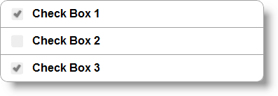
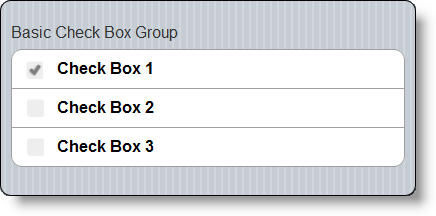
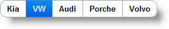
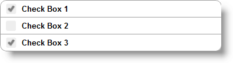
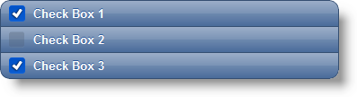

<!--
|metadata|
{
    "fileName": "checkboxgroup-overview",
    "controlName": "CheckBoxGroup",
    "tags": ["Editing","Getting Started","MVC"]
}
|metadata|
-->

# CheckBoxGroup Overview

## Topic Overview

### Purpose

This topic contains information related to the `CheckBoxGroup` MVC wrapper.

### In this topic

This topic contains the following sections:

-   [**Introduction**](#introduction)
-   [**CheckBoxGroup MVC Wrapper Main Features Summary**](#features-summary)
-   [**CheckBoxGroup MVC Wrapper Features**](#features)
-   -   [Name Group](#name)
    -   [Defining Items](#items)
    -   [Orientation](#orientation)
    -   [Mini](#mini)
    -   [Theme](#theme)
-   [**Related Content**](#related-content)
    -   [Topics](#topics)
    -   [Samples](#samples)

##  Introduction

The `CheckBoxGroup` MVC wrapper allows you to combine several individual check boxes under one context. This means that you can use the jQuery Mobile [checkboxradio](http://jquerymobile.com/demos/1.1.1/docs/forms/checkboxes/) plugin to dynamically modify the checkboxes. For more information about configuring and using the individual check box, review the [CheckBox](CheckBox.html) topic.

##  CheckBoxGroup MVC Wrapper Main Features Summary

The following table summarizes the main features of the `CheckBoxGroup` MVC wrapper:

Feature | Description
---|---
Name Group | [`Text`](Infragistics.Web.Mvc.Mobile~Infragistics.Web.Mvc.Mobile.CheckBoxGroupModel~Text.html) property allows you to set and get the text of the control.
Defining Items | The control allows you to define several individual `CheckBox` items.
Orientation | The `CheckBox` can have one of the two states – the default vertical or a horizontal one.
Mini | The `CheckBoxGroup` can have two states – one normal and another that can make the control smaller.
Theme | `CheckBoxGroup` can have the standard jQuery Mobile Themes.

##  CheckBoxGroup MVC Wrapper Features

###  Name Group

[`Text`](Infragistics.Web.Mvc.Mobile~Infragistics.Web.Mvc.Mobile.CheckBoxGroupModel~Text.html) property allows you to set and get the text of the control. It will be displayed above `CheckBox` container.

###  Defining Items

The control allows you define several individual `CheckBox` items. For more information please review the [CheckBox](CheckBox.html) topics.

###  Orientation

The `CheckBox` can have one of two states – the default vertical and or a horizontal one.

###  Mini

The `CheckBoxGroup` can have two states – one normal and another that can make the control smaller. This method is general for the whole group, but it can be overwritten by individual check box items.

###  Theme

`CheckBoxGroup` can have the standard jQuery Mobile Themes. The following picture shows you a `CheckBoxGroup` with Theme “a” applied. This method is general for the whole group, but it can be overwritten by individual `CheckBox` items.

##  Related Content

###  Topics

The following topics provide additional information related to this topic:

- [Adding *CheckBoxGroup*](Adding-CheckBoxGroup.html): This topic contains the information needed to enable the `CheckBoxGroup` using the Infragistics MVC Wrappers.

- [Configure *CheckBoxGroupe*](CheckBoxGroup-Configuring.html): This topic contains the information and references needed to configure the `CheckBoxGroup` using the MVC wrapper.

- [*CheckBoxGroup* Property Reference](CheckBoxGroup-Property-Reference.html):  This topic provides reference information about the properties of the `CheckBoxGroup` MVC Wrapper.

###  Samples

The following samples provide additional information related to this topic:

- [Basic Usage](%%SamplesUrl%%/mobile-checkbox-group/basic-usage): This sample demonstrates usages of the `CheckBoxGroup` ASP.NET MVC helper.

 

 

