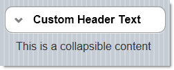
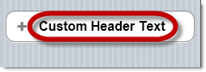
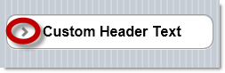
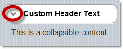
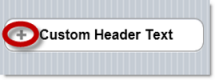
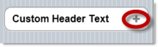
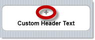
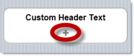

<!--
|metadata|
{
    "fileName": "collapsible-overview",
    "controlName": "Collapsible",
    "tags": ["Getting Started"]
}
|metadata|
-->

# Collapsible Overview

## Topic Overview

### Purpose

This topic provides an overview of the `Collapsible` Asp.Net MVC wrapper and its features.

### In this topic

This topic contains the following sections:

-   [**Introduction**](#introduction)
-   [**Collapsible ASP.NET MVC Helper Main Features Summary**](#features-summary)
	-   [Collapsible ASP.NET MVC Helper main features summary chart](#features-summary-chart)
    -   [Configurable header text](#header-text)
    -   [Configurable state icon picture](#icon-picture)
    -   [Configurable state icon position](#icon-position)
-   [**Related Content**](#related-content)
    -   [Topics](#topics)
    -   [Samples](#samples)

##  Introduction

The `Collapsible` MVC wrapper produces a collapsible block of content.

There is an option to set the header of the collapsible block to look like a clickable button. The content of the collapsible block can contain any HTML content.

##  Collapsible ASP.NET MVC Helper Main Features Summary

###  Collapsible ASP.NET MVC Helper main features summary chart

The following table summarizes the main features of the `Collapsible` MVC wrapper. Some of them are further explained in the text blocks following the table. The full coverage of how to configure `Collapsible`‘s widget features is provided in the [Configuring the *Collapsible*](Collapsible-Configuring.html) topic.

Feature | Description
---|---
[Configurable header text](#header-text) | The text displayed in the header of the collapsible block is set with the [`HeaderText`](Infragistics.Web.Mvc.Mobile~Infragistics.Web.Mvc.Mobile.CollapsibleModel~HeaderText.html) property
[Configurable state icon picture](#icon-picture) | The default icon for the Collapsed and Expanded states of the `Collapsible` wrapper can be changed by setting the [`CollapsedIcon`](Infragistics.Web.Mvc.Mobile~Infragistics.Web.Mvc.Mobile.CollapsibleModel~CollapsedIcon.html) and [`ExpandedIcon`](Infragistics.Web.Mvc.Mobile~Infragistics.Web.Mvc.Mobile.CollapsibleModel~ExpandedIcon.html) properties, respectively.
[Configurable state icon position](#icon-position) | By default, the state icon is displayed at the utmost-left of the `Collapsible` header. The position of the icon is configurable through the [`IconPosition`](Infragistics.Web.Mvc.Mobile~Infragistics.Web.Mvc.Mobile.CollapsibleModel~IconPosition.html) property.
Configurable default state | The state (Collapsed/Expanded) of the `Collapsible` widget is managed by the [`Collapsed`](Infragistics.Web.Mvc.Mobile~Infragistics.Web.Mvc.Mobile.CollapsibleModel~Collapsed.html) property. Setting this property upon widget’s initialization effectively changes the widget’s default state.

###  Configurable header text

The `Collapsible` wrapper can be configured display a text label for the header of the collapsible block. Its purpose is to provide information to the user about the collapsed content.

###  Configurable state icon picture

The following screenshots demonstrate the icons for the Collapsible wrapper’s header with their customized pictures.

Collapsed state icon | Expanded state icon
---------------------|-------------------
 | 

The type of the icon (Collapsed/Expanded) is indicated by a relevant picture. There is an individual property for setting the picture for each of the two icons:

-   [CollapsedIcon](Infragistics.Web.Mvc.Mobile~Infragistics.Web.Mvc.Mobile.CollapsibleModel~CollapsedIcon.html)
-   [ExpandedIcon](Infragistics.Web.Mvc.Mobile~Infragistics.Web.Mvc.Mobile.CollapsibleModel~ExpandedIcon.html)

The allowed values are listed in the [Icon set](http://jquerymobile.com/test/docs/buttons/buttons-icons.html).

###  Configurable state icon position

The position of the state icon is configurable through the [`IconPosition`](Infragistics.Web.Mvc.Mobile~Infragistics.Web.Mvc.Mobile.CollapsibleModel~IconPosition.html) property. Four positions are allowed (shown in the pictures below) and can be set as values of the configuring property: *left*, *right*, *top* and *bottom*.

##  Related Content

###  Topics

The following topics provide additional information related to this topic.

- [Adding the *Collapsible*](Collapsible-Adding.html): This topic explains, with code examples, how to enable the `Collapsible` widget using its Infragistics® Model-View-Controller (MVC) wrappers.

- [Configuring the *Collapsible*](Collapsible-Configuring.html): This topic explains how to configure the `Collapsible` widget.

- [*Collapsible* Property Reference](Collapsible-Property-Reference.html): This topic provides reference information about the properties of `Collapsible` widget.

###  Samples

The following samples provide additional information related to this topic.

- [Basic Usage](%%SamplesUrl%%/mobile-collapsible/basic-usage): This is a basic sample showing the ASP.NET MVC helper for the jQuery Mobile collapsible widget.

 

 

