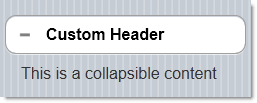

<!--
|metadata|
{
    "fileName": "collapsible-adding",
    "controlName": "Collapsible",
    "tags": ["Layouts","MVC"]
}
|metadata|
-->

# Adding Collapsible

This procedure demonstrates adding the `Collapsible` widget to a View page in an MVC solution using the MVC wrappers.

The sample code illustrating the procedure configures the `Collapsible` ASP.NET MVC wrapper with a header named Custom Header and collapsible content saying This is a collapsible content.

The following screenshot shows the `Collapsible` widget added to the page as a result of performing the procedure.



## Prerequisites

To complete the procedure, you need the following:

-   An MVC Mobile application
-   A reference to the *Infragistics.Web.Mvc.Mobile.dll*
-   A reference to the Infragistics Mobile loader
-   References to the needed resources for the MVC reassurance wrappers

In the following sample code, all of the JavaScript and CSS files are located under a virtual directory named *ig_mobileui*. In order to complete this step, this folder should be renamed according to the correct JavaScript and CSS location on your machine.

**In Razor:**
```csharp
@using Infragistics.Web.Mvc.Mobile

<script src="http://code.jquery.com/jquery.min.js"></script>

<script src="http://code.jquery.com/mobile/1.1.1/jquery.mobile.min.js"></script>
<script type="text/javascript" src="http://localhost/ig_mobileui/js/infragistics.mobile.loader.js"></script>
@(Html.InfragisticsMobile().
    Loader().
    ScriptPath("http://localhost/ig_mobileui/js/").
    CssPath("http://localhost/ig_mobileui/css/").
    Render())
```


## Overview

Following is a conceptual overview of the process:

1. Adding the `Collapsible` wrapper to the View page ​
2. (Optional) Verifying the result

## Steps

The following steps demonstrate the procedure of adding the `Collapsible`.

1. Add the `Collapsible` ASP.NET MVC wrapper to the View page.

	Add an instance of the `Collapsible` widget together with its configuration settings.
	
	For this example, the `Collapsible` is configured with the [`HeaderText`](Infragistics.Web.Mvc.Mobile~Infragistics.Web.Mvc.Mobile.CollapsibleModel~HeaderText.html) property set to “Custom Header” and with collapsible content saying "This is a collapsible content".
	
	**In Razor:**
	
	```csharp
	@(
	    Html.InfragisticsMobile()
	    .Collapsible()
	    .HeaderText("Custom Header")
	    .BeginRender()
	)
	    This is a collapsible content
	@(
	    Html.InfragisticsMobile()
	    .Collapsible()
	    .EndRender()
	)
	```

2. (Optional) Verify the result.

	To verify the result, save the View and then, re-build and run the application.


## <a id="related-content"></a> Related Content

### <a id="topics"></a> Topics

The following topics provide additional information related to this topic.

- [Configuring the *Collapsible*](Collapsible-Configuring.html): This topic explains how to configure the `Collapsible` widget.

- [*Collapsible* Property Reference](Collapsible-Property-Reference.html): This topic provides reference information about the properties of `Collapsible` widget.


### <a id="samples"></a> Samples

The following samples provide additional information related to this topic.

- [Basic Usage](%%SamplesUrl%%/mobile-collapsible/basic-usage): This is a basic sample showing the ASP.NET MVC helper for the jQuery Mobile collapsible widget.


 

 


