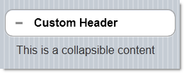
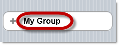
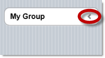
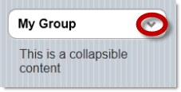

<!--
|metadata|
{
    "fileName": "collapsible-configuring",
    "controlName": "Collapsible",
    "tags": ["How Do I"]
}
|metadata|
-->

# Configuring Collapsible

## Topic Overview

### Purpose

This topic explains how to configure the `Collapsible`™ ASP.NET MVC wrapper.

### Required background

The following topics are prerequisites to understanding this topic:

- [*Collapsible* Overview](Collapsible-Overview.html): This topic provides an overview of the `Collapsible` widget and its features.

- [Adding the *Collapsible*](Collapsible-Adding.html): This topic explains, with code examples, how to enable the `Collapsible` widget using its Infragistics® Model-View-Controller (MVC) wrappers.


### In this topic

This topic contains the following sections:

-   [Collapsible Configuration Summary](#summary)
-   [Changing the Default State of the Collapsible](#default-state)
-   [Configuring the Text of the Header](#header-text)
-   [Configuring the State Icon](#state-icon)
-   [Related Content](#related-content)


## <a id="summary"></a> Collapsible Configuration Summary

The following table lists the configurable aspects of the collapsible MVC wrapper:

Configurable aspect | Details | Properties
--------------------|---------|-----------
[The default state of the *Collapsible*](#default-state) | The logical state of the `Collapsible` (Expanded/Collapsed) is managed by the [`Collapsed`](Infragistics.Web.Mvc.Mobile~Infragistics.Web.Mvc.Mobile.CollapsibleModel~ExpandCueText.html) property. Setting this property upon the widget’s initialization effectively changes the widget’s default state. | [Collapsed](Infragistics.Web.Mvc.Mobile~Infragistics.Web.Mvc.Mobile.CollapsibleModel~ExpandCueText.html)
[The text of the header](#header-text) | The text of the header can be changed using the [`HeaderText`](Infragistics.Web.Mvc.Mobile~Infragistics.Web.Mvc.Mobile.CollapsibleModel~HeaderText.html) property. | [HeaderText](Infragistics.Web.Mvc.Mobile~Infragistics.Web.Mvc.Mobile.CollapsibleModel~HeaderText.html)
[The state icon](#state-icon) | The logical state icon of the `Collapsible` can be configured in the following aspects: position and picture. Each of these aspects is managed by a dedicated property. | [IconPosition](Infragistics.Web.Mvc.Mobile~Infragistics.Web.Mvc.Mobile.CollapsibleModel~IconPosition.html) <br /> [ExpandedIcon](Infragistics.Web.Mvc.Mobile~Infragistics.Web.Mvc.Mobile.CollapsibleModel~ExpandedIcon.html) <br /> [CollapsedIcon](Infragistics.Web.Mvc.Mobile~Infragistics.Web.Mvc.Mobile.CollapsibleModel~CollapsedIcon.html)


## <a id="default-state"></a> Changing the Default State of the Collapsible

The logical state of the `Collapsible` (Expanded/Collapsed) is managed by the [`Collapsed`](Infragistics.Web.Mvc.Mobile~Infragistics.Web.Mvc.Mobile.CollapsibleModel~ExpandCueText.html) property. Setting this property upon the widget’s initialization effectively changes the widget’s default state.

By default, the `Collapsible` is initialized in Collapsed state (the [`Collapsed`](Infragistics.Web.Mvc.Mobile~Infragistics.Web.Mvc.Mobile.CollapsibleModel~ExpandCueText.html) property is true).

### Property settings

The following table maps the desired configuration to initialize the collapsible in true state.

In order to: | Use this property: | And set it to:
---|---|---
Set the `Collapsible` state | [Collapsed](Infragistics.Web.Mvc.Mobile~Infragistics.Web.Mvc.Mobile.CollapsibleModel~ExpandCueText.html) | *true* or *false*

### Code example

The code below demonstrates how to change the default state of the `Collapsible` by initializing it with the [`Collapsed`](Infragistics.Web.Mvc.Mobile~Infragistics.Web.Mvc.Mobile.CollapsibleModel~ExpandCueText.html) property set to *false*:



**In Razor:**

```csharp
@(
    Html.InfragisticsMobile()
    .Collapsible()
    .HeaderText("Custom Header")
    .Collapsed(false)
    .BeginRender()
)
    This is a collapsible content
@(
    Html.InfragisticsMobile()
    .Collapsible()
    .EndRender()
)
```


## <a id="header-text"></a> Configuring the Text of the Header

The text of the header is configured using the [`HeaderText`](Infragistics.Web.Mvc.Mobile~Infragistics.Web.Mvc.Mobile.CollapsibleModel~HeaderText.html) properties.

### Property settings

The following table maps the desired configurations to the property settings that manage them.

In order to: | Use this property: | And set it to:
---|---|---
Set the header text | [HeaderText](Infragistics.Web.Mvc.Mobile~Infragistics.Web.Mvc.Mobile.CollapsibleModel~HeaderText.html) | The desired text string

### Code example

The code below demonstrates how to change the default header text of the Collapsible to “My Group” by setting the [`HeaderText`](Infragistics.Web.Mvc.Mobile~Infragistics.Web.Mvc.Mobile.CollapsibleModel~HeaderText.html) property.



**In Razor:**

```csharp
@(
    Html.InfragisticsMobile()
    .Collapsible()
    .HeaderText("My Group")
    .BeginRender()
)
    This is a collapsible content
@(
    Html.InfragisticsMobile()
    .Collapsible()
    .EndRender()
)
```


## <a id="state-icon"></a> Configuring the State Icon

The icon of the `Collapsible` can be configured in the following aspects:

-   **position** – position of the icon on the header
-   **picture** – the pictures of the icon for indicating the Expanded and Collapsed states

Each of these aspects is managed by a dedicated property.

### Property settings

The following table maps the desired configurations to the property
settings that manage them.

<table class="table table-striped">
	<thead>
		<tr>
            <th> In order to: </th>
            <th> Use this property: </th>
            <th> And set it to: </th>
        </tr>
	</thead>
	<tbody>
        <tr>
            <td>
Set the position of the icon
			</td>
            <td>
[IconPosition](Infragistics.Web.Mvc.Mobile~Infragistics.Web.Mvc.Mobile.CollapsibleModel~IconPosition.html)
			</td>
            <td>
                One of the following:
                <ul>
                    <li> Left </li>
                    <li> Right </li>
                    <li> Top </li>
                    <li> Bottom	</li>
                </ul>
            </td>
        </tr>
        <tr>
            <td>
Change the icon picture for the Collapsed state
			</td>
            <td>
[CollapsedIcon](Infragistics.Web.Mvc.Mobile~Infragistics.Web.Mvc.Mobile.CollapsibleModel~CollapsedIcon.html)
			</td>
            <td>
The desired image. (Could be one of the images in [the icon set](http://jquerymobile.com/test/docs/buttons/buttons-icons.html).)
			</td>
        </tr>
        <tr>
            <td>
Change the icon picture for the Expanded state
			</td>
            <td>
[ExpandedIcon](Infragistics.Web.Mvc.Mobile~Infragistics.Web.Mvc.Mobile.CollapsibleModel~ExpandedIcon.html)
			</td>
            <td>
The desired image. (Could be one of the images in [the icon set](http://jquerymobile.com/test/docs/buttons/buttons-icons.html).)
			</td>
        </tr>
    </tbody>
</table>


### Code example

The code snippets below demonstrate how to set the collapsible icon on the right and change both expanded and collapsed icons to arrow-down and arrow-left.

Collapsed and Expanded icon

> The [`CollapsedIcon`](Infragistics.Web.Mvc.Mobile~Infragistics.Web.Mvc.Mobile.CollapsibleModel~CollapsedIcon.html)/[`ExpandedIcon`](Infragistics.Web.Mvc.Mobile~Infragistics.Web.Mvc.Mobile.CollapsibleModel~ExpandedIcon.html) properties require jQuery Mobile 1.2 or higher.



**In Razor:**

```csharp
@(
    Html.InfragisticsMobile()
    .Collapsible()
    .HeaderText("My Group")
    .IconPosition("right")
    .CollapsedIcon("arrow-l")
    .ExpandedIcon("arrow-d")
    .BeginRender()
)
    This is a collapsible content
@(
    Html.InfragisticsMobile()
    .Collapsible()
    .EndRender()
)
@(
    Html.InfragisticsMobile()
    .Collapsible()
    .HeaderText("My Group")
    .IconPosition("right")
    .CollapsedIcon("arrow-l")
    .ExpandedIcon("arrow-d")
    .BeginRender()
)
    This is a collapsible content
@(
    Html.InfragisticsMobile()
    .Collapsible()
    .EndRender()
)
```



**In Razor:**

```csharp
@(
    Html.InfragisticsMobile()
    .Collapsible()
    .HeaderText("My Group")
    .IconPosition("right")
    .CollapsedIcon("arrow-l")
    .ExpandedIcon("arrow-d")
    .BeginRender()
)
    This is a collapsible content
@(
    Html.InfragisticsMobile()
    .Collapsible()
    .EndRender()
)
@(
    Html.InfragisticsMobile()
    .Collapsible()
    .HeaderText("My Group")
    .IconPosition("right")
    .CollapsedIcon("arrow-l")
    .ExpandedIcon("arrow-d")
    .BeginRender()
)
    This is a collapsible content
@(
    Html.InfragisticsMobile()
    .Collapsible()
    .EndRender()
)
```


## <a id="related-content"></a> Related Content

### <a id="topics"></a> Topics

The following topics provide additional information related to this topic.

- [*Collapsible* Property Reference](Collapsible-Property-Reference.html): This topic provides reference information about the properties of `Collapsible` widget.


### <a id="samples"></a> Samples

The following samples provide additional information related to this topic.

- [Basic Usage](%%SamplesUrl%%/mobile-collapsible/basic-usage): This is a basic sample showing the ASP.NET MVC helper for the jQuery Mobile collapsible widget.


 

 


