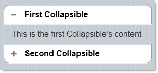

<!--
|metadata|
{
    "fileName": "collapsibleset-adding",
    "controlName": "CollapsibleSet",
    "tags": ["Layouts","MVC"]
}
|metadata|
-->

# Adding CollapsibleSet


## Topic Overview

### Purpose

This topic explains, with code examples, how to enable the `CollapsibleSet`™ widget using its Infragistics® MVC wrappers.

### Required background

The following topics are prerequisites to understanding this topic:

- [CollapsibleSet](CollapsibleSet-Overview.html) [Overview](CollapsibleSet-Overview.html): This topic provides an overview of the `CollapsibleSet` widget and its features.


### In this topic

This topic contains the following sections:

-   [**Adding the CollapsibleSet**](#adding)
    -   [Preview](#preview)
    -   [Prerequisites](#prerequisites)
    -   [Overview](#overview)
    -   [Steps](#steps)
-   [**Related Content**](#related-content)
    -   [Topics](#topics)
    -   [Samples](#samples)


## <a id="adding"></a> Adding the CollapsibleSet

This procedure demonstrates adding the `CollapsibleSet` widget to a View page in an MVC solution using the MVC wrappers. You need to add a reference to the *Infragistics.Web.Mvc.Mobile.dll*, as well as a reference to the Infragistics Mobile loader.

The sample code illustrating the procedure configures the `CollapsibleSet` to be with two collapsible controls. The controls have headers saying First Collapsible and Second `Collapsible` and following collapsible texts saying This is the first `Collapsible`’s content and This is the second `Collapsible`’s content.

### <a id="preview"></a> Preview 

The following screenshot shows the Collapsible Set widget added to the page as a result of performing the procedure.



### <a id="prerequisites"></a> Prerequisites 

To complete the procedure, you need the following:

-   An MVC Mobile application
-   A reference to the *Infragistics.Web.Mvc.Mobile.dll*
-   A reference to the Infragistics Mobile loader
-   References to the needed resources for the MVC reassurance wrappers

In the following sample code, all of the JavaScrip and CSS files are located under a virtual directory named *ig_mobileui*. In order to complete this step, this folder should be renamed according to the correct JavaScript and CSS location on your machine.

**In Razor:**

```csharp
@using Infragistics.Web.Mvc.Mobile
<script src="http://code.jquery.com/jquery.min.js"></script>
<script src="http://code.jquery.com/mobile/1.1.1/jquery.mobile.min.js"></script>
<script type="text/javascript" src="http://localhost/ig_mobileui/js/infragistics.mobile.loader.js"></script>
@(Html.InfragisticsMobile().
    Loader().
    ScriptPath("http://localhost/ig_mobileui/js/").
    CssPath("http://localhost/ig_mobileui/css/").
    Render())
```

### <a id="overview"></a> Overview 

Following is a conceptual overview of the process:

​1. Adding the `CollapsibleSet` to the View page

​2. (Optional) Verifying the result

### <a id="steps"></a> Steps

The following steps demonstrate the procedure of adding the `CollapsibleSet`.

1. Add the `CollapsibleSet` to the View page.

	Add an instance of the `CollapsibleSet` widget together with its configuration settings.
	
	For this example, the `CollapsibleSet` is configured with two collapsible controls with header text - “First Collapsible” and “Second Collapsible” and with collapsible content - “This is the first Collapsible’s content” and “This is the second `Collapsible`’s content”, respectively.
	
	**In Razor:**
	
	```csharp
	@(
	 Html.InfragisticsMobile()
	    .CollapsibleSet()
	    .BeginRender()
	)
	@(
	    Html.InfragisticsMobile()
	    .Collapsible()
	    .HeaderText("First Collapsible")
	    .BeginRender()
	)
	    This is the first Collapsible’s content
	@(
	    Html.InfragisticsMobile()
	    .Collapsible()
	    .EndRender()
	)
	@(
	    Html.InfragisticsMobile()
	    .Collapsible()
	    .HeaderText("Second Collapsible")
	    .BeginRender()
	)
	    This is the second Collapsible’s content
	@(
	    Html.InfragisticsMobile()
	    .Collapsible()
	    .EndRender()
	)
	@(
	    Html.InfragisticsMobile()
	    .CollapsibleSet()
	    .EndRender()
	)
	```

2. (Optional) Verify the result.

	To verify the result, save the View and then re-build and run the application.


## <a id="related-content"></a> Related Content

### <a id="topics"></a> Topics

The following topics provide additional information related to this topic:

- [Configuring the *CollapsibleSet*](CollapsibleSet-Configuring.html): This topic explains how to configure the `CollapsibleSet` widget.

- [CollapsibleSet](CollapsibleSet-Property-Reference.html) [Property Reference](CollapsibleSet-Property-Reference.html): This topic provides reference information about the properties of `CollapsibleSet` widget.


### <a id="samples"></a> Samples

The following samples provide additional information related to this topic:

- [Basic Usage](%%SamplesUrl%%/mobile-collapsible-set/basic-usage): This sample demonstrates how the `CollapsibleSet` ASP.NET MVC helper is used as a food order form. All the Collapsible controls are grouped into a collapsible set and only one collapsible set is expanded at a time. If one collapsible set is expanded, the previous set is collapsed.


 

 


