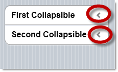

<!--
|metadata|
{
    "fileName": "collapsibleset-configuring",
    "controlName": "CollapsibleSet",
    "tags": ["How Do I","Layouts","MVC"]
}
|metadata|
-->

# Configuring CollapsibleSet

## Topic Overview

### Purpose

This topic explains how to configure the `CollapsibleSet`™ MVC wrapper.

### Required background

The following topics are prerequisites to understanding this topic:

- [CollapsibleSet](CollapsibleSet-Overview.html) [Overview](CollapsibleSet-Overview.html): This topic provides an overview of the `CollapsibleSet` widget and its features.

- [Adding the *CollapsibleSet*](CollapsibleSet-Adding.html): This topic explains, with code examples, how to enable the Collapsible widget using its Infragistics® Model-View-Controller (MVC) wrappers.


### In this topic

This topic contains the following sections:

-   [**CollapsibleSet Configuration Summary**](#summary )
-   [**Configuring the State Icon**](#state-icon)
    -   [Property settings](#property-settings)
    -   [Code example](#example)
-   [**Related Content**](#related-content)
    -   [Topics](#topics)
    -   [Samples](#samples)


## <a id="summary"></a> Collapsible Configuration Summary

The following table lists the configurable aspects of the collapsible MVC wrapper.

Configurable aspect | Details | Properties
--------------------|---------|-----------
[The state icon](#state-icon) | The logical state icon of the `CollapsibleSet` can be configured in the following aspects: position and picture. Each of these aspects is managed by a dedicated property. | <ul><li>[IconPosition](Infragistics.Web.Mvc.Mobile~Infragistics.Web.Mvc.Mobile.CollapsibleSetModel~IconPosition.html)</li><li>[ExpandedIcon](Infragistics.Web.Mvc.Mobile~Infragistics.Web.Mvc.Mobile.CollapsibleSetModel~ExpandedIcon.html)</li><li>[CollapsedIcon](Infragistics.Web.Mvc.Mobile~Infragistics.Web.Mvc.Mobile.CollapsibleSetModel~CollapsedIcon.html)</li></ul>


## <a id="state-icon"></a> Configuring the State Icon
The icon of the `CollapsibleSet` can be configured in the following aspects:

-   **position** – position of the icon on the header
-   **type** – the pictures of the icon for indicating the Expanded and Collapsed states

Each of these aspects is managed by a dedicated property.

### <a id="property-settings"></a> Property settings

The following table maps the desired configurations to the property settings that manage them.

In order to: | Use this property: | And set it to: 
-------------|--------------------|-----------
Set the position of the icon | [IconPosition](Infragistics.Web.Mvc.Mobile~Infragistics.Web.Mvc.Mobile.CollapsibleSetModel~IconPosition.html) | One of the following: <br /> <ul><li> Left </li><li> Right </li><li> Top </li><li> Bottom </li></ul>
Change the icon picture for the Collapsed state | [CollapsedIcon](Infragistics.Web.Mvc.Mobile~Infragistics.Web.Mvc.Mobile.CollapsibleSetModel~CollapsedIcon.html) | The desired image. (Could be one of the images in [the icon set](http://jquerymobile.com/test/docs/buttons/buttons-icons.html).)
Change the icon picture for the Expanded state | [ExpandedIcon](Infragistics.Web.Mvc.Mobile~Infragistics.Web.Mvc.Mobile.CollapsibleSetModel~ExpandedIcon.html) | The desired image. (Could be one of the images in [the icon set](http://jquerymobile.com/test/docs/buttons/buttons-icons.html).)

### <a id="example"></a> Code example

The code snippets below demonstrate how to set the `CollapsibleSet` icon on the right and change both expanded and collapsed icons as it follows arrow-down and arrow left.

> **Collapsed and Expanded icon**
>
> The [`CollapsedIcon`](Infragistics.Web.Mvc.Mobile~Infragistics.Web.Mvc.Mobile.CollapsibleSetModel~CollapsedIcon.html)/[`ExpandedIcon`](Infragistics.Web.Mvc.Mobile~Infragistics.Web.Mvc.Mobile.CollapsibleSetModel~ExpandedIcon.html) properties require jQuery Mobile 1.2 or higher.




**In Razor:**

```csharp
@(
 Html.InfragisticsMobile()
    .CollapsibleSet()
    .IconPosition(IconPositions.Right)
    .ExpandedIcon(DefaultIcons.DownArrow)
    .CollapsedIcon(DefaultIcons.LeftArrow)
    .BeginRender()
)
@(
    Html.InfragisticsMobile()
    .Collapsible()
    .HeaderText("First Collapsible")
    .BeginRender()
)
    This is the first content
@(
    Html.InfragisticsMobile()
    .Collapsible()
    .EndRender()
)
@(
    Html.InfragisticsMobile()
    .Collapsible()
    .HeaderText("Second Collapsible")
    .BeginRender()
)
    This is the second content
@(
    Html.InfragisticsMobile()
    .Collapsible()
    .EndRender()
)
@(
    Html.InfragisticsMobile()
    .CollapsibleSet()
    .EndRender()
)
@(
 Html.InfragisticsMobile()
    .CollapsibleSet()
    .IconPosition(IconPositions.Right)
    .ExpandedIcon(DefaultIcons.DownArrow)
    .CollapsedIcon(DefaultIcons.LeftArrow)
    .BeginRender()
)
@(
    Html.InfragisticsMobile()
    .Collapsible()
    .HeaderText("First Collapsible")
    .BeginRender()
)
    This is the first content
@(
    Html.InfragisticsMobile()
    .Collapsible()
    .EndRender()
)
@(
    Html.InfragisticsMobile()
    .Collapsible()
    .HeaderText("Second Collapsible")
    .BeginRender()
)
    This is the second content
@(
    Html.InfragisticsMobile()
    .Collapsible()
    .EndRender()
)
@(
    Html.InfragisticsMobile()
    .CollapsibleSet()
    .EndRender()
)
```


**In Razor:**

```csharp
@(
 Html.InfragisticsMobile()
    .CollapsibleSet()
    .IconPosition(IconPositions.Right)
    .ExpandedIcon(DefaultIcons.DownArrow)
    .CollapsedIcon(DefaultIcons.LeftArrow)
    .BeginRender()
)
@(
    Html.InfragisticsMobile()
    .Collapsible()
    .HeaderText("First Collapsible")
    .BeginRender()
)
    This is the first content
@(
    Html.InfragisticsMobile()
    .Collapsible()
    .EndRender()
)
@(
    Html.InfragisticsMobile()
    .Collapsible()
    .HeaderText("Second Collapsible")
    .BeginRender()
)
    This is the second content
@(
    Html.InfragisticsMobile()
    .Collapsible()
    .EndRender()
)
@(
    Html.InfragisticsMobile()
    .CollapsibleSet()
    .EndRender()
)
@(
 Html.InfragisticsMobile()
    .CollapsibleSet()
    .IconPosition(IconPositions.Right)
    .ExpandedIcon(DefaultIcons.DownArrow)
    .CollapsedIcon(DefaultIcons.LeftArrow)
    .BeginRender()
)
@(
    Html.InfragisticsMobile()
    .Collapsible()
    .HeaderText("First Collapsible")
    .BeginRender()
)
    This is the first content
@(
    Html.InfragisticsMobile()
    .Collapsible()
    .EndRender()
)
@(
    Html.InfragisticsMobile()
    .Collapsible()
    .HeaderText("Second Collapsible")
    .BeginRender()
)
    This is the second content
@(
    Html.InfragisticsMobile()
    .Collapsible()
    .EndRender()
)
@(
    Html.InfragisticsMobile()
    .CollapsibleSet()
    .EndRender()
)
```


## <a id="related-content"></a> Related Content

### <a id="topics"></a> Topics

The following topics provide additional information related to this topic:

- [CollapsibleSet](CollapsibleSet-Property-Reference.html) [Property Reference](CollapsibleSet-Property-Reference.html): This topic provides reference information about the properties of `CollapsibleSet` widget.


### <a id="samples"></a> Samples

The following samples provide additional information related to this topic:

- [Basic Usage](%%SamplesUrl%%/mobile-collapsible-set/basic-usage): This sample demonstrates how the `CollapsibleSet` ASP.NET MVC helper is used as a food order form. All the Collapsible controls are grouped into a collapsible set and only one collapsible set is expanded at a time. If one collapsible set is expanded, the previous set is collapsed.


 

 


