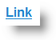

<!--
|metadata|
{
    "fileName": "link-overview",
    "controlName": "Link",
    "tags": ["Getting Started","MVC","Navigation"]
}
|metadata|
-->

# Link Overview

## Topic Overview

### Purpose

This topic introduces MVC `Link` control wrapper and its main functionalities.

### In this topic

This topic contains the following sections:

-   [**Introduction**](#introduction)
-   [**Link MVC Wrapper Main Features Summary**](#summary)
-   [**Link MVC Wrapper Features**](#features)
	-   [Text](#text)
    -   [Reference resource](#reference-resource)
    -   [Target](#target)
    -   [Relationship](#relationship)
    -   [Cache](#cache)
    -   [Prefetch referenced document](#prefetch)
    -   [Transition Animation](#animation)
    -   [Button-like Appearance](#button)
    -   [Theme](#theme)
    -   [Attributes](#attributes)
-   [**Related Content**](#related-content)
    -   [Topics](#topics)
    -   [Samples](#samples)

##  Introduction

The `Link` MVC wrapper is used to render a HTML reference. It has several additional methods that allow configuring the `Link` and customizing it.

##  Link MVC Wrapper Main Features Summary

The following table summarizes the main features of the `Link` MVC wrapper. For more detailed information about any individual method, please review the [*Link* Property Reference](Link-Property-Reference.html) topic.

Feature | Description
---|---
Text | [Text](Infragistics.Web.Mvc.Mobile~Infragistics.Web.Mvc.Mobile.LinkWrapper~Text.html) property allows you to set and get the text of the control.
Reference resource | The Link MVC API allows you to reference the resource you want to load.
Target | Set the target window that will be the container of the referenced resource.
Relationship | Define the document relationship between the current document and the referenced one.
Cache | Ability to enable or disable the caching of the referenced page in the DOM.
Prefetch referenced document | Prefetch referenced resource, in order to load it faster when it is requested. You can use AJAX to prefetch the document behind the scenes.
Transition Animation | Set animation type when transitioning to the referenced document.
Button-like Appearance | You can transform the Link to a Button and use its methods to customize it.
Theme | Link accepts the standard jQuery Mobile Themes.
Attributes | The MVC Link wrapper has a method that accepts a list of HTML attributes that will be rendered on the client.

##  Link MVC Wrapper Features

###  Text

[`Text`](Infragistics.Web.Mvc.Mobile~Infragistics.Web.Mvc.Mobile.LinkWrapper~Text.html) property allows you to set and get the text of the control.

###  Reference resource

The `Link` MVC API allows you to reference the resource you want to load. When Link [`NavigateUrl`](Infragistics.Web.Mvc.Mobile~Infragistics.Web.Mvc.Mobile.LinkWrapper~NavigateUrl.html) method is used to reference the resource, then on the client this will be rendered as the value of the HTML href attribute of the anchor tag.

###  Target

Set the target window that will be the container of the referenced resource. When the Link Target method is used to set the container, then on the client this will be rendered as the value of the HTML target attribute of the anchor tag.

###  Relationship

You can define the document relationship between the current document and the referenced one. When [`DestinationRelationship`](Infragistics.Web.Mvc.Mobile~Infragistics.Web.Mvc.Mobile.LinkWrapper~DestinationRelationship.html) method is used to define document relationship, then on the client this will be rendered as the value of the HTML data-rel attribute of the anchor tag.

###  Cache

This is the ability to enable or disable the caching of the referenced page in the DOM. When the `Link` [`DomCache`](Infragistics.Web.Mvc.Mobile~Infragistics.Web.Mvc.Mobile.LinkWrapper~DomCache.html) method is used to enable or disable page caching, then on the client this will be rendered as the value of the HTML data-dom-cache attribute of the anchor tag.

###  Prefetch referenced document

You should [`Prefetch`](Infragistics.Web.Mvc.Mobile~Infragistics.Web.Mvc.Mobile.LinkWrapper~Prefetch.html) referenced resource, in order to load it faster when it is requested. You can use AJAX to prefetch the document behind the scenes. When the `Link` Prefetch method is used to enable or disable page prefetching, then on the client this will be rendered as the value of the HTML data-prefetch attribute of the anchor tag. If AJAX is used, then the same behavior will occur with the `Link` Ajax methods that will render the value for the attribute data-ajax.

###  Transition Animation

You can set the animation type when transitioning to the referenced document. When the `Link` Transition method is used to set page transition animation, the client will render the value of the HTML data-transition attribute of the anchor tag. It is the same with the `Link` [`ReverseDirection`](Infragistics.Web.Mvc.Mobile~Infragistics.Web.Mvc.Mobile.LinkWrapper~ReverseDirection.html) methods that will render the attribute data-direction with value of reverse.

###  Button-like Appearance

You can transform the `Link` to a Button and use the Button methods to customize it. For more information about the Button MVC methods, review the [Button](Button.html) topics.

###  Theme

`Link` accepts the standard [jQuery Mobile Themes](http://jquerymobile.com/demos/1.1.1/docs/api/themes.html), but the theme can be applied only when the control has a button-like appearance. By default, MVC wrappers render controls with the default jQuery mobile form, which is “c”. The following picture shows you button customized with theme “e”:

###  Attributes

The MVC `Link` wrapper has a method that accepts a list of HTML attributes that will be rendered on the client.

##  Related Content

###  Topics

The following topics provide additional information related to this topic:

- [Adding *Link*](Adding-Link.html): This topic contains the information needed to enable the `Link` using the Infragistics MVC Wrappers.

- [Configuring *Link*](Configuring-Link.html): This topic contains the information and references needed to configure the `Link` using the MVC wrapper.

- [*Link* Property Reference](Link-Property-Reference.html): This topic provides reference information about the properties of the `Link` MVC Wrapper.

###  Samples

The following samples provide additional information related to this topic:

- [Basic Usage](%%SamplesUrl%%/mobile-link/basic-usage): This sample demonstrates various usages of the `Link` ASP.NET MVC helper.

 

 

