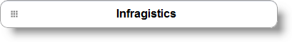

<!--
|metadata|
{
    "fileName": "configuring-link",
    "controlName": "Link",
    "tags": ["How Do I","MVC","Navigation"]
}
|metadata|
-->

# Configuring Link

## Topic Overview

### Purpose

This topic contains the information and references needed to configure the `Link` using the MVC wrapper.

### Required background

The following topics are prerequisites to understanding this topic:

Topic

Purpose

[*Link* Overview](Link-Overview.html)

This topic introduces the MVC `Link` control wrapper and its main functionalities.


#### In this topic

This topic contains the following sections:

-   [**Control Configuring Summary**](#summary)
-   [**Button-like Link**](#button) 
    -   [Property Settings](#button-property-settings)
    -   [Code Example](#button-example)
-   [**Related Content**](#related-content)
    -   [Topics](#topics)
    -   [Samples](#samples)


## <a id="summary"></a> Control Configuration Summary

The following table lists the configurable aspects of the `Link` MVC wrapper:

<table class="table">
	<thead>
		<tr>
            <th>
Configurable aspects
			</th>
            <th>
Details
			</th>
            <th>
Properties
			</th>
        </tr>
	</thead>
	<tbody>
        <tr>
            <td>
Button-like `Link`
			</td>
            <td>
Here you can find a list of all the properties that can be used to disguise the `Link` to look like a Button.
			</td>
            <td>
                <ul>
                    <li>
[RenderMode](Infragistics.Web.Mvc.Mobile~Infragistics.Web.Mvc.Mobile.LinkWrapper~RenderMode.html)
					</li>
                    <li>
[Icon](Infragistics.Web.Mvc.Mobile~Infragistics.Web.Mvc.Mobile.LinkWrapper~Icon.html)
					</li>
                    <li>
[Shadow](Infragistics.Web.Mvc.Mobile~Infragistics.Web.Mvc.Mobile.LinkWrapper~Shadow.html)
					</li>
                </ul>
            </td>
        </tr>
    </tbody>
</table>


## <a id="button"></a> Button-like *Link* 

This scenario will help you to transform the basic `Link` to a more user-friendly button-like `Link`.



### <a id="button-property-settings"></a> Property settings 

The following table maps the desired configuration to transform the `Link` to a Button:

In order to: | Use this property: | And set it to:
---|---|---
Render Link as Button | [RenderMode](Infragistics.Web.Mvc.Mobile~Infragistics.Web.Mvc.Mobile.LinkWrapper~RenderMode.html) | [LinkRenderMode.Button](Infragistics.Web.Mvc.Mobile~Infragistics.Web.Mvc.Mobile.LinkRenderMode.html)
Set grid as a `Link` Icon | [Icon](Infragistics.Web.Mvc.Mobile~Infragistics.Web.Mvc.Mobile.LinkWrapper~Icon.html) | “grid”
Set `Link` shadows | [Shadow](Infragistics.Web.Mvc.Mobile~Infragistics.Web.Mvc.Mobile.LinkWrapper~Shadow.html) | true


### <a id="button-example"></a> Code Example 

**In Razor:**

```csharp
@(Html.InfragisticsMobile()
    .Link()
    .ID("lnk2")
    .Text("Infragistics")
    .NavigateUrl("http://www.infragistics.com")
    .Target("_blank")
    .RenderAsButton(true)
    .Icon(DefaultIcons.Grid)
    .Mini(true)
    .Shadow(true)
    .Render())
```


## <a id="related-content"></a> Related Content

### <a id="topics"></a> Topics

The following topics provide additional information related to this topic:

- [*Link* Overview](Link-Overview.html): This topic introduces MVC `Link` control wrapper and its main functionalities.

- [Adding *Link*](Adding-Link.html): This topic contains the information needed to enable the `Link` using the Infragistics MVC Wrappers.

- [*Link* Property Reference](Link-Property-Reference.html): This topic provides reference information about the properties of the `Link` MVC Wrapper.


### <a id="samples"></a> Samples

The following samples provide additional information related to this topic:

- [Basic Usage](%%SamplesUrl%%/mobile-link/basic-usage): This sample demonstrates various usages of the `Link` ASP.NET MVC helper.


 

 


