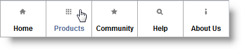

<!--
|metadata|
{
    "fileName": "adding-navbar",
    "controlName": "NavBar",
    "tags": ["How Do I","MVC","Navigation"]
}
|metadata|
-->

# Adding NavBar

## Topic Overview

### Purpose

This topic contains the information needed to enable the `NavBar` using the Infragistics MVC Wrappers.

### Required background

The following topics are prerequisites to understanding this topic:

- [*NavBar* Overview](NavBar-Overview.html): This topic contains information related to the `NavBar` MVC wrappers.

### In this topic

This topic contains the following sections:

-   [**Enabling the NavBar**](#enabling)
    -   [Prerequisites](#prerequisites)
    -   [Overview](#overview)
    -   [Steps](#steps)
-   [**Related Content**](#related-content)
    -   [Topics](#topics)
    -   [Samples](#samples)


## <a id="enabling"></a> Enabling *NavBar*

This procedure will guide you through how to add the `NavBar` in a view page in the MVC solution using the MVC Wrappers.

### Preview 

The following screenshot is a preview of the final result:



### <a id="prerequisites"></a> Prerequisites 

To complete the procedure, you need to do the following:

-   Create an MVC Mobile application
-   Add references to the needed resources for the MVC reassurance wrappers to the project

### <a id="overview"></a> Overview 

Following is a conceptual overview of the process:

1. Including resources in the view page
2. Adding `NavBar` to the view page
3. Verifying the result

### <a id="steps"></a> Steps

The following steps demonstrate how to add the `NavBar` in a view page in the MVC solution using the MVC Wrappers.

1. Include resources in the view page

	A reference to the *Infragistics.Web.Mvc.Mobile.dll* is needed as well as reference to the Infragistics Mobile loader. In the following example, all of the js and css files are located under virtual directory named `ig_mobileui`. In order to complete this step, this folder should be renamed according to the correct js and css location.
	
	**In Razor:**
	
	```csharp
	@using Infragistics.Web.Mvc.Mobile
	<script src="http://code.jquery.com/mobile/1.1.1/jquery.mobile.min.js"></script>
	<script src="http://code.jquery.com/mobile/1.1.1/jquery.mobile.min.js"></script>
	<script type="text/javascript" src="http://localhost/ig_mobileui/js/infragistics.mobile.loader.js"></script>
	@(Html.InfragisticsMobile().
	    Loader().
	    ScriptPath("http://localhost/ig_mobileui/js/").
	    CssPath("http://localhost/ig_mobileui/css/").
	    Render())
	```

2. Add the `NavBar` to the view page
	
	**In Razor:**
	
	```csharp
	@(
	    Html.InfragisticsMobile()
	    .NavBar()
	    .ID("nvbr1")
	    .Items(bar => {
	        bar.NavBarItem().Text(Resources.NavBar.Home).Icon(DefaultIcons.Home).Href("http://www.infragistics.com/").Theme("a");
	        bar.NavBarItem().Text(Resources.NavBar.Products).Icon(DefaultIcons.Grid).Href("http://www.infragistics.com/products").Theme("b");
	        bar.NavBarItem().Text(Resources.NavBar.Community).Icon(DefaultIcons.Star).Href("http://www.infragistics.com/community").Theme("c");
	        bar.NavBarItem().Text(Resources.NavBar.Help).Icon(DefaultIcons.Search).Href("http://www.infragistics.com/help").Theme("d");
	        bar.NavBarItem().Text(Resources.NavBar.AboutUs).Icon(DefaultIcons.Info).Href("http://www.infragistics.com/about-us").Theme("e");
	    })
	    .IconPosition(IconPositions.Top)
	    .Render()
	)
	```
	
	> **Note:** You cannot set icon position for individual `NavBar` items.

3. Verify the result

	Save the view, rebuild, and run the application to verify the result.


## <a id="related-content"></a> Related Content

### <a id="topics"></a> Topics

The following topics provide additional information related to this topic:

- [*NavBar* Overview](NavBar-Overview.html): This topic contains information related to the `NavBar` MVC wrappers.

- [Adding *NavBar*](Adding-NavBar.html): This topic contains the information needed to enable the `NavBar` using the Infragistics MVC Wrappers.

- [*NavBar* Property Reference](NavBar-Property-Reference.html): This topic provides reference information about the properties of the `NavBar` MVC Wrapper.


### <a id="samples"></a> Samples

The following samples provide additional information related to this topic:

- [Basic Usage](%%SamplesUrl%%/mobile-navbar/basic-usage): The `NavBar` ASP.NET MVC helper allows you to create navigation menus and customize them.

 


