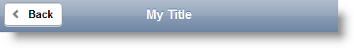

<!--
|metadata|
{
    "fileName": "page-configuring",
    "controlName": "Page",
    "tags": ["How Do I","Layouts","MVC"]
}
|metadata|
-->

# Page Configuring

## Topic Overview
### Purpose

This topic contains the information and references needed to configure the Page using the MVC wrapper.

### Required background
The following topics are prerequisites to understanding this topic:

- [Page Overview](Page-Overview.html): This topic contains information related to the Page MVC wrappers.


### In this topic

This topic contains the following sections:

-   [**Control Configuration Summary**](#control-config)
-   [**Add Page Buttons**](#add-page-buttons)
    -   [Overview](#overview)
    -   [Property settings](#property-settings)
    -   [Code Example](#code-example)
-   [**Cache Page**](#cache-page)
    -   [Property settings](#cache-page-settings)
    -   [Code Example](#cache-page-example)
-   [**Related Content**](#related-content)
    -   [Topics](#topics)
    -   [Samples](#samples)


## <a id="control-config"></a> Control Configuration Summary

The following table lists the configurable aspects of the Page MVC wrapper:

<table class="table table-striped">
	<thead>
		<tr>
            <th>
Configurable aspects
			</th>

            <th>
Details
			</th>

            <th>
Properties
			</th>
        </tr>
	</thead>
	<tbody>
        

        <tr>
            <td>
Add Page Buttons
			</td>

            <td>
Add and configure the Page back and close buttons.
			</td>

            <td>
                <ul>
                    <li>
[AddBackButton](Infragistics.Web.Mvc.Mobile~Infragistics.Web.Mvc.Mobile.PageModel~AddBackButton.html)
					</li>

                    <li>
[BackButtonText](Infragistics.Web.Mvc.Mobile~Infragistics.Web.Mvc.Mobile.PageModel~BackButtonText.html)
					</li>

                    <li>
[BackButtonTheme](Infragistics.Web.Mvc.Mobile~Infragistics.Web.Mvc.Mobile.PageModel~BackButtonTheme.html)
					</li>

                    <li>
[CloseButtonText](Infragistics.Web.Mvc.Mobile~Infragistics.Web.Mvc.Mobile.PageModel~CloseButtonText.html)
					</li>
                </ul>
            </td>
        </tr>

        <tr>
            <td>
Cache page
			</td>

            <td>
This sample will show you how to configure the Page wrapper so that the Page is cached in the browser DOM during transition between the pages.
			</td>

            <td>
                <ul>
                    <li>
[DomCache](Infragistics.Web.Mvc.Mobile~Infragistics.Web.Mvc.Mobile.PageModel~DomCache.html)
					</li>
                </ul>
            </td>
        </tr>
    </tbody>
</table>

## <a id="add-page-buttons"></a>Add Page Buttons
### <a id="overview"></a>Overview

You can add the Page Back button and configure the Close button. The following code and screenshot are the result of the MVC Page wrapper configuration below.

> **Note:** The Close button will show only when the page is opened in a dialog.

> **Note:** Defining page header is obligatory in order to display the back button inside it.

**In HTML:**

```html
<div data-add-back-btn="true" data-back-btn-text="Back" 
         data-back-btn-theme="c" data-close-btn-text="X" 
         data-role="page" id="Page1" data-url="Page1" >
     <div data-role="header"><h1>My Title</h1></div>
</div>
```



### <a id="property-settings"></a>Property settings

The following table maps the desired configuration to display the Add Button and configure the Close Button:

In order to: | Use this property: | And set it to:
---|---|---
Add the Back button | [AddBackButton](Infragistics.Web.Mvc.Mobile~Infragistics.Web.Mvc.Mobile.PageModel~AddBackButton.html) | `true`
Set the Back button text | [BackButtonText](Infragistics.Web.Mvc.Mobile~Infragistics.Web.Mvc.Mobile.PageModel~BackButtonText.html) | `Back`
Set the Back button theme | [BackButtonTheme](Infragistics.Web.Mvc.Mobile~Infragistics.Web.Mvc.Mobile.PageModel~BackButtonTheme.html) | `a`
Set the Close button Text | [CloseButtonText](Infragistics.Web.Mvc.Mobile~Infragistics.Web.Mvc.Mobile.PageModel~CloseButtonText.html) | `X`

### <a id="code-example"></a>Code Example

Use the following code to mark the start and end of the `Page` as well as to define some header. The header is obligatory in order to display the Back button:

**In Razor:**

```csharp
@(Html.InfragisticsMobile()
    .Page()
    .ID("pg1")
    .AddBackButton(true)
    .BackButtonText("Back")
    .BackButtonTheme("a")
    .CloseButtonText("X")
    .BeginRender())
        <div data-role="header"><h1>My Title</h1></div>
@(Html.InfragisticsMobile()
    .Page()
    .ID("pg1")
    .EndRender())
```


## <a id="cache-page"></a>Cache Page
When you navigate through multiple Pages placed in one View, jQuery mobile framework ensures that only one Page is available in the DOM and clears the page when it is replaced by new one. This avoids filling the browser memory. But if you want to ensure fast loading of a previously visited Page, you can enable DOM caching for a Page and keep the instance in the DOM.

The following HTML code is rendered in result of the code in the Code Example section:

**In HTML:**

```html
<div data-dom-cache="true" 
         data-role="page" id="Page1">
</div>
```

### <a id="cache-page-settings"></a>Property settings

The following table maps the desired configuration to enable caching of the Page in the browser:

In order to: | Use this property: | And set it to:
---|---|---
Add the Back button | [DomCache](Infragistics.Web.Mvc.Mobile~Infragistics.Web.Mvc.Mobile.PageModel~DomCache.html) | `true`


### <a id="cache-page-example"></a>Code Example

Use the following code to mark the start of the Page:

**In Razor:**

```csharp
@(Html.InfragisticsMobile()
    .Page()
    .ID("pg1")
    .DomeCache(true)
    .BeginRender())
```

When Page content is added, then close the Page wrapper definition.

**In Razor:**

```csharp
@(Html.InfragisticsMobile()
    .Page()
    .ID("pg1")
    .EndRender())
```


## <a id="related-content"></a>Related Content
### <a id="topics"></a>Topics

The following topics provide additional information related to this topic:

- [Page Overview](Page-Overview.html): This topic contains information related to the Page MVC wrappers.
- [Adding *Page*](Adding-Page.html): This topic contains the information needed to enable the Page using the Infragistics MVC Wrappers.
- [Page Property Reference](Page-Property-Reference.html): This topic provides reference information about the properties of the Page MVC Wrapper.

### <a id="samples"></a>Samples
The following samples provide additional information related to this topic:

- [Basic Usage](%%SamplesUrl%%/mobile-page/basic-usage): This sample demonstrates how to use the Page ASP.NET MVC helper to define the HTML DIV element with the data role of type Page.


 

 


