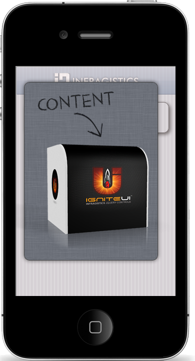

<!--
|metadata|
{
    "fileName": "popup-overview",
    "controlName": "Popup",
    "tags": ["Layouts","MVC"]
}
|metadata|
-->

# Popup Overview

## Topic Overview

### Purpose

This topic introduces to the `Popup` MVC wrapper.

### In this topic

This topic contains the following sections:

-   [**Introduction**](#introduction)
-   [**Popup MVC Wrapper Main Features Summary**](#summary)
-   [**Popup MVC Wrapper Features**](#features)
	-   [Positioning](#positioning)
    -   [Transition](#transition)
    -   [Theming and Styling](#theming-styling)
    -   [Attributes](#attributes)
-   [**Related Content**](#related-content)
    -   [Topics](#topics)
    -   [Samples](#samples)

##  Introduction

`Popup` is a widget that allows you to display HTML content in a popup window. The content can be any HTML content. You can use HTML anchors to easily open the popup and it has a set of features that can be used right out of the box.

##  Popup MVC Wrapper Main Features Summary

The following table summarizes the main features of the `Popup` MVC wrapper.

Feature | Description
---|---
Positioning | You can choose where the `Popup` should appear according to its parent window or relative element. You can define tolerance that will set minimum space to the relative element.
Transition | `Popup` can accept jQuery transition values to customize the behavior for when the `Popup` appears.
Theming and Styling | Set a general `Popup` theme as well as an overlay theme. You can define the shadow and corners for the `Popup`.
Attributes | The MVC `Popup` wrapper has a method that accepts a list of HTML attributes that will be rendered on the client.

##  Popup MVC Wrapper Features

###  Positioning

You can choose where the `Popup` should appear according to its parent window or relative element. The method [`PositionTo`](Infragistics.Web.Mvc.Mobile~Infragistics.Web.Mvc.Mobile.PopupWrapper~PositionTo.html) allows you to achieve this scenario, and it can accept one of the following values:

-   jQuery selector - pick the target element, for example: `$(“#targetElementID”)`. The `Popup` will be centered over that relative element.
-   “origin” - centers the `popup` over the link that opens it.
-   “window” - centers the `popup` in the window.

 

You can define tolerance that will set minimum space to the relative element. The method [`Tolerance`](Infragistics.Web.Mvc.Mobile~Infragistics.Web.Mvc.Mobile.PopupWrapper~Tolerance.html) allows you to achieve this result and it can accept one of the following:

-   Common tolerance – this will define common space from the top, right, bottom and left side of the `Popup`. Examples: Tolerance(100).
-   Top/Bottom and Right/Left tolerance – this allows you to define one common value for both top and bottom distance and another common value for both right and left space. Example: Tolerance(100, 150).
-   Individual Tolerance – allows you to define separate tolerance values for each of the `Popup` sides, starting from top and moving clockwise. Example: Tolerance(100, 150, 50, 150).

For more information about the jQuery *Popup* widget please follow the [*Popup* Property Reference](Popup-Property-Reference.html) topic.

###  Transition

`Popup` can accept jQuery transition values in order to customize the behavior for when the `Popup` appears. For more information of the possible values, please follow the [*Popup* Property Reference](Popup-Property-Reference.html) document.

###  Theming and Styling

Page accepts the standard [jQuery Mobile Themes](http://jquerymobile.com/demos/1.1.1/docs/api/themes.html). By default, the MVC wrappers render controls with the default jQuery mobile form, which is “c”. On the picture below you will see the `Popup` modified with theme “a”,overlay theme “e”, and with shadows enabled.

###  Attributes

The MVC Page wrapper has a method that accepts a list of HTML attributes that will be rendered on the client.

##  Related Content

###  Topics

The following topics provide additional information related to this topic:

- [Adding *Popup*](Adding-Popup.html): This topic contains the information needed in order to enable the `Popup` using the Infragistics MVC Wrapper.

- [Popup Property Reference](Popup-Property-Reference.html): This topic provides reference information about the properties of the `Popup` MVC Wrapper.

###  Samples

The following samples provide additional information related to this topic:

- [Basic Usage](%%SamplesUrl%%/mobile-popup/basic-usage): This sample demonstrates how to initialize the `Popup` ASP.NET MVC helper and how to open it on a button click. Note: `Popup` Mobile widget is introduced in jQuery Mobile, version 1.2.0.

 

 

