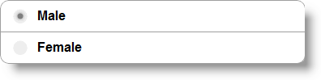
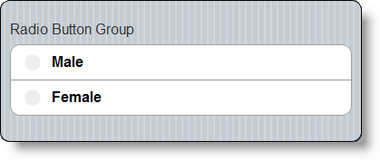
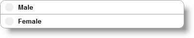
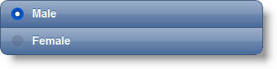

<!--
|metadata|
{
    "fileName": "radiobuttongroup-overview",
    "controlName": "RadioButtonGroup",
    "tags": ["Editing","MVC"]
}
|metadata|
-->

# RadioButtonGroup Overview

## Topic Overview
### Purpose

This topic contains information related to the `RadioButtonGroup` MVC wrappers.

### In this topic

This topic contains the following sections:

-   [**Introduction**](#introduction)
-   [**RadioButtonGroup MVC Wrapper Main Features Summary**](#main-features-summary)
-   [**RadioButtonGroup MVC Wrapper Features**](#features)
    -   [Text](#text)
    -   [Items](#items)
    -   [Horizontal](#horizontal)
    -   [Mini](#mini)
    -   [Theme](#theme)
    -   [Attributes](#attribures)
-   [**Related Content**](#related-content)
    -   [Topics](#topics)
    -   [Samples](#samples)

## Introduction

The `RadioButtonGroup` MVC wrapper renders a set of options but only allows you to select one of them. Similar to some other controls, the `RadioButtonGroup` MVC wrapper uses a standard HTML input element and then adds additional markup and functionality to support a touch environment. For example, rather than the normal vertical positioning of all the radio buttons, `RadioButtonGroup` MVC wrapper allows you to have horizontal list of buttons as well. You can also access dynamically any of the radio buttons using the jQuery Mobile [checkboxradio](http://jquerymobile.com/demos/1.1.1/docs/forms/radiobuttons/) widget.

## RadioButtonGroup MVC Wrapper Main Features Summary

The following table summarizes the main features of the `RadioButtonGroup` MVC wrapper.

Feature | Description
---|---
Text | [Text](Infragistics.Web.Mvc.Mobile~Infragistics.Web.Mvc.Mobile.RadioButtonGroupWrapper~Text.html) property allows you to set and get the text of the  control.
Items | This control allows you to define several individual radio button items. They inherit their parent’s behavior, but can also overwrite it.
Horizontal | This control can be configured to display the buttons in horizontal order.
Mini | The Radio Button can have two states – one normal and another that can make the control smaller.
Theme | `RadioButtonGroup` accepts the standard jQuery Mobile Themes, and applies it to all the child buttons.
Attributes | The MVC `RadioButtonGroup` wrapper has a method that accepts a list of HTML attributes that will be rendered on the client.

## RadioButtonGroup MVC Wrapper Features
### Text

[Text](Infragistics.Web.Mvc.Mobile~Infragistics.Web.Mvc.Mobile.RadioButtonGroupWrapper~Text.html) property allows you to set and get the text of the control. It will be displayed above the radio button container.

### Items

The control allows you define several individual radio button items and set the selected one. Any button inherits its parent behavior, but can also overwrite it. To see all the radio button methods, please review the [**RadioButtonGroup Property Reference**](RadioButtonGroup-Property-Reference.html) topic.

### Horizontal

The control can be configured to display the buttons in horizontal order, as shown in the picture below. You can review the [**Configuring RadioButtonGroup**](RadioButtonGroup-Configuring.html) topic to see the details on how this can be achieved.

### Mini

The `RadioButtonGroup` can have two states – one normal and another that can make the control smaller. This method is general for the whole group, but it can be overwritten by individual radio button items.

### Theme

The `RadioButtonGroup` can have the standard jQuery Mobile Themes. The following picture shows a `RadioButtonGroup` with Theme “a” applied. This method is general for the whole group, but it just set the theme to every individual radio button item. If some radio button defines its own theme, it overrides the general one.

### Attributes

The MVC Radio Button wrapper has a method that accepts a list of HTML attributes that will be rendered on the client. The method name is [HtmlAttributes](Infragistics.Web.Mvc.Mobile~Infragistics.Web.Mvc.Mobile.RadioButtonWrapper~HtmlAttributes.html) and it accepts parameters from type [Dictionary](http://msdn.microsoft.com/en-us/library/xfhwa508.aspx). Note that this is available only for the child radio button and not for the group.

## Related Content
### Topics

The following topics provide additional information related to this topic:

- [Adding RadioButtonGroup](Adding-RadioButtonGroup.html): This topic contains the information needed in order to enable the `RadioButtonGroup` using the Infragistics MVC Wrappers.

- [RadioButtonGroup Configure](RadioButtonGroup-Configuring.html): This topic contains information and references needed to configure the `RadioButtonGroup` using the MVC wrapper.

- [RadioButtonGroup Property Reference](RadioButtonGroup-Property-Reference.html): This topic provides reference information about the properties of the `RadioButtonGroup` MVC Wrapper.

### Samples

The following samples provide additional information related to this topic:

- [Basic Usage](%%SamplesUrl%%/mobile-radiobutton-group/basic-usage): The sample demonstrates how the `RadioButtonGroup` renders both horizontal or vertical orientations.

 

 

