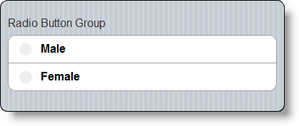

<!--
|metadata|
{
    "fileName": "adding-radiobuttongroup",
    "controlName": "RadioButtonGroup",
    "tags": ["Editing","MVC"]
}
|metadata|
-->

# Adding RadioButtonGroup

## Topic Overview
### Purpose

This topic contains the information needed in order to enable the RadioButtonGroup using the Infragistics MVC Wrappers.

### Required background

The following topics are prerequisites to understanding this topic:

- [RadioButtonGroup Overview](RadioButtonGroup-Overview.html): This topic contains information related to the `RadioButtonGroup` MVC wrappers.


### In this topic

This topic contains the following sections:

-   [**Enabling RadioButtonGroup**](#enabling)
    -   [Introduction](#introduction)
    -   [Preview](#preview)
    -   [Prerequisites](#prerequisites)
    -   [Overview](#overview)
    -   [Steps](#steps)
-   [**Related Content**](#related-topics)
    -   [Topics](#topics)
    -   [Samples](#samples)


## <a id="enabling"></a>Enabling RadioButtonGroup
### <a id="introduction"></a>Introduction

This procedure will guide you to add the `RadioButtonGroup` in a view page in an MVC solution using the MVC Wrappers.

### <a id="preview"></a>Preview 

The following screenshot is a preview of the final result:



### <a id="prerequisites"></a>Prerequisites 

To complete the procedure, you need to do the following:

-   Create an MVC Mobile application
-   Add references to the needed resources for the MVC reassurance wrappers to the project

### <a id="overview"></a>Overview 

Following is a conceptual overview of the process:

1. Including resources in the view page

2. Adding the `RadioButtonGroup` to the view page

3. Verifying the result

### <a id="steps"></a>Steps

The following steps demonstrate how to add the Radio Button, using the MVC Wrappers.

1. Include resources in the view page

	A reference to the `Infragistics.Web.Mvc.Mobile.dll` is needed as well as a reference to the Infragistics Mobile loader. In the following example, all of the js and css files are located under virtual directory named ig_mobileui. In order to complete this step, this folder should be renamed according to the correct js and css location.
	
	**In Razor:**
	
	```csharp
	@using Infragistics.Web.Mvc.Mobile
	<script src="http://code.jquery.com/jquery.min.js"></script>
	<script src="http://code.jquery.com/mobile/1.1.1/jquery.mobile.min.js"></script>
	<script type="text/javascript" src="http://localhost/ig_mobileui/js/infragistics.mobile.loader.js"></script>
	@(Html.InfragisticsMobile().
	    Loader().
	    ScriptPath("http://localhost/ig_mobileui/js/").
	    CssPath("http://localhost/ig_mobileui/css/").
	    Render())
	```

2. Add `RadioButtonGroup` to the view page
	
	**In Razor:**
	
	```csharp
	@(
	    Html.InfragisticsMobile()
	    .RadioButtonGroup()
	    .Text("RadioButtonGroup")
	    .ID("rdbtngrp1")
	    .Items(item =>
	    {
	        item.RadioButton().ID("rdbtnMale").Text(”Male");
	        item.RadioButton().ID("rdbtnFemale").Text(”Female");   
	    })
	    .Render()
	)
	```

3. Verify the result

	Save the view, rebuild, and run the application to verify the result.


## <a id="related-topics"></a>Related Content
### <a id="topics"></a>Topics

The following topics provide additional information related to this topic:

- [RadioButtonGroup Overview](RadioButtonGroup-Overview.html): This topic contains information related to the `RadioButtonGroup` MVC wrappers.

- [Configure RadioButtonGroup](RadioButtonGroup-Configuring.html): This topic contains the information and references needed in order to configure the `RadioButtonGroup` using the MVC wrapper.

- [RadioButtonGroup Property Reference](RadioButtonGroup-Property-Reference.html): This topic provides reference information about the properties of the `RadioButtonGroup` MVC Wrapper.


### <a id="samples"></a>Samples

The following samples provide additional information related to this topic.

- [Basic Usage](%%SamplesUrl%%/mobile-radiobutton-group/basic-usage): The sample demonstrates how the `RadioButtonGroup` renders both horizontal or vertical orientations.


 

 


