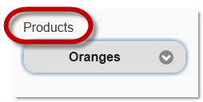
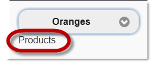
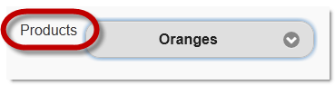
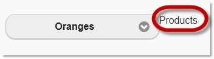
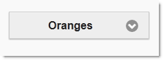
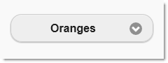

<!--
|metadata|
{
    "fileName": "selectmenu-overview",
    "controlName": "SelectMenu",
    "tags": ["Editing","Getting Started","Selection"]
}
|metadata|
-->

# SelectMenu Overview

## Topic Overview
### Purpose

This topic provides an overview of the `SelectMenu`™ helper and its features.

### In this topic

This topic contains the following sections:

-   [**Introduction**](#introduction)
-   [**SelectMenu Main Features Summary**](#main-features)
    -   [Select main features summary chart](#select-main-features-chart)
    -   [Optional label](#optional-label)
    -   [Configurable position of the label](#config-position-of-labels)
-   [**Related Content**](#related-content)
    -   [Topics](#topics)
    -   [Samples](#samples)

## Introduction
### SelectMenu ASP.NET MVC helper summary

The `SelectMenu` ASP.NET MVC helper produces a jQuery Mobile `selectmenu` widget based on a native select element. In order to create the final style and functionality, jQuery Mobile hides the original select element and replaces it with a custom-styled select button that matches the look and feel of the jQuery Mobile framework.

## SelectMenu Main Features Summary
### SelectMenu main features summary chart

The following table summarizes the main features of the `SelectMenu` ASP.NET MVC helper. Further details are found in the text blocks following the table. The full documentation of the `SelectMenu`‘s configuration is found in the [**Configuring the SelectMenu**](SelectMenu-Configure.html) topic.

Feature | Description
---|---
[Optional Label](#optional-label) | The `SelectMenu` can display a label for the entire switch. This label provides the user with further context as to what the switch does.
Configurable corners | The corners of the `SelectMenu` can be rounded using the [Corners](Infragistics.Web.Mvc.Mobile~Infragistics.Web.Mvc.Mobile.SelectMenuWrapper~Corners.html) property
[Configurable position of the label](#config-position-of-labels) | The optional switch label can be positioned above, below, to the left, or to the right of the `SelectMenu`.

### Optional label

The `SelectMenu` can display a label for the entire switch. This label
provides the user with further context as to what the switch does.

To display a menu label, enter the text for the label as the value for the [Label](Infragistics.Web.Mvc.Mobile~Infragistics.Web.Mvc.Mobile.SelectMenuWrapper~Label.html) property and ensure the [HideLabel](Infragistics.Web.Mvc.Mobile~Infragistics.Web.Mvc.Mobile.SelectMenuWrapper~HideLabel.html) property is not enabled.

### Configurable position of the label

The optional label can be positioned above, below, to the left, or to the right of the `SelectMenu`.

The default label position is above the `SelectMenu`.

The label positioning is managed by the [LabelAlignment](Infragistics.Web.Mvc.Mobile~Infragistics.Web.Mvc.Mobile.SelectMenuWrapper~LabelAlignment.html) property setting (Top, Bottom, Left, and Right, respectively).

### Configurable corners

By default, the corners of the `SelectMenu` are rounded. The rounded corners are managed by the [Corners](Infragistics.Web.Mvc.Mobile~Infragistics.Web.Mvc.Mobile.SelectMenuWrapper~Corners.html) property

## Related Content
### Topics

The following topics provide additional information related to this topic.

- [Configuring the SelectMenu](SelectMenu-Configure.html): This topic explains how to configure the `SelectMenu` helper.

- [SelectMenu Property Reference](SelectMenu-Property-Reference.html): This topic provides reference information about the properties of the `SelectMenu` helper.

- [Adding the SelectMenu](SelectMenu-Adding.html):This topic explains, with code examples, how to enable the jQuery Mobile `selectmenu` widget using its Infragistics® ASP.NET MVC helper.

### Samples

The following samples provide additional information related to this topic.

- [Basic Usage](%%SamplesUrl%%/mobile-selectmenu/basic-usage): This sample demonstrates how the `SelectMenu` ASP.NET MVC helper is used in a basic example.

 

 

