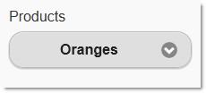

<!--
|metadata|
{
    "fileName": "selectmenu-adding",
    "controlName": "SelectMenu",
    "tags": ["Editing","How Do I","MVC","Selection"]
}
|metadata|
-->

# Adding Select Menu

## Topic Overview
### Purpose

This topic explains, with code examples, how to add a jQuery Mobile `selectmenu` widget to an ASP.NET MVC view using its Infragistics® ASP.NET MVC helper.

### Required background

The following topics are prerequisites to understanding this topic:

- [SelectMenu Overview](SelectMenu-Overview.html): This topic provides an overview of the `SelectMenu` ASP.NET MVC helper and its features.


### In this topic

This topic contains the following sections:

-   [**Adding the SelectMenu**](#adding-menu)
-   [**Related Content**](#related-content)


## <a id="adding-menu"></a>Adding the SelectMenu
### Introduction

This procedure demonstrates adding the `selectmenu` widget to a view in an ASP.NET MVC solution using its ASP.NET MVC helper. You need to add a reference to the `Infragistics.Web.Mvc.Mobile.dll`, as well as a reference to the Infragistics Mobile loader.

The sample code illustrates how to initialize the `SelectMenu` with three menu items (“Apples”, Oranges”, and “Bananas”) and a top-aligned label displaying Products.

### Preview

The following screenshot shows the `SelectMenu` widget added to the page as a result of performing the procedure.



### Prerequisites

To complete the procedure, you need the following:

-   An ASP.NET MVC Mobile application
-   References to the needed resources for the ASP.NET MVC helpers

### Overview

Following is a conceptual overview of the process:

1. Adding the resources to the View page
2. Adding the `SelectMenu` to the View page
3. Verifying the result

### Steps

The following steps demonstrate how to instantiate a `SelectMenu` using the ASP.NET MVC helper.

1. Add the resources to the view.

	In the following sample code, all JavaScript and CSS files are located under a virtual directory named ig_mobileui. In order to complete this step, this folder should be renamed according to the correct JavaScript and CSS location in your application.
	
	**In Razor:**
	
	```csharp
	@using Infragistics.Web.Mvc.Mobile
	<script src="http://code.jquery.com/jquery.min.js"></script>
	<script src="http://code.jquery.com/mobile/1.1.1/jquery.mobile.min.js"></script>
	<script type="text/javascript" src="http://localhost/ig_mobileui/js/infragistics.mobile.loader.js"></script>
	@(Html.InfragisticsMobile().
	    Loader().
	    ScriptPath("http://localhost/ig_mobileui/js/").
	    CssPath("http://localhost/ig_mobileui/css/").
	    Render())
	```

2. Add the SelectMenu to the View page.

	Add an instance of the SelectMenu helper together with its configuration settings.
	
	For this example, the SelectMenu is configured with three menu items: “Apples”, “Oranges”, and “Bananas”. The [Label](Infragistics.Web.Mvc.Mobile~Infragistics.Web.Mvc.Mobile.SelectMenuWrapper~Label.html) property is set to “Products”, and [LabelAlignment](Infragistics.Web.Mvc.Mobile~Infragistics.Web.Mvc.Mobile.SelectMenuWrapper~LabelAlignment.html) to Top
	
	**In Razor:**
	
	```csharp
	@(
	 Html.InfragisticsMobile()
	    .SelectMenu()
	    .Label("Products")
	    .LabelAlignment(Alignment.Top)
	    .Items(s =>
	    {
	        s.MenuItems.Add(new SelectMenuItem { 
	            Text = "Apples", Selected = false });
	        s.MenuItems.Add(new SelectMenuItem { 
	            Text = "Oranges", Selected = true });
	        s.MenuItems.Add(new SelectMenuItem { 
	            Text = "Bananas", Selected = false });
	    })
	    .Render()
	)
	```

3. Verify the result.

	To verify the result, save the view, rebuild, and run the application.


## <a id="related-content"></a>Related Content
### Topics

The following topics provide additional information related to this topic.

- [Configuring the SelectMenu](SelectMenu-Configure.html): This topic explains how to configure the `SelectMenu` helper.

- [SelectMenu Property Reference](SelectMenu-Property-Reference.html): This topic provides reference information about the properties of the `SelectMenu` helper.

### Samples

The following samples provide additional information related to this topic.

- [Basic Usage](%%SamplesUrl%%/mobile-selectmenu/basic-usage): This sample demonstrates how the `SelectMenu` ASP.NET MVC helper is used in a basic example.


 

 


