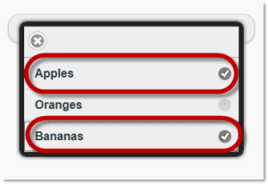
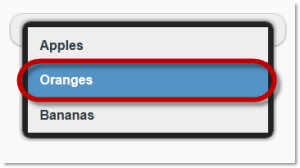
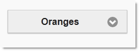
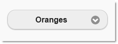
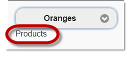
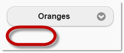
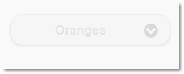

<!--
|metadata|
{
    "fileName": "selectmenu-configure",
    "controlName": "SelectMenu",
    "tags": ["Editing","Getting Started","MVC","Selection"]
}
|metadata|
-->

# Configure Select Menu

## Topic Overview
### Purpose

This topic explains how to configure the `SelectMenu` ASP.NET MVC helper.

### Required background

The following topics are prerequisites to understanding this topic:

- [SelectMenu Overview](SelectMenu-Overview.html): This topic provides an overview of the `SelectMenu` ASP.NET MVC helper and its features.


### In this topic

This topic contains the following sections:

-   [SelectMenu Configuration Summary](#config-summary)
-   [Configuring multiple selection in the SelectMenu](#config-multiple-selections)
    -   [Overview](#multiple-selection-overview)
    -   [Property settings](#multiple-selection-settings)
    -   [Code example](#multiple-selection-code-example)
-   [Configuring the Corners of the SelectMenu](#config-corners)
    -   [Overview](#corners-overview)
    -   [Property settings](#corners-settings)
    -   [Code example](#corners-code-example)
-   [Configuring the Optional Label](#config-optional-labels)
    -   [Overview](#optional-labels-overview)
    -   [Property settings](#optional-labels-settings)
    -   [Code example](#optional-labels-code-example)
-   [Disabling User Operations in the SelectMenu](#disable-user-operation)
    -   [Overview](#user-operation-overview)
    -   [Property settings](#user-operation-settings)
    -   [Code example](#user-operation-code-example)
-   [Related Content](#related-content)
    -   [Topics](#topics)
    -   [Samples](#samples)


## <a id="config-summary"></a>SelectMenu Configuration Summary
### SelectMenu configuration summary chart

The following table lists the configurable aspects of the `SelectMenu` ASP.NET MVC helper.

<table class="table table-bordered">
	<thead>
		<tr>
            <th>
Configurable aspect
			</th>

            <th>
Details
			</th>

            <th>
Properties
			</th>
        </tr>
	</thead>
	<tbody>
        

        <tr>
            <td>
[Configurable Multiple/Single Selection Choice](#config-multiple-selections))
			</td>

            <td>
By default, the `selectmenu` is configured with a single choice option enabled. Using the Multiple property, the multiple choice behavior can be enabled.
			</td>

            <td>
                <ul>
                    <li>
[Multiple](Infragistics.Web.Mvc.Mobile~Infragistics.Web.Mvc.Mobile.SelectMenuWrapper~Multiple.html)
					</li>
                </ul>
            </td>
        </tr>

        <tr>
            <td>
[Label](#config-optional-labels)
			</td>

            <td>
The optional label of the `selectmenu` can be configured in the following ways: [text](#text), [position](#position), and [visibility](#visibility).

                Each of these aspects is managed by a dedicated property.
			</td>

            <td>
                <ul>
                    <li>
[Label](Infragistics.Web.Mvc.Mobile~Infragistics.Web.Mvc.Mobile.SelectMenuWrapper~Label.html)
					</li>

                    <li>
[LabelAlignment](Infragistics.Web.Mvc.Mobile~Infragistics.Web.Mvc.Mobile.SelectMenuWrapper~LabelAlignment.html)
					</li>

                    <li>
[HideLabel](Infragistics.Web.Mvc.Mobile~Infragistics.Web.Mvc.Mobile.SelectMenuWrapper~HideLabel.html)
					</li>
                </ul>
            </td>
        </tr>

        <tr>
            <td>
[Configurable Corner](#config-corners)
			</td>

            <td>
The corners of the `selectmenu` can be rounded using the [Corners](Infragistics.Web.Mvc.Mobile~Infragistics.Web.Mvc.Mobile.SelectMenuWrapper~Corners.html)property
			</td>

            <td>
                <ul>
                    <li>
[Corners](Infragistics.Web.Mvc.Mobile~Infragistics.Web.Mvc.Mobile.SelectMenuWrapper~Corners.html)
					</li>
                </ul>
            </td>
        </tr>

        <tr>
            <td>
[Operation mode](#disable-user-operation)
			</td>

            <td>
The `selectmenu` has two operation modes: Enabled and Read-Only
			</td>

            <td>
                <ul>
                    <li>
[Disabled](Infragistics.Web.Mvc.Mobile~Infragistics.Web.Mvc.Mobile.SelectMenuWrapper~Disabled.html)
					</li>
                </ul>
            </td>
        </tr>
    </tbody>
</table>


## <a id="config-multiple-selections"></a>Configuring multiple selection in the SelectMenu
### <a id="multiple-selection-overview"></a>Overview

Use the [Multiple](Infragistics.Web.Mvc.Mobile~Infragistics.Web.Mvc.Mobile.SelectMenuWrapper~Multiple.html) property on the `SeletMenu` helper to enable multiple selection. By default, the `selectmenu` renders with single selection.

### <a id="multiple-selection-settings"></a>Property settings

The following table maps the desired configuration to initialize the `selectmenu` with multiple selection enabled.

In order to: | Use this property: | And set it to:
---|---|---
Set the selection mode to multiple | [Multiple](Infragistics.Web.Mvc.Mobile~Infragistics.Web.Mvc.Mobile.SelectMenuWrapper~Multiple.html) | true


### <a id="multiple-selection-code-example"></a>Code example

The code below demonstrates how to change the selection mode of the `selectmenu` by setting the helper’s [Multiple](Infragistics.Web.Mvc.Mobile~Infragistics.Web.Mvc.Mobile.SelectMenuWrapper~Multiple.html) property to true(left) and false(right) :




**In Razor:**

```csharp
@(
 Html.InfragisticsMobile()
    .SelectMenu()
    .NativeMenu(false)
    .Multiple(true)
    .Items(s =>
    {
        s.MenuItems.Add(new SelectMenuItem { 
            Text = "Apples", Selected = false });
        s.MenuItems.Add(new SelectMenuItem { 
            Text = "Oranges", Selected = true });
        s.MenuItems.Add(new SelectMenuItem { 
            Text = "Bananas", Selected = false });
    })
    .Render()
)
@(
 Html.InfragisticsMobile()
    .SelectMenu()
    .NativeMenu(false)
    .Multiple(false)
    .Items(s =>
    {
        s.MenuItems.Add(new SelectMenuItem { 
            Text = "Apples", Selected = false });
        s.MenuItems.Add(new SelectMenuItem { 
            Text = "Oranges", Selected = true });
        s.MenuItems.Add(new SelectMenuItem { 
            Text = "Bananas", Selected = false });
    })
    .Render()
)
```



**In Razor:**

```csharp
@(
 Html.InfragisticsMobile()
    .SelectMenu()
    .NativeMenu(false)
    .Multiple(true)
    .Items(s =>
    {
        s.MenuItems.Add(new SelectMenuItem { 
            Text = "Apples", Selected = false });
        s.MenuItems.Add(new SelectMenuItem { 
            Text = "Oranges", Selected = true });
        s.MenuItems.Add(new SelectMenuItem { 
            Text = "Bananas", Selected = false });
    })
    .Render()
)
@(
 Html.InfragisticsMobile()
    .SelectMenu()
    .NativeMenu(false)
    .Multiple(false)
    .Items(s =>
    {
        s.MenuItems.Add(new SelectMenuItem { 
            Text = "Apples", Selected = false });
        s.MenuItems.Add(new SelectMenuItem { 
            Text = "Oranges", Selected = true });
        s.MenuItems.Add(new SelectMenuItem { 
            Text = "Bananas", Selected = false });
    })
    .Render()
)
```


## <a id="config-corners"></a>Configuring the Corners of the SelectMenu
### <a id="corners-overview"></a>Overview

By default, the corners of the `SelectMenu` are rounded. Use the [Corners](Infragistics.Web.Mvc.Mobile~Infragistics.Web.Mvc.Mobile.SelectMenuWrapper~Corners.html) property to disable the rounded corners.

### <a id="corners-settings"></a>Property settings

The following table maps the desired configurations to the property settings that manage them.

In order to: |  Use this property: | And set it to:
---|---|---
Disable rounded corners | [Corners](Infragistics.Web.Mvc.Mobile~Infragistics.Web.Mvc.Mobile.SelectMenuWrapper~Corners.html) |false

### <a id="corners-code-example"></a>Code example

The code snippets below demonstrate the different [Corners](Infragistics.Web.Mvc.Mobile~Infragistics.Web.Mvc.Mobile.SelectMenuWrapper~Corners.html) settings of the `SelectMenu`




**In Razor:**

```csharp
@(
 Html.InfragisticsMobile()
    .SelectMenu()
    .Corners(false)
    .NativeMenu(false)
    .Items(s =>
    {
        s.MenuItems.Add(new SelectMenuItem { 
            Text = "Apples", Selected = false });
        s.MenuItems.Add(new SelectMenuItem { 
            Text = "Oranges", Selected = true });
        s.MenuItems.Add(new SelectMenuItem { 
            Text = "Bananas", Selected = false });
    })
    .Render()
)
@(
 Html.InfragisticsMobile()
    .SelectMenu()
    .Corners(true)
    .NativeMenu(false)
    .Items(s =>
    {
        s.MenuItems.Add(new SelectMenuItem { 
            Text = "Apples", Selected = false });
        s.MenuItems.Add(new SelectMenuItem { 
            Text = "Oranges", Selected = true });
        s.MenuItems.Add(new SelectMenuItem { 
            Text = "Bananas", Selected = false });
    })
    .Render()
)
```



**In Razor:**

```csharp
@(
 Html.InfragisticsMobile()
    .SelectMenu()
    .Corners(false)
    .NativeMenu(false)
    .Items(s =>
    {
        s.MenuItems.Add(new SelectMenuItem { 
            Text = "Apples", Selected = false });
        s.MenuItems.Add(new SelectMenuItem { 
            Text = "Oranges", Selected = true });
        s.MenuItems.Add(new SelectMenuItem { 
            Text = "Bananas", Selected = false });
    })
    .Render()
)
@(
 Html.InfragisticsMobile()
    .SelectMenu()
    .Corners(true)
    .NativeMenu(false)
    .Items(s =>
    {
        s.MenuItems.Add(new SelectMenuItem { 
            Text = "Apples", Selected = false });
        s.MenuItems.Add(new SelectMenuItem { 
            Text = "Oranges", Selected = true });
        s.MenuItems.Add(new SelectMenuItem { 
            Text = "Bananas", Selected = false });
    })
    .Render()
)
```

## <a id="config-optional-labels"></a>Configuring the Label
### <a id="optional-labels-overview"></a>Overview

The label of the `SelectMenu` can be configured in the following ways:

-   <a id="text"></a>text – the text of the label
-   <a id="position"></a>position – the position of the label relative to the selectmenu.
-   <a id="visibility"></a>visibility – whether the label is shown or hidden: under certain circumstances you may want to hide the label (a configured label is visible by default)

### <a id="optional-labels-settings"></a>Property settings

The following table maps the desired configurations to the property
settings that manage them.

<table class="table table-bordered">
	<thead>
		<tr>
            <th>
In order to:
			</th>

            <th>
Use this property:
			</th>

            <th>
And set it to:
			</th>
        </tr>
	</thead>
	<tbody>
        

        <tr>
            <td>
Set the text of the label
			</td>

            <td>
[Label](Infragistics.Web.Mvc.Mobile~Infragistics.Web.Mvc.Mobile.SelectMenuWrapper~Label.html)
			</td>

            <td>
the desired text string
			</td>
        </tr>

        <tr>
            <td>
Set the position of the label
			</td>

            <td>
[LabelAlignment](Infragistics.Web.Mvc.Mobile~Infragistics.Web.Mvc.Mobile.SelectMenuWrapper~LabelAlignment.html)
			</td>

            <td>
                One of the following:

                <ul>
                    <li>
Left
					</li>

                    <li>
Right
					</li>

                    <li>
Top
					</li>

                    <li>
Bottom
					</li>
                </ul>
            </td>
        </tr>

        <tr>
            <td>
Hide or show the label
			</td>

            <td>
[HideLabel](Infragistics.Web.Mvc.Mobile~Infragistics.Web.Mvc.Mobile.SelectMenuWrapper~HideLabel.html)
			</td>

            <td>
                <ul>
                    <li>
true – to hide the label
					</li>

                    <li>
false – to display the label
					</li>
                </ul>
            </td>
        </tr>
    </tbody>
</table>


### <a id="optional-labels-code-example"></a>Code example

The code snippet on the left demonstrates how to set a label to display Products beneath the `selectmenu` by setting the [Label](Infragistics.Web.Mvc.Mobile~Infragistics.Web.Mvc.Mobile.SelectMenuWrapper~Label.html) property to “Products” and the [LabelAlignment](Infragistics.Web.Mvc.Mobile~Infragistics.Web.Mvc.Mobile.SelectMenuWrapper~LabelAlignment.html) property to Bottom. The code snippet on the right shows how to hide the label.




**In Razor:**

```csharp
@(
 Html.InfragisticsMobile()
    .SelectMenu()
    .Label("Products")
    .LabelAlignment(Alignment.Bottom)
    .Multiple(false).NativeMenu(false)
    .Items(s =>
    {
        s.MenuItems.Add(new SelectMenuItem { 
            Text = "Apples", Selected = false });
        s.MenuItems.Add(new SelectMenuItem { 
            Text = "Oranges", Selected = true });
        s.MenuItems.Add(new SelectMenuItem { 
            Text = "Bananas", Selected = false });
    })
    .Render()
)
@(
 Html.InfragisticsMobile()
    .SelectMenu()
    .Label("Products")
    .LabelAlignment(Alignment.Bottom)
    .Hidelabel(true)
    .Multiple(false).NativeMenu(false)
    .Items(s =>
    {
        s.MenuItems.Add(new SelectMenuItem { 
            Text = "Apples", Selected = false });
        s.MenuItems.Add(new SelectMenuItem { 
            Text = "Oranges", Selected = true });
        s.MenuItems.Add(new SelectMenuItem { 
            Text = "Bananas", Selected = false });
    })
    .Render()
)
```


**In Razor:**

```csharp
@(

	Html.InfragisticsMobile()
	
	.SelectMenu()
	
	.Label("Products")
	
	.LabelAlignment(Alignment.Bottom)
	
	.Hidelabel(true)
	
	.Multiple(false).NativeMenu(false)
	
	.Items(s =>
	
	{
	
	s.MenuItems.Add(new SelectMenuItem {
	
	Text = "Apples", Selected = false });
	
	s.MenuItems.Add(new SelectMenuItem {
	
	Text = "Oranges", Selected = true });
	
	s.MenuItems.Add(new SelectMenuItem {
	
	Text = "Bananas", Selected = false });
	
	})
	
	.Render()

)
```

## <a id="disable-user-operation"></a>Disabling User Operations in the SelectMenu
### <a id="user-operation-overview"></a>Overview

By default, the `SelectMenu` is enabled but the widget can also operate in read-only mode if user intervention needs to be disabled (In the latter case, the `SelectMenu` only visualizes the selected item on the initialization)

The screenshot below demonstrates how the `SelectMenu` looks as a result of configuring it as read-only.



### <a id="user-operation-settings"></a>Property settings

The following table maps the desired configurations to the property
settings that manage them.

In order to: | Use this property: | And set it to:
---|---|---
Disable the `selectmenu` | [Disabled](Infragistics.Web.Mvc.Mobile~Infragistics.Web.Mvc.Mobile.SelectMenuWrapper~Disabled.html) | true
Enable the `selectmenu` | [Disabled](Infragistics.Web.Mvc.Mobile~Infragistics.Web.Mvc.Mobile.SelectMenuWrapper~Disabled.html) | false


### <a id="user-operation-code-example"></a>Code Example

The code below demonstrates how to disable the `selectmenu` by setting the [Disabled](Infragistics.Web.Mvc.Mobile~Infragistics.Web.Mvc.Mobile.SelectMenuWrapper~Disabled.html) property to true.

**In Razor:**

```csharp
@(
 Html.InfragisticsMobile()
    .SelectMenu()
    .Disabled(true)
    .NativeMenu(false)
    .Items(s =>
    {
        s.MenuItems.Add(new SelectMenuItem { 
            Text = "Apples", Selected = false });
        s.MenuItems.Add(new SelectMenuItem { 
            Text = "Oranges", Selected = true });
        s.MenuItems.Add(new SelectMenuItem { 
            Text = "Bananas", Selected = false });
    })
    .Render()
)
```


## <a id="related-content"></a>Related Content
### <a id="topics"></a>Topics

The following topics provide additional information related to this topic.

- [SelectMenu Property Reference](SelectMenu-Property-Reference.html): This topic provides reference information about the properties of the `SelectMenu` helper.

- [Adding the SelectMenu](SelectMenu-Adding.html): This topic explains, with code examples, how to add a jQuery Mobile `selectmenu` widget to an ASP.NET view using its Infragistics® ASP.NET MVC helper.

### <a id="samples"></a>Samples

The following samples provide additional information related to this topic.

- [Basic Usage](%%SamplesUrl%%/mobile-selectmenu/basic-usage): This sample demonstrates how the `SelectMenu` ASP.NET MVC helper is used in a basic example.


 

 


