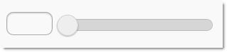
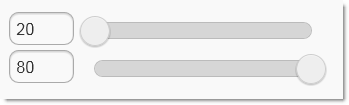
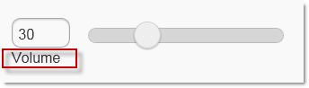
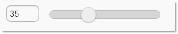
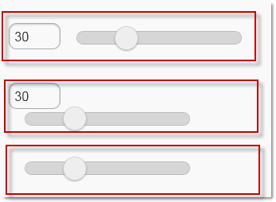

<!--
|metadata|
{
    "fileName": "slider-overview",
    "controlName": "Slider",
    "tags": ["Getting Started"]
}
|metadata|
-->

# Slider Overview

## Topic Overview

### Purpose

This topic details the features of the `Slider` ASP.NET MVC helper.

### Required background

The following topics are prerequisites to understanding this topic:

- [Referencing Mobile Resources in Ignite UI](Referencing-Mobile-Resources-in-NetAdvantage-for-jQuery.html): This topic explains how to manage the required mobile resources for Ignite UI controls.

### In this topic

This topic contains the following sections:

-   [**Introduction**](#introduction)
-   [**Slider ASP.NET MVC Helper Main Features Summary**](#summary)
-   [**Slider ASP.NET MVC Helper Features**](#features)
	-   [Set Min/Max Value](#min-max-value)
    -   [Set Label Text and Position](#label)
    -   [Default Value](#default-value)
    -   [Set Numeric input display mode](#numeric-input)
-   [**Related Content**](#related-content)
    -   [Topics](#topics)
    -   [Samples](#samples)

##  Introduction

The `Slider` ASP.NET MVC helper is used to render a jQuery Mobile `slider` widget in an ASP.NET view. A slider is a common UI element on mobile devices used for numeric data input. The following screenshot shows a `slider` with default options and values:

##  Slider ASP.NET MVC Helper Main Features Summary

The following table summarizes the main features of the Slider ASP.NET MVC helper.

Feature | Description
--------|------------
Setting Min/Max Value | [`MinValue`](Infragistics.Web.Mvc.Mobile~Infragistics.Web.Mvc.Mobile.SliderWrapper~MinValue.html) and [`MaxValue`](Infragistics.Web.Mvc.Mobile~Infragistics.Web.Mvc.Mobile.SliderWrapper~MaxValue.html) properties are used to set the minimum and maximum values of the slider
Set Label text and position | [`Label`](Infragistics.Web.Mvc.Mobile~Infragistics.Web.Mvc.Mobile.SliderWrapper~Label.html) and [`LabelAlignment`](Infragistics.Web.Mvc.Mobile~Infragistics.Web.Mvc.Mobile.SliderWrapper~LabelAlignment.html) properties are used to configure the label text of the slider
Set Default Value | The [`Value`](Infragistics.Web.Mvc.Mobile~Infragistics.Web.Mvc.Mobile.SliderWrapper~Value.html) property is used to set the default value of the slider
Set Numeric Display Mode | The [`NumericInputDisplayMode`](Infragistics.Web.Mvc.Mobile~Infragistics.Web.Mvc.Mobile.SliderWrapper~NumericInputDisplayMode.html) property is used to configure the appearance of the numeric input of the slider

##  Slider ASP.NET MVC Helper Features

###  Set Min/Max Value

By default, the minimum value is set to *0.0* and the maximum value is set to *100*. The [`MinValue`](Infragistics.Web.Mvc.Mobile~Infragistics.Web.Mvc.Mobile.SliderWrapper~MinValue.html) and [`MaxValue`](Infragistics.Web.Mvc.Mobile~Infragistics.Web.Mvc.Mobile.SliderWrapper~MaxValue.html) properties are used to change the default values of the slider. In the screenshot below, there are two sliders with [`MinValue`](Infragistics.Web.Mvc.Mobile~Infragistics.Web.Mvc.Mobile.SliderWrapper~MinValue.html) property set to *20.0* and [`MaxValue`](Infragistics.Web.Mvc.Mobile~Infragistics.Web.Mvc.Mobile.SliderWrapper~MaxValue.html) property set to *80.0*.

**Related Topics**

-   [Configure Slider](Slider-Configuring.html)

###  Set Label Text and Position

The [`Label`](Infragistics.Web.Mvc.Mobile~Infragistics.Web.Mvc.Mobile.SliderWrapper~Label.html) property is used to set the text for the label of the slider. The [`LabelAlignment`](Infragistics.Web.Mvc.Mobile~Infragistics.Web.Mvc.Mobile.SliderWrapper~LabelAlignment.html) property sets the position of the slider’s label. By default it’s positioned on the left side of the slider. In the screenshot below the [`Label`](Infragistics.Web.Mvc.Mobile~Infragistics.Web.Mvc.Mobile.SliderWrapper~Label.html) property is set to “*Volume*” and the [`LabelAlignment`](Infragistics.Web.Mvc.Mobile~Infragistics.Web.Mvc.Mobile.SliderWrapper~LabelAlignment.html) property is set to “*bottom*”.

**Related Topics**

-   [Configuring the Slider](Slider-Configuring.html)

###  Default Value

The [`Value`](Infragistics.Web.Mvc.Mobile~Infragistics.Web.Mvc.Mobile.SliderWrapper~Value.html) property allows the developer to set the slider’s initial value. In the screenshot below the [`Value`](Infragistics.Web.Mvc.Mobile~Infragistics.Web.Mvc.Mobile.SliderWrapper~Value.html) property is set to *35*

**Related Topics**

-   [Configuring Slider](Slider-Configuring.html)

###  Set Numeric input display mode

The [`NumericInputDisplayMode`](Infragistics.Web.Mvc.Mobile~Infragistics.Web.Mvc.Mobile.SliderWrapper~NumericInputDisplayMode.html) property is used to configure the numeric input positioning. It has three possible values – inline, block and none. In the screenshot below there are three sliders with [`NumericInputDisplayMode`](Infragistics.Web.Mvc.Mobile~Infragistics.Web.Mvc.Mobile.SliderWrapper~NumericInputDisplayMode.html) set to the three possible values – the top slider with the [`NumericInputDisplayMode`](Infragistics.Web.Mvc.Mobile~Infragistics.Web.Mvc.Mobile.SliderWrapper~NumericInputDisplayMode.html) property set to “*Inline*”, in the middle a slider with the [`NumericInputDisplayMode`](Infragistics.Web.Mvc.Mobile~Infragistics.Web.Mvc.Mobile.SliderWrapper~NumericInputDisplayMode.html) property set to “*Block*” and at the bottom slider with the [`NumericInputDisplayMode`](Infragistics.Web.Mvc.Mobile~Infragistics.Web.Mvc.Mobile.SliderWrapper~NumericInputDisplayMode.html) property set to “*None*”

**Related Topics**

-   [Configuring the Slider](Slider-Configuring.html)

##  Related Content

###  Topics

The following topics provide additional information related to this topic.

- [Adding Slider](Slider-Adding.html): This topic details how to add a jQuery Mobile `slider` using the Infragistics ASP.NET MVC helper.

- [Configure Slider](Slider-Configuring.html): This topic contains information and references needed to configure the `Slider` using the ASP.NET MVC helper.

- [Slider Property Reference](Slider-Property-Reference.html): This topic provides reference information about the properties of the `Slider` ASP.NET MVC helper

###  Samples

The following samples provide additional information related to this topic.

- [Basic Usage](%%SamplesUrl%%/mobile-slider/basic-usage): This sample demonstrates how the `Slider` ASP.NET MVC helper is used in a basic example.
    
- [Color Picker](%%SamplesUrl%%/mobile-slider/color-picker): This sample demonstrates how the `Slider` ASP.NET MVC helper is used in a Color Picker scenario. When the sliders are moved, the color of the square is changed and the hex value of the color gets populated automatically.

 

 

