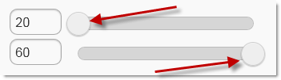
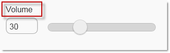
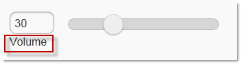
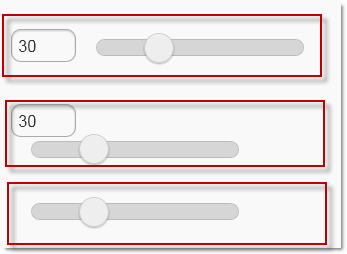
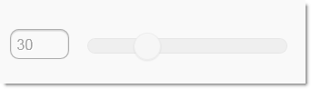
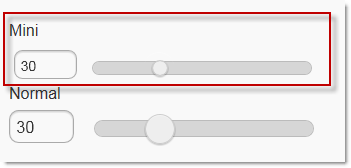
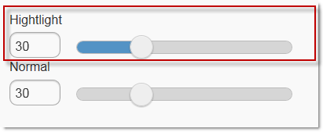

<!--
|metadata|
{
    "fileName": "slider-configuring",
    "controlName": "Slider",
    "tags": ["How Do I","MVC"]
}
|metadata|
-->

# Configuring Slider

## Topic Overview

### Purpose

This topic contains information and references needed to configure the slider using the ASP.NET MVC helper

### Required background

The following topics are prerequisites to understanding this topic:

- [Slider Overview](Slider-Overview.html): This topic details the features of the Slider ASP.NET MVC helper.


### In this topic

This topic contains the following sections:

-   [**Slider Configuration Summary**](#summary)
-   [**Change the default values for Min/Max value of the slider**](#min-max-value)
-   [**Setting the label of the slider**](#label)
-   [**Changing the alignment of the label of the slider**](#label-alignment)
-   [**Setting the display mode of the numeric input**](#numeric-input)
-   [**Hiding of the label of the slider**](#label-hiding)
-   [**Disabling the slider**](#disable)
-   [**Using the mini version of the slider**](#mini)
-   [**Changing of the step of the slider**](#step)
-   [**Highlighting the slider**](#highlight)
-   [**Related Content**](#related-content)
    -   [Topics](#topics)
    -   [Samples](#samples)


## <a id="summary"></a> Slider Configuration Summary

The following table lists the configurable aspects of the `Slider` ASP.NET MVC helper.

<table class="table table-striped">
	<thead>
		<tr>
            <th>
Configurable aspects
			</th>
            <th>
Details
			</th>
            <th>
Properties
			</th>
        </tr>
	</thead>
	<tbody>
        <tr>
            <td>
Change default values for Min/Max Value
			</td>
            <td>
The [`MinValue`](Infragistics.Web.Mvc.Mobile~Infragistics.Web.Mvc.Mobile.SliderWrapper~MinValue.html) and [`MaxValue`](Infragistics.Web.Mvc.Mobile~Infragistics.Web.Mvc.Mobile.SliderWrapper~MaxValue.html) properties of the slider ASP.NET MVC helper are used to change the default boundaries of the `slider`. By default they are from 0 to 100.
			</td>
            <td>
                <ul>
                    <li>
[MinValue](Infragistics.Web.Mvc.Mobile~Infragistics.Web.Mvc.Mobile.SliderWrapper~MinValue.html)
					</li>
                    <li>
[MaxValue](Infragistics.Web.Mvc.Mobile~Infragistics.Web.Mvc.Mobile.SliderWrapper~MaxValue.html)
					</li>
                </ul>
            </td>
        </tr>
        <tr>
            <td>
Configure the label of the slider
			</td>
            <td>
You can set the label text value, as well as position the label using the [`LabelAlignment`](Infragistics.Web.Mvc.Mobile~Infragistics.Web.Mvc.Mobile.SliderWrapper~LabelAlignment.html) property. The [`HideLabel`](Infragistics.Web.Mvc.Mobile~Infragistics.Web.Mvc.Mobile.SliderWrapper~HideLabel.html) property is used to hide the label.
			</td>

            <td>
                <ul>
                    <li>
[Label](Infragistics.Web.Mvc.Mobile~Infragistics.Web.Mvc.Mobile.SliderWrapper~Label.html)
					</li>
                    <li>
[LabelAlignment](Infragistics.Web.Mvc.Mobile~Infragistics.Web.Mvc.Mobile.SliderWrapper~LabelAlignment.html)
					</li>
                    <li>
[HideLabel](Infragistics.Web.Mvc.Mobile~Infragistics.Web.Mvc.Mobile.SliderWrapper~HideLabel.html)
					</li>
                </ul>
            </td>
        </tr>

        <tr>
            <td>
Set the default value
			</td>
            <td>
By default, the slider is initialized with its value set to *0*. The [`Value`](Infragistics.Web.Mvc.Mobile~Infragistics.Web.Mvc.Mobile.SliderWrapper~Value.html) property is used to change the value.
			</td>
            <td>
                <ul>
                    <li>
[Value](Infragistics.Web.Mvc.Mobile~Infragistics.Web.Mvc.Mobile.SliderWrapper~Value.html)
					</li>
                </ul>
            </td>
        </tr>

        <tr>
            <td>
Use mini version of the widget
			</td>
            <td>
The [`Mini`](Infragistics.Web.Mvc.Mobile~Infragistics.Web.Mvc.Mobile.SliderWrapper~Mini.html) property outputs a smaller sized slider when enabled.
			</td>
            <td>
                <ul>
                    <li>
[Mini](Infragistics.Web.Mvc.Mobile~Infragistics.Web.Mvc.Mobile.SliderWrapper~Mini.html)
					</li>
                </ul>
            </td>
        </tr>

        <tr>
            <td>
Disable the slider
			</td>
            <td>
The `Slider` can be initialized as a read-only widget.
			</td>
            <td>
                <ul>
                    <li>
[Disabled](Infragistics.Web.Mvc.Mobile~Infragistics.Web.Mvc.Mobile.SliderWrapper~Disabled.html)
					</li>
                </ul>
            </td>
        </tr>

        <tr>
            <td>
Change the step of the slider
			</td>
            <td>
The [`Step`](Infragistics.Web.Mvc.Mobile~Infragistics.Web.Mvc.Mobile.SliderWrapper~Step.html) property is used to define the interval between when the change events are fired.
			</td>
            <td>
                <ul>
                    <li>
[Step](Infragistics.Web.Mvc.Mobile~Infragistics.Web.Mvc.Mobile.SliderWrapper~Step.html)
					</li>
                </ul>
            </td>
        </tr>

        <tr>
            <td>
Enable highlight on the slider
			</td>
            <td>
The [`Highlight`](Infragistics.Web.Mvc.Mobile~Infragistics.Web.Mvc.Mobile.SliderWrapper~Highlight.html) property is used to highlight the selected value of the `slider`.
			</td>
            <td>
                <ul>
                    <li>
[Highlight](Infragistics.Web.Mvc.Mobile~Infragistics.Web.Mvc.Mobile.SliderWrapper~Highlight.html)
					</li>
                </ul>
            </td>
        </tr>
    </tbody>
</table>


## <a id="min-max-value"></a> Change the default values for Min/Max value of the slider

The default values of the minimum and the maximum values of the slider are changed using the  [`MinValue`](Infragistics.Web.Mvc.Mobile~Infragistics.Web.Mvc.Mobile.SliderWrapper~MinValue.html) and [`MaxValue`](Infragistics.Web.Mvc.Mobile~Infragistics.Web.Mvc.Mobile.SliderWrapper~MaxValue.html) properties

### Property settings

The following table maps the desired configuration to set the boundaries of the slider from “20” to “60”

In order to: | Use this property: | And set it to:
-------------|--------------------|--------------
Set minimum value to 20 | [MinValue](Infragistics.Web.Mvc.Mobile~Infragistics.Web.Mvc.Mobile.SliderWrapper~MinValue.html) | 20.0
Set maximum value to 60 | [MaxValue](Infragistics.Web.Mvc.Mobile~Infragistics.Web.Mvc.Mobile.SliderWrapper~MaxValue.html) | 60.0


### Code Example

In the screenshot below, there are two sliders with [`MinValue`](Infragistics.Web.Mvc.Mobile~Infragistics.Web.Mvc.Mobile.SliderWrapper~MinValue.html) property set to “*20.0*” and [`MaxValue`](Infragistics.Web.Mvc.Mobile~Infragistics.Web.Mvc.Mobile.SliderWrapper~MaxValue.html) property set to “*60*”. The top slider has the [`Value`](Infragistics.Web.Mvc.Mobile~Infragistics.Web.Mvc.Mobile.SliderWrapper~Value.html) property set to “*20.0*”, and the bottom slider has the [`Value`](Infragistics.Web.Mvc.Mobile~Infragistics.Web.Mvc.Mobile.SliderWrapper~Value.html) property set to “*60*”



**In Razor:**

```csharp
@(
 Html.InfragisticsMobile()
    .Slider()
    .Value(20.0)
    .MinValue(20.0)
    .MaxValue(60.0)
    .Render()
)

@(
 Html.InfragisticsMobile()
    .Slider()
    .Value(60.0)
    .MinValue(20.0)
    .MaxValue(60.0)
    .Render()
)
```


## <a id="label"></a> Setting the label of the slider

The text of the label of the slider can be changed using the [`Label`](Infragistics.Web.Mvc.Mobile~Infragistics.Web.Mvc.Mobile.SliderWrapper~Label.html) property of the `Slider` ASP.NET MVC helper.

### Property settings

The following table maps the desired configuration to set the label of the slider to “Volume”

In order to: | Use this property: | And set it to:
-------------|--------------------|--------------
Set the label text to “Volume” | [Label](Infragistics.Web.Mvc.Mobile~Infragistics.Web.Mvc.Mobile.SliderWrapper~Label.html) | “Volume”


### Code Example:

The screenshot below demonstrates how the slider looks as a result of setting the [`Label`](Infragistics.Web.Mvc.Mobile~Infragistics.Web.Mvc.Mobile.SliderWrapper~Label.html) property to “*Volume*”:



**In Razor:**

```csharp
@(
 Html.InfragisticsMobile()
    .Slider()
    .Value(30.0)
    .Label("Volume")
    .Render()
)
```


## <a id="label-alignment"></a> Changing the slider’s label alignment

The label position is changed using the [`LabelAlignment`](Infragistics.Web.Mvc.Mobile~Infragistics.Web.Mvc.Mobile.SliderWrapper~LabelAlignment.html) property. It has four possible values – Left, Right, Top and Bottom

#### Property settings

The following table maps the desired configuration to position the label below the `slider`.

In order to: | Use this property: | And set it to:
-------------|--------------------|--------------
Position the label below the slider | [LabelAlignment](Infragistics.Web.Mvc.Mobile~Infragistics.Web.Mvc.Mobile.SliderWrapper~LabelAlignment.html) | *Alignment.Bottom*


### Code Example

The screenshot below demonstrates how the slider looks as a result of setting the [`LabelAlignment`](Infragistics.Web.Mvc.Mobile~Infragistics.Web.Mvc.Mobile.SliderWrapper~LabelAlignment.html) property to *Alignment.Bottom*:



**In Razor:**

```csharp
@(
 Html.InfragisticsMobile()
    .Slider()
    .Value(30.0)
    .Label("Volume")
    .LabelAlignment(Alignment.Bottom)
    .Render()
)
```


## <a id="numeric-input"></a> Setting the display mode of the numeric input

The display mode of the slider’s numeric input is changed using the [`NumericInputDisplayMode`](Infragistics.Web.Mvc.Mobile~Infragistics.Web.Mvc.Mobile.SliderWrapper~NumericInputDisplayMode.html) property.

#### Property settings

The following table maps the desired configuration to set the [`NumericInputDisplayMode`](Infragistics.Web.Mvc.Mobile~Infragistics.Web.Mvc.Mobile.SliderWrapper~NumericInputDisplayMode.html) property with three possible values – “*Block*”, “*Inline*” and “*None*”

In order to: | Use this property: | And set it to:
-------------|--------------------|--------------
Set the display mode of the input to Block | [NumericInputDisplayMode](Infragistics.Web.Mvc.Mobile~Infragistics.Web.Mvc.Mobile.SliderWrapper~NumericInputDisplayMode.html) | DisplayMode.Block
Set the display mode of the input to Inline | [NumericInputDisplayMode](Infragistics.Web.Mvc.Mobile~Infragistics.Web.Mvc.Mobile.SliderWrapper~NumericInputDisplayMode.html) | DisplayMode.Inline
Set the display mode of the input to None | [NumericInputDisplayMode](Infragistics.Web.Mvc.Mobile~Infragistics.Web.Mvc.Mobile.SliderWrapper~NumericInputDisplayMode.html) | DiplayMode.None


### Code Example

In the screenshot below there are three sliders with [`NumericInputDisplayMode`](Infragistics.Web.Mvc.Mobile~Infragistics.Web.Mvc.Mobile.SliderWrapper~NumericInputDisplayMode.html) set to the three possible values – the top slider with the [`NumericInputDisplayMode`](Infragistics.Web.Mvc.Mobile~Infragistics.Web.Mvc.Mobile.SliderWrapper~NumericInputDisplayMode.html) property set to “*Inline*”, in the middle a slider with the [`NumericInputDisplayMode`](Infragistics.Web.Mvc.Mobile~Infragistics.Web.Mvc.Mobile.SliderWrapper~NumericInputDisplayMode.html) property set to “*Block*” and at the bottom slider with the [`NumericInputDisplayMode`](Infragistics.Web.Mvc.Mobile~Infragistics.Web.Mvc.Mobile.SliderWrapper~NumericInputDisplayMode.html) property set to “*None*”



**In Razor:**

```csharp
@(
    Html.InfragisticsMobile()
    .Slider()
    .Value(30.0)
    .NumericInputDisplayMode(DisplayMode.Inline)
    .Render()
)

@(
    Html.InfragisticsMobile()
    .Slider()
    .NumericInputDisplayMode(DisplayMode.Block)
    .Value(30.0)
    .Render()
)

@(
    Html.InfragisticsMobile()
    .Slider()
    .NumericInputDisplayMode(DisplayMode.None)
    .Value(30.0)
    .Render()
)
```


## <a id="label-hiding"></a> Hiding of the label of the slider

The visibility of the label of the slider is configured using the [HideLabel](Infragistics.Web.Mvc.Mobile~Infragistics.Web.Mvc.Mobile.SliderWrapper~HideLabel.html) property.

### Property settings

The following table maps the desired configuration to hide the label of the slider.

In order to: | Use this property: | And set it to:
-------------|--------------------|--------------
Hide Label | [HideLabel](Infragistics.Web.Mvc.Mobile~Infragistics.Web.Mvc.Mobile.SliderWrapper~HideLabel.html) | true


### Code Example

The screenshot below demonstrates how the slider looks as a result of hiding the label:


**In Razor:**

```csharp
@(
 Html.InfragisticsMobile()
    .Slider()
    .Value(30.0)
    .Label("Volume")
    .Hidelabel(true)
    .Render()
)
```


## <a id="disable"></a> Disabling the slider

The `slider` can be set to read-only .

### Property settings

The following table maps the desired configuration to make the slider read-only.

In order to: | Use this property: | And set it to:
-------------|--------------------|--------------
Disable the Slider | [Disabled](Infragistics.Web.Mvc.Mobile~Infragistics.Web.Mvc.Mobile.SliderWrapper~Disabled.html) | true


### Code Example

The screenshot below demonstrates how the slider looks as a result configuring it as a read-only:



**In Razor:**

```csharp
@(
 Html.InfragisticsMobile()
    .Slider()
    .Value(30.0)
    .Disabled(true)
    .Render()
)
```


## <a id="mini"></a> Using the mini version of the slider

Using of the mini version of the `slider` produces a slider that is not as tall as the standard version and has a smaller track too.

### Property settings

The following table maps the desired configuration to make the slider compact.

In order to: | Use this property: | And set it to:
-------------|--------------------|--------------
Enable Mini property | [Mini](Infragistics.Web.Mvc.Mobile~Infragistics.Web.Mvc.Mobile.SliderWrapper~Mini.html) | true


### Code Example

The screenshot below demonstrates the difference between a normal and mini slider:



**In Razor:**

```csharp
@(
 Html.InfragisticsMobile()
    .Slider()
    .Value(30.0)
    .Label("Mini")
    .Mini(true)
    .Render()
)
<br />
@(
 Html.InfragisticsMobile()
    .Slider()
    .Label("Normal")
    .Value(30.0)
    .Render()
)
```


## <a id="step"></a> Changing of the step of the slider

The delta in the current value to which the change event of the `slider` gets fired is configured using the [`Step`](Infragistics.Web.Mvc.Mobile~Infragistics.Web.Mvc.Mobile.SliderWrapper~Step.html) property of the `slider` ASP.NET MVC helper

### Property settings

The following table maps the desired configuration to set the [`Step`](Infragistics.Web.Mvc.Mobile~Infragistics.Web.Mvc.Mobile.SliderWrapper~Step.html) property to 10.0.

In order to: | Use this property: | And set it to:
-------------|--------------------|--------------
Set Step property to 10 | [Step](Infragistics.Web.Mvc.Mobile~Infragistics.Web.Mvc.Mobile.SliderWrapper~Step.html) | 10.0


### Code Example

The Code Example demonstrates how to set the Step property of the slider to “10.0” using the ASP.NET MVC helper.

**In Razor:**

```csharp
@(
 Html.InfragisticsMobile()
    .Slider()
    .Step(10.0)
    .Render()
)
```


## <a id="highlight"></a> Highlighting the slider

The highlighting of the `slider` is configured using the [`Highlight`](Infragistics.Web.Mvc.Mobile~Infragistics.Web.Mvc.Mobile.SliderWrapper~Highlight.html) property.

### Property settings

The following table maps the desired configuration to enable the [`Highlight`](Infragistics.Web.Mvc.Mobile~Infragistics.Web.Mvc.Mobile.SliderWrapper~Highlight.html) of the slider.

In order to: | Use this property: | And set it to:
-------------|--------------------|--------------
Enable Highlighting | [Highlight](Infragistics.Web.Mvc.Mobile~Infragistics.Web.Mvc.Mobile.SliderWrapper~Highlight.html) | “true”


### Code Example

In the screenshot below there are two sliders instantiated – the top one has the [`Highlight`](Infragistics.Web.Mvc.Mobile~Infragistics.Web.Mvc.Mobile.SliderWrapper~Highlight.html) property set to “*true*”, the bottom one has the default value.



**In Razor:**

```csharp
@(
 Html.InfragisticsMobile()
    .Slider()
    .Value(30.0)
    .Label("Hightlight")
    .Highlight(true)
    .Render()
)
<br />
@(
 Html.InfragisticsMobile()
    .Slider()
    .Value(30.0)
    .Label("Normal")
    .Render()
)
```


## <a id="related-content"></a> Related Content

### <a id="topics"></a> Topics

The following topics provide additional information related to this topic.

- [Slider Overview](Slider-Overview.html): This topic details the features of the `Slider` ASP.NET MVC helper.

- [Adding Slider](Slider-Adding.html): This topic details how to add a jQuery Mobile `slider` using the Infragistics ASP.NET MVC helper.

- [Slider Property Reference](Slider-Property-Reference.html): This topic provides reference information about the properties of the `Slider` ASP.NET MVC helper


### <a id="samples"></a> Samples

The following samples provide additional information related to this topic.

- [Basic Usage](%%SamplesUrl%%/mobile-slider/basic-usage): This sample demonstrates how the `Slider` ASP.NET MVC helper is used in a basic example.
    
- [Color Picker](%%SamplesUrl%%/mobile-slider/color-picker): This sample demonstrates how the `Slider` ASP.NET MVC helper is used in a Color Picker scenario. When the sliders are moved, the color of the square is changed and the hex value of the color gets populated automatically.


 

 


