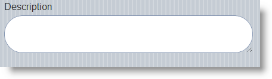

<!--
|metadata|
{
    "fileName": "textbox-overview",
    "controlName": "TextBox",
    "tags": ["Editing","Getting Started","MVC"]
}
|metadata|
-->

# TextBox Overview

## Topic Overview
### Purpose

This topic contains information related to the `TextBox` ASP.NET MVC helper.

### In this topic

This topic contains the following sections:

-   [**Introduction**](#introduction)
-   [**TextBox ASP.NET MVC Helper Main Features Summary**](#main-features-summary)
-   [**TextBox ASP.NET MVC Helper Features**](#features)
    -   [Text](#text)
    -   [Mode](#mode)
    -   [Native](#native)
    -   [Label](#label)
    -   [Mini](#mini)
    -   [Disabled](#disable)
    -   [Theme](#theme)
    -   [Attributes](#attribute)
-   [**Related Content**](#related-content)
    -   [Topics](#topics)
    -   [Samples](#samples)

## Introduction

The `TextBox` ASP.NET MVC helper renders standard HTML inputs. Once rendered, jQuery Mobile optimizes them for mobile and touch devices. This means that you can use the jQuery Mobile [textinput](http://jquerymobile.com/demos/1.1.1/docs/forms/textinputs/index.html) plugin to dynamically modify the inputs.

## TextBox ASP.NET MVC Helper Main Features Summary

The following table summarizes the main features of the `TextBox` ASP.NET MVC helper.

Feature | Description 
---|---
Text | The [`Text`](Infragistics.Web.Mvc.Mobile~Infragistics.Web.Mvc.Mobile.TextBoxWrapper~Text.html) option sets and gets the text of the control.
Mode | The `TextBox` has default templates to use for Multiline, Password, Search, as well as normal Text mode.
Native | This option restores the default HTML INPUT appearance according to the browser.
Label | The control has a customizable label that can be hidden or shown. 
Mini | The `TextBox` has two states – one normal and another that can make the control smaller. 
Disabled | When `TextBox` is disabled, it is read-only and has a disabled visual style. 
Theme | The `TextBox` accept the standard jQuery Mobile Themes. 
Attributes | The ASP.NET MVC `TextBox` helper has a method that accepts a list of HTML attributes that is rendered on the client.

## TextBox ASP.NET MVC Helper Features
### Text

The `TextBox` [Text](Infragistics.Web.Mvc.Mobile~Infragistics.Web.Mvc.Mobile.TextBoxWrapper~Text.html) option sets and gets the text of the control.

### Mode

The `TextBox` has default templates for Multiline, Password, Search, as well as normal Text mode. The pictures below show you how the `TextBox` looks in the different modes.

### Native

By default jQuery Mobile modifies the normal HTML input of type text to optimize it for mobile devices. But the ASP.NET MVC `TextBox` helper allows you to restore the basic HTML `TextBox` appearance if you want.

### Label

The [Text](Infragistics.Web.Mvc.Mobile~Infragistics.Web.Mvc.Mobile.TextBoxWrapper~Text.html) method allows you to modify the text inside the control itself, but if you want to place text above the control you can use the [Label](Infragistics.Web.Mvc.Mobile~Infragistics.Web.Mvc.Mobile.TextBoxWrapper~Label.html) property.

### Mini

The `TextBox` can have two states – one normal and another that can make the control smaller. If the default size of the `TextBox` does not fit your requirements and you want to restrict the control size, you can make the `TextBox` smaller, using its [Mini](Infragistics.Web.Mvc.Mobile~Infragistics.Web.Mvc.Mobile.TextBoxWrapper~Mini.html) method.

### Disabled

When `TextBox` is disabled, it is read-only and the text appears with a disabled visual style as shown in the picture below.

### Theme

The `TextBox` can use the standard [jQuery Mobile Themes](http://jquerymobile.com/demos/1.1.1/docs/api/themes.html). By default, the ASP.NET MVC helpers render controls with the default jQuery mobile theme swatch, which is c.

### Attributes

The ASP.NET MVC `TextBox` helper has a method that accepts a list of HTML attributes that are rendered on the client. The method name is [HtmlAttributes](Infragistics.Web.Mvc.Mobile~Infragistics.Web.Mvc.Mobile.TextBoxWrapper~HtmlAttributes.html) and accepts a parameter of type [Dictionary](http://msdn.microsoft.com/en-us/library/xfhwa508.aspx)

## Related Content
### Topics

The following topics provide additional information related to this topic.

- [Adding TextBox](AddingTextBox.html): This topic contains information needed to enable the `TextBox` using the Infragistics ASP.NET MVC helpers

- [TextBox Property Reference](TextBox-Property-Reference.html): This topic provides a property reference for the `TextBox` ASP.NET MVC helper.

### Samples

The following samples provide additional information related to this topic.

- [Basic Usage](%%SamplesUrl%%/mobile-textbox/basic-usage): This sample demonstrates how to use the `TextBox` ASP.NET MVC helper to define several types of input fields.

 

 

