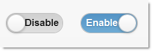
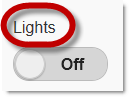
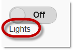
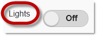
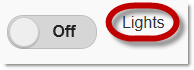

<!--
|metadata|
{
    "fileName": "toggleswitch-overview",
    "controlName": "ToggleSwitch",
    "tags": ["Editing","MVC"]
}
|metadata|
-->

# ToggleSwitch Overview

## Topic Overview

### Purpose

This topic provides an overview of the `Toggle Switch` MVC wrapper and its features.

### In this topic

This topic contains the following sections:

-   [**Introduction**](#introduction)
-   [**Toggle Switch Main Features Summary**](#features)
    -   [Optional switch label](#label)
    -   [Configurable position of the switch label](#label-position)
-   [**Related Content**](#related-content)
    -   [Topics](#topics)
    -   [Samples](#samples)

## Introduction

The `Toggle Switch` MVC wrapper produces a binary “flip switch” that is used for on/off or true/false data input. Such virtual switches are common User Interface (UI) elements in mobile devices. The `Toggle Switch` is a track slider with two alternative positions (left and right) representing the two states of the “switch” (Enabled and Disabled). There is also a label indicating the current state and different color schemes for each of the states.

By default, the labels representing the states of the `Toggle Switch` are On and Off, but they can be customized to represent any couple of alternative options, like Enable/Disable, On/Off, Low/High, and so on.

The state of the switch is managed by a property of the jQuery mobile UI ([SwitchedState](Infragistics.Web.Mvc.Mobile~Infragistics.Web.Mvc.Mobile.ToggleSwitchWrapper~SwitchedState.html) at this writing).

The default state with which the `Toggle Switch` initializes is dependent on the jQuery Mobile default setting (Disabled at the time of this writing), but this is configurable.

## Toggle Switch Main Features Summary

The following table summarizes the main features of the `Toggle Switch` MVC wrapper. Some of them are further explained in the text blocks following the table. The full coverage of the `Toggle Switch`‘s feature configuration is available in the [Configuring the ToggleSwitch](ToggleSwitch-Configuring.html).

Feature | Description
--------|----------
Configurable size | The size of the widget can be configured in two ways:   **By setting the widget’s width directly** in the MVC wrapper’s [`Width`](Infragistics.Web.Mvc.Mobile~Infragistics.Web.Mvc.Mobile.ToggleSwitchWrapper~Width.html) property. This is useful for accommodating state descriptions that are longer than the default ones (On/Off).    **By scaling down the entire widget through a mini theme.**
Dual-mode operation (Edit/Read-Only modes) | The `Toggle Switch` can be configured as a read-only widget.
Configurable default state | The state of the `Toggle Switch` is managed by the [`SwitchedState`](Infragistics.Web.Mvc.Mobile~Infragistics.Web.Mvc.Mobile.ToggleSwitchWrapper~SwitchedState.html) property. Setting this property upon the widget’s initialization effectively changes the widget’s default state.
Configurable state label | The text label indicating the states of the switch (*On* and *Off* by default) is implemented through two text strings (for the Enabled and Disabled states respectively). The strings are set in the [`OnText`](Infragistics.Web.Mvc.Mobile~Infragistics.Web.Mvc.Mobile.ToggleSwitchWrapper~OnText.html) and [`OffText`](Infragistics.Web.Mvc.Mobile~Infragistics.Web.Mvc.Mobile.ToggleSwitchWrapper~OffText.html) properties.
[Optional switch label](#label) | The `Toggle Switch` can be configured display a label for the entire switch. Its purpose is to tell the user what the switch is about.
[Configurable position of the switch label](#label-position) | The optional switch label can be positioned above, below, to the left, or to the right of the “switch”.

### Optional switch label

The `Toggle Switch` can be configured to display a label for the entire switch. Its purpose is to provide information to the user what the switch is about.

To display a switch label, you need to enter the text for the label as the value for the [`Label`](Infragistics.Web.Mvc.Mobile~Infragistics.Web.Mvc.Mobile.ToggleSwitchWrapper~Label.html) property, and the [`HideLabel`](Infragistics.Web.Mvc.Mobile~Infragistics.Web.Mvc.Mobile.ToggleSwitchWrapper~HideLabel.html) property should either be not set or set to *false*.

### Configurable position of the switch label

The optional switch label can be positioned above, below, to the left, and to the right of the “switch”.

The default label position is above the “switch”.

The label positioning is managed by the [`LabelAlignment`](Infragistics.Web.Mvc.Mobile~Infragistics.Web.Mvc.Mobile.ToggleSwitchWrapper~LabelAlignment.html) property setting (*Top*, *Bottom*, *Left*, and *Right*, respectively).

##  Related Content

###  Topics

The following topics provide additional information related to this topic:

- [Adding the](ToggleSwitch-Adding.html) [Toggle Switch](ToggleSwitch-Adding.html): This topic explains, with code examples, how to enable the `Toggle Switch` widget using its Infragistics® Model-View-Controller (MVC) wrappers.

- [Configuring the](ToggleSwitch-Configuring.html) [Toggle Switch](ToggleSwitch-Configuring.html): This topic explains how to configure the `Toggle Switch` widget.

- [Toggle Switch](ToggleSwitch-Property-Reference.html) [Property Reference](ToggleSwitch-Property-Reference.html): This topic provides reference information about the properties of the `Toggle Switch` widget.

###  Samples

The following samples provide additional information related to this topic:

- [Basic Usage](%%SamplesUrl%%/mobile-toggleswitch/basic-usage): This sample demonstrates how the `Toggle Switch` MVC wrapper is used in a basic example.

- [Device Manager](%%SamplesUrl%%/mobile-toggleswitch/device-manager): This sample demonstrates how the `Toggle Switch` MVC wrapper is used in a device manager scenario where devices can be turned on and off.

 

 

