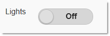

<!--
|metadata|
{
    "fileName": "toggleswitch-adding",
    "controlName": "ToggleSwitch",
    "tags": ["How Do I","MVC"]
}
|metadata|
-->

# Adding ToggleSwitch

## Topic Overview

### Purpose

This topic explains, with code examples, how to enable the `Toggle Switch` widget using its Infragistics® Model-View-Controller (MVC) wrappers.

### Required background

The following topics are prerequisites to understanding this topic:

- [Toggle Switch Overview](ToggleSwitch-Overview.html): This topic provides an overview of the `Toggle Switch` MVC wrapper and its features.


### In this topic

This topic contains the following sections:

-   [**Adding the Toggle Switch**](#adding)
-   [**Related Content**](#related-content)


## <a id="adding"></a> Adding the Toggle Switch

This procedure demonstrates adding the `Toggle Switch` widget to a View page in an MVC solution using the MVC wrappers. You need to add a reference to the *Infragistics.Web.Mvc.Mobile.dll* is needed, as well as a reference to the Infragistics Mobile loader.

The sample code illustrating the procedure configures the `Toggle Switch` to be 120 pixels wide with a left-aligned label saying *Lights*.

### Preview

The following screenshot shows the `Toggle Switch` widget added to the page as a result of performing the procedure.



### Prerequisites

To complete the procedure, you need the following:

-   an MVC Mobile application
-   References to the needed resources for the MVC reassurance wrappers

### Overview

Following is a conceptual overview of the process:

1. Adding the resources to the View page

2. Adding the `Toggle Switch` to the View page

3. Verifying the result

### Steps

1. Add the resources to the View page.

	In the following sample code, all JavaScript and CSS files are located under a virtual directory named `ig_mobileui`. In order to complete this step, this folder should be renamed according to the correct JavaScript and CSS location on your machine.
	
	**In Razor:**
	
	```csharp
	@using Infragistics.Web.Mvc.Mobile
	<script src="http://code.jquery.com/jquery.min.js"></script>
	<script src="http://code.jquery.com/mobile/1.1.1/jquery.mobile.min.js"></script>
	<script type="text/javascript" src="http://localhost/ig_mobileui/js/infragistics.mobile.loader.js"></script>
	@(Html.InfragisticsMobile().
	    Loader().
	    ScriptPath("http://localhost/ig_mobileui/js/").
	    CssPath("http://localhost/ig_mobileui/css/").
	    Render())
	```

2. Add the `Toggle Switch` to the View page.

	Add an instance of the `Toggle Switch` widget together with its configuration settings.
	
	For this example, the `Toggle Switch` is configured with the [`Label`](Infragistics.Web.Mvc.Mobile~Infragistics.Web.Mvc.Mobile.ToggleSwitchWrapper~Label.html) property set to “*Lights*”, [`LabelAlignment`](Infragistics.Web.Mvc.Mobile~Infragistics.Web.Mvc.Mobile.ToggleSwitchWrapper~LabelAlignment.html) –to *Left* and [`Width`](Infragistics.Web.Mvc.Mobile~Infragistics.Web.Mvc.Mobile.ToggleSwitchWrapper~Width.html) – to “*120px*”.
	
	**In Razor:**
	
	```csharp
	@(
	    Html.InfragisticsMobile()
	    .ToggleSwitch()
	    .Label("Lights")
	    .LabelAlignment(Alignment.Left)
	    .Width("12
	0
	px")
	    .Render()
	)
	```

3. Verify the result.

	To verify the result, save the view and then, rebuild and run the application.


## <a id="related-content"></a> Related Content

### Topics

The following topics provide additional information related to this topic.

- [Configuring the](ToggleSwitch-Configuring.html) [Toggle Switch](ToggleSwitch-Configuring.html): This topic explains how to configure the `Toggle Switch` widget.

- [Toggle Switch](ToggleSwitch-Property-Reference.html) [Property Reference](ToggleSwitch-Property-Reference.html): This topic provides reference information about the properties of the `Toggle Switch` widget. This topic provides reference information about the properties of the Toggle Switch widget.


### Samples

The following samples provide additional information related to this topic:

- [Basic Usage](%%SamplesUrl%%/mobile-toggleswitch/basic-usage): This sample demonstrates how the `Toggle Switch` MVC wrapper is used in a basic example.

- [Device Manager](%%SamplesUrl%%/mobile-toggleswitch/device-manager): This sample demonstrates how the `Toggle Switch` MVC wrapper is used in a device manager scenario where devices can be turned on and off.


 

 


