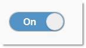
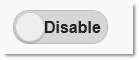
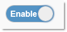
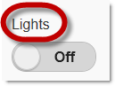
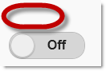
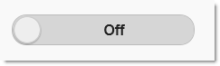
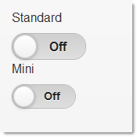
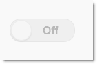

<!--
|metadata|
{
    "fileName": "toggleswitch-configuring",
    "controlName": "ToggleSwitch",
    "tags": ["Editing","How Do I","MVC"]
}
|metadata|
-->

# Configuring ToggleSwitch

## Topic Overview

### Purpose

This topic explains how to configure the `Toggle Switch`™ MVC wrapper.

### Required background

The following topics are prerequisites to understanding this topic:

- [Toggle Switch Overview](ToggleSwitch-Overview.html): This topic provides an overview of the `Toggle Switch` MVC wrapper and its features.


### In this topic

This topic contains the following sections:

-   [**Toggle Switch Configuration Summary**](#summary)
-   [**Changing the Default State of the Toggle Switch**](#default-state)
    -   [Property settings](#default-state-property)
    -   [Code example](#default-state-example)
-   [**Configuring the State Label**](#state-label)
    -   [Property settings](#state-label-property-settings)
    -   [Code example](#state-label-example)
-   [**Configuring the Optional Switch Label**](#label)
    -   [Property settings](#label-property-settings)
    -   [Code example](#label-example)
-   [**Resizing the Toggle Switch**](#resize)
    -   [Property settings](#resize-property-settings)
    -   [Code example](#resize-example)
-   [**Disabling User Operations in the Toggle Switch**](#disable)
    -   [Property settings](#disable-property-settings)
    -   [Code Example](#disable-example)
-   [**Related Content**](#related-content)
    -   [Topics](#topics)
    -   [Samples](#samples)


## <a id="summary"></a> Toggle Switch Configuration Summary

The following table lists the configurable aspects of the toggle switch MVC wrapper:

<table class="table table-striped">
	<thead>
		<tr>
            <th>
Configurable aspect
			</th>
            <th>
Details
			</th>
            <th>
Properties
			</th>
        </tr>
	</thead>
	<tbody>
        <tr>
            <td>
[Default state of the *ToggleSwitch*](#default-state)
			</td>
            <td>
The logical state of the `Toggle Switch` (Enabled/Disabled) is managed by the [`SwitchedState`](Infragistics.Web.Mvc.Mobile~Infragistics.Web.Mvc.Mobile.ToggleSwitchWrapper~SwitchedState.html) property. Setting this property upon the widget’s initialization effectively changes the widget’s default state.
			</td>
            <td>
                <ul>
                    <li>
[SwitchedState](Infragistics.Web.Mvc.Mobile~Infragistics.Web.Mvc.Mobile.ToggleSwitchWrapper~SwitchedState.html)
					</li>
                </ul>
            </td>
        </tr>

        <tr>
            <td>
[Text of the state label](#state-label)
			</td>
            <td>
The text label indicating the states of the switch (*On* and *Off* by default) is implemented through two text strings (for the Enabled and Disabled states respectively) set in two separate properties.
			</td>
            <td>
                <ul>
                    <li>
[OnText](Infragistics.Web.Mvc.Mobile~Infragistics.Web.Mvc.Mobile.ToggleSwitchWrapper~OnText.html)
					</li>
                    <li>
[OffText](Infragistics.Web.Mvc.Mobile~Infragistics.Web.Mvc.Mobile.ToggleSwitchWrapper~OffText.html)
					</li>
                </ul>
            </td>
        </tr>

        <tr>
            <td>
[Switch label](#label)
			</td>
            <td>
The optional label of the `Toggle Switch` can be configured in the following aspects: `text`, `position`, and `visibility`.

                Each of these aspects is managed by a dedicated property.
			</td>
            <td>
                <ul>
                    <li>
[Label](Infragistics.Web.Mvc.Mobile~Infragistics.Web.Mvc.Mobile.ToggleSwitchWrapper~Label.html)
					</li>
                    <li>
[LabelAlignment](Infragistics.Web.Mvc.Mobile~Infragistics.Web.Mvc.Mobile.ToggleSwitchWrapper~LabelAlignment.html)
					</li>
                    <li>
[HideLabel](Infragistics.Web.Mvc.Mobile~Infragistics.Web.Mvc.Mobile.ToggleSwitchWrapper~HideLabel.html)
					</li>
                </ul>
            </td>
        </tr>

        <tr>
            <td>
[Size of the ToggleSwitch](#resize)
			</td>
            <td>
The size of the widget can be configured in two aspects: width and scale.

Each of these aspects is managed by a dedicated property.
			</td>
            <td>
                <ul>
                    <li>
[Width](Infragistics.Web.Mvc.Mobile~Infragistics.Web.Mvc.Mobile.ToggleSwitchWrapper~Width.html)
					</li>
                    <li>
[Mini](Infragistics.Web.Mvc.Mobile~Infragistics.Web.Mvc.Mobile.ToggleSwitchWrapper~Mini.html)
					</li>
                </ul>
            </td>
        </tr>

        <tr>
            <td>
[Operation mode](#disable)
			</td>
            <td>
The `Toggle Switch` has two operation modes – Edit/Read-Only – so can be configured as a read-only widget if necessary.
			</td>
            <td>
                <ul>
                    <li>
[Disabled](Infragistics.Web.Mvc.Mobile~Infragistics.Web.Mvc.Mobile.ToggleSwitchWrapper~Disabled.html)
					</li>
                </ul>
            </td>
        </tr>
    </tbody>
</table>


## <a id="default-state"></a> Changing the Default State of the Toggle Switch 

The logical state of the `Toggle Switch` (Enabled/ Disabled) is managed by the [`SwitchedState`](Infragistics.Web.Mvc.Mobile~Infragistics.Web.Mvc.Mobile.ToggleSwitchWrapper~SwitchedState.html) property. Setting this property upon the widget’s initialization effectively changes the widget’s default state.

By default, the `Toggle Switch` is initialized in the Disabled state (the [`SwitchedState`](Infragistics.Web.Mvc.Mobile~Infragistics.Web.Mvc.Mobile.ToggleSwitchWrapper~SwitchedState.html) property is *false*).

### <a id="default-state-property"></a> Property settings

The following table maps the desired configuration to initialize the toggle switch in the true state:

In order to: | Use this property: | And set it to:
-------------|--------------------|---------------
Set the Toggle Switch state | [SwitchedState](Infragistics.Web.Mvc.Mobile~Infragistics.Web.Mvc.Mobile.ToggleSwitchWrapper~SwitchedState.html) | true or false


### <a id="default-state-example"></a> Code example

The code below demonstrates how to change the default state of the `Toggle Switch` by initializing it with the [`SwitchedState`](Infragistics.Web.Mvc.Mobile~Infragistics.Web.Mvc.Mobile.ToggleSwitchWrapper~SwitchedState.html) property set to true:



**In Razor:**

```csharp
@(
    Html.InfragisticsMobile()
    .ToggleSwitch()
    .SwitchedState(true)
    .Render()
)
```


## <a id="state-label"></a> Configuring the State Label

The text label indicating the states of the switch (*On* and *Off* by default) is implemented through two text strings (for the Enabled and Disabled states respectively). The strings are set in the [`OnText`](Infragistics.Web.Mvc.Mobile~Infragistics.Web.Mvc.Mobile.ToggleSwitchWrapper~OnText.html) and [`OffText`](Infragistics.Web.Mvc.Mobile~Infragistics.Web.Mvc.Mobile.ToggleSwitchWrapper~OffText.html) properties.

### <a id="state-label-property-settings"></a> Property settings

The following table maps the desired configurations to the property settings that manage them.

In order to: | Use this property: | And set it to:
-------------|--------------------|---------------
Set the text label for the Enable state | [OnText](Infragistics.Web.Mvc.Mobile~Infragistics.Web.Mvc.Mobile.ToggleSwitchWrapper~OnText.html) | The desired text string
Set the text label for the Disable state | [OffText](Infragistics.Web.Mvc.Mobile~Infragistics.Web.Mvc.Mobile.ToggleSwitchWrapper~OffText.html) | The desired text string


### <a id="state-label-example"></a> Code example

The code snippets below demonstrate how to change the default text for the Disabled state of the `Toggle Switch` (*Off*) to Disable by setting the [`OffText`](Infragistics.Web.Mvc.Mobile~Infragistics.Web.Mvc.Mobile.ToggleSwitchWrapper~OffText.html) property and the default text for the Enabled state to *Enable* by setting the [`OnText`](Infragistics.Web.Mvc.Mobile~Infragistics.Web.Mvc.Mobile.ToggleSwitchWrapper~OnText.html) property.





**In Razor:**

```csharp
@(
    Html.InfragisticsMobile()
    .ToggleSwitch()
    .OffText("Disable")
    .Render()
)
@(
    Html.InfragisticsMobile()
    .ToggleSwitch()
    .OnText("Enable")
    .Render()
)
```


## <a id="label"></a> Configuring the Optional Switch Label 

The optional label of the Toggle Switch can be configured in the following aspects:

-   text –text of the label
-   position – position of the label relative to the “switch”.
-   visibility – whether the label is shown or hidden: under certain circumstances you may want to hide the label (a configured label is visible by default)

Each of these aspects is managed by a dedicated property.

### <a id="label-property-settings"></a> Property settings

The following table maps the desired configurations to the property
settings that manage them.

<table class="table table-striped">
	<thead>
		<tr>
            <th>
In order to:
			</th>

            <th>
Use this property:
			</th>

            <th>
And set it to:
			</th>
        </tr>
	</thead>
	<tbody>
        <tr>
            <td>
Set the text of the switch label
			</td>
            <td>
[Label](Infragistics.Web.Mvc.Mobile~Infragistics.Web.Mvc.Mobile.ToggleSwitchWrapper~Label.html)
			</td>
            <td>
The desired text string
			</td>
        </tr>

        <tr>
            <td>
Set the position of the switch label
			</td>
            <td>
[LabelAlignment](Infragistics.Web.Mvc.Mobile~Infragistics.Web.Mvc.Mobile.ToggleSwitchWrapper~LabelAlignment.html)
			</td>
            <td>
One of the following:
                <ul>
                    <li>
Left
					</li>
                    <li>
Right
					</li>
                    <li>
Top
					</li>
                    <li>
Bottom
					</li>
                </ul>
            </td>
        </tr>

        <tr>
            <td>
Hide or show the label
			</td>
            <td>
[HideLabel](Infragistics.Web.Mvc.Mobile~Infragistics.Web.Mvc.Mobile.ToggleSwitchWrapper~HideLabel.html)
			</td>
            <td>
                <ul>
                    <li>
true – to hide the label
					</li>
                    <li>
false – to display the label
					</li>
                </ul>
            </td>
        </tr>
    </tbody>
</table>


### <a id="label-example"></a> Code example

The code snippets below demonstrate how to set a switch label saying Lights on top of the switch by setting the [`Label`](Infragistics.Web.Mvc.Mobile~Infragistics.Web.Mvc.Mobile.ToggleSwitchWrapper~Label.html) property to “*Lights*” and the [`LabelAlignment`](Infragistics.Web.Mvc.Mobile~Infragistics.Web.Mvc.Mobile.ToggleSwitchWrapper~LabelAlignment.html) property to *Top* (left) and hiding the same label (right).

<table class="table">
	<tbody>
		<tr>
			<td>

            </td>
			<td>

            </td>
        </tr>
    </tbody>
</table>

**In Razor:**

```csharp
@(
    Html.InfragisticsMobile()
    .ToggleSwitch()
    .Label("Lights")
    .LabelAlignment(Alignment.Top)
    .Render()
)
@(
    Html.InfragisticsMobile()
    .ToggleSwitch()
    .Label("Lights")
    .Hidelabel(true)
    .LabelAlignment(Alignment.Top)
    .Render()
)
```


## <a id="resize"></a> Resizing the Toggle Switch

The size of the widget can be configured in two ways:

-   **By setting the widget’s width directly** in the MVC wrapper’s [`Width`](Infragistics.Web.Mvc.Mobile~Infragistics.Web.Mvc.Mobile.ToggleSwitchWrapper~Width.html) property. This is useful for accommodating state descriptions that are longer than the default ones (*On/Off*).
-   **By scaling down the entire widget through a mini theme**.

### <a id="resize-property-settings"></a> Property settings

The following table maps the desired configurations to the property settings that manage them.

In order to: | Use this property: | And set it to:
---|---|---
Set the width of the `Toggle Switch` | [Width](Infragistics.Web.Mvc.Mobile~Infragistics.Web.Mvc.Mobile.ToggleSwitchWrapper~Width.html) | The desired value in pixels, e.g. “200px”
Scale down the `Toggle Switch` | [Mini](Infragistics.Web.Mvc.Mobile~Infragistics.Web.Mvc.Mobile.ToggleSwitchWrapper~Mini.html) | true


### <a id="resize-example"></a> Code example

The code snippets below demonstrate how to resize the `Toggle Switch` to a width of 200 pixels by setting the [`Width`](Infragistics.Web.Mvc.Mobile~Infragistics.Web.Mvc.Mobile.ToggleSwitchWrapper~Width.html) property to “*200px*” (left) and scale it down by enabling the [`Mini`](Infragistics.Web.Mvc.Mobile~Infragistics.Web.Mvc.Mobile.ToggleSwitchWrapper~Mini.html) property (right).

<table class="table">
	<tbody>
		<tr>
			<td>

            </td>
			<td>

            </td>
        </tr>
    </tbody>
</table>

**In Razor:**

```csharp
@(
    Html.InfragisticsMobile()
    .ToggleSwitch()
    .Width("200px")
    .Render()
)
@(
    Html.InfragisticsMobile()
    .ToggleSwitch()
    .Label("Standard")
    .Render()
)
@(
    Html.InfragisticsMobile()
    .ToggleSwitch()
    .Label("Mini")
    .Mini(true)
    .Render()
)
```


## <a id="disable"></a> Disabling User Operations in the Toggle Switch

By default, the `Toggle Switch` can interact with the user (the user can flip the “switch”, this is Edit mode), but the widget can operate also in Read-Only mode if user intervention needs to be disabled (In the latter case, the switch only visualizes the state of an object or process.)

The screenshot below demonstrates how the `Toggle Switch` looks as a result configuring it as read-only.



### <a id="disable-property-settings"></a> Property settings

The following table maps the desired configurations to the property
settings that manage them.

In order to: | Use this property: | And set it to:
---|---|---
Disable user operations in the `Toggle Switch` | [Disabled](Infragistics.Web.Mvc.Mobile~Infragistics.Web.Mvc.Mobile.ToggleSwitchWrapper~Disabled.html) | true
Disable user operations in the `Toggle Switch` | [Disabled](Infragistics.Web.Mvc.Mobile~Infragistics.Web.Mvc.Mobile.ToggleSwitchWrapper~Disabled.html) | false


### <a id="disable-example"></a> Code Example

The code below demonstrates how to disable user operations in the `Toggle Switch` by setting the [`Disabled`](Infragistics.Web.Mvc.Mobile~Infragistics.Web.Mvc.Mobile.ToggleSwitchWrapper~Disabled.html) property to *true*.

**In Razor:**

```csharp
@(
    Html.InfragisticsMobile()
    .ToggleSwitch()
    .Disabled(true)
    .Render()
)
```


## <a id="related-content"></a> Related Content

### <a id="topics"></a> Topics

The following topics provide additional information related to this topic:

- [Adding the](ToggleSwitch-Adding.html) [Toggle Switch](ToggleSwitch-Adding.html): This topic explains, with code examples, how to enable the `Toggle Switch` widget using its Infragistics® Model-View-Controller (MVC) wrappers.

- [Configuring the](ToggleSwitch-Configuring.html) [Toggle Switch](ToggleSwitch-Configuring.html): This topic explains how to configure the `Toggle Switch` widget.


### <a id="samples"></a> Samples

The following samples provide additional information related to this topic:

- [Basic Usage](%%SamplesUrl%%/mobile-toggleswitch/basic-usage): This sample demonstrates how the `Toggle Switch` MVC wrapper is used in a basic example.

- [Device Manager](%%SamplesUrl%%/mobile-toggleswitch/device-manager): This sample demonstrates how the `Toggle Switch` MVC wrapper is used in a device manager scenario where devices can be turned on and off.


 

 


