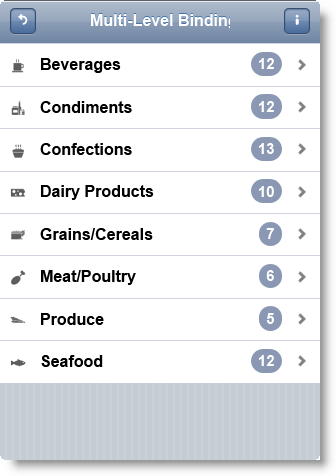
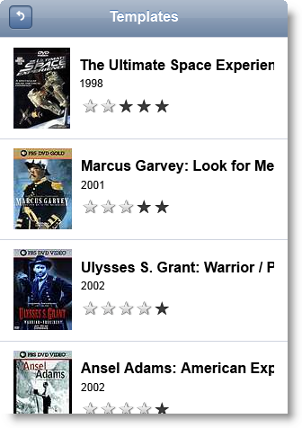
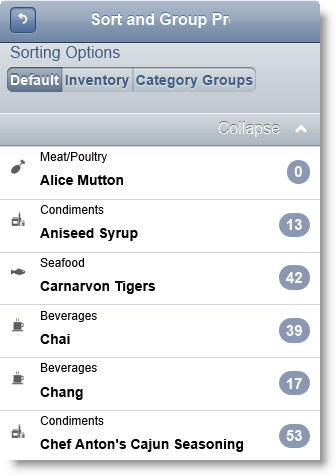
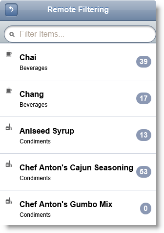
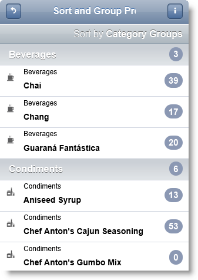
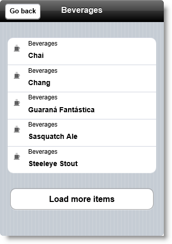

<!--
|metadata|
{
    "fileName": "iglistview-overview",
    "controlName": "igListView",
    "tags": ["Data Binding","Drilldown","Filtering","Getting Started","Grouping","Sorting","Templating"]
}
|metadata|
-->

# igListView Overview

## Topic Overview

### Purpose

This topic explains the features of `igListView`™.

### In this topic

This topic contains the following sections:

-   [**Introduction**](#introduction)
-   [**Main Features**](#features)
	-   [Data binding](#data-binding)
    -   [Hierarchy](#hierarchy)
    -   [Templates](#templates)
    -   [Sorting](#sorting)
    -   [Filtering](#filtering)
    -   [Grouping](#grouping)
    -   [Load on demand](#load-on-demand)

##  Introduction

The `igListView` control is intended to provide list functionality in jQuery Mobile platform.

##  Main Features

The following table summarizes the main features of the `igListView` control. Additional details are available after the summary table.

Feature | Description
---|---
[Data binding](#data-binding) | `igListView` can be bound to all the data sources which are available to `igDataSource` as well as UL or OL HTML elements.
[Hierarchy](#hierarchy) | `igListView` supports hierarchical navigation. Hierarchical navigation follows jQuery Mobile navigation concepts.
[Templates](#templates) | `igListView` can be easily used in conjunction with templates.
[Sorting](#sorting) | `igListView` supports local or remote sorting. Custom sorting is also supported. Sorting can also be used in conjunction with grouping.
[Filtering](#filtering) | Filtering can be local or remote. You can use presets for filter or a search box.
[Grouping](#grouping) | Grouping allows you to stack similar items together.
[Load on demand](#load-on-demand) | `igListView` Load on demand allows you to add more items to the list by user request.

###  Data binding

`igListView` can be bound to all the data sources which are available to `igDataSource` as well as UL or OL HTML elements.

**Related Topics:**

-   [Adding igListView to a Web Page](igListView-Adding-igListView-to-a-Web-Page.html)
-   [igDataSource Overview](igDataSource-igDataSource-Overview.html)

###  Hierarchy

`igListView` supports hierarchical navigation. Hierarchical navigation follows jQuery Mobile navigation concepts. Hierarchical navigation can be used with Load on Demand feature.

**Related Topics:**

-   [Configuring Multi-level Data Binding](igListView-Configuring-Multi-Level-Data-Binding.html)

###  Templates

`igListView` can be easily used in conjunction with templates.

**Related Topics:**

-   [igTemplate Overview](igTemplating-Overview.html)

###  Sorting

`igListView` supports local or remote sorting. Custom sorting is also supported. Sorting can also be used in conjunction with grouping.

**Related Topics:**

-   [Configuring Sorting](igListView-Configuring-Sorting.html)

###  Filtering

Filtering can be local or remote. You can use presets for filter or a search box.

**Related Topics:**

-   [Configuring Filtering](igListView-Configuring-Filtering.html)

###  Grouping

Grouping allows you to stack similar items together. Access the grouping options of the `igListViewSorting` widget to enable collapsible groups, apply a divider template, and configure additional grouping functionality.

**Related Topics:**

-   [Configuring Grouping](igListView-Configuring-Grouping.html)

###  Load on demand

`igListView` Load on demand can be used in two types of scenarios. First use is in case of hierarchical data. Second use is in case of flat data where user can request more items by pressing a button. This case is illustrated in the screenshot below.

**Related Topics:**

-   [Configuring Load on demand](igListView-Configuring-Load-on-Demand.html)

 

 

